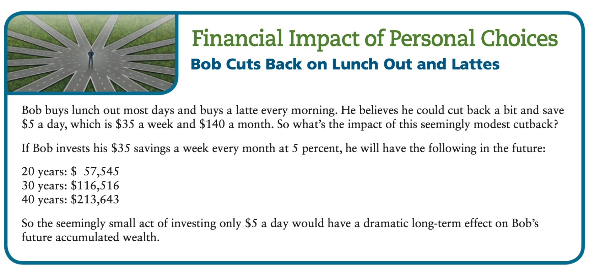
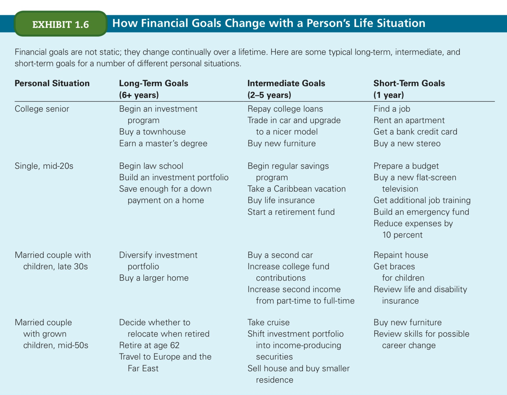
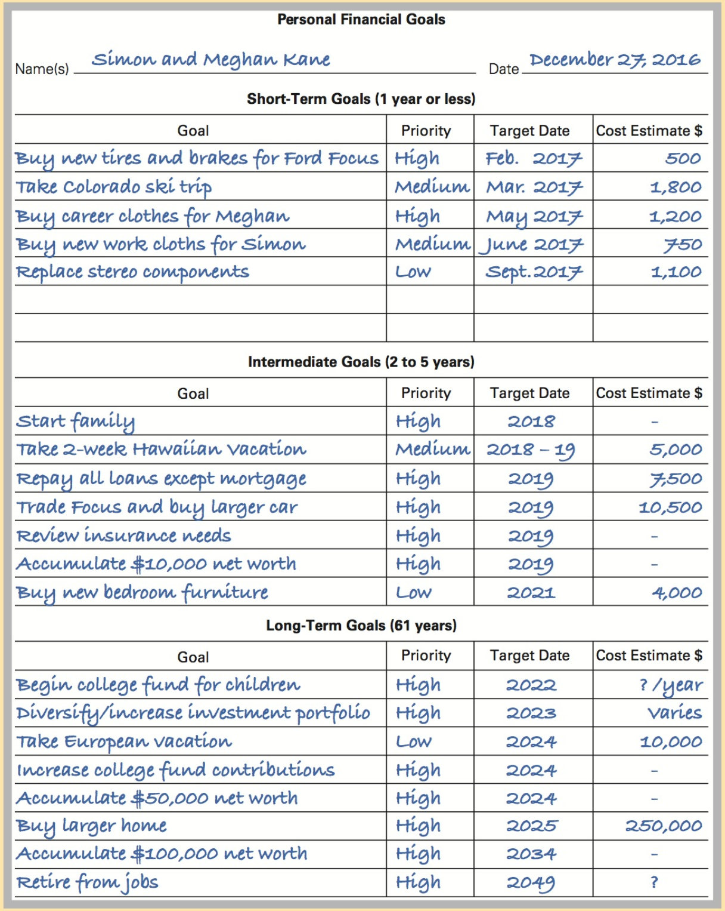
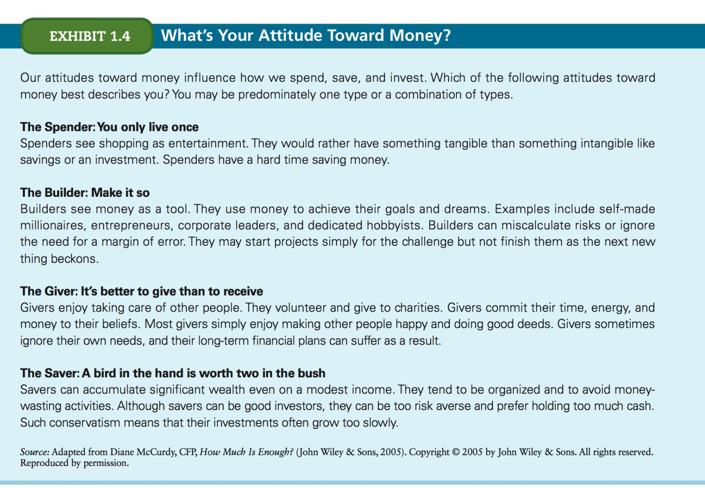
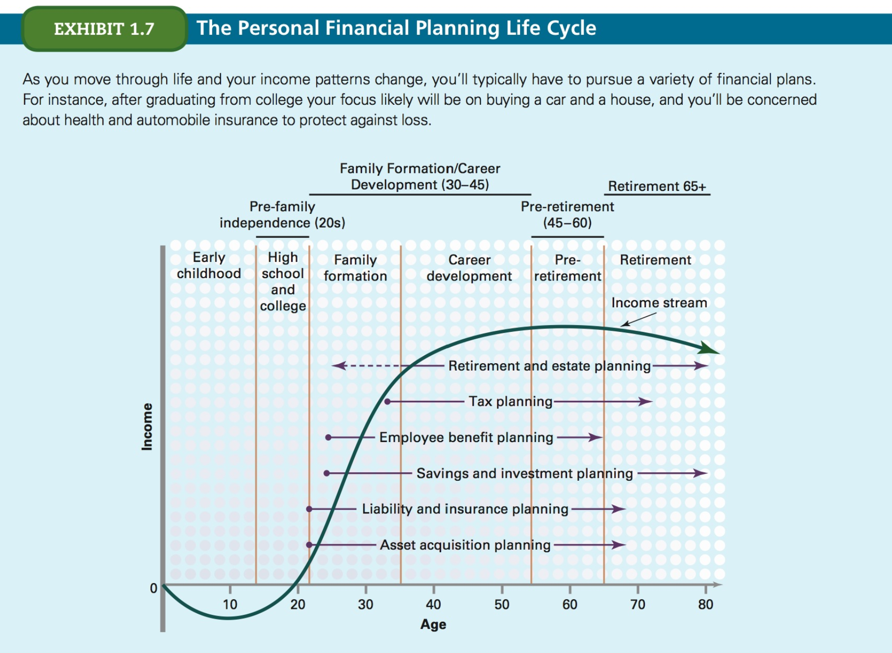
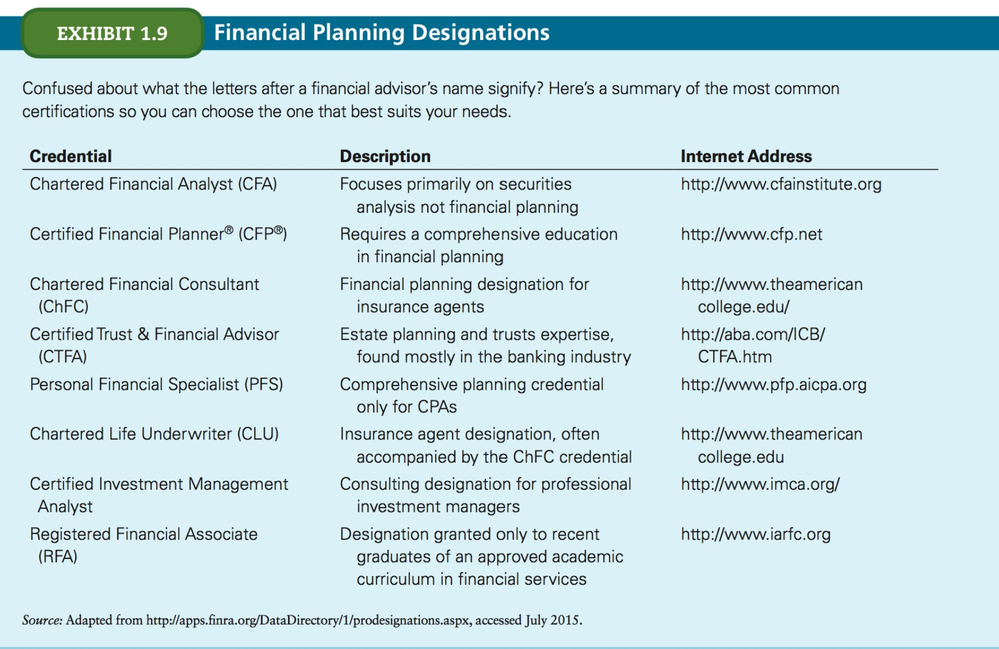
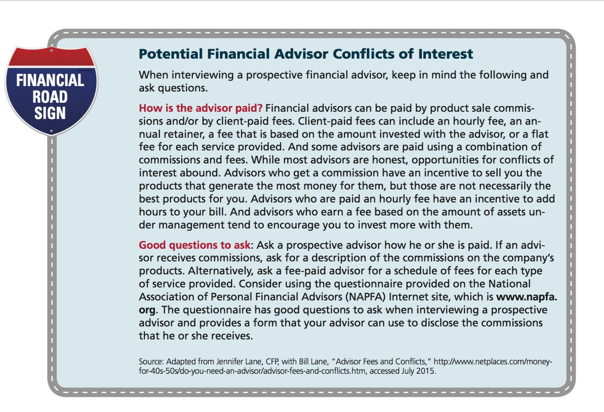
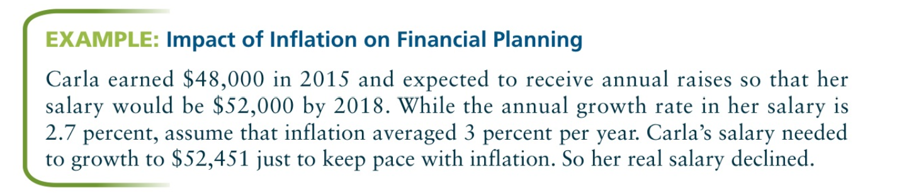
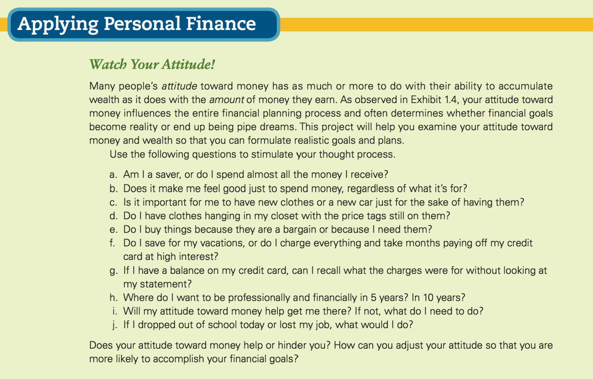

# Chapter 1
## Understanding the Financial Planning Process

<!-- START doctoc generated TOC please keep comment here to allow auto update -->
<!-- DON'T EDIT THIS SECTION, INSTEAD RE-RUN doctoc TO UPDATE -->

- [Important concepts](#important-concepts)
- [Intro](#intro)
- [Terms](#terms)
- [Personal Financial Planning](#personal-financial-planning)
  - [Steps](#steps)
  - [1. Financial goals](#1-financial-goals)
    - [The Psychology of Money](#the-psychology-of-money)
    - [Money and relationships](#money-and-relationships)
  - [2. Financial Plans](#2-financial-plans)
    - [Types of financial plans](#types-of-financial-plans)
      - [Asset acquisition plans](#asset-acquisition-plans)
      - [Liability & insurance plans](#liability--insurance-plans)
      - [Savings & investing plans](#savings--investing-plans)
      - [Employee benefit plans](#employee-benefit-plans)
      - [Tax plans](#tax-plans)
      - [Retirement & estate plans](#retirement--estate-plans)
    - [Special financial conditions](#special-financial-conditions)
  - [Economic environment](#economic-environment)
    - [Inflation](#inflation)
  - [Determining income factors](#determining-income-factors)

<!-- END doctoc generated TOC please keep comment here to allow auto update -->

---

## Important concepts

- IRA (individual retirement account)
- emergency fund
- professional financial planners: people who will guide you and help you  (H&R Block's Financial Advisors / Personal Advisors of Ameriprise Financial)
- the best advice is worthless if you're not willing to change your financial habits

Principles:

1. Spend less than you earn
1. Keep investing so your money continues to work toward your goals
1. Know where you are and plan for the unexpected. You cannot know where you are financially unless you carefully, and frequently, update your family's budget. And it is important to set aside money for an emergency fund.

## Intro

- Whatever your ideal life is, it requires financial planning to achieve financial goals
- The best way to acheive financial goals is through _personal financial planning_, which help
	- define financial goals
	- develop appropriate strategies to reach them
- We should **NOT** depend solely on employee or governement benefits (social security) to retire comfortably
- Creating flexible plans and _revising them constantly_ is the key to financial soundness
- Goals should be SMART
- A carefully developed financial plan should set aside a portion of current income for deferred, future spending. Placing these funds in various savings and investment vehicles allows you to generate a return on your funds until you need them

## Terms

- **standard of living**: the necessities comforts and luxuries enjoyed or desired by an individual or family
- **personal financial planning**: A systematic process that considers important elements of an individual's financial affairs in order to fulfill financial goals.
- **Financial self awareness**: observing your own thoughts, feelings, and behaviour concerning your finances.
	- **Is the way I spend consistent with what I believe?**
	- **Have I clearly stated the financial goals that are important to me and, if so, what am I doing today to make sure I achieve them?**
- **Wealth**: net total value of all the items the individual owns.
	- Divided into:
		- Tangible assets: Physical assets (e.g. real estate, automobiles). Held for consumption or investment purposes
		- Financial assets: _intangible_, paper assets, such as savings accounts and securities (stocks, bonds, mutual funds). They are earning assets held for the return on investment offered

## Personal Financial Planning

The heart of financial planning is determining where you are today and where you want to be in the future.

### Steps

The personal financial process is a loop:

1. Define financial goals
1. Develop financial plans and strategies to achieve goals.
1. Implement financial plans and strategies
1. Periodically develop and implement budgets to monitor and control progress toward goals.
1. Use financial statements to evaluate results of plans and budgets, taking corrective action as required.
1. Redefine goals and revise plans and strategies as personal circumstances change.

### 1. Financial goals

- **Financial goals**: results than an individual wants to obtain, such as buying a home, building a college fund, or acheiving financial independence.

Financial goals are established in monetary terms. Money is not necessarily what people ultimately want, but rather the **utility**: the amount of satisfaction received from purchasing certain types or quantities of goods and services (which money makes possible)

Financial goals cover a wide range of financial aspirations:

- controlling living expenses,
- setting up a savings and investment program
- minimising your taxes
- having enough money to live as well as possible now
- being financially independent
- sending children to college
- providing for retirement

They should be defined as specifically as possible:

- **BAD**: "I want to save money next year"
- **GOOD**: "Save 10% of my take-home pay each month to start an investment program"

They should also be realistic and attainable, and should be based on realistic assumptions.

Finally, you should **assign a time frame and priorities to financial goals** (short, medium, long-term; low, medium, high priority goals and combinations thereof).

**Long term goals**

Cover a period of the next 6 to 40 years. Difficult to predict, but should give a baseline. You will change and constantly adjust these over time.

**Short term goals**

- Set each year
- Cover a 12-month period
- Short term planning should also include establishing an **emergency fund with at least 6 to 9 month's worth of income**.

Above is presented a sample worksheet to write down your financial goals.

#### The Psychology of Money

Your personal value system — the important ideals and beliefs that guide your life — will also shape your attitude toward money and wealth accumulation.

You can formulate financial plans that provide the greatest personal satisfaction and quality of life by identifying your values.

Important questions to ask youself:

- How important is money to me? Why?
- What types of spending give me satisfaction?
- Am I a risk taker?
- Do I need large financial reserves to feel secure?

Effective financial plans are both economically and psychologically sound. They must not only consider your wants, needs, and financial resources, but must also realistically reflect your personality and emotional reactions to money.

#### Money and relationships

Financial compatibility is important. Most people are uncomfortable talking about money matters, even with their partners. You should discuss financial goals and attitudes towards money with your partners, also allocating responsibility for money management tasks and decisions.

> Your parents should play an important role in your financial planning. As they age, you may have to assume greater responsibility for their care.

- Do you know what health care coverage and financial plans they have in place?
- Where do they keep important financial and legal documents?
- What preferences do they have for health care should they become incapacitated?

### 2. Financial Plans

Financial plans provide the roadmap for achieving your financial goals.

#### Types of financial plans

- **Asset acquisition plans**
- **Liability & insurance plans**
- **Savings & investing plans**
- **Employee benefit plans**
- **Tax plans**
- **Retirement & estate plans**

##### Asset acquisition plans

We accumulate assets: _liquid_ (cash, savings accounts, and money market funds), _investments_ (stocks, bonds, & mutual funds) acquired to earn a return, _personal property_ (movable property such as automobiles, household furnishings, appliances, clothing, jewelry, home electronics, and similar items), and _real property_ (immovable property; land and anything fixed to it, such as a house). **Chaps 4 & 5** focus on important considerations for managing liquid assets and other major assets such as automobiles & housing.

##### Liability & insurance plans

_Liability_: something we owe as measured by the amount of debt we incur (by borrowing money). Some debts include credit card debt, mortgages, education loans, car loans, etc. Managing credit effectively requires careful planning, covered in **Chapters 6 & 7**.

Obtaining adequate insurance coverage is also essential, covered in **Chapters 8 , 9 & 10**.

##### Savings & investing plans

As your income begins to increase, so does the importance of savings & investment planning. Initially, you save to establish an emergency fund. Eventually, you must devote greater attention to investing excess income as a means of accumulating wealth, either for major expenditures (such as a child's college education) or for retirement. Individuals build wealth through savings and the subsequent investing of funds in various investment vehicles: common or preferred stocks, government or corporate bonds, mutual funds, real estate, and so on.

We'll examine compounding more fully in **Chapter 2**, savings in **Chapter 4**, and investments in **Chapters 11, 12, and 13**.

##### Employee benefit plans

Life, health, and disability insurance; tuition reimbursement programs, pension and profit-sharing plans, 401(k) plans, flexible spending accounts, stock options, sick leave, personal time, and vacation days: all can be offered by your employer.

Managing your employee benefit plans and coordinating them with your other plans are an important part of the overall financial planning process. For example, tax-deferred retirement plans and flexible spending accounts offer tax advantages. Some retirement plans allow you to borrow against them. Employer-sponsored insurance plans may need to be supplemented with personal policies.

If you change jobs, your new company may not offer the same benefits. Your personal financial plans should include contingency plans to replace employer-provided benefits as required.

Employee benefits are discussed in:

- **Chapter 2 (planning)**
- **Chapter 3 (taxes)**
- **Chapters 8, 9 and 10 (insurance)**
- **Chapter 14 (retirement)**

##### Tax plans

Taxes are complicated. Tax planning involves (legitimately) reducing your tax liability through tax shelters. It involves looking at your current and projected earnings and then developing strategies that will defer and minimize taxes. This is examined in **Chapter 3**.

##### Retirement & estate plans

While you're working you should be managing your finances to attain those goals you feel are important after you retire. These might include:

- maintaining your standard of living
- extensive travel
- visiting children
- frequent dining at better restaurants
- and perhaps a vacation home or boat.

These aspects are discussed in **Chapter 14**.

You also have to consider how to most effectively pass your wealth on to your heirs, an activity known as _estate planning_. This complex subject which includes topics such as wills, trusts, and the effects of gift and estate taxes is discussed in **Chapter 15**.

#### Special financial conditions

**Managing double income**

Read on pg 21.

**Employee Benefits**

Employee benefits can have a major financial impact on income. Today's well defined- employee benefits package may include:

- Health and life insurance
- Disability insurance
- Long-term care insurance
- Pension and profit-sharing plans
- Supplemental retirement programs, such as 401(k) plans
- Dental & vision care
- Child care, elder care, and educational assistance programs
- Subsidized employee food services

Many companies are replacing traditional programmes with **flexible-benefit (cafeteria) plans**: where the employer allocates a certain amount of money to each employee and then lets the employee "spend" that money for benefits that suit his or her age, marital status, number of dependent children, level of income, etc. You can typically choose from a menu of options your employer provides.

**Professional financial planners**

An individual or firm that helps clients establish financial goals and develop and implement financial palns to acheive those goals.

Two types:

- _Commission-based planners_: earn commmissions on the financial products they sell
- _Fee-only planners_: charged based on the complexity of the plan they prepare.

Better choice: CFP or ChFc

Do your homework before engaging the services of a professional financial planner.

You can also use software like Microsoft Money.

### Economic environment

#### Inflation

The economy is said to be experiencing a period of **inflation** when the general level of prices increases over time.

### Determining income factors

- Demographics: Very young or very old people have the lowest incomes. Highest earnings generally occur between the ages of 45 to 64.
- Education: Controllable factor that significantly affects your income.
- Where you live: Salaries vary regionally. It will also be higher if you live in a large metropolitan area. Living costs also vary throughout the country.
- Your career.

