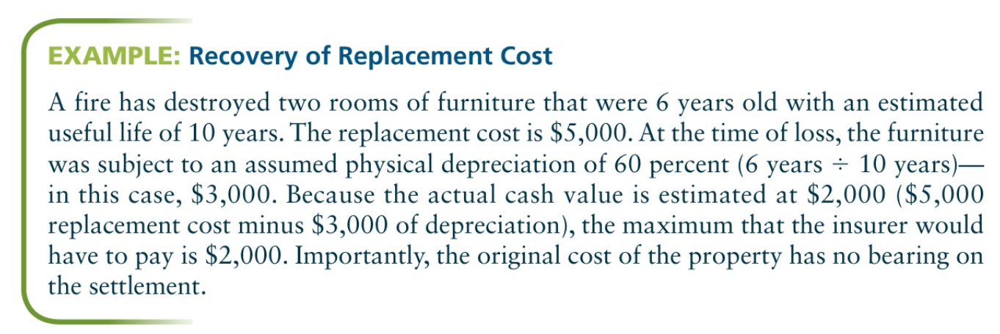
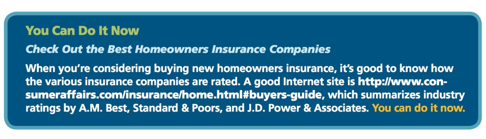
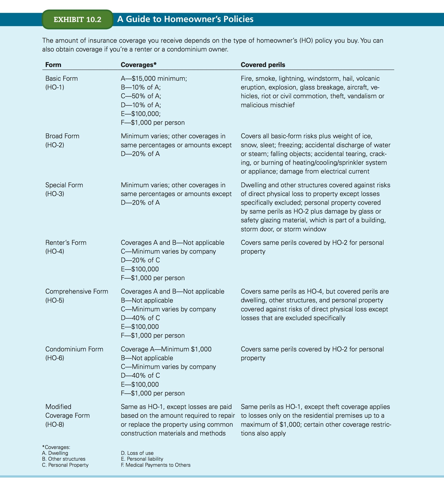
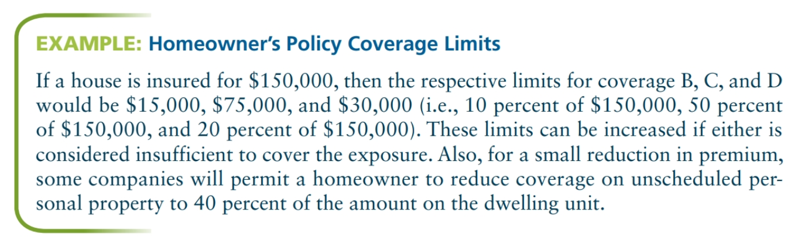
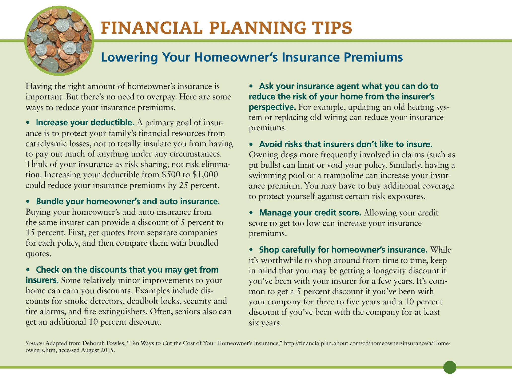
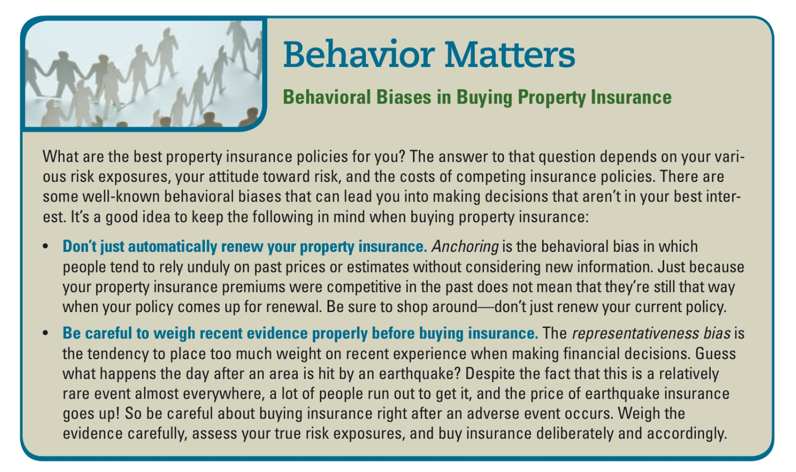
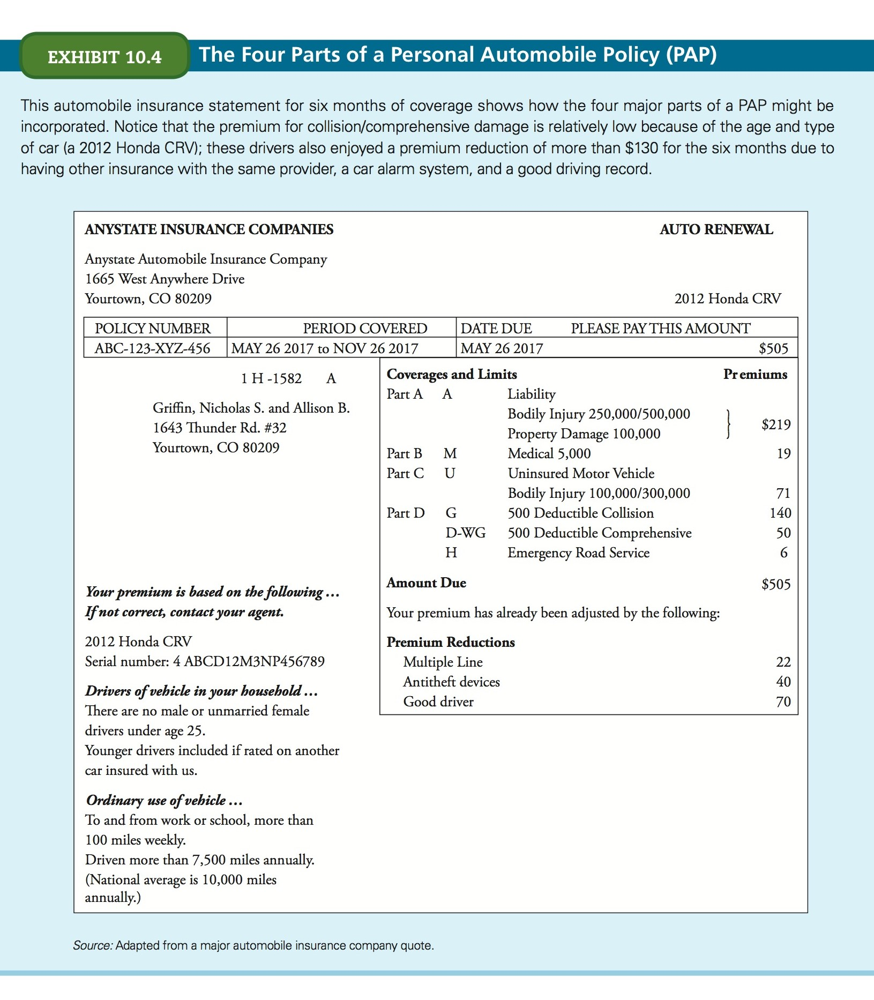
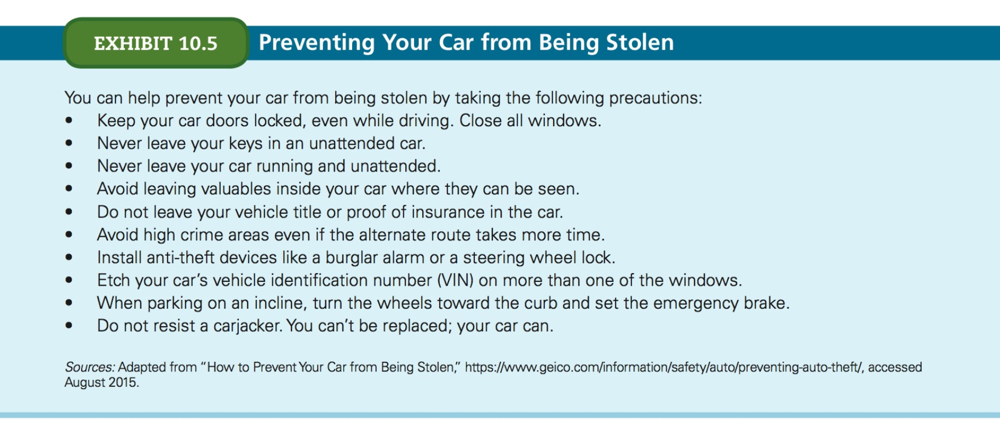
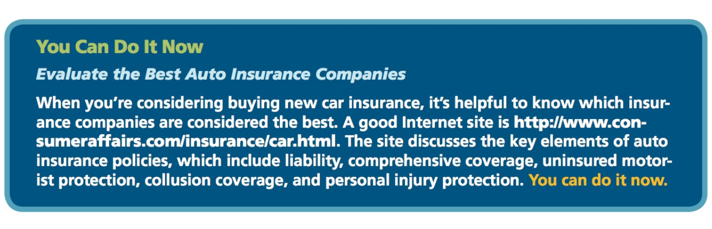
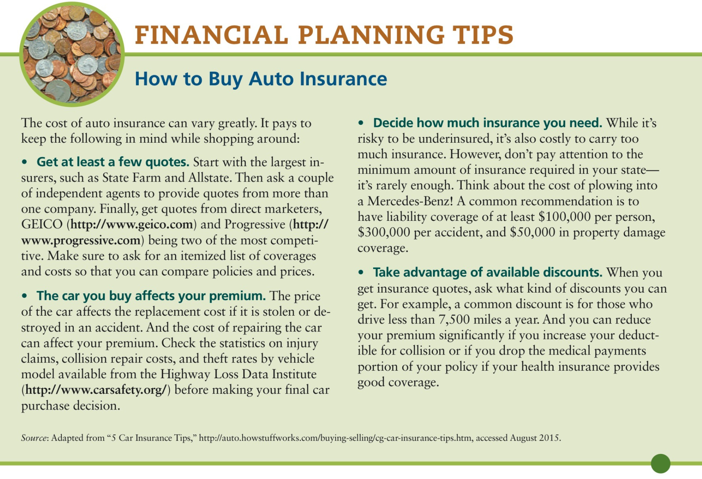

# Chapter 10
## Insuring your property

- **Property insurance** guards against catastrphic losses of real and personal property cause by such perils as fire, theft, vandalism, windstorms, and other calamities.
- **Liability insurance** offers protection against the financial consequences that may arise from the insured's responsibility for property loss or personal injuries to others.

## Basic principles

### Types of exposure

Most people face two types of exposure:

1. Physical loss of property
1. Loss through liability

#### Property loss

> **perils**: the causes of loss

Most property insurance contracts define the property covered and name the **perils** for which the insured will be compensated in case of claim.

Mos property insurance contracts impose two obligations on the property owner:

1. developing a complete inventory of the property being insured;
1. identifying the perils against which protection is desired

##### Property inventory

- Especially important in the case of a total loss (e.g. fire)
- All property insurance companies require you to show _proof of loss_ when making a claim.
- Your personal property inventory, along with corresponding values at the time of inventory, can serve as evidence to satisfy the company.
- Things like musical instruments, paintings, bonds, securities, cameras, electronic equipment and PCs are generally not covered under your basic property insurance.
- Picture evidence is super important for insurance companies.
- Keep your inventory somewhere safe (not where you insured).

##### Identify perils

Certain perils may not be reasonably insured. E.g. most homeowners or automobile insurance policies limit or exclude damage or loss caused by flood (e.g. Hurricane Katrina), earthquake, backing up of sewers and drains, mudslides, mysterious disappearance, war, nuclear radiation, and ordinary wear and tear.

In addition, property insurance routinely limit coverage based on the location of the property, time of loss, persons invovled, and types of hazards to which the property is exposed.

#### Liability exposure

- Loss exposures result from **negligence**, which is failing to act in a reasonable manner or take necessary steps to protect others from harm.
- Liability insurance will protect you from losses resulting from these risks, including the high legal fees required to defend yourself againt suits that may, or may not have merit.

### Indemnity

> **Principle of indemnity**: An insurance principle stating that an insured may not be compensated by the insurance company in an amount exceedng the insured's economic loss.

- This principle does not apply to life and health insurance.

#### Actual cash value versus replacement cost

> **actual cash value**: A value assiend to an insured property that is determined by subtracting the amount of physical depreciation from its replacement cost.

The principle of indemnity limits the amount that an insured may collect to the **actual cash value** of the property. Some insurers pay replacement ocst without taking depreciation into account. 

Wihout a replacement-cost provision, it's common practice to deduct the amount of depreciation to obtain the actual cash value.

If an insured property is damaged, then the insurer is obligated to pay no more than the property would cost new today (its **replacement cost**) less the amount of depreciation from wear and tear.

#### Subrogation

> **right of subrogation**: The rigth of an insurer, who has paid an insured's claim, to request reimbursement from either the person who caused the loss or that person's insurer.

> For example, assume you're in an automobile accident in which the other party damages your car. You may collect from your insurer or the at-fault party-s insurer, but not from both (not for the same loss). Collecting from both violates the principle of indemnity.

#### Other insurance

Nearly all property and liability insurance contracts have an _other-insurance clause_, prohibiting insured persons from insuring their property with two or more insurance companies and collecting from multiple companies for the same loss.

The other-insurance clause normally states that if a person has more than one insurance policy on a property, then each company need only pay an amount prorated for its share of all insurance covering the property. 

### Coinsurance

> **co-insurance**: In property insurance, a provision requiring a policyholder to buy insurance of an amount equal to a specified percentage of the replacement value of their property.

The coinsurance clause in a property insurance policy requires that a home is insured for a percentage of its total cash or replacement value. Usually, this percentage is 80-percent but different providers may require varying percentages of coverage. If a structure is not insured to this level and the owner should file a claim for a covered peril, the provider may impose a coinsurance penalty on the owner.

As an example, if a property has a value of $200,000 and the insurance provider requires an 80% coinsurance, the owner must have $160,000 of property insurance coverage.

## Homeowner's Insurance

5 different forms of homeowner's insurance:

- **HO-1:** Basic Form (seldom-used, relatively narrow coverage)
- **HO-2:** Broad Form
- **HO-3:** Special Form
- **HO-5:** Comprehensive Form
- **HO-8:** Older Home Form

(HO-4 and HO-6 provide protection for renters and owners of condominiums and HO7 for Mobile homes.)
 
All HO forms are divided into two sections:

1. Section I: applies to the dwelling, accompanying structures, and personal property of the insured. 
1. Section II: comprehensive coverage for personal liability and for medical payments to others.

- Scope of Section I coverage is least with an HO-1 and greatest with an HO-5.
- Section II coverage is the same for all forms.

### HO-3 vs HO-5 (most common)

They're basically the same coverage. The differences lie in the number of perils against which protection applies to the personal property coverage.

#### Perils covered

> Some property and liability insurance agreements, called **comprehensive policies**, cover all perils except those specifically excluded, whereas **named peril policies** name particular, individual perils covered.

##### Section I Perils

The perils against which the home and its contents are insured are dhown in Exhibit 10.2. Coverage on the dwelling is the same for the HO-3 and HO-5 forms, but coverage on the house itself and other structures is _comprehensive_ under HO-5 and a _named peril_ in HO-3. 

An HO-5 provides comprehensive coverage on the personal property, where an HO-3 covers only named perils.

**Whether homeowners should buy an HO-3 or an HO-5 form depends primarily on how much they're willing to spend to secure the additional protection.**

The premiums can be wildly different between an HO-3 and an HO-5. 

- **Buying an HO-1 or HO-2 policy is not recommended because of its more limited coverage.**
- Note that most policies exclude earthquakes and floods. You can obtain this coverage as a separate policy or a rider.

#####  Section II Perils

Perils in Section II are the (alleged) negligence of an insured. The coverage is called _comprehensive personal liability coverage_ because it offers protection against personal liability resulting from negligence.

- Does not insure against other losses such as libel, slander, defamation of character, and contractual or intentional wrongdoing. 
- Example: coverage would apply if you accidentally knoced someone down your stairs. 

Section II also provides a limited amount of medical coverage for persons other than the homeowner's family in certain types of minor accidents on or off the insured's premises. The limited medical payment coverage pays irrespective of negligence or fault.

#### Factors affecting home insurance costs

- **Type of structure**: Wood/Brick? Construction materials affect the cost of insuring it. Home insurance is more expensive for wood houses than block, but the reverse is true for earthquake insurance.
- **Credit score**: Credit scores affect premiums more than any other factor. Low credit scores can pay 2 or 3 times more than a smiliar policy for an excellnt score. **If your credit score improves, it's important to let your insurance company know because this could lower your premiums.**
- **Location of home**: Local crime rates, weather, and proximity to a fire hydrant all affect your home's insurance premium costs. If many claims are filed from your area, insurance premiums for all the homeowners ther will be higher. The local frequency of hailstorms and hurricanes will affect rates too.
- **Other factors**: swimming pools, trampolines, large dogs, or other potentially hazardous risk factors on your property will make premiums go higher.

#### Property covered

Protects:

- dwelling unit
- accompanying structures
- personal property of homeowners and their families.

Some coverage also applies to: lawns, tress, plants, and shrubs.

Does not cover:

- premises used for business purposes (except incidentally)
- animals (pets or otherwise)
- motorized vehicles not used in maintaining the premises (autos, motorcycles, gold carts)
- _Business inventory_ (e.g. goods that are held for sale) but _business property_ **is** covered (books, computers, office furniture, supplies), typically up to a maximum of $2,500, while it is on the insured premises.

If you work from home, then you may need to increase your policy's limits to protect your home office. These riders are usually cheap.

#### Personal Property Floaters

A homeowner's policy may not protect your expensive personal property adequately. To overcome this deficiency, you can add a **personal property floater (PFP)** as an endorsement to your homeowner's policy or take out a separate floater policy.

Two types:

- **blanket (unscheduled)**: provides the maximum protection available for virtually all the insured's personal property.
- **scheduled**: list the items to be covered and provide supplement coverage under a homeowner's contract. 

Especially useful for expensive property and it includes loss, damage and theft. Popular uses of PPFs are: furs, jewelry, personal computers and peripheral equipment, photographic equipment, silverware, fine art and antiques, collections.

#### Renter's insurance (HO-4)

> If you live in an apartment (or some other type of rental unit), be aware that although the building you live in is likely to be fully insured, _your furnishings and other personal belongings are not_. 

As a renter, you need a special type of HO policy to obtain insurance coverage on your personal possessions.

**Unless a landlord can be proven negligent, he or she isn't responsible for a tenant's property.**

Standard renter's insurance policy covers furniture, carpets, appliances, clothing and most other personal items for their cash value at the time of loss. Expect to pay around $150 to $250 a year for about $30,000 in personal property coverage and $100,000 in liability coverage, depending no where you live.

Renter's insurance pays for losses caused by fire, lightning, explosion, windstorms, hail, theft, civil commotion, aircraft, vehicles, smoke, vandalism and malicious mischief, falling objects, building collapse, and the weight of ice and snow. Certain damages caused by water, steam, electricity, appliances, and frozen pipes are covered as well. Plus, if your residence can't be occupied because of damage from any of those perils, the insurer will pay for any increase in living expenses resulting from staying at a hotel and eating in restaurants.

#### Coverage

##### Types of losses covered

1. Direct loss of property
2. Indirect loss occuring due to loss of damaged property
3. Additional expenses resulting from direct and indirect losses

**Section I Coverage.** When a house is damaged by an insured peril, the insurance company will pay reasonable living expenses that a family might incur. One such covered expense would be the cost of renting alternative accommodations while the insured's home is being repaired or rebuilt. Also, in many instances, the insurer will pay for damages caused by perils other than those mentioned in the policy if a named peril is determined to be the underlying cause of the loss.

> Assume, for instance, that lightning (a covered peril) strikes a house while a family is away and knocks out the power, causing $400 worth of food in the freezer and refrigerator to spoil. Insurance will pay for the loss even though the temperature change (the direct cause) is not mentioned in the policy.

**Section II Coverage.** Besides paying successfully pursued liability claims against an insured, a homeowner's policy includes coverage for

1. Cost of defending the insured
2. Reasonable expenses incurred by an insured in helping the insurance company's defense
3. Payment of court costs

Because these costs apply even when the liability suit is found to be without merit, this coverage can save you thousands of dollars in attorney fees.

##### Persons covered

Named persons in the policy and members of their families who are residents of the household. A person can be a resident of the household even while temporarily living away from home, such as college students

##### Locations covered

Most homeowner's policies offer coverage worldwide. Consequently, an insured's personal property is fully covered even if its lent to the next-door neighbor or kept in a hotel room in London. The only exception is property left at a second home (such as a beach house or resort condo), where coverage is reduced to 10% of the policy limit on personal property unless the loss occurs while the insured is residing there.

Homeowners and their families have liability protection for their negligent acts wherever they occur. 

#### Limitations on Payment

##### Replacement cost

> **Replacement cost**: the amount necessary to repair, rebuild, or replace an asset at today's prices.

When replacement-cost coverage is in effect, a homeowner's reimbursement for damage to a houes or accompanying structures is based on the cost of rapiring or replacing those structures. This means that the insurer will repair or replace damaged items without deducting for depreciation.

Homeowners are eligible for reimbursement on a fulll replacement-cost basis only if they keep their homes insured for at least 80% of the amount that it would cost to build them today, not including the value of the land. 

In periods of inflation, homeowners must either increase their coverage limits on the dwelling unit every year or take a chance on falling below the 80% requirement. Alternatively, for a nominal cost, homeowners can purchase an inflation protection rider that automatically adjusts the amount of coverage based on prevailing inflation rates.

Although coverage on a house is often on a replacement-cost basis, standard coverage on its contents may be on an _actual cash-value basis_, which deducts depreciation from the _current replacement cost_ for claims involving furniture, clothing, and other belongings. Some policies offer, for a slight increase in premium, replacement-cost coverage on contents. You should seriously consider this option &mdash; as well as an inflation protection rider on the dwelling &mdash; when buying homeowner's insurance.

##### Policy limits

In Section I, the amount of coverage on the dwelling unit (Coverage A) establishes the amounts applicable to the accompanying structures (coverage B), the unscheduled personal property (coverage C), and the temporary living expenses (coverage D).  Generally, the limits under coverage B, C, and D are 50%, and 10-20%, respectively, of the amount of coverage under A.

Remember that homeowner's policies usually specify limits for certain types of personal property included under the coverage C category. Some policies also offer $5,000 coverage for home computer equipment. You can increase these limits by increasing coverage C.

In Section II the personal liability coverage (coverage E) often starts at $100,000, and the medical payments portion (coverage F) normally has a limit of $1,000 per person.

Although these are the most common limits, most homeowners need additional protection, especially liability coverage. In these days of high damage awards by juries, a $100,000 liability limit may not be adequate.

##### Deductibles

_Deductibles_ limit what a company must pay for small losses, and help reduce insurance premiums by doing away with the frequent small loss claims that are proportionately more expensive to administer. The standard deductible in most states is **$250** on the physical damage protection covered in Section I. 

However, choosing higher deductible amounts of $500 or $1,000 results in considerable premium savings &mdash; as much as 10 to 20% in some states.

Deductibles don't apply to liability and medical payments coverage because insurers want to be notified of all claims, no matter how trivial. Otherwise, they could be notified too late to investigate properly and prepare adequate defenses for resulting lawsuits.

#### Insurance premiums

- Vary widely depending on the insurance provider and the location of the property (neighborhood, city, state). It pays to shop around.
- Remember each type of property damage is subject to a deductible of $250 or more.
- Most people need to modify the basic package by adding an inflation rider and increasing the coverage on their homes to 100% of the replacement cost.
- Changing the contents protection from actual cash value to replacement cost and scheduling some items of expensive personal property may be desirable.
- Most insurance professionals also advise homeowners to increase their liability and medical payments limits. 
- You can reduce your total premium by increasing the amount of your deductible. Because it's better to budget for small losses than to insure against them, larger deductibles are becoming more popular. 

## Automobile insurance

### Types of auto insurance coverage

> **personal automobile policy (PAP)**: A comprehensive automobile insurance policy designed to be easily understood by the "typical" insurance purchaser.

6 parts:

1. **Part A**: Liability coverage
1. **Part B**: Medical payments coverage
1. **Part C**: Uninsured motorists coverage
1. **Part D**: Coverage for damage to your vehicle

Part E pertains to your duties and responsibilities if you're involved in an accident, and Part F defines basic provisions of the policy, including the policy coverage period and the right of termination.

- You may choose _not_ to buy protection against damage to your automobile if it's an older vehicle of relatively little value.

#### Part A: Liability coverage

As part of the liability provisions of a PAP, the insurer agrees to:

- Pay damages for bodily injury and/or property damage for which you are legally responsible as a result of an automobile accident
- Settle or defend any claim or suit asking for such damages.

The policy _does not_ coer defense of criminal charges against the insured due to an accident (such as a drunk driver).

##### Policy limits

Insurance companies typically set a _dollar limit_ up to which it will pay for damages from any one accident.

Typicial limits are $50,000, $100,000, $300K, and $500K. **You'd be well advised to consider no less than $300K coverage in today's legal liability environment**. 

Some insurers make so-called _split limits_ of liability coverage available, with the first amount in each combination the per-individual limit and the second the per-accident limit. Some policy limit combinations for proecting individuals against claims made for **bodily injury liability losses** are $25,000/$50k, $50K/$100K, etc.

> The max amount any one person negligently injured in an accident would receive from the insurance company would be $250K. Further, the total amount the insurer would pay to all injured victims in one accident would not exceed $500K. If a jury awarded a claimant $80K, the defendant whose insurance policy limits where $50K/$100K could be required to pay $30K out of his or her pocket.

The policy limits available to cover **property damage liability losses** are typically $10K, $25K, $50K, and $100K. In contrast to bodily inury liability limits, property damage limits are stated as a per-accident limit, without specifying limits applicable on a per-item or per-person basis.

##### Persons insuerd

- Insured person: includes you (the named insured) and any family member, any person using a covered auto, and any person or organization that you may be held responsible for your actions. The spouse of the person named is considered a named insured if he or she resides in the same household. An unmarried college student living away is usually considered part of the family.
- Covered autos: vehicles shown in the declarations page of your PAP, autos acquired during the policy period, any trailer owned, and any auto or trailer used as a temporary substitute while your auto or trailer is being repaired or serviced.

The named insured and family members have part A liability coverage regardless of the automobile they're driving. However, for persons other than the named insured and family members to have liability coverage, they must be driving a covered auto.

> When a motorist who is involved in an auto accident is covered under two or more liability insurance contracts, the coverage _on the automobile_ is primary and the other coverage is secondary. For example, if Dennis Ellis, a named insured in his own right, was involved in an accident while driving Kaitilin Wei's car (with permission), then a claim settlement exceeding the limits of Kaitlin's liability policy would be necessary before Dennis' liability insurance would apply. If Kaitlin's insurance had lapsed, Dennis' policy would then offer primary protection (but it would apply only to Dennis, not to Kaitlin).

#### Part B: Medical payments coverage

Insures a covered individual for reasonable and necessary medical expenses incurred within three years of an automobile accident in an amount not to exceed the policy limits. It provides for reimbursement even if other sources of recovery, such as health or accident insurance, also make payments.

In most states, the insurer reimburses the insured for medical payments even if the insured proves that another person was negligent in the accident and receives commpensation from that party's liability insurer.

Injuries sustained as a pedestrian or on a bicycle in a traffic accident, are also covered (Motorcycle accidents are normally not covered).

If you're a passanger in a friend's car during an accident and suffer $8,000 in medical expenses, you can collect under his medical payments insurance up to his policy limits. Further, you can collect (up to the amount of your policy limits) from your insurer the amount exceeding what the other medical payments provide.

##### Policy limits

Medical payments insurance usually has a per-person limits of 1,2,3,5, or $10K. Most families are advised to buy the 5 or 10K limit because even though they may have other health insurance available, they can't be sure that their passengeres are as well protected.

##### Persons insured

Coverage under an automobile medical payments insurance applies to the named insured and to family members who are injured while occupying an automobile (whether owned by the named insured or not) or when struck by an automobile or trailer of any type. Part B also applies to any other person occupying a covered automobile.

#### Part C: Uninsured motorists coverage

> **uninsured motorists coverage**: automobile insurance designed to meet the needs of "innocent" victims of accidents who are negligently injured by uninsured, underinsured, or hit-and-run motorists.

- Nearly all states require uninsured motorists insurance to be included in each liability insurance policy issued. The insured is allowed to reject this coverage in most of these states.
- About 16% of drivers are uninsured and because many others meet only minimum insurance coverage requirements, rejecting uninsured motorists coverage is not a good idea.
- The insured is able to collect an amount equal to the sum that could have been collected from the negligent motorist's liability insurance, had such coverage been available, up to a maximum amount equal to the policy's stated _uninsured motorists limit_.

3 points must be proven:

1. another motorist must be at fault
1. the motorist has no available insurance or is underinsured
1. damages were incurred

##### Policy limits

- Fairly low cost relative to the coverage it provides.
- 100/300K coverage for $71 per six months.

##### Persons insured

Uninsured motorists protection covers the named insured, family members, and any other person occupying a covered auto.

##### Underinsured motorists coverage

For a nominal premium you can obtain **underinsured motorists coverage**, which protects the insured against damages caused by being in an accident with an underinsured motorist who is found liable.

You should consider buying the optional coverage if available.

#### Part D: Coverage for damage to your vehicle

2 types:

- Collision
- Comprehensive

##### Collision insurance

Insurance that pays for collision damage to an insured automobile _regardless of who is at fault_. The amount is the actual cash value of the loss in excess of your deductible. (The actual cash value is _defined as replacement cost less depreciation_). Deductibles typically range between $50 and $1,000 and selecting a higher deductible, will reduce your premiums.

**Avoid buying automobile insurance from car dealers or finance companies**.

The collision provision of your insurance policy often fully protects you in a rental car, so be sure to check before purchasing supplemental collision insurance when renting a car. Also, when you charge your car rental to your credit card, collision insurance may be offered under the umbrella of the credit card.

##### Comprehensive automobile insurance

> **comprehensive automobile insurance**: Coverage that protects against loss to an insured automobile caused by any peril (with a few exceptions) _other than collision_.

- The max compensation provided under this coverage is the actual cash value of the automobile.
- Coverage includes: fire, theft, glass breakage, falling objects, malicious mischief, vandalism, riot, earthquake, etc.
- The automobile insurance policy typically does **not cover the theft of personal property** left in the insured vehicle. However, the off-premises coverage of the homeowner's policy may cover such a loss if the auto was locked when the theft occured.

### Insurance premiums

#### Factors affecting premiums

1. **Rating territory**: Rates are higher in geographic areas where accident rates, number of claims filed, and average cost of claims paid are higher. Rates reflect auto repair costs, hospital and medical expenses, jury awards, and theft and vandalism in the area. Some jurisdictions prohibit the use of rating territories, age, and gender factors, because it's believed these factors unfairly discriminate against the urban, the young, and the male.
1. **Use of the automobile**: Drive less, pay less! Low annual miles translate into a smaller probability of an accident, so you pay lower rates. Rates are also lower if the insured automobile isn't usually driven to work or is driven less than 3 miles one way. 
1. **Drivers' personal characteristics**: Insured's age, sex, and marital status. Insurance companies base premium differentials on the number of accidents involving certain age groups. For example, drivers aged 25 and under make up only about 15% of the total driving population, but they are involved in nearly 30% of auto accidents and in 26% of fatal accidents. Male drivers are invovled in a larger % of fatal crashes, so unmarried males under age 30 (and married males under 25) pay higher premiums than do older individuals. Females over age 24, as well as married females of any age, are exempt from the youthful operator classification and pay lower premiums.
1. **Type of automobile**: Insurance companies charge higher rates for automobiles classified as intermediate-performance, high-performance, and sports vehicles and also for rear-engine models. Some states even rate four-door cars differently from two-door models.
1. **Driving record**: The driving records - traffic violations and accidents - of those insured and the people who live with them affect premium levels. More severe traffic conditions - driving under the influence, leaving the scene of an accident, homicide or assault arising from the operation of a motor vehicle, and driving with a revoked or suspended driver's license - result in higher insurance premiums. Any conviction for a moving traffic violation that results in the accumulation of points under a state point system also may incur a premium surcharge. 

Many states palce drivers with multiple traffic violations in an **automobile insurance plan** (formerly called an _assigned-risk plan_), providing automobile insurance to those refused regular coverage. The plan generally offers less coverage for a higher premium. Even with higher premiums, however, insurers lost billions of dollars on this type of business in a recent 5-year period.

#### Driving down the cost of car insurance

1. Comparison shop
1. Take advantage of the discounts
	- _safe driving_ discounts
	- lower rates if you've had driver's training
	- good student discounts
	- multicar discounts
	- antitheft device discount
	- nonsmoker/nondrinker discounts
1. Raise your deductibles
1. Bundle with homeowner's insurance

### Financial responsibility laws

Most states have **financial responsibility laws** whereby motorists must buy a _specified minimum amount of automobile liability insurance_ or provide other proof of comparable financial reponsibility. These limits are well below what you should carry.

Fall into 2 categories:

1. _Compulsory auto insurance_ laws require motorists to show evidence of insurance coverage _before_ receiving their license plates.
1. The second requires to show proof of insurance _after_ being involved in an accident. If they fail to do so, their registrations and driver's licenses are suspended. 

## Other property and liability insurance

Some families need other, more specialized types of insurance.

### Supplemental property insurance coverage

- **Earthquake insurance**: Very few homeowners buy this coverage because policies typically carry a 15% deductible on the replacement cost of a home damaged or destroyed by earthquake. So even though the premiums are relatively inexpensive, you have to pay a lot out of pocket before you can collect on the policy.
- **Flood insurance**: The federal government has established a subsidized flood insurance program in cooperation with private insurance agents, who can sell this low-cost coverage to homeowners and tenants living in designated communities. The flood insurance program also encourages communities to intitiate land-use controls to reduce future flood losses.
- **Other forms of transportation insurance**: e.g. mobile homes, recreational vehicles, or boats.

### Personal liability umbrella policy

> **personal liability umbrella policy**: An insurance policy providing excess liability coverage for homeowner's and automobile insurance as well as additional coverage not provided by either policy.

People with moderate or high level incomes may want to buy one.

- Limits of $1M or more.
- Premiums are quite reasonable for the broad coverage offered: $150 to $300 a year for as much as $1M in coverage
- Comprehensive protection, with some exclusions.
- The insured party must already have relatively high liability limits ($100K to $300K) on their homeowner's and auto coverage in order to purchase a personal liability umbrella policy.
- If you have sizable assets that could be seized to pay a judgement against you that is not fully covered by your homeowner's and automobile policies and if you rent your home to others, have house sitters, or hire unbonded help such as gardeners or babysitters because you're reponsible for any injuries that they may incur or cause you should consider buying this insurance.

## Buying insurance and settling claims

1. Develop an inventory of exposures to loss
1. Arrange them from highest to lowest priority.

Losses that lend themselves to insurance protection are those that seldom occur but are potentially substantial &mdash; e.g. damage to a home and its contents or liability arising from a negligence claim. 

Somewhat less imortant, but still desirable, is insurance to cover losses that could disrupt a family's financial plans, even if the losses might not result in insolvency. Such risks include physical damage to cars, boats, and other personal property of moderate value.

Lowest priority exposures can be covered by savings or from current income.

### Property and liability insurance agents

A good insurance agent can make the process much easier.

2 categories:

1. **captive agent**: represents only one insurance company and is more or less an employee of that company. Allstate, Nationwide, and State Fram are major insurance comapnies that market their products through captive agents.
1. **independent agents**: Represent from 2 to 10 different insurance companies. Some well-known companies that operate through independent agents include The Hartford, Kemper, Chubb, and Travelers.

Either type could work and should:

- Review your total property and liability insurance exposures
- Inventory property and identify exposures
- Determine appropriate covered perils, limits, deductibles, and floater policies

It pays to comparison shop. Look for Chartered Property and Casualy Underwriter (CPCU) or Certified Insurance Councelor (CIC) designations.

Companies that sell directly to the consumer are also available and generally have smaller premiums. Examples include Amica, Erie, GEICO, and USAA.

### Property and liability insurance companies

Ask questions about the company's financial soundness, its claim settlement practices, and the geographic range of its operations (this could be important if you're involved in an accident 1,000 miles from home). Check the company's ratings and stick tho those rated in the top categories.

## Settling Property and Liability Claims

### First steps following an accident

1. Record the names, addresses, and phone numbers of all witnesses, drivers, occupants, and injured parties, along with license numbers of the automobiles involved.
1. **Never leave the scene of an accident, even if the other party says it's acceptable to do so.**
1. Immediately notify law enforcement officers and your insurance agent of the accident. 
1. Never discuss liability at the scene of an accident or with anyone other than the police and your insurer.
1. The duty of the police offer is to assess the probability of a law violation and maintain order at the scene of an accident &mdash; not to make judgements about liability.

### Claim settlement process

If you're involved in an accident, the first things to decide is whether to file a claim. Most experts agree that unless it's a very minor or insignificant accident, the best course of action is to file a claim. Be aware that if you've made several claims, then your insurance company may decide to drop you after settling the current one.

1. **Notice to your insurance company**
1. **Investigation**: Insurance company personnel may talk to witnesses or law enforcement officers and gather physical evidence to determine whether the claimed loss is covered by the policy, and they'll check to make sure that the date of the loss falls within the policy period. **Don't delay filing a claim**. All policies specify the period within which you must give notice.
1. **Proof of loss**: Requires you to give a sworn statement. You may have to show medical bills, submit an inventory, and certify the value of the lost property (e.g. written inventory, photographs, purchase receipts). You may also have to submit an employer statment of lost wages, and if possible, physical evidence of damage (X-Rays if you claim a back injury; show a broken window or pried door). After reviewing your proof of loss, the insurer may (1) pay you the amount you asked for, (2) offer you a lesser amount, or (3) deny that the company has any legal responsibility under the terms of your policy.

If the amount is disputed, most policies provide some form of claims arbitration. You hire a third party, the company hires a third party, and these two arbitrators jointly select one more person. When any two of the three arbitrators reach agreement, their decision binds you and the company to their solution.

When a company denies responsibility, you do not get the right of arbitration. In such cases, you must either bring an attorney or perhaps a public adjustor.

### Claims adjustment

If you're in an minor accident, the insurance agent may give you a check on the spot. If your loss is more complex, your company will probably assign a claims adjustor to the case. 

> **claims adjustor**: An insurance specialist who works for the insurance company, as an independent adjustor or for an adjustment bureau, to investigate claims.

Cooperate with your adjustor and answer inquiries honestly &mdash; keeping in mind that the insurance company writes the adjustor's paycheck.

