# Chapter 11
## Investment Planning

**Table of Contents**

<!-- START doctoc generated TOC please keep comment here to allow auto update -->
<!-- DON'T EDIT THIS SECTION, INSTEAD RE-RUN doctoc TO UPDATE -->


- [Objectives and rewards](#objectives-and-rewards)
  - [Role of investing in the PFP process](#role-of-investing-in-the-pfp-process)
  - [What are your investment objectives?](#what-are-your-investment-objectives)
  - [Different ways to invest](#different-ways-to-invest)
    - [1. Common stock](#1-common-stock)
    - [2. Bonds](#2-bonds)
    - [3. Preferreds and Convertibles](#3-preferreds-and-convertibles)
    - [4. Mutual funds, exchange-traded funds, exchange-traded notes](#4-mutual-funds-exchange-traded-funds-exchange-traded-notes)
    - [5. Real estate](#5-real-estate)
- [Securities markets](#securities-markets)
  - [Primary and secondary markets](#primary-and-secondary-markets)
    - [Primary markets](#primary-markets)
    - [Secondary markets](#secondary-markets)
  - [Broker & dealer markets](#broker--dealer-markets)
    - [Broker markets](#broker-markets)
    - [Dealer markets](#dealer-markets)
  - [Bull market or Bear](#bull-market-or-bear)
- [Making transactions in the securities markets](#making-transactions-in-the-securities-markets)
  - [Stockbrokers](#stockbrokers)
    - [Selecting a broker](#selecting-a-broker)
    - [Full service, discount, and online brokers](#full-service-discount-and-online-brokers)
    - [Brokerage fees](#brokerage-fees)
    - [Executing trades](#executing-trades)
    - [Types of orders](#types-of-orders)
  - [Calculating investment returns](#calculating-investment-returns)
  - [Margin trades and short sales](#margin-trades-and-short-sales)
    - [Short sales](#short-sales)
- [Becoming an informed investor](#becoming-an-informed-investor)
  - [Annual stockholder reports](#annual-stockholder-reports)
  - [The financial press](#the-financial-press)
  - [Market data](#market-data)
    - [Dow Jones Industrial Averages](#dow-jones-industrial-averages)
    - [Standard & Poor's indexes](#standard--poors-indexes)
    - [NYSE, NASDAQ and other market indexes](#nyse-nasdaq-and-other-market-indexes)
  - [Brokerage reports](#brokerage-reports)
  - [Advisory services](#advisory-services)
- [Online investing](#online-investing)
    - [Investor education](#investor-education)
    - [Investment tools](#investment-tools)
      - [Day traders](#day-traders)
- [Managing your investment holdings](#managing-your-investment-holdings)
  - [Building a portfolio of securities](#building-a-portfolio-of-securities)
    - [Investor characteristics](#investor-characteristics)
    - [Investor objectives](#investor-objectives)
  - [Asset allocation & portfolio management](#asset-allocation--portfolio-management)
  - [Keeping track of your investments](#keeping-track-of-your-investments)

<!-- END doctoc generated TOC please keep comment here to allow auto update -->


---

We usually make a distinction between investing and speculating:

- **Investing**: placing money in a medium such as stocks or bonds in the expectation of receiving some future benefit
- **Speculating**: A form of investing in which future value and expected returns are highly uncertain

**Prereqs for investing:**

- Have sufficient liquidity (cash and savings)
- Have proper insurance

Tips:

- Never invest in something you don't understand
- Learn as much as you can about the market, different types of securities, and various trading strategies.
- You may want to become a regular reader of Money, The Wall Street Journal, Barrons, and Forbes.
- Strongly suggest to set up a portfolio of securities on paper, and make _paper trades_ in and out of your portfolio for 6 months to a year, to get a feel of what it's like to make and lose money on the market. You might want to use some online _portfolio tracking_ programs offered at [quicken.com](https://www.quicken.com/)  or [MSN Money Central](https://moneycentral.msn.com).
- You will also need a way to invest &mdash; specifically a **brokerage firm** (person or online) and some investment vehicle in which to invest.
- As a beginner investor, probably best to stick to the basics:
	- Stocks
	- Bonds
	- Mutual funds
	- Exchange-traded funds
- You might want to consider a mutual fund as your first investment. They provide professional management and diversification that individual investors can rarely obtain on their own.

## Objectives and rewards


### Role of investing in the PFP process

1. Come up with a financial goal
2. Set a time limit and amount
3. Determine a _rate of return_ that you can think you earn on your money (on average, across the span of the goal)
4. Calculate the investment capital needed. Two ways of achieving this:
	- 4.1 Making a lump-sum investment up front (1)
	- 4.2 Set up a systematic savings plan and put away certain amount each year (2)

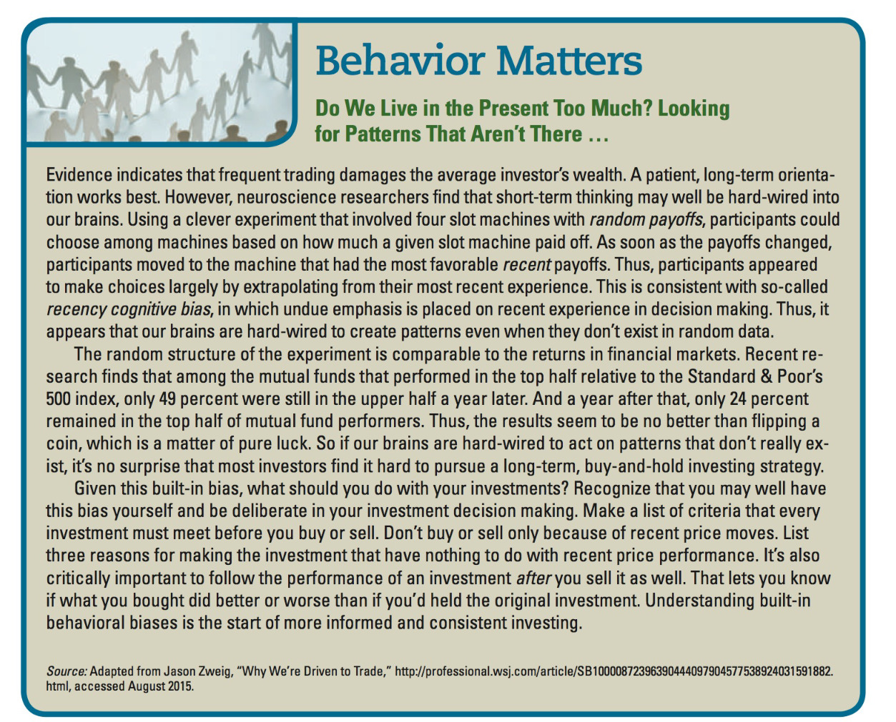

**Workseet 11.1: Determining the amount of investment capital**

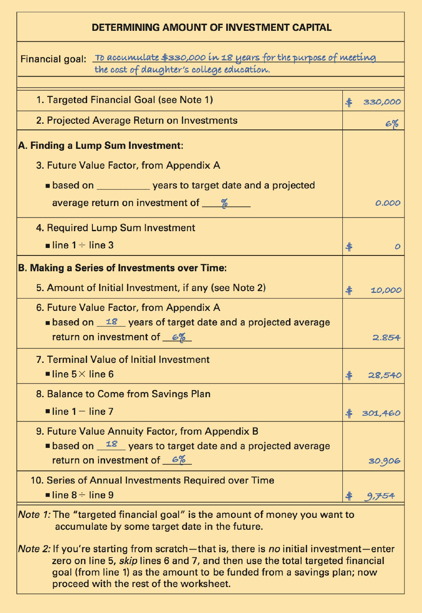

> **Investment plan**: A statement - preferably written - that specifies how investment capital will be invested to achieve a specified goal.

### What are your investment objectives?

Your goals tend to set the tone for your investment program, and they play a major role in determining how aggressive or conservative you're likely to be in making investment decisions. The most frequent investment objectives tend to be:

1. Accumulate funds for retirement
2. Save for a major purchase
	- Downpayment for a home
	- Money for a child's college education
	- Capital for going into business
3. Enhance current income
4. Seek shelter from taxes

### Different ways to invest

Some investment vehicles:

1. Common stock
2. Bonds
3. Preferreds and Convertibles
4. Mutual funds, Exchange-traded funds, Exchange-traded notes
5. Real estate

Quick overview, these are discussed further in the next chapters:

#### 1. Common stock

A form of _equity_, they represent an ownership interest in a corporation. Each share symbolises a fractional ownership position in a firm. A share of stock typically entitles the holder to equal participation in the corporation's earnings and dividends as well as an equal vote to elect the management of the corporation.

**The return comes from dividends and/or appreciation in share price**. (See [Chapter 12](TODO: add link to chap 12))


#### 2. Bonds

Bonds are _liabilities_ &mdash; they're IOUs from the issuer. Governments and corporations issue bonds that pay a stated return, called _interest_. An individual who invests in bonds receives a stipulated interest income, typically paid every six months, plus the return of the principal (face) value of the bond at maturity.


**Example**:

```
If you purchased a $1,000 bond that paid 5% interest in semiannual installments, 
then you could expect to receive $25 every six months (i.e., 5% x 0.5 years x $1,000) and at maturity,
recover the $1,000 face value of the bond.
```

**A bond can be bought or sold prior to maturity**, at a price that may differ from its face value because bond prices, like common stock prices, fluctuate in the market.


#### 3. Preferreds and Convertibles

These are forms of _hybrid securities_ in that each has the characteristics of both stocks and bonds; they're a cross between the two.

_Preferred securities_ are issued as stock, and as such, represent an equity position in a corporation. Unlike common stock, preferreds have a stated (fixed) dividend rate that is paid before the dividends to stock holders. Like bonds, preferred stocks are usually purchased for the current income (dividends) they pay.

A _convertible security_, in contrast, is a fixed-income obligation (usually a bond, but sometimes a preferred stock) that carries a conversion feature permitting the investor to convert it into a specified number of shares of common stock. Thus, convertibles provide the fixed-income benefits (interest) of a bond while offering the price appreciation (capital gains) potential of common stock. 

#### 4. Mutual funds, exchange-traded funds, exchange-traded notes


**Mutual fund**: an organisation that invests in and professionally manges a diversified portfolio of securities. 

A mutual fund sells shares to investors, who then become part owners of the fund's securities portfolio. A mutual fund will issue and repurchase shares at a price that reflects the current value of the portfolio at the time the transaction is made. They offer a wide variety of investment opportunities and services that many investors find appealing.


**Exchange-traded funds (ETFs)** are similar to mutual funds in that they are portfolios of securities. They are commonly designed to track a basket or index of equity securities like the S&P 500 or a particular sector, such as telecommunications or utility stocks. They can also include other types of investments, which include bonds and real estate. Whereas mutual funds can be bought or sold only at the end of a day, investors can trade ETFs throughout the day just like individual shares of stock. ETFs offer certain advantages over mutual funds. For example, unlike mutual funds, they trade continuously throughout the trading day and can be purchased with borrowed money or sold short. Further, ETFs provide more favourable tax treatment than mutual funds.


**Exchange-traded notes (ETNs)** are more similar to ETFs than to mutual funds. Unsecured, unsubordinated debt securities issued by an underwriting bank. Debt securities that have a maturity date and are backed only by the credit of the issuer. The ETN **bears a different risk than the ETF**. If the bank underwriting the ETN goes bankrupt, the ETN might lose value just as a senior debt security would. Consequently, ETFs only face the risk of market fluctuations, while ETNs face both market risk and the risk that the issuing bank will default. Unfortunately, this credit risk is hard for investors to evaluate. Like ETFs, ETNs are traded on an exchange and can be sold short. Also like ETFs, ETNs provide tax advantages over mutual funds.


#### 5. Real estate

Raw land speculation to limited-partnership shares in commercial property, even real estate mutual funds. Return comes from rents, capital gains, and certain tax benefits. [See Chapter 13](TODO: Add link to chap 13)

## Securities markets

> **Securities markets:** the marketplace in which stocks, bonds, and other financial instruments are traded


- Physical or
- Electronic networks


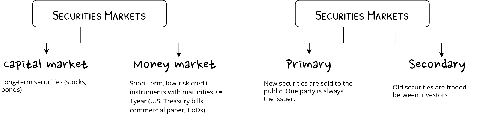

### Primary and secondary markets


#### Primary markets

When a corp. sells a new issue to the public, several financial institutions participate in the transaction:

- The corp will probably use an _investment banking firm_ which specialises in _underwriting_ (selling) new security issues
- The investment banking firm will give the corporation advice on pricing and other aspects of the issue and will either sell the new security itself or arrange for a _selling group_ to do so. 
- The selling group is normally made up of several brokerage firms, each responsible for selling a certain portion of the new issue.
- On large issues, the original investment banking firm may bring other underwriting firms as partners and form an _underwriting syndicate_ in order to spread the risks associated with underwriting and selling the new securities.
- Potential investors are given a **prospectus**, which is a document describing the firm and the issue.


#### Secondary markets

- Investors can execute transactions among themselves; an investor gets to sell his or her holdings to someone else. Included here are the various _security exchanges_.
- Another major segment of the market is made up of those securities that are listed and traded on the _National Association of Securities Dealers Automated Quotation System (NASDAQ)_ market, which employs an all-electronic trading platform to execute trades.
- Finally the _over-the-counter (OTC)_ market deals in smaller, unlisted securities.


### Broker & dealer markets

You can divide the secondary market into two categories, on the basis of _how securities are traded_: 

1. **Broker markets**
2. **Dealer markets**


**Note** that as an investor, these differences are not important because you place the orders in the exact same way (through a stockbroker, discussed later).

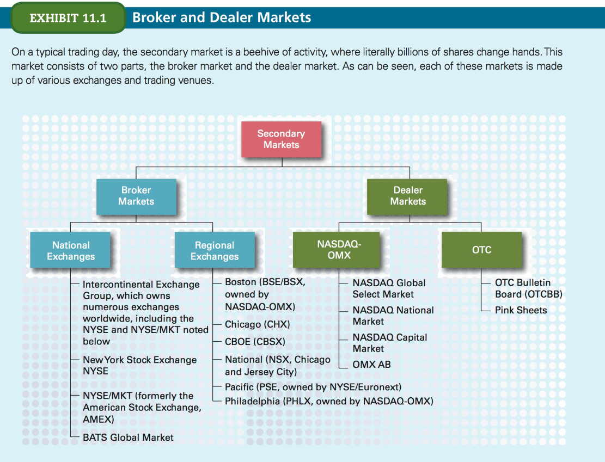

- **Broker markets:** the two parties to the transaction are brought together and the trade takes place at that point. The securities exchange hands right there on the floor of the exchange, with the help of a broker.
- **Dealer markets**: two parties never meet. Buy/sell orders are executed separately through _securities dealers_, who act as _market makers_. There is always a dealer (market maker) on one side of the transaction.


#### Broker markets

- New York Stock Exchange (NYSE)
- American Stock Exchange (AMEX)
- BATS Global Market
- Handful of _regional exchanges_. Boston, National, Pacific, and Philadelphia exchanges. Most are modeled after the NYSE, but their membership and listing requirements are considerably more lenient. To enhance their trading activity, regional exchanges often list securities that are also listed on the NYSE.


#### Dealer markets

- Unlike the NYSE, it doesn't have centralised trading floors.
- Many market makers linked through a mass telecom network
- Each market maker offers to sell or buy securities at stated bid/ask prices.
- Consists of both the NASDAQ and OTC markets (40% of all shares traded in the US)

> **Bid price**: the highest price offered to purchase a given security (from the dealer)

> **Ask price**: the lowest price at which a security is offered for sale (by the dealer)


To be traded on the NASDAQ all stocks must have at least two market makers, although the bigger, more actively traded stocks (such as Apple) will have many more than that. 

These dealers electronically post all their bid/ask prices so that, when investors place (market) orders, they're immediately filled at the best available price. 

NASDAQ sets various listing standards, the most comprehensive of which are for the 2K or so stocks traded on the _NASDAQ National Market (NNM)_ and the roughly 1K stocks traded on the _NASDAQ Global Select Market_ (this market is reserved for the biggest and bluest NASDAQ stocks). 

Indeed, just as the NYSE has its list of big name players (e.g., ExxonMobil, Wal-Mart, Pfizer, IBM, Coca-Cola, Home Depot, and UPS), so too does NASDAQ - including names like Apple, Microsoft, Intel, Cisco, eBay, and Google.

The other part of the dealer market is made up of securities that trade in the _OTC market_. This market is separate from NASDAQ and includes mostly small companies that either can't or don't wish to comply with NASDAQ listing requirements. They trade on either the _OTC Bulletin Board (OTCBB)_ or in the so-called _Pink Sheets_. 

**OTCBB**: an electronic quotation system that links the market makers who trade the shares of small companies, regulated by the SEC, which requires (among other things) that all companies traded on this market file audited financial statements and comply with federal securities law.

In sharp contrast, the **Pink Sheets** represent the _unregulated_ segment of the market, where the companies aren't even required to file with the SEC. Actually, this market is broken into two tiers: The larger (bottom) tier is populated by all those small and oftentimes questionable companies that provide little or no info about their operations, while the top (albeit smaller) tier is reserved for companies that choose to provide audited financial statements and other required information. Liquidity is often minimal or almost nonexistent; and the market, especially the bottom tier, is littered with scores of nearly worthless stocks - definitely not a market for the uninitiated.

More than 100 other countries have organized securities exchanges. 


### Bull market or Bear

The general condition of the market is termed as either _bullish_ or _bearish_, depending on whether securities prices are rising or falling over extended periods.

Changing conditions generally stem from changing investor attitudes, economic activity, and certain governmental actions aimed at stimulating or slowing down the economy.

> **Bull market**: A market condition normally associated with investor optimism, economic recovery, and expansion; characterized by generally rising securities prices

> **Bear market**: A condition of the market typically associated with investor pessimism and economic slowdown; characterized by generally falling securities prices.

- Over the past 50 years or so, the market has generally been bullish
- Since WWII, the longest bull market lasted 125 months from Nov. 1990 to March 2000. 
- That bull market ended abruptly in the spring of 2000, when a nasty bear market took over.
- Recovered in 2002, the market advanced till Oct 2007, when the full effects of the financial crisis started to become apparent.
- The S&P lost about 37% in 2008 yet rose by about 40% between March & May of 2009
- Since 1825, returns increased in 134 years, and decreased in 56 years.


## Making transactions in the securities markets

### Stockbrokers

> **Stockbrokers (account executives, financial consultants)**: a person who buys and sells securities on behalf of clients and gives them investment advice and information.

- Note that they help an investor sell all sorts of securities, not only stocks: bonds, convertibles, mutual funds, options, and many other types.
- Brokers must be licensed by the exchanges and must abide by the ethical guidelines of the exchanges and SEC regulations
- **In essence are there to execute the orders placed.**

#### Selecting a broker

If you decide to start investing, it's important to select someone _who understands your investment objectives and who can effectively help you pursue them_. A good place to start is to ask friends, relatives, or business associates to recommend a broker. A good broker is someone who's more interested in **your investments than in his or her own commissions**. 


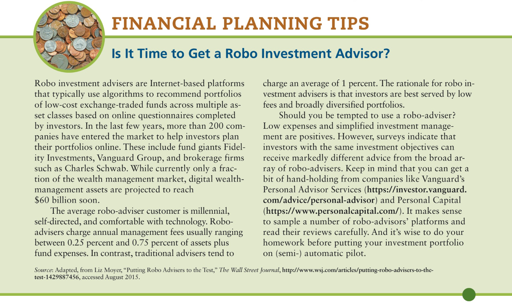


#### Full service, discount, and online brokers

Just a few years ago, there were 3 distinct types of brokers:

- full-service
- discount
- online

and each occupied a well-defined market niche. Today, the lines between these 3 types of brokers are blurred. Most brokerage firms, even the more traditional ones, now offer online services to compete with the increasingly popular online firms. And many discount brokers now offer services, such as research reports for clients, that once were available only from a full-service broker.

- **Full-service broker**: offers investors a wide array of brokerage services, including investment advice and information, trade execution, holding securities for safekeeping, online brokerage services, and margin loans.
- **Discount brokers**: If you're only interested in executing trades, and don't want to pay for all those services above, you can go to a discount broker, who tends to have low-overhead operations and offer fewer customer services. Depending on the transaction size, discount brokers can **save investors from 30 to 80%** of the commissions charged by full-service brokers.
- **Online broker**: Typically a discount broker through whom investors can execute trades online.

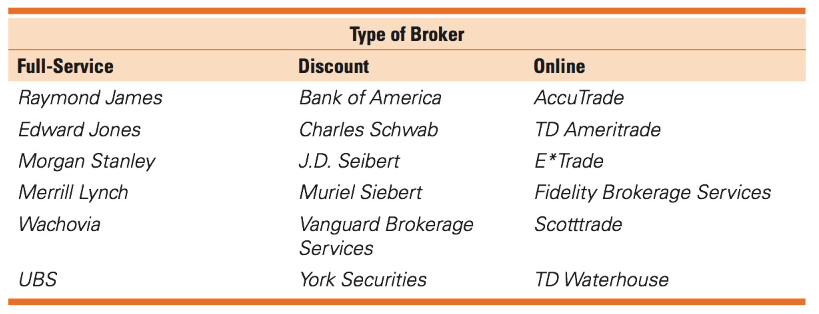

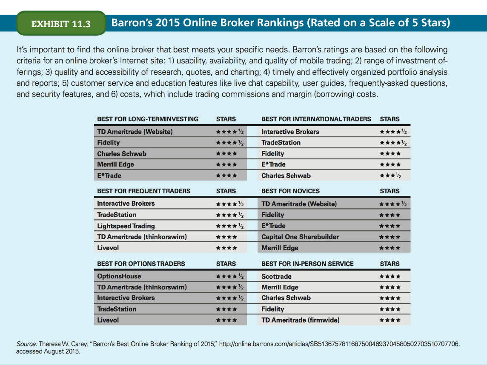

#### Brokerage fees

- Brokerage firms receive commissions for executing buy and sell orders for their clients.
- Commissions are _negotiated_ (not fixed), but in practice most firms have _established fee schedules_ that they use with small transactions.
- Pays to shop around.
- If you're an active trader, by all means try to negotiate a reduced commission schedule with your broker. Brokers much prefer active traders to buy-and-hold investors, because traders generate a lot more commissions.
- A round lot (100 shares) of common stock will amount to roughly 1% of the transaction value

Brokerage commissions on _bond transactions_ differ from those on stock transactions. Typically charge a min. fee between $5 and $30, regardless of the number of bonds. For multiple bond transactions, the brokerage cost per $1,000 corporate bond typically drops to $10 or below. 

Commission schedules for other securities, such as mutual funds and options, differ from those used with stocks and bonds. 

The magnitude of brokerage commissions is obviously an important consideration when making security transactions, because these fees tend to raise the overall cost of purchasing securities and lower the overall proceeds from their sale.

**Security transactions can be made in either odd or round lots**.

> **Odd lot**: consists of fewer than 100 shares of stock

> **Round lot**: 100-share unit or multiples thereof

Odd lots include processing fees which make **round lots** the best deal whenever possible.

#### Executing trades

1. Place a buy or sell order (by phone or online)
2. Receive confirmation that the order has been completed. 

The whole process usually takes less than 2 minutes.

Once the trade takes place, the investor has three (business) days to "settle" his or her account with the broker - that is, to pay for the securities.

#### Types of orders

1. **Market order**: An order to buy or sell a security at the best price available at the it's placed. Quickest way to have orders filled because they're executed as soon as they reach the trading floor. 
2. **Limit order**: An order to buy at a specified price (or lower), or sell at a specified price (or higher). The broker transmits a limit order to a _specialist_ dealing in the given security on the floor of the exchange. The order is executed as soon as the specified market price is reached and all other such orders with precedence have been filled. Although a limit order can be quite effective, it can also cost you money. If, for instance, you want to buy at $20 or less and the stock price moves from its current $20.50 to $32 while you're waiting, your limit order for $20 will have caused you to forgo an opportunity to make a profit of $11.50 ($32.00 - $20.50) per share. Had you placed a market order, this profit would have been yours.
3. **Stop-Loss order**: An order to _sell a stock_ when the market prices reaches or drops below a specified level. Used to protect the investor against rapid declines in stock prices, the stop order is placed on the specialist's book and activated when the stop price is reached. At that point, the stop order becomes a _market order_ to sell.

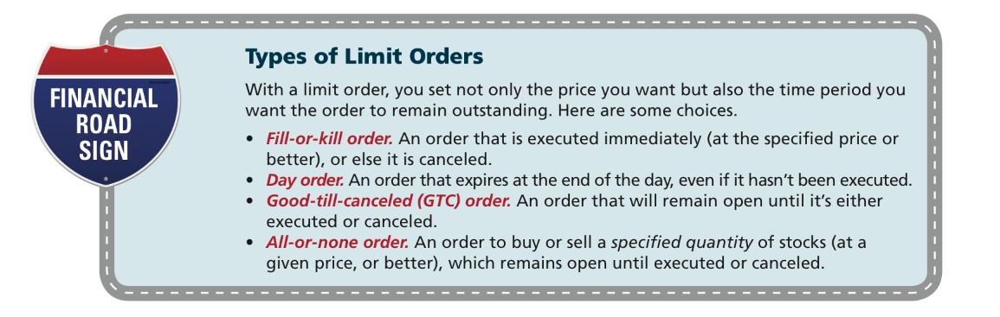


### Calculating investment returns

> **Rate of return**: The increase or decrease in the price of an investment as well as any income received over the investment period, both stated as a percentage of the initial investment

```
Rate of Return = (ending value - beginning value + income) / (beginning value)
```

The amount earned on an investment per dollar invested. Thus, the rate of return on a stock is the change in the price of the stock + any dividends over the investment period, both divided by the original price paid for the stock.

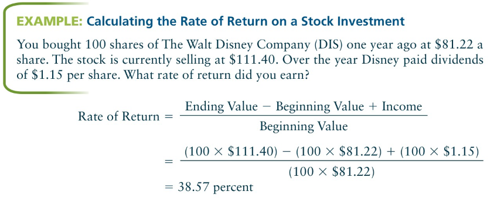

### Margin trades and short sales

When you're ready to buy securities, you can do so by putting up your own money or by borrowing some of the money.

> **Buying on margin**: is a practice that allows investors to use borrowed money to make security transactions.

Margin trading is closely regulated and is carried out under strict margin requirements set by the Federal Reserve Board. These requirements specify the amount of _equity_ that an investor must put up when buying stocks, bonds, and other securities. The most recent requirement is 50% for common stock, which means that at least 50% of each dollar invested must be the investor's own.

The use of margin allows you to increase the return of your investment when stock prices increase. A major attribute of margin trading is that it allows you to _magnify your returns_, you can use margin to reduce your equity in an investment and thereby magnify the returns from invested capital when security prices go up. Importantly, **the use of margin mangifies both profits and losses**. 

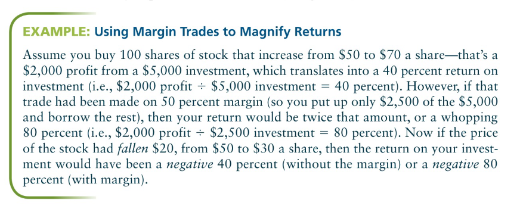

#### Short sales

Investors can **go long** or **go short** when they trade stocks. By far, the vast majority are _long transactions_. That is, they're made in anticipation of _stock prices going up_, so the investor can make money buying low and selling high.

> **Short sale**: a transaction that involves selling borrowed securities with the expectation that they can be replaced at a lower price at some future date; made in anticipation of a decline in the security's price. 

Essentially, a bet against a security. The broker **will borrow the security** from its own portfolio or from one of its clients, and then sell it on behalf of the short seller (the money goes to them). If the price of the security drops, it's bought back and a profit is made (and the security replaced).

In this scenario, you **sell high, then buy low**. It's a **very high risk** investment.

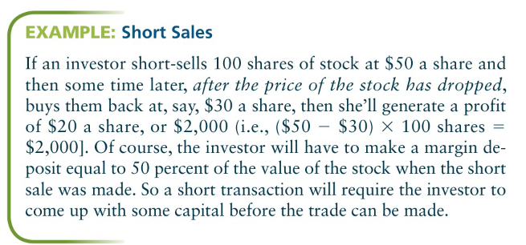


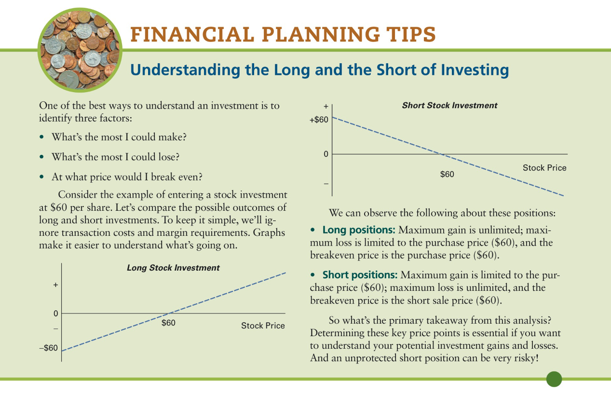


## Becoming an informed investor

Investor know-how defines the playing field. It gives you access to many investment vehicles and opportunities the more you know about them. It helps determine how well you'll meet your investment objectives. It can't guarantee success, but can help you avoid unnecessary losses.

**4 types of investment information you should follow on a regular basis**:

1. **Economic developments and current events**: To help you evaluate the underlying investment environment
2. **Alternative investment vehicles**: To keep you abreast of market developments
3. **Current interest rates and prices**: To monitor your investments and stay alert for developing investment opportunities
4. **Personal investment strategies**: To help you hone your skills and stay alert for new techniques as they develop


### Annual stockholder reports

> **Annual stockholders' report**: A report made available to stockholders and other interested parties that includes a variety of financial and descriptive information about a firm's operation in the recent past.

- Balance sheets
- Income statements
- Other financial reports
- Business activities
- Recent developments
- Future plans and outlook
- Financial ratios describing past performance

Reading the report:

1. Start with the highlights or selected financial data sections.
2. Read the chief executive's letter. Look for euphemisms like "a slowing of growth" to describe a drop in earnings.
3. Move on to the discussion of operations. Provides info on sales, earnings, debt, ongoing litigation, etc.
4. Review the financial statements, including the notes. Look for trends in sales, costs, profit, cash position, and net working capital.
5. Read the auditor's report. Look for phrases like "except for" or "subject to", as they mean _there may be problems you need to understand_.


### The financial press

- WSJ
- Barron's
- Investor's Business Daily
- the "Money" section in USA Today
- Money magazine
- Forbes 
- Fortune
- Business Week
- Kiplinger's
- Bloomberg

### Market data

Averages or indexes, they describe the general behaviour of the securities markets.

- Based on the price movements of a select group of securities over an extended period
- Capture the overall performance of the market as a whole
- The absolute value of the index is far less important than the trend.
- Most common: Dow Jones, S&P, NYSE, and NASDAQ.


#### Dow Jones Industrial Averages

4 parts:

1. DJIA: the industrial average, based on 30 stocks
2. Transportation average (20 stocks)
3. Utility average (15 stocks)
4. Composite average (all 65 industrial, transportation, and utility stocks)

Most of the stocks are picked from the NYSE, but a few are from the NASDAQ (Intel & Microsoft).

- strong bias towards blue chips
- DJIA behaviour closely reflects that of other broadly based stock market measures

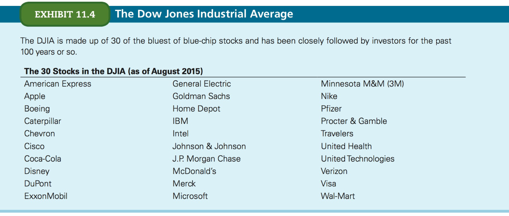


#### Standard & Poor's indexes

- Uses a lot more stocks (S&P 500 uses 500)
- Greater breadth of representation
- Index, not average, but highly correlated
- MidCap 400 and SmallCap 600 also very popular

#### NYSE, NASDAQ and other market indexes

- NYSE index: Performance of all stocks listed in the NYSE
- NASDAQ Composite (all stocks in NASDAQ) (more volatile than the Dow or S&P)
- NASDAQ 100 (biggest 100 nonfinancial stock)
- Dow Jones Wilshire 5000 index: total market value of 98-99% of all publicly traded stock in the US. Used to track performance, but also an accurate read of the size of the market
- Russell 2000 (small cap segment of market)


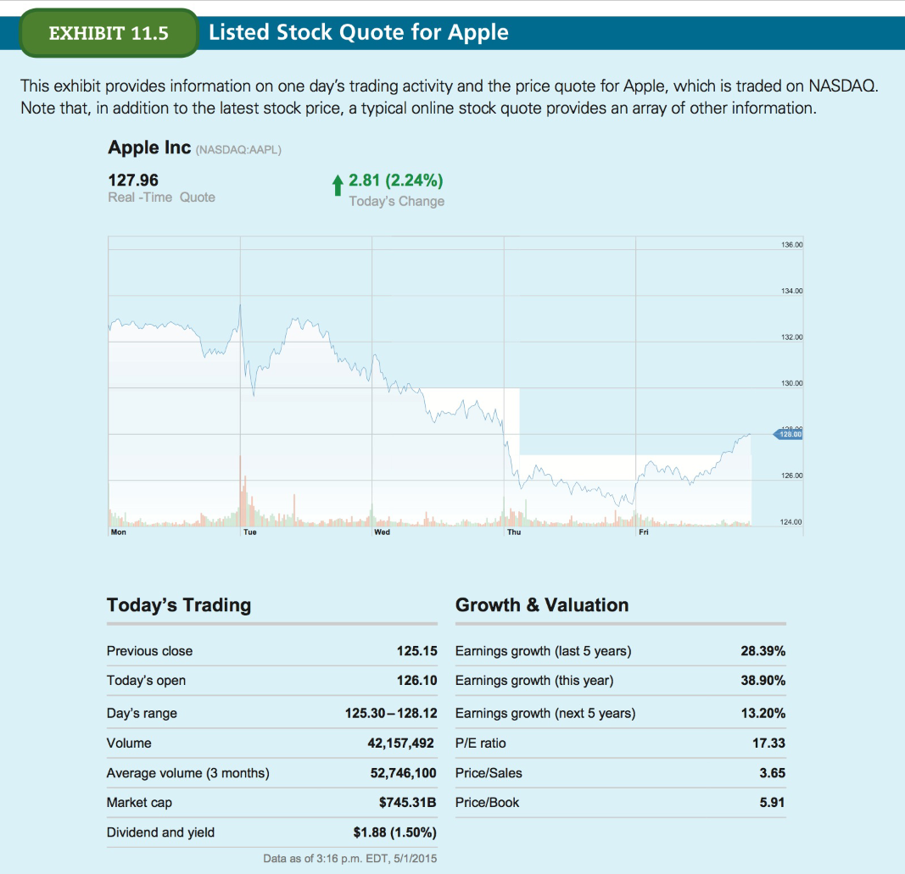

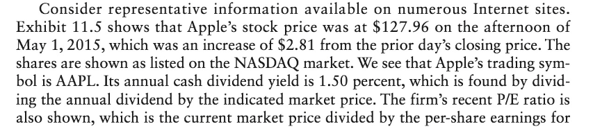
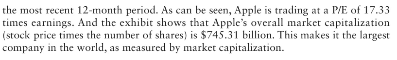


### Brokerage reports

Reports produced by the research staffs of major (full-service) brokerage firms provide still another important source of investor information. They also regularly issue reports on specific securities, including recommendations for the type of investment returns expected and whether to buy, hold, or sell specific securities.

### Advisory services

Subscription advisory services provide info and recommendations on various industries and specific securities. Cost from $50 to several hundred dollars a year, although you can review the material at your broker's office, university & public libraries, or online.

Best known:

- S&P: monthly stock guide & bond guide, _S&P Outlook_ (see example in Exhibit 11.6)
- Moody's Investor Service: stock & bond guide
- Value Line: _Investment Survey_
- Morningstar


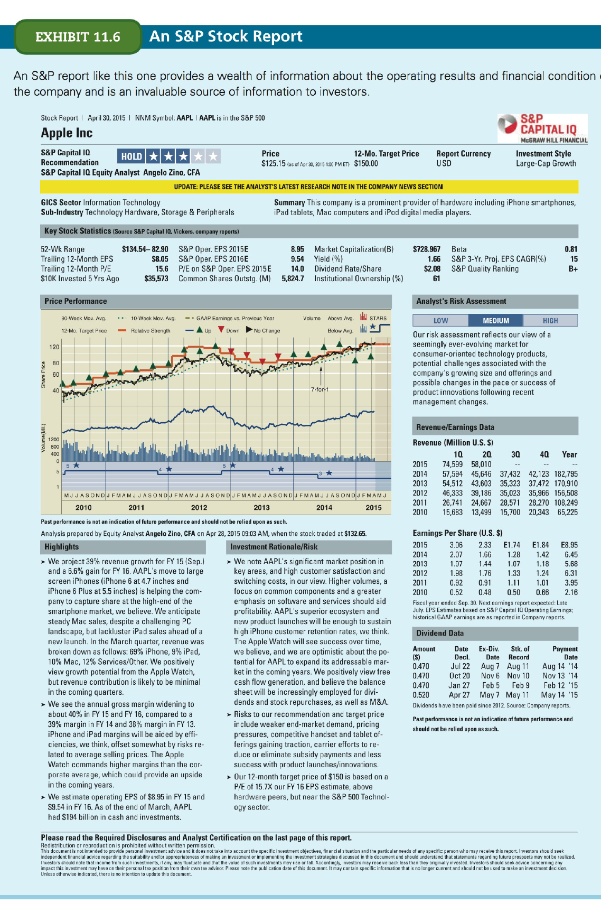
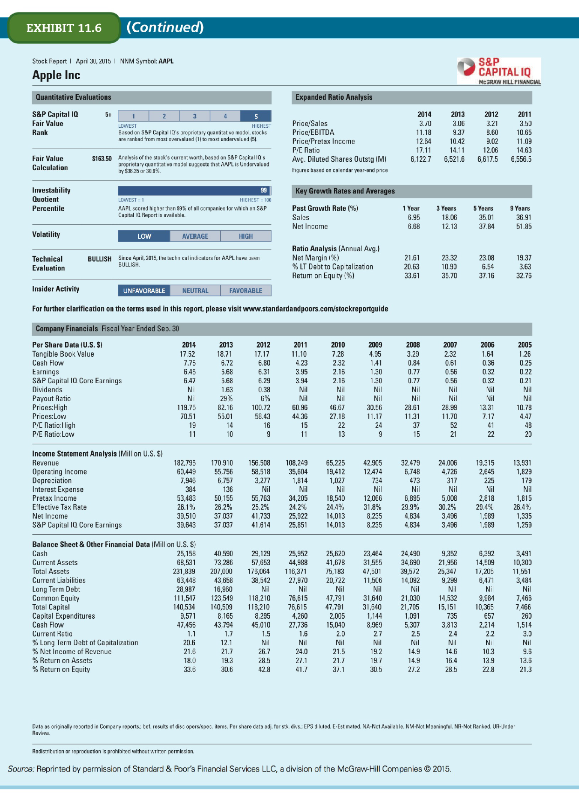

## Online investing

- You can trade all types of securities online
- Lots of risk, no human broker to tell you to reconsider
- Rules are still the same: _knwo what you're buying, from whom, and at what level of risk_.
- [E-Trade](httpss://www.etrade.com)
	- Quick overview of recent market activity, obtain price quotes, and research reports, or use their services to track a whole portfolio of securities
	- Select stocks, bonds, and mutual funds
	- Get advice on retirement planning & saving for college
	- Even do your banking


You can find a lot of good info online:


#### Investor education

Tutorials, online classes, and articles. Here are some featuring _investment fundamentals_:

- [The Motley Fool](https://www.fool.com): _Fool's School_ has sections on fundamentals of investing, mutual fund investing, choosing a broker, investment strategies and styles, lively discussion boards, and more.
- [Morningstar](https://www.morningstar.com): provides comprehensive information on stocks, mutual funds, ETFs, and more.
- [Zacks Investment Research](https://www.zacks.com): excellent starting place to learn what the Internet can offer investors
- [NASDAQ](https://www.nasdaq.com) has an investor Resource section that helps with financial planning and choosing a broker.
- [Money](https://money.cnn.com)
- [Kiplinger](https://www.kiplinger.com)

#### Investment tools

Once you're familiar with the basics of investing, you can develop financial plans, and set investment goals, find securities that meet them, analyse potential investments, and organize your portfolio.

- financial calculators & worksheets: how much to save each month for a goal.
	- [Fidelity](https://www.fidelity.com)
- screening & charting tools: historical and forecasted info earnings, earnings per share, dividend yields, growth rates, etc. Track behaviour of a specific stock relative to a market index or to one or more of its major competitors. Screening: identify attractive and potentially rewarding investment vehicles. Allows you to specify stocks with low or high P/E multiples, small market capitalizations, high dividend yields, specific revenue growth, and low debt-to-equity ratios and it'll filter them for you
	- Quicken
	- Morningstar
	- MSN Money Central
- portfolio trackers: specify number of shares held & symbol for stocks or mutual funds and the tracker will update the value of your portfolio. 
	- Quicken
	- Morningstar
	- [Google](https://google.com/finance/portfolio)
	- ETrade
- alert systems

##### Day traders

In contrast to buy-and-hold investors with a long-term perspective, **day traders** buy and sell stocks quickly throughout the trading day. They hope their stocks will continue to rise in value for the short time they own them - sometimes just seconds or minutes - so they can make quick profits. Day trading is neither illegal nor unethical, but it is _highly risky_. They usually buy on margin to compound their risk and earn even higher returns. 

They usually incur major financial losses when they start trading. Some never reach profitability. High expenses for brokerage commissions, training, and computer equipment. 


## Managing your investment holdings

Buying and selling securities is not difficult; the hard part is finding securities that will provide the kind of return that you're looking for. Eventually, your investment holdings will increase to the point where you're managing a whole portfolio of securities.

> **Portfolio**: a collection of investment vehicles assembled to meet a common investment goal.

Seasoned investors devote much attention to constructing diversified portfolios of securities. Such portfolios consist of stocks and bonds selected not only for their returns but also for their combined risk-return behaviour.

> **Diversification**: The process of choosing securities with dissimilar risk-return characteristics in order to create a portfolio that provides an acceptable level of return and an acceptable exposure risk.

Studies have shown that you can achieve a noticeable reduction in risk simply by diversifying your investment holdings.


### Building a portfolio of securities

Diversification is a desirable quality in investments portfolio.

```
For example, a portfolio made up of nothing but drug stocks, such as Merck and Eli Lilly, would hardly be well diversified.
```

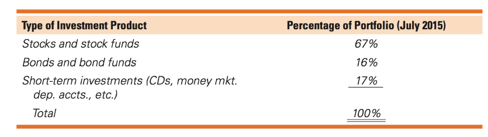

Your portfolio strategy will depend on your own objectives and needs.


#### Investor characteristics

Begin with an honest evaluation of your own financial condition and family situation. Pay attention to the following variables:

- Level and stability of income
- Family factors
- Investment horizon
- Net worth
- Investment experience and age
- Disposition towards risk


An investor with a secure job is more likely to embark on a more aggressive investment program. Income taxes also bear on the investment decision. The higher an investor's income, the more important the tax ramifications of an investment program become.

Consider  that municipal bonds normally yield about 25-30% less in annual interest than corporate bonds, because the interest income on municipal bonds is tax-free. On an after-tax basis, however, municipal bonds may provide a superior return if an investor is in a tax bracket of 28% or higher.

A good rule of thumb is that _an investor's exposure to risk should never exceed the ability to bear that risk_.


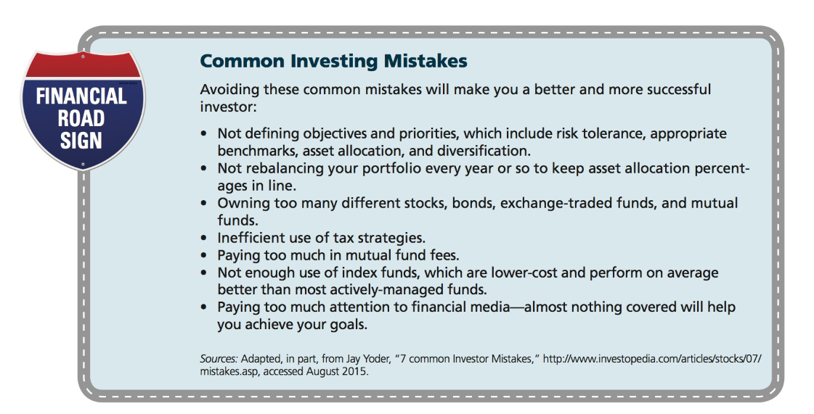

#### Investor objectives

"What do I want from my portfolio?"

There's generally a trade-off between earning a high current income from an investment and obtaining significant capital appreciation from it. An investor must choose one or the other; it's hard to obtain both from a single investment vehicle.

Of course, in a portfolio it's possible to have a _balance_ of both income and growth (capital gains), but most often that involves "tilting" the portfolio in one direction (e.g. toward income) or the other (toward growth).

An investor's needs should determine which approach to choose. For instance, a retired investor whose income depends a lot on her portfolio will probably choose a lower-risk, current-income-oriented approach for financial survival. In contrast, a high-income ,financially secure investor may be much more willing to take on risky investments in hopes of improving her net worth. Likewise, a young investor with a secure job may be less concerned about current income and more able to bear risk. This type of investor will likely be more capital gains oriented and may choose speculative investments.


### Asset allocation & portfolio management

To create a portfolio geared towards your goals, you need to create an **assets allocation strategy**.

> **Assets allocation**: A plan for dividing a portfolio among different classes of securities in order to preserve capital by protecting the portfolio against negative market developments.

What portion of your portfolio will be devoted to:

- short-term securities
- long-term bonds and bond funds
- individual common stocks & equity funds

The emphasis is on _preserving capital_.There's overwhelming evidence that, over the long run, _the total return on a portfolio is influenced far more by its asset allocation than by specific security selections_.

Looks like this:

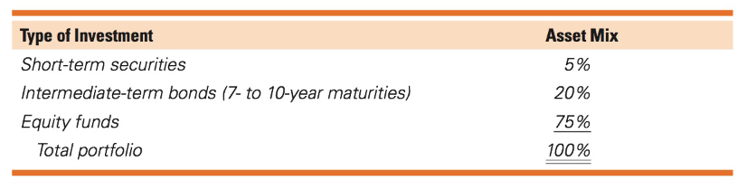


Once you've decided that you want to put, say, 20% of your money into intermediate-term (7-10 years) bonds, your next step is to select those specific securities.

After establishing your asset allocation strategy, you should check it regularly for two reasons:

1. To make sure that you portfolio is in line with your desired asset mix
2. To see if that mix is still appropriate for your investment objectives

Some reason to reevaluate your asset allocation:

- A major change in personal circumstances &mdash; marriage, birth of a child, loss of a spouse to divorce or death, child graduating from college, loss of a job, or family illness &mdash; that changes your investment goals
- The proportion of an asset category rises or falls considerably and thereby deviates from your target allocation for that class by more than, say, 5%.
- You're close to reaching a certain goal

Reevaluate periodically but not too often: allow for changes.

Exhibit 11.7 provides examples of four portfolios, each developed with a particular financial situation in mind. 

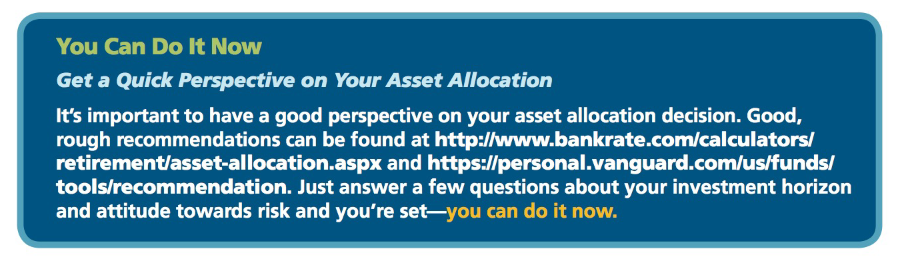

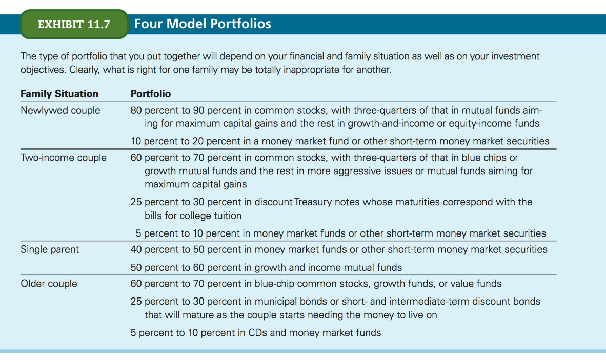


### Keeping track of your investments

Sometimes investments don't perform the way you thought they would. Their return may be well below what you'd like, or you may even have suffered a loss. In either case, it may be time to sell the investments and put the money elsewhere.

You should set up a monitoring system that can allow you to identify such securities.

Use a worksheet like the one below along with an online portfolio tracker. The ws provides long-term information from the date of purchase of an asset, and the online portfolio tracker provides year-to-date or annual returns. A report like the WS below should be prepared at least once a year.

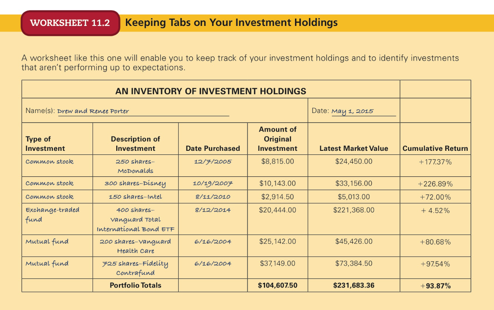

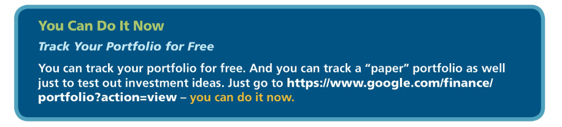

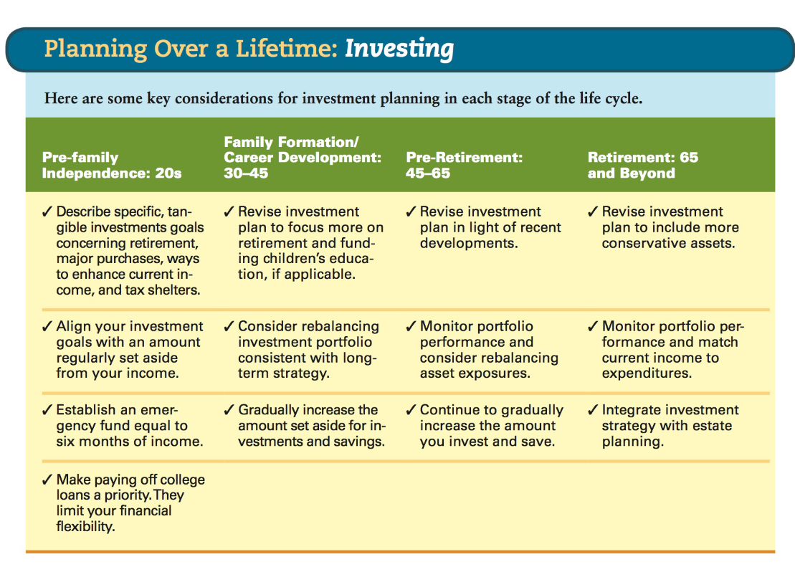

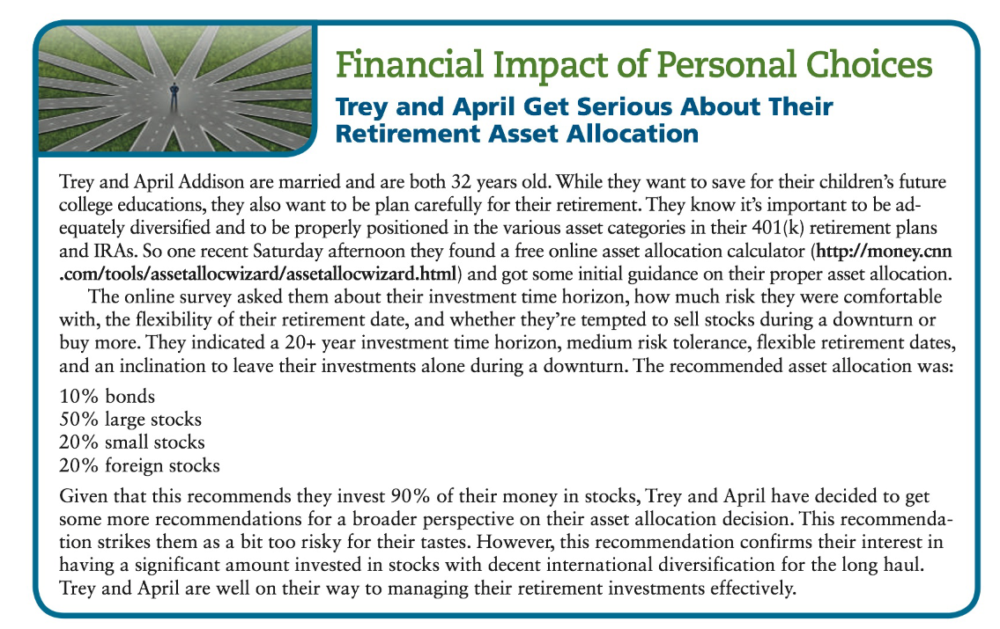
