# Chapter 12
## Investing in Stocks &amp; Bonds

## Risk & Return

Return rate alone is not enough to decide if an investment is good. You must also consider the _risk_ &mdash; the chance that the actual return will fall short from the expected value.

Generally speaking riskier investments should provide higher levels of returns. (Risk-return trade-off).

### Risks of investing

> **Fixed-income securities**: Securities such as bonds, notes, and preferred stocks that offer purchasers fixed periodic income.

Almost all investments are subject to some risk. Basic types of investment risk:

- **business risk:** when investing in a company, possibility that the firm will not maintain sales & profits, stay in business. Variability surrounding firm's cash flows and subsequent ability to meet operating expenses on time.
- **financial risk**: the amount of debt used to finance the firm and its ability to meet these obligations on time. (Look to the company's balance sheet)
- **market risk**: Results from the behaviour of investors in the securities markets. Risk of the price volatility of a security.
- **purchasing power risk**: Results from possible changes in price levels, which significantly affect investment returns. In periods of rising prices (inflation), the purchasing power of the dollar declines. This means that a smaller quantity of good and services can be purchased with a given number of dollars. In general, investments (such as stocks and real estate) whose values tend to move with the general price levels are most profitable during periods of rising prices, whereas investments (such as bonds) that pay fixed cash flows are preferred during periods of low or declining price levels.
- **interest rate risk**: A type of risk resulting from changing market interest rates, that mainly affects fixed-income securities. As interest rates change, the price of these securities fluctuate, decreasing with rising interest rates and increasing with falling rates. The prices of fixed-income securities drop when interest rates increase because investors require rates of return that are competitive with securities offering higher levels of interest income.
- **liquidity risk**: The risk of not being able to liquidate (i.e., sell) an investment conveniently and at a reasonable price. In general, investments traded in _thin markets_, where supply and demand are relatively small, tend to be less liquid than those traded in _broad markets_. To be liquid, an investment not only must be easy to sell, but also must be so _at a resonable price_. For example, a security recently purchased for $1,000 wouldn't be viewed as highly liquid if it could only be sold at a significantly reduced price, such as $500. Vehicles such as mutual funds, common stocks, and U.S. Treasury securities are generally highly liquid; others, such as an isolated parcel of raw land, are not.
- **event risk**: The risk that some major, unexpected event will occur that leads to a sudden and substantial change in the value of an investment. A good example was the action by the FDA years ago to halt the use of silicone breast implants. The share price of Dow Corning &mdash; the dominant producer of this product &mdash; quickly fell due to this single event. 


### Returns from investing

Any investment has two basic sources of return:

- **current income**
- **capital gains**

Some investments offer only one source of return (for example, non-dividend-paying stocks provide only capital gains), but many others offer both income and capital gains, which together make up the _total return_ from an investment. 

The relative importance varies with each vehicle. Whereas current income is more important with bonds, capital gains are usually a larger portion of the total return from common stocks.


#### Current income

Generally received with some degree of regularity over the course of the year. It may take the form of dividends on stock, interest from bonds, or rents from real estate. People who invest to obtain income look for investments that will provide regular and predictable patterns of income. Preferred stocks and bonds, which are expected to pay established amounts at specified times (e.g. quarterly or semiannually), are usually viewed as good income investments.

#### Capital gains

The other type of return is capital appreciation (or growth), which is reflected as an **increase in the market value of an investment** vehicle. Capital gains occur when you're ale to **sell a security for more than you paid for it**. Greater growth potential usually means lower levels of current income.


#### Earning interest on interest

To be able to achieve the expected rate of returns from an investment, **you must reinvest the interest at the same rate of return**.

> For example, consider an investor who buys a 4% U.S. Treasury bond and holds it to the maturity date in 20 years. Each year, the bondholder receives $40 in interest, and at maturity, the $1,000 in principal is repaid. There's no loss in capital, no default; everything is paid right on time. Yet this sure-fire investment ends up yielding only 3%. Why? Because the investor failed to reinvest the semiannual interest payments received at the original interest rate of 4%, and so failed to earn any interest on interest.

The notion of earning interest on interest is what the market refers to as a _fullly compounded rate of return_. It's an important concept because you can't reap the full potential from your investments unless you earn a fully compounded return on your money.

Interest on interest is a particularly important element of return of investment programs involving a lot of current income. This is because, in contrast to capital gains, current income must be reinvested by the individual investor.


#### Future return

For a given investment, you should know the _expected future return_. Past returns are not useful. 

The return is based, again, on capital gains plus income.

> Assume you're thinking of buying some stock in CTA Strategic Group, Inc. (CTA). After reviewing several financial reports, you've estimated the future dividends and price behaviour of CTA as follows (assume we're currently in 2016):

Expected average annual dividends, 2017-2019: $2.15 a share
Expected market price of the stock, 2019: $95 a share

> Because stock is now selling for $60 a share, the difference between its current and expected future market price ($95 - $60) represents the amount of _capital gains_ that you expect to receive over the next three years &mdash; in this case, $35 a share. The projected future price, along with the expected annual dividends, gives you an estimate of the stock's _future income stream_, what you need now is a way to measure the _expected return_.

#### Approximate expected yield

Approximate expected yield provides a measure of the fully compounded rate of return.


## Investing in common stock

Appeal:

- Level of current income
- Common stockholders are residual owners of the company

The market has its bad days, and sometimes they seem to go on for months, but those bad days _are the exception, not the rule_. From 1929 through 2015, the Dow went down (for the year) 21 times, which is only 25% of the time. The other 75% the market was up anywhere from 2-40%.

> There is risk and volatility. From August 1982, through January 2000 the DIJA climbed from 777, to 11,723 points, an annual rate of almost 17%. In early 2000 everything came to a halt when for the next 3 years all 3 markets fell. The Dow recovered from 2003 through mid-2007, but then it fell from that point on through early 2009 (due to the Great Recession).


#### Issuers of stock

Any company can issue stock. Some companies don't have publicly traded stock, but we're not concerned with those here. These are known as _publicly traded issues_. Subsequent sales of additional shares may be made through a procedure known as a _public offering_. In it, the corporation, working with is underwriter, simply offers the investing public a certain number of shares of its stock at a certain price.


#### Voting rights

Holders of common stock normally receive _voting rights_. One vote per share. There are stock that are issued as nonvoting, but these are the exception. Several voting systems exist, but small stockholders need not concern with them, because their changes of affecting corporate control with their votes are quite slim.

Corporations have annual stockholder meetings, at which time new directors are elected and special issues are voted on. Because most small stockholders can't attend these meetings, they can use a proxy to assign their votes to another person, who will vote for them. A **proxy** is a written statement assigning voting rights to another party.

#### Basic tax considerations

Both dividends and capital gains are taxed, and mostly equally at 15% or 20%. Capital gains are not taxed until you actually sell the stock. Dividends are taxed as income for the year you received the payment.


### Dividends

Dividends are paid in cash or additional stock. Cash is most common. Usually paid quarterly in an amount determined by the firm's board of directors.

If directors declared a quarterly yield of 50 cents per share, if you owned 200 shares of stock, then you'd receive a check for $100.

A popular way of assessing the amount of dividends received is to measure the stock's dividend yield.

> **Dividend yield**: The percentage return provided by the dividends paid on common stock. 

```
Dividend Yield = Annual dividend received per share / Market price per share of stock
```

For example, a company that pays $2 per share in annual dividends and whose stock is trading at $50 a share will have a dividend yield of 4% (2/50 = .04).

Occasionally, the directors may declare a stock dividend as a supplement to or in place of cash dividends.

> **Stock dividends**: New shares of stock distributed to existing stockholders as a supplement to or substitute for cash dividends. (Ex. 1/10 of a share of new stock for each share owned, i.e. 10% stock dividend)

Unfortunately, you'll be no better off after the stock dividend than you were before. That's because the total market value of the shares owned would be (roughly) the same after the stock dividend as before. This is because the price of the stock usually falls in direct proportion to the size of a stock dividend.


### Some key measures of performance

Investors use a variety of financial ratios and measures. 

- dividend yield
- book value (or book value per share)
- net profit margin
- return on equity
- earnings per share
- price/earnings ratio
- beta


#### Book value

> **Book value**: the amount of stockholder's equity in a firm; determined by subtracting the company's liabilities and preferred stock from its assets

Indicates the net amount of stockholder funds used to finance thee firm. 

```
Assume CTA had assets of $8M, liabilities of $2M and preferred stock valued at $1M.
The book value of the firm's common stock would be $5M ($8 - $2M - $1M).
```

If the book value is divided by the number of shares outstanding, the result is _book value per share_. 

Because it usually reflects attractive growth, you'd like to see book value per share steadily increasing over time. Also, look for stocks whose market prices are comfortably above their book values.


#### Net profit margin

One of the most widely followed measures of corporate performance.

> **Net profit margin**: Relates a firm's net profits to its sales; shows the rate of return the company is earning on its sales.

```
Net profit / sales
```

It also captures how well the company manages its cost structure. The higher the net profit margin, the more money the company earns. Look for a relatively stable - or even better, increasing - net profit margin.


#### Return on equity (ROE)

> **Return on equity**: reflects the firm's overall profitability from the equityholders' perspective.

```
Net equity / shareholders' equity
```

Measures how effectively the firm's manages its assets, operations and capital structure. It's important because it is significantly related to profits, growth, and dividends of the firm. So long as the firm is not borrowing too much money, the better the ROE, the better the company's financial and competitive positions. Look for a stable or increasing ROE.


#### Earnings per share

> **Earnings per share**: The dollar return earned by each share of common stocks.

The firm's annual earnings are usually measured and reported in terms of earnings per share (EPS). 

```
EPS = (Net profit after taxes - Preferred dividends paid) / (Number of shares of common stock outstanding)
```

Represents the amount the firm has earned on behalf of each outstanding share of common stock. Look for steady growth in EPS.


#### Price/Earnings (P/E) ratio

> **P/E ratio**: A measure of investor's confidence in a given security or the overall market; calculated by diving market price per share by EPS.


```
P/E = (market price per share) / EPS
```

The higher the P/E multiple, the more confidence the investors are presumed to have in a given security.

```
In the case of CTA whose shares are currently selling for $60, the P/E ratio is 12 ($60 per share / $5 per share). This means that CTA stock is selling for 12 times its earnings.
```

They reveal how aggressively the stock is being priced in the market. Watch out for very high P/Es - that is, P/Es that are way out of line with the market - because that could indicate the stock is overpriced. 


#### Beta

A stock's **beta** is an indication of its _price volatility_;  it shows how responsive the stock is to changes in the overall stock market. 

The market (often measured by the S&P index of 500 stocks) is used as a benchmark of performance, which has a beta of 1.0. From there everything is relative: low-beta stocks (< 1.0) have low price volatility (their prices are relatively stable), whereas high-beta stocks (> 1.0) are considered to be highly volatile. In short, the higher a stock's beta, the riskier the stock. 

Beta is an _index_ of relative performance. If CTA has a beta of 0.8, then it should rise (or fall) only 80% as much as the market. Thus, if the market goes up by 10%, then CTA should go up only 8%.

All other things being equal, if you're looking for a relatively conservative investment, then you should stick with low-beta stocks; on the other hand, if it's potentially high capital gains and price volatility you're after, go with high-beta securities.

### Types of common stock

Common stocks are often classified on the basis of their dividends or their rate of growth in EPS. 

- blue-chip
- growth
- tech stocks
- income
- speculative
- cyclical
- defensive
- large-cap
- mid-cap
- small-cap

**Blue-chip**

Most performant stock. Have a long and stable record of earnings and dividends. Issued by large, well-established firms that have impeccable financial credentials (Apple, Nike, Wal-Mart, IBM, Microsoft, Merck, ExxonMobil). 


**Growth stocks**

Stocks that have experienced - and are expected to continue experiencing - consistently high rates of growth in operations and earnings. Sustained rate of growth in earnings of 15-20% over a period when common stocks are averaging 6-8%. In mid-2015 prime examples include Apple, SAP, Intel, Wal-Mart.

These stocks often pay little or nothing in dividends because the firms' rapid growth potential require them to retain and reinvest most, if not all, of their earnings. Usually sell at relatively high P/E ratios, and typically have betas in excess of 1.0. They appeal mostly to investors who are seeking capital gains rather than dividend income.


**Tech stocks**

Tech sector. Usually fall in the _growth stock_ or _speculative stock_ class, although some of them are _blue chips_.


**Income stocks vs. Speculative stocks**

- Income stocks: stocks whose appeal is based primarily on the dividends they pay are known as **income stocks**. Have a fairly stable stream of earnings, in dividends. Appeal to investors looking for a relatively safe and high level of current income. An added (and often overlooked) feature of these stocks is that, unlike bonds and preferred stock, holders of income stock can expect the _amount of dividends paid to increase over time_. Commonly have betas < 1.0.
	- Examples include: Phillip Morris Intl., Johnson & Johnson, PepsiCo, & Procter & Gamble.
	


- **Speculative stocks**: Stock that is purchased on little more than the hope that its price per share will increase. Gamble that some new info, discovery, or production technique will favourably affect the firm's growth and inflate the stock price. (E.g. recently discovered a new drug or located a valuable resource, such as oil). Often small, not well-known firms in industries that could turn around. Betas nearly always well in excess of 1.0. High-risk securities. In mid-2015, include companies like Bona Film Group, Destination Maternity, Global Power Equipment Group, and Iridium Communications.


**Cyclical and Defensive stocks**

- Cyclical stocks: stocks whose price movements tend to flow the business cycle. When the economy is in an expansionary stage, the prices tend to increase; during a contractionary stage (recession), they tend to decline. Most cyclical stocks are found in the basic industries &mdash; automobiles, steel, and lumber &mdash; which are generally sensitive to changes in economic activity. Investors try to purchase cyclical stocks just before an expansionary phase and sell just before a contraction occurs. Always have positive betas. Alcoa, eBay, Kohl's, Goodyear, Dow Chemical, and Ford Motor.
- **Defensive stock**: Expected to remain stable during periods of contraction (often called countercyclical). Betas on these stocks are typically quite low. Coca-Cola, McDonald's, Wal-Mart, Procter & Gamble, and Merck.


**Large-cap, mid-cap, and small-cap**

A stock's size is based on its market value - or more commonly, on what's known as its _market capitalization_ or _market cap_. A stock's market cap is found by multiplying its market price by the number of shares outstanding. Generally, the market can be broken into three major segments:

- Large-cap: > $10B
- Mid-cap: $2-$10B
- Small-cap: < $2B

Also one for _really small_ (micro-caps, < $250M); they should be purchased only by investors who fully understand the risks involved and can tolerate such risk exposure.

Just because the large-cap market has big stocks, doesn't mean they're better. Indeed, both the small- and mid-cap segments of the market tend to hold their own with, or even outperform, large stocks over time.

**Mid-cap stocks** offer investors some attractive return opportunities. They provide much of the sizzle of small-stock returns, but without all the price volatility. Also offer some of the safety of the big, established stocks. Accuity, Advance Auto Parts, Avery Dennison, Oshkosh, and USG.

Small-cap stocks: often have annual revenues of < $250M. Spurts of growth can dramatically affect their earnings and stock prices. Immunogen, Hecla Mining, Vaalco Energy, Western Refining, and Zynga. Although some small-caps are solid companies with equally solid financials, that's definitely not the case with most of them. Small-company stocks have a tendency to be "here today, and gone tomorrow". May hold the potential for high returns, but also have high risk exposure.


### International markets

The best and easiest way to invest in foreign markets is through _international mutual funds_ or _exchange traded-funds_ (See Chapter 13). Also available are American Depositary Receipts (ADRs), which are denominated in dollars and are traded directly on U.S. markets. They're just like common stock, except that each ADR represents a stated number of shares in a specific foreign company. The shares of more than 1K companies from some 50 foreign countries are traded on U.S. exchanges as ADRs; these companies include Honda, Sony, Nestle, Nokia, Ericcson, Tata Motors, and Vodafone. ADRs are a great way to invest in foreign stocks because their prices are quoted in dollars, and all dividends are paid in dollars.


### Investing in common stock

 Three basic reasons:
 
 1. Use the stock as a warehouse of value
 2. To accumulate capital
 3. To provide a source of income
 
 
Some investors are more concerned about storage of value than others, and they put safety of principal first. More quality conscious, tend to gravitate toward blue chips or other low-risk securities. 
 
Accumulation of capital generally is important to individuals with long-term investment horizons. These investors use the capital gains and dividends that stocks provide to build up their wealth. Some use growth stocks, others do it with income shares; others both. 
 
Some people use stocks as a source of income; to them; a dependable flow of dividends is essential. High-yielding, good-quality income shares are usually their preferred investment vehicle.


#### Advantages & disadvantages of stock ownership

| Advantages | Disadvantages |
| ---------- | ------------- |
| Potential returns  |  Risk  |
| Actively traded, therefore highly liquid. | Problem of timing purchases and sales |
| No direct management. | Uncertainty of dividends |
| Market/company info is usually widely published and regularly available. | Risk can be very high |

### Making the investment decision

1. Know where to put your money: matching your risk and return objectives with the available investment vehicles.
2. When to make your moves.


A stock (or any other investment vehicle) should be considered a viable investment candidate only as it long as it looks likely to generate a sufficiently attractive rate of return, and one that fully compensates for the risks you take.

Thus, if you're considering the purchase of a stock, you should expect to earn more than what you can get from T-bills or high-grade corporate bonds.

#### Putting a value on a stock


_How much should you be willing to pay for a stock?_  To answer, you must place a value on the stock.

Value of a stock depends on:

- expected stream of future earnings
- expected market price appreciation
- associated risk


Once you have the first two, you can find the _expected rate of return on the investment_.  If the expected return exceeds your min. required rate of return, then you should make the investment. Otherwise, you shouldn't, because it's currently overpriced, and thus you won't be able to earn your required rate of return.


Here's a general algorithm to finding a stock:

1. Find a company you like and take a look at how it has performed over the past **3-5 years**.
	- Growth in sales
	- Strong ROE?
	- Able to maintain or improve its profit margin
	- How much it has been paying out to stockholders (dividends)
	- Find this info on publications like _Value Line Investment Survey_ and the S&P _Stock reports_ or from the Internet.
The idea is to find stocks that are financially strong, have done well in the past, and continue to hold prominent positions in a given industry or market segment. 
2. **Expected future performance**.
	- Key benefits are future dividends and share price behaviour. Usually doesn't make sense to go beyond 2 or 3 years (5 at the most) because predictions start to deteriorate rapidly after that.
	- With a 3 year investment horizon, **forecast annual dividends per share** for each of the next 3 years + future price stock at the end of the 3-year holding period.
	- Generate them yourself or check publications such as _Value Line Investment Survey_. 
3. Calculate the expected return from the investment.


#### Timing your investments

Once you find a stock that you think will give you the kind of return that you're looking for, you now have to time your investments.

So long as the prospects for the market and the economy are positive, the time may be right to invest in stocks.

Sometimes investing in stocks makes no sense at all &mdash; in particular, _don't_ invest in stocks under either of the following conditions:

- You believe _strongly_ that the market is headed down in the short run. If you're confident the market's in for a big fall (or will continue to fall, if it's already doing so), then wait until the market drops and buy the stock when it's cheaper.
- You feel uncomfortable with the general tone of the market &mdash; it lacks direction, or there's way too much price volatility to suit you. Once again, wait for the market to settle down before buying stocks.


Research shows that investors are better off investing steadily than trying to time the market. It is exceedingly difficult to buy consistently at market bottoms and sell at market tops. Many investors pulled out of the stocks during the Great Recession. Yet as of mid-2015, the S&P 500 index had more than tripled since the worst of the stock market crisis in 2009.

There's a high potential cost of being out of the equity market during its best-performing times. This is because pulling money out of the market exposes you to the significant risk that you'll miss the months of good returns that could help you recoup prior losses.


#### Be sure to plow back your earnings


Unless you're living off the income, the basic investment objective with stocks is the same as it is with any other security: to earn an attractive, fully compounded rate of return. This requires regular **reinvestment** of dividend income. There's no better way to accomplish such reinvestment than through a **dividend reinvestment plan (DRP)**. 

> **Dividend reinvestment plan (DRP)**: a program whereby stockholders can choose to take their cash dividends in the form of more shares of the company's stock.

The philosophy is: if the company's good enough to invest in, then it's good enough to reinvest in.

In a DRP, share-holders can sign up to have their cash dividends automatically reinvested in additional shares of the company's common stock &mdash; in essence, it's like taking your cash dividends in the form of more shares of common stock. Such an approach can have a tremendous impact on your investment position over time, as seen in Exhibit 12.4.


Stocks in most DRPs are acquired free of any brokerage commissions, and most plans allow _partial participation_. Rather than committing all of their cash dividends to these plans, participants may specify a portion of their shares for dividend reinvestment and receive cash dividends on the rest.

Some plans even sell their shares in their programs at discounts of 3-5%. Most plans also credit fractional shares to the investors' accounts. There's a catch, however: even though these dividends take the form of additional shares of stock, _reinvested dividends are taxable in the year they're received, just as if they had been received in cash_.


## Invest in bonds

Bonds are _liabilities_ (debt). Usually referred to as _fixed income securities_ because the debt service obligations of the issuer are usually fixed: the issuer agrees to pay a fixed amount of interest periodically and to pay the principal at or before maturity.

### Why invest in bonds

Two kinds of income:

1. Current income: interest payments over the life of the issue
2. Substantial capital gains: whenever market interest rates fall.

A basic rule: interest rates and bond prices move in opposite directions. Thus, it's possible to buy bonds at one price, and if interest rate conditions are right, to sell them sometime later at a higher price.

They are versatile: can be used conservatively by those seeking high current income or aggressively by those actively seeking capital gains. In fact, some investors regularly commit all or a good deal of their investment funds to bonds because they are good for preservation and long-term accumulation of capital.

### Bonds vs stocks

Good points of bonds: lower risk and attractive levels of current income, along with diversification properties. Bad: _compartive returns_. 

_Relative_ to stocks, there's usually a big sacrifice in returns when investing in bonds, which is the price that you pay for the even bigger reduction in risk. 

Note that this doesn't mean that bonds are always the underachievers. See Exhibit 12.5.

Over the roughly 20-year period from 1995 to mid-2015, the S&P 500 overperformed long-term Treasury bonds by 1.53% (9.83% vs 8.3%). The net result was that a $10,000 investment in 1995 would have generated a terminal value in mid-2015 of about $67,429 for stocks, compared with about $50,666 for bonds. Although historically, the long-term performance of stocks typically outstrips that of bonds, there have been times when that just wasn't so. And the margin was particularly small over this time period owing to the effects of the financial crisis.


### Basic issue characteristics

U.S. bonds typically pay interest every 6 months. The amount depends on the **coupon**, which defines the annual interest that the issuer will pay to the bondholder.

For example, a $1,000 bond with an 8% coupon would pay $80 in interest every year, generally in the form of two $40 semiannual payments. The principal amount of a bond, also known as its _par value_, specifies the amount of capital that must be rapid at maturity.


Debt securities regularly trade at market prices that differ from their principal (or par) values. This occurs whenever an issue's coupon differs from the prevailing market rate of interest because the price of an issue will change until its yield is compatible with prevailing market yields. For example, such behaviour explains why a 7% coupon issue will carry a market price of only $825 when the market yield is 9%. The drop in prices is necessary to raise the yield on this bond from 7 to 9%.

Issues with market values lower than par are known as _discount bonds_, and carry coupons that are less than those on new issues.

In contrast, issues with market values above par are called _premium bonds_ and have coupons greater than those currently being offered on new issues.


#### Types of issues

Bonds can be differentiated by the type of collateral behind them. 

- Junior standing: backed only by a promise to pay interest and principal and timely basis.
	- **Debenture**: Totally unsecured bonds issued as either notes (2 to 10 years maturities) or bonds (maturities of > 10 years).
- Senior standing: secured obligations because they're backed by a legal claim on some specific property of the issuer that acts as collateral for the bonds.
	- **mortgage bonds**: backed by real estate
	- **equipment trust certificates**: backed by certain types of equipment and are popular with railroads and airlines

#### Sinking fund

> **Sinking fund**: A bond provision specifying the annual repayment schedule to be used in paying off the issue.

Not all bonds have this requirement, but for those that do, a sinking fund specifies the repayment schedule and how much principal will be retired each year. These reqs generally begin 1 to 5 years after the date of the issue and continue annually thereafter until all or most of the issue has been paid off. Any amount not repaid by maturity is then retired with a single balloon payment.

#### Call feature

> **Call feature**: a provision that stipulates whether a bond can be called (i.e. retired) before its regularly scheduled maturity date, and, if so, under what conditions.

Every bond has one. 3 types of call features:

- _freely callable_: issuer can retire the bond prematurely at any time
- _noncallable_
- _deferred call_: the issue cannot be called until after a certain length of time has passed from the date of the issue.


Call features are usually used to retire a bond prematurely and replace it with one that carries a lower coupon rate. In this way, the issuer benefits by being able to reduce its annual interest costs. In an attempt to at least partially compensate investors who have their bonds called out from under them, a _call premium_ (usually = to ~6 months - 1 year of interest) is tacked onto the par value of the bond and paid to investors, along with the issue's par value, at the time the bond is called.


```
Example: if a company decides to call its 7% some 15 years before maturity, then it might pay $1,052.50 for every $1,000 bond outstanding (i.e. a call premium = to 9 months interest - $70 : 0.75 = $52.50 - would be added to the par value of $1,000). 

Although this might sound like a good deal, it's really not for the investor. The bondholder may indeed get a few extra bucks when the bond is called; but in turn, she loses a source of high current income. 

For example, the investor may have a 7% bond called away at a time when the best she can do in the market is maybe 4 or 5%.
```


### The Bond market

Bond market was valued in 2014 at $39 trillion. It's divided into 4 segments:

- Treasury
- Agency
- Municipal
- Corporate

#### Treasury bonds

> **Treasury bonds**: a bond issued and backed up by the full faith and credit of the U.S. government.

U.S. Treasury issues bonds, notes, and other types of debt securities (such as T-bills) as a means of meeting the federal government's needs. 

Of the highest quality, which makes them very popular. 

- _Notes_ are issued with maturities of 2,3,5 and 10 years
- _Bonds_ carry 20 and 30-year maturities

*Note* that although the Treasury is authorized to issue these securities, it hasn't issued any 20-year bonds since Jan. 1986, and it did not resume issuing 30-year bonds until Feb. 2006.

- Issued at regularly scheduled auctions.
- All notes and bonds sold at minimum denominations of $1K
- Income due to interest is subject to federal income tax, but exempt from state and local taxes.
- Only issues _noncallable_ securities. The last time it issued a callable debt was 1984.

Newest type of Treasury issue is the **Treasury inflation-indexed bond** (TIPS: Treasury Inflation-Protected Security).

- Issued with 5, 10, or 20 year maturities
- Periodically adjust its returns for any inflation
- The coupons on these securities are set very low because they're meant to provide investors with real (inflation-adjusted) returns. (one of these bonds might carry 1.5%, when regular T-bonds are paying 3.5 or 4%)
 
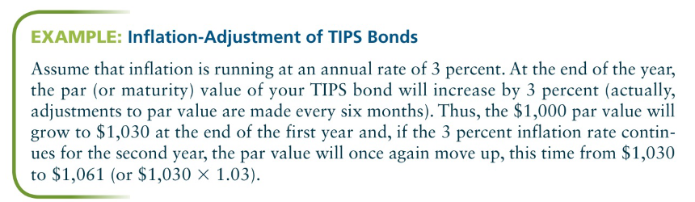

#### Agency & mortgage-backed bonds

> **Agency bonds**: an obligation issued by a political subdivision of a U.S. government

- They're not obligations of the U.S. Treasury.
- Customarily provide yields that are comfortably above the market rates for Treasuries and thus offer investors a way to increase returns with little or no real difference in risk
- Federal Farm Credit Bank, Federal National Mortgage Association (a.k.a. "Fannie Mae"), Federal Land Bank, Student Loan Marketing Association, Federal Home Loan Mortgage Corporation (Freddie Mac)
- Although various agencies issue traditional unsecured notes and bonds, they are perhaps best known for their mortgage-backed securities

> **Mortgage-backed securities**: Securities that are a claim on the cash flows generated by mortgage loans; bonds backed by mortgages as collateral


Bonds issued by Fannie Mae and Freddie Mac are backed by mortgages, but have _no government guarantee_. 

The Government National Mortgage Association (GNMA, or Ginnie Mae) is owned by the U.S. government and insures bonds that are backed by Veterans Administration (VA) and Federal Housing Administration (FHA) home loans. As such, these GNMA-insured bonds are backed by the full faith and credit of the U.S. government.

Some agencies have unusual interest-payment provisions (i.e., interest is paid monthly in a few instances, and yearly in one case), and in some cases, the interest is exempt from state and local taxes.


#### Municipal bonds

> **Municipal bonds**: issued by states, counties, cities, and other political subdivisions, such as school districts, and water and sewer districts. Income is usually exempt from federal taxes.

Historically been considered high-grade securities, but these days they can and do go into default. While defaults are rare, there are more defaults than are reported by the rating agencies. Usually, only the most financially secure municipalities request bond ratings.

Unlike other bonds, they don't pay federal taxes (which is why they're known as _tax-free bonds_). However, the tax-free status does not apply to any capital gains that may be earned on these securities. A tax-free yield is probably the most important feature of municipal bonds and is certainly a major reason why individuals invest in them.

The higher the individual's tax bracket, the more attractive municipal bonds become.


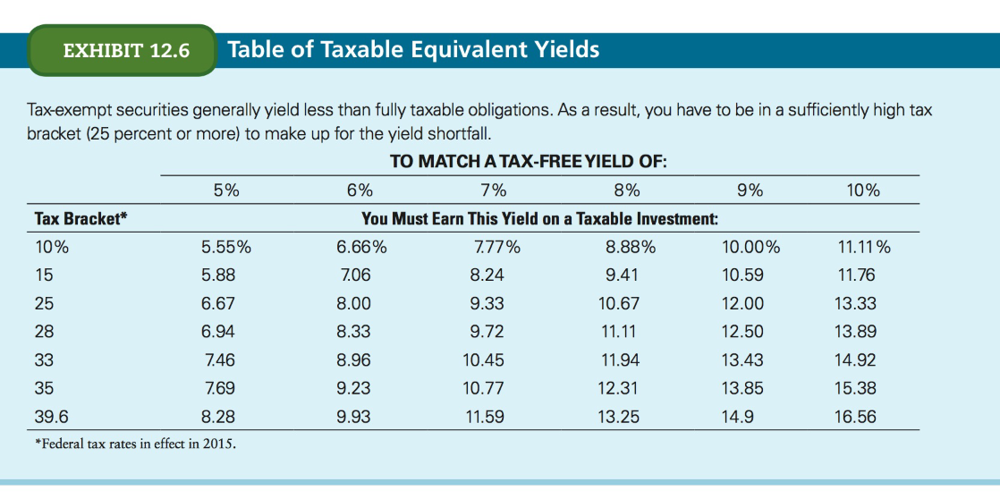


Yields are usually lower than those from fully taxable issues. So unless the tax effect is sufficient to raise the yield on a municipal to a level that equals or exceeds the yields on taxable issues, it obviously doesn't make sense to buy municipal bonds. You can determine the return that a fully taxable bond must provide in order to match the after-tax return on a lower-yielding tax-free bond by computing the municipal's **fully taxable equivalent yield**:

```
FTEY = Yield on municipal bond / (1 - Tax Rate)
```

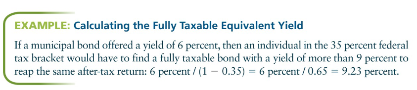

Municipal bonds are usually issued as **serial obligations**, meaning that the issue is broken into a series of smaller bonds, each with its own maturity date and coupon rate. 

Investors should be especially cautious when investing in **revenue bonds**, which are municipal bonds serviced from the income generated by specific income-producing projects, such as toll roads. Unlike issuers of so-called **general obligation bonds** &mdash; which are backed by the full faith and credit of the municipality &mdash; the issuer of a revenue bond is obligated to pay principal and interest _only if a sufficient level of revenue_ is generated.


#### Corporate bonds

Major nongovernmental issuers of bonds are corporations. The market is customarilly subdivided into several segments:

- industrials (most diverse)
- public utilities (dominant in terms of volume of new issues)
- rail and transportation bonds
- financial issues (such as banks and finance companies)

Widest range of different types of issues, from _first-mortgage bonds_ and _convertible bonds_ to _debentures_, _subordinated debentures_, and _income bonds_. Usually come in $1K denominations, and maturities range from 5 to 10 up to 30 years or more.

Many of the issues will carry provisions that prohibit prepayment of the issue during the first 5 to 10 years.

Popular because of their relatively high yields.

#### The special appeal of zero coupon bonds

Investors can also choose from a variety of _specialty issues_ &mdash; bonds that, for the most part, have unusual coupon or repayment provisions.

> **Zero-coupon bonds**: bonds that pay no annual interest but sells at a deep discount to its par value, and then increase in value over time, at a compound rate of return, so at maturity they're worth much more than their initial investment.

All other things being equal, the cheaper the bond, the greater the return you can earn.

For example, whereas a 7% 15-year zero bond might sell for $362, a 15-year issue with a 5% yield will cost a lot more &mdash; say, $481.

Because they have no coupons, these bonds pay nothing to the investor until they mature. Very alike the Series EE savings bonds, and this is also the main attraction:

> Investors need not worry about reinvesting coupon income twice a year. Instead, the fully compounded rate of return on a zero coupon bond is virtually guaranteed at the rate that existed when the issue was purchased as long as the investor holds it to full maturity.

Because of their unusual tax exposure (even though the bonds don't pay regular yearly interest, the IRS treats the annually accrued interest as taxable income), zeros are best used in tax-sheltered investments, such as individual retirement accounts (IRAs) or held by minor children who are likely to be taxed at low rates, if at all.

Zeros are issued by corporations, municipalities, and federal agencies, even the U.S. Treasury issues their own form of zero coupon bonds, known as **Treasury STRIPS**, or STRIP-Ts, for short. 

Actually, the Treasury doesn't issue zero coupon bonds; instead, _they allow government securities dealers to take regular coupon-bearing notes and bonds in stripped form_, which can then be sold to the public as zero-coupon securities. Essentially, the coupons are stripped from the bond, repackaged, and then sold separately as zero coupon bonds. 

For instance, a 10-year Treasury bond has 20 semiannual coupon payments plus 1 principal payment &mdash; and each of these 21 cash flows can be repackaged and sold as 21 different zero coupon securities with maturities ranging from six months to 10 years.


#### Convertible bonds

- Found only in the corporate market.
- Hybrid security possesses features of both corporate bonds, and common stocks.
- Initially issued as debentures (unsecured debt), they carry a provision that enables them to be converted into a certain number of shares of the issuing company's common stock.

Key element is the **conversion privilege**: when the bond can be converted (sometimes they'll be an initial waiting period of 6 months - 2 years after issue date). 

From the investor's PoV, the most important feature is the **conversion ratio**, which specifies the number of shares of common stock into which the bond can be converted.

> **Converstion value** indicates what a convertible issue would trade for if it were priced to sell based only on its stock value.


Easy to determine: simply multiply the conversion ratio of the issue by the current market price of the underlying common stock.

Convertibles _seldom trade precisely at their conversion value_. Instead, they usually trade at **conversion premiums**, which means that the convertibles are priced in the market at more than their conversion values. 

Convertibles appeal to investors who want the price potential of a common stock along with the downside risk of a corporate bond.


#### Bond ratings

- Grades for the bonds which designate investment quality.
- Two largest rating agencies: **Moody's** and **Standard and Poor's**.
- Every time a large, new corporate or municipal issue comes to the market, a staff of professional bond analysts determines its default risk exposure and investment quality.


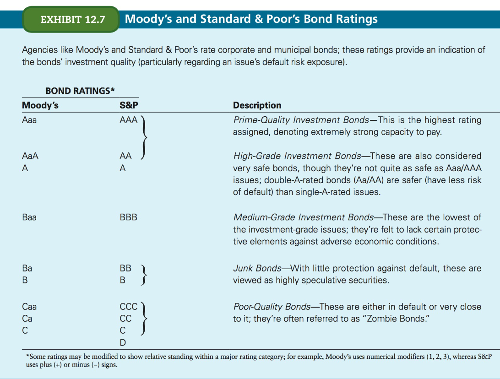

The financial records of the issuing organization are thoroughly examined and its future prospects assessed. The result is the assignment of a bond rating which indicates _the ability of the issuing org to servicee its debt in a prompt and timely manern_.

The **top 4 ratings (Aaa through Baa or AAA through BBB)** designate _investment-grade bonds_, which indicates financially strong, well-run companies or municipalities.

The next 2 ratings (Ba/B or BB/B) are where you'll find most **junk bonds**. 

> **Junk bonds**: Also known as _high-yield bonds_, these are highly speculative securities that have received low ratings

Indicates that, although the principal and interest payments on these bonds are still being paid, the risk of default is relatively high.

Older, outstanding bonds are also regularly reviewed to ensure that their assigned ratings are still valid. Although most issues will carry a single rating to maturity, ratings can change over time. It's the _issue_ that's being assigned the rating, not the institution. 

Other things being equal, _the higher the rating, the lower the yield of an obligation_.

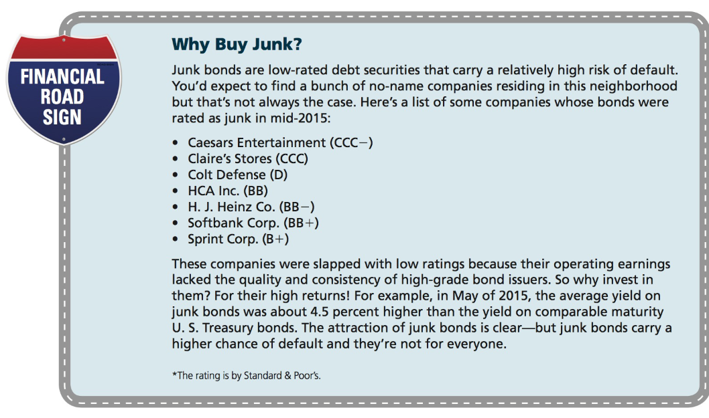


### Pricing a bond

All bonds are priced as a percentage of par. A quote of 85 translates into 85% of the bond's par.

- In the bond market, 1 point = $10, so a quote of 85 means $850. This is so because market convention assumes that bonds carry par values of $1,000.
- Price of any bond is always related to the coupon and maturity.
- In corporate and municipal markets, bonds are priced in decimals, using 3 places to the right.
	- A quote of 87.562, as a % of a $1K par bond, converts to a price of $875.62
- U.S. Treasury and agency bond quotes are stated in **32s of a point** (where 1 point = $10). 
	- You'll see prices listed as "94:16", which means 94 16/32 or 94.5% of par, in other word $945.00
	- The figures to the right of the colon show the number of 32s embedded in the price

#### Bond prices and accrued interest

The price of the bond quoted on your favorite financial Internet site is unlikely to be the price that you would actually pay as a buyer. This is because such quoted prices usually do not include the interest that accrues between the coupon payment dates of the bond.

> **Accrued interest**: the amount of interest that's been earned since the last coupon payment date by the bond holder/seller, but which will be received by the new owner/buyer of the bond at the next regularly scheduled coupon payment date.

When a bond is sold between coupon payment dates, the buyer pays the seller for the accrued interest, which is the prorated share of the upcoming coupon payment.


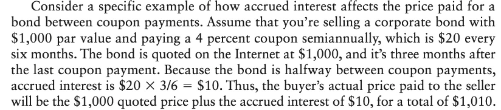


In market jargon, how accrued interest is treated in bond pricing is the basis for the distinction between **clear price** and **dirty (full) price**.

- Clean price = quoted price
- Dirty (full) price = quoted price + accrued interest


Prices quoted on the press and on the Internet are clean bond prices. Be aware that quoted prices understate the true (dirty) price that must be paid to actually purchase the bond in the open market.


#### Bond prices and yields

Price of a bond depends on:

- coupon
- maturity
- movement of market interest rates


When interest rates go down, bond prices go up, and vice versa.

> **premium bond**: one that sells for more than its par value (whenever market rates drop below the coupon rate on the bond)

> **discount bond**: sells for less than par and is the result of market rates being grater than the issue's coupon rate.

When a bond is first issued, it's usually sold to the public at a price that equals or is very close to its par value. Likewise when the bond matures it will once again be priced at its par value.

Bond prices will also vary according to the coupon and maturity of the issue. Bonds with _lower couponds_ and/or _longer maturities_ will respond more vigorously to changes in market rates and undergo _greater price swings_.

Thus, if interest rates are moving up, then the investor should seek high coupon bonds with short maturities, because this will dampen price variation and preserve as much capital as possible. In contrast, if rates are going down, that's the time to be in long-term bonds.

If you're a speculator looking for lots of capital gains, then go with long-term, low coupon bonds. 


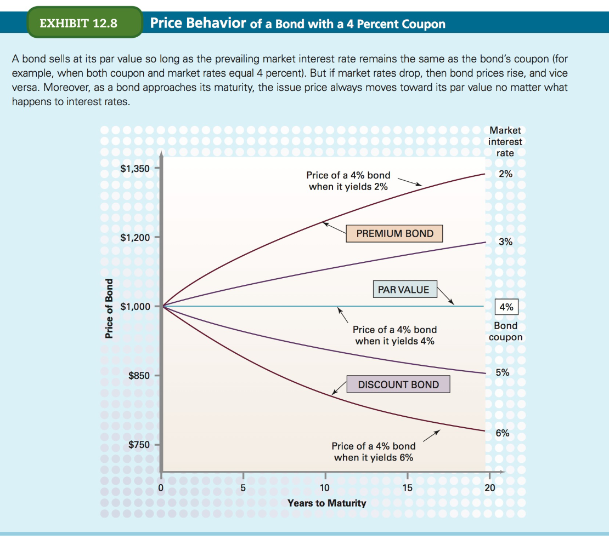

#### Current yield & Yield to maturity

Two most common bond yields:

- **current yield:** the amount of annual interest income the bond provides relative to its current market price
- **yield to maturity**: the fully compounded rate of return that a bond would yield if it were held to maturity


```
Current Yield = Annual interest income / Market price of bond
```

Current yield on a bond is comparable to the dividend yield on a stock. This measure is important for _investors seeking current income_. 

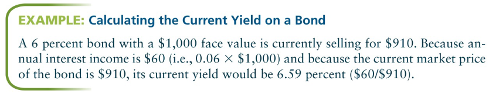


If a bond is purchased at its face value, then its yield to maturity will equal the coupon, or stated, rate of interest. On the other hand, if the bond is  purchased at a discount or a premium then its yield to maturity will vary according to the prevailing level of market yields.

You can find the yield to maturity on discount and premium bonds using the _approximate yield_ formula. Or you can use a calculator to obtain a figure that's very close to the real figure used in the market. The difference is that here **annual compounding** is used, while the market uses **semiannual compounding**, because most U.S. bonds pay interest semiannually. The delta is usually no  more than 5 or 6 basis points, where 1 basis point = 1/100 of 1%.

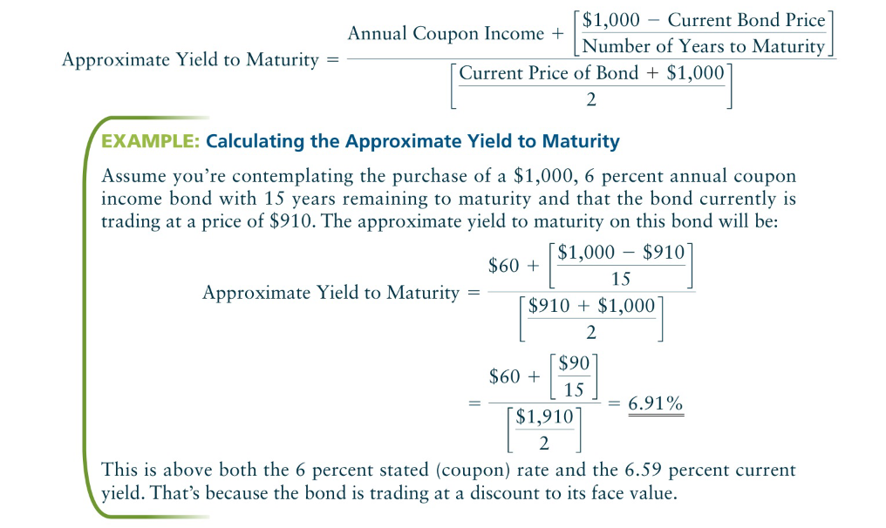

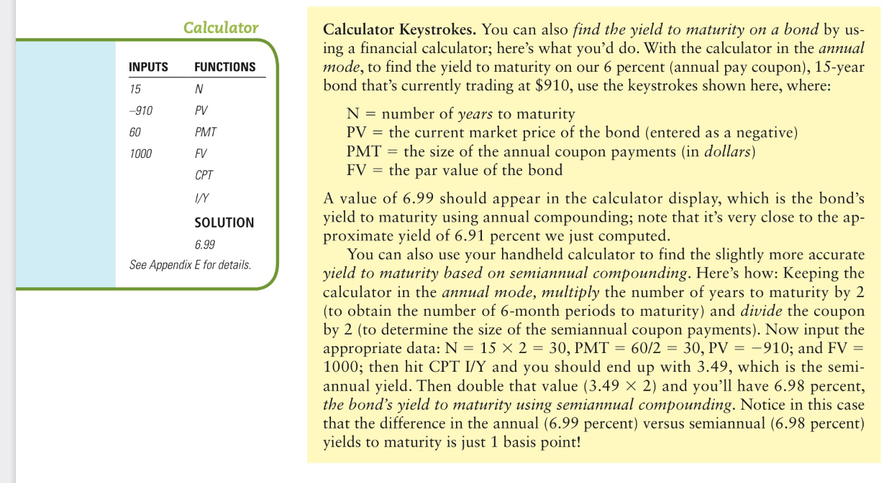


The higher the ytm, the more attractive the investment, all other things being equal. _If a bond provided a ytm that equaled or exceeded an investor's desired rate of return, then it would be considered a worthwile investment candidate_.

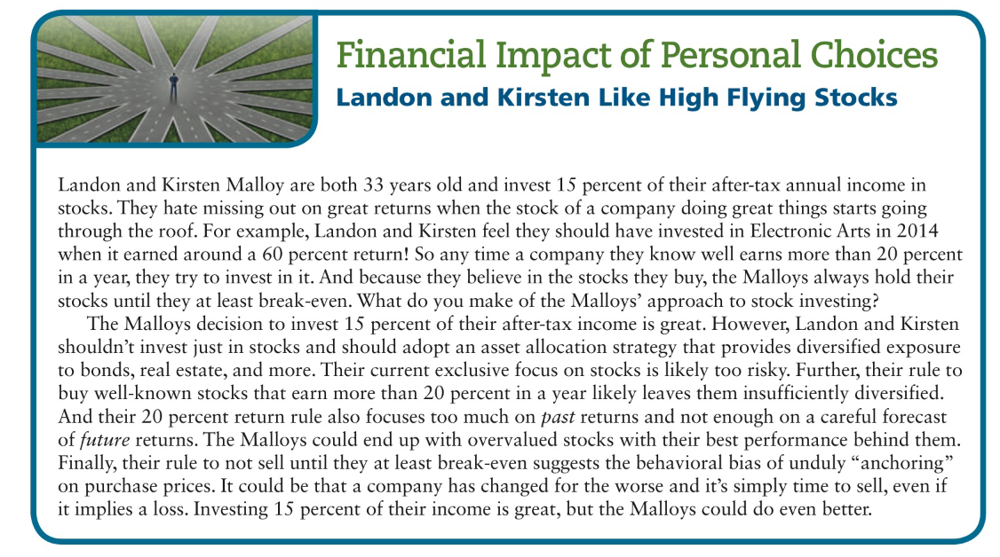


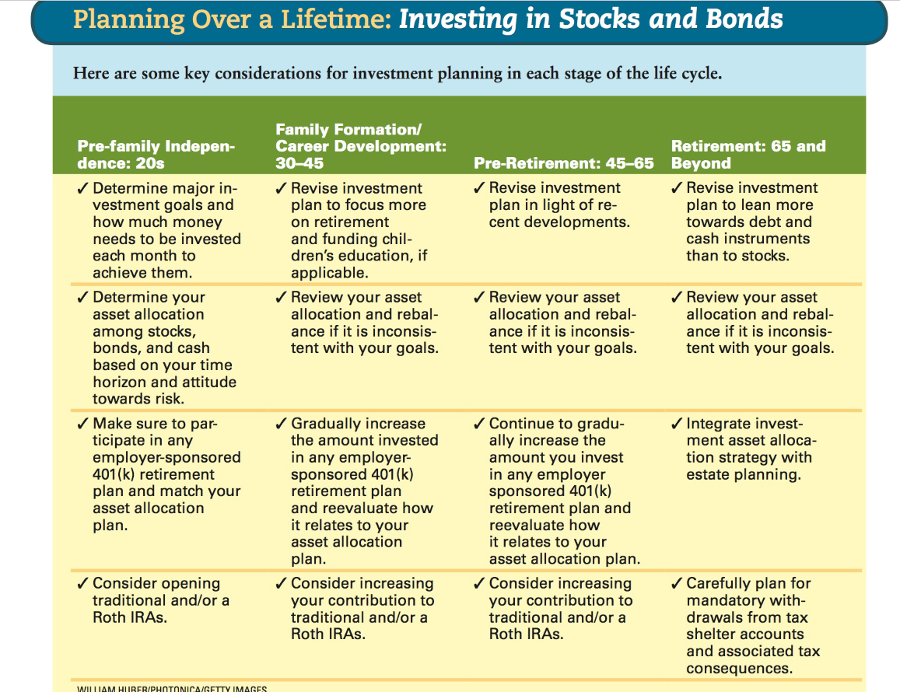
