# Chapter 13
## Investing in Mutual Funds, ETFs, and Real Estate

<!-- START doctoc generated TOC please keep comment here to allow auto update -->
<!-- DON'T EDIT THIS SECTION, INSTEAD RE-RUN doctoc TO UPDATE -->
**Table of Contents**

- [Mutual funds & Exchange-Traded Funds (ETFs)](#mutual-funds--exchange-traded-funds-etfs)
  - [Pooled diversification](#pooled-diversification)
  - [Why invest in a mutual fund / ETF?](#why-invest-in-a-mutual-fund--etf)
- [Mutual fund organization & operation](#mutual-fund-organization--operation)
- [Open vs Closed-end Funds](#open-vs-closed-end-funds)
  - [Open-end investment companies](#open-end-investment-companies)
  - [Closed-end investment companies](#closed-end-investment-companies)
- [ETFs](#etfs)
  - [Types of ETFs](#types-of-etfs)
  - [ETNs](#etns)
- [TODO: complete](#todo-complete)
    - [Cost considerations](#cost-considerations)
      - [Load funds](#load-funds)
      - [No-load funds](#no-load-funds)
      - [12b-1 fees](#12b-1-fees)
      - [Management fees](#management-fees)
      - [Keeping track of fund fees and loads](#keeping-track-of-fund-fees-and-loads)
    - [Buying and selling funds](#buying-and-selling-funds)
  - [Types of funds & fund services](#types-of-funds--fund-services)
    - [Types of funds](#types-of-funds)
      - [Growth funds](#growth-funds)
      - [Aggressive growth funds](#aggressive-growth-funds)
      - [Value funds](#value-funds)
      - [Equity-Income funds](#equity-income-funds)
      - [Balanced funds](#balanced-funds)
      - [Growth-and-Income funds](#growth-and-income-funds)
      - [Bond funds](#bond-funds)
      - [Money market mutual funds](#money-market-mutual-funds)
      - [Index funds](#index-funds)
      - [Sector funds](#sector-funds)
      - [Socially responsible funds](#socially-responsible-funds)
      - [International funds](#international-funds)
      - [Asset allocation funds](#asset-allocation-funds)
    - [Fund services](#fund-services)
      - [Automatic investment plans](#automatic-investment-plans)
      - [Automatic reinvestment plans](#automatic-reinvestment-plans)
      - [Regular income](#regular-income)
      - [Conversion privileges](#conversion-privileges)
      - [Retirement programs](#retirement-programs)
  - [Making mutual fund and ETF investments](#making-mutual-fund-and-etf-investments)
    - [The selection process](#the-selection-process)
      - [Objectives and motives for using funds](#objectives-and-motives-for-using-funds)
      - [What funds have to offer](#what-funds-have-to-offer)
      - [Whittling down the alternatives](#whittling-down-the-alternatives)
      - [Stick with no-loads or low-load mutual funds](#stick-with-no-loads-or-low-load-mutual-funds)
      - [Choosing between ETFs and Mutual Funds](#choosing-between-etfs-and-mutual-funds)
    - [Measuring fund performance](#measuring-fund-performance)
- [TODO: write this section](#todo-write-this-section)
      - [Measuring ETF perf](#measuring-etf-perf)
      - [Future performance](#future-performance)
  - [Investing in Real estate](#investing-in-real-estate)
    - [Basic considerations](#basic-considerations)
      - [Cash flow & taxes](#cash-flow--taxes)
      - [Appreciation in value](#appreciation-in-value)
      - [Use of leverage](#use-of-leverage)
    - [Speculating in raw land](#speculating-in-raw-land)
    - [Investing in income property](#investing-in-income-property)
      - [Commercial property](#commercial-property)
      - [Residential property](#residential-property)
    - [Other ways to invest in real estate](#other-ways-to-invest-in-real-estate)
      - [Real estate investment trusts (REITs)](#real-estate-investment-trusts-reits)
      - [Real estate limited partnerships (or LLCs)](#real-estate-limited-partnerships-or-llcs)

<!-- END doctoc generated TOC please keep comment here to allow auto update -->


## Mutual funds & Exchange-Traded Funds (ETFs)

> **Mutual fund**: a financial services organization that receives money from its shareholders and invests those funds on their behalf in a diversified portfolio of securities


> **Exchange-traded fund**: an investment company whose shares trade on stock exchanges. Unlike mutual funds, ETF shares can be bought or sold (or sold short) throughout the day.


When investors buy shares in a mutual fund or ETF, they become _part owners of a widely diversified portfolio of securities_.

More people invest in mutual funds than any other type of investment product, not only for a variety of investment opportunities, but also a wide array of services that many investors find appealing.

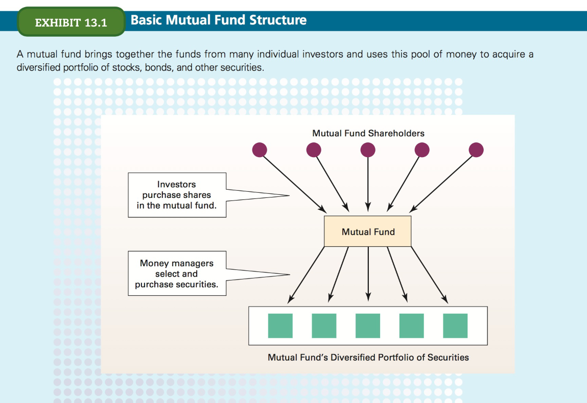

It's a way to turn the problems of security selection and portfolio management over to professional money managers. The fact is that many people simply lack the time, the know-how, or the commitment to manage their own securities, so they turn to mutual funds.


#### Pooled diversification

- Through mutual fund you can enjoy much wider investment diversification than you could achieve on your own.
- As the securities the mutual fund holds move up and down in price, so does the market value of the shares
- If you own 1K shares of stock in a mutual fund that represents 1% of all shares outstanding, then you would receive 1% of the dividends paid by the fund. Same thing with capital gains.
- Rests on the idea of **pooled diversification**, whereby individuals pool their resources for the collective benefit of all contributors.


#### Why invest in a mutual fund / ETF?

1. achieve diversification
2. obtain professional money manager services
3. generate an attractive return
4. for the convenience they offer

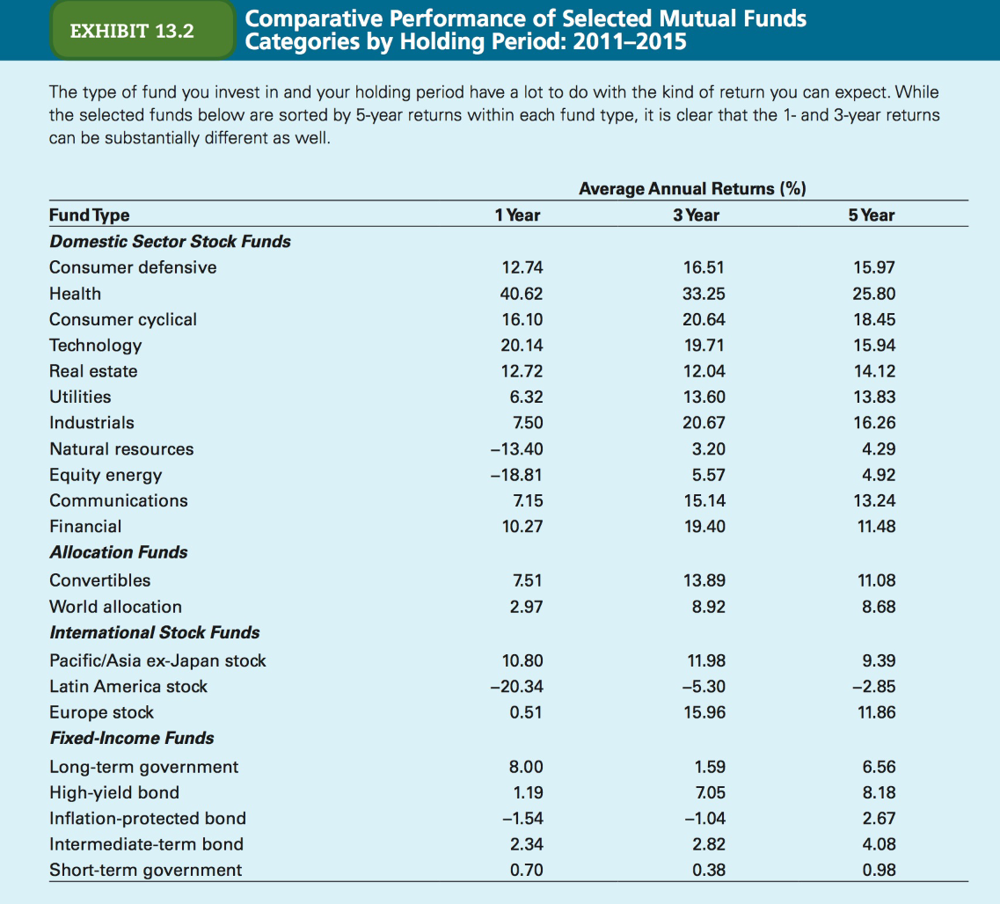

### Mutual fund organization & operation

The fund itself is organized as a separate corporation or trust and _is owned by the shareholders_.

Besides that:

- The _management company_ runs the daily operations (Fidelity, Vanguard, T.Rowe Price). Usually the management firm also serves as the investment advisor
- The _investment advisor_ buys and sells the stocks or bonds and oversees the portfolio. Three parties participate in this operation: the _portfolio manager_, who actually runs the portfolio and makes the buy and sell decisions; _securities analysts_, who analyze securities and look for attractive investment candidates; and _traders_, who try to buy and sell blocks of securities at the best possible price.
- The _distributor_ sells the fund shares, either directly to the public or through certain authorized dealers (such as major brokerage houses and commercial banks).
- The _custodian_ physically safeguards the securities and other assets of a fund, but without taking an active role in the investment decisions. To discourage foul play, an independent party (such as a bank) serves in this capacity.
- The _transfer agent_ executes transactions, keeps track of purchase and redemption requests from shareholders, and maintains other shareholder records.


This separation of duties is designed to protect the mutual fund investor/shareholder. Obviously, you can lose money if your fund's stock or bond holdings go down, but that's really the only risk you face, because the chance of ever losing money from fraud or a mutual fund collapse is almost nonexistent.

_The fund's assets can never be in the hands of the management company_. Each fund must have a board of directors, or trustees, who are elected by shareholders and charged with keeping tabs on the mgmt company and renewing its contract.


### Open vs Closed-end Funds

Funds can be set up as _open-end companies_, which can sell an unlimited number of ownership shares, or as _closed-end companies_, which can only issue a limited number of shares.


#### Open-end investment companies

The term _mutual fund_ commonly denotes an **open-end investment company** (most common, 95% of assets under mgmt).

> **Open-end investment company**: A firm that can issue an unlimited number of shares that it buys and sells at a price based on the current market value of the securities it owns; also called a _mutual fund_.

Investors actually buy and sell their shares from the mutual fund itself. When they buy shares in the fund, the fund issues new shares of stock and fills the purchase order with these new shares. There's no limit to the number of shares that the fund can issue, other than investor demand. Further, all open-end mutual funds stand behind their shares and buy them back when investors decide to sell.

- Buy/sell transactions are carried out based on the **net asset value (NAV)** &mdash; the current value of all the securities held in the fund's portfolio.
- The NAV is calculated at least once a day and represents the underlying value of a share of stock in a particular fund.

```
NAV: (Total market value of all securities held by the fund - liabilities) / # of shares outstanding
```

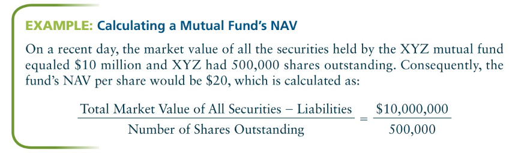


#### Closed-end investment companies

The term _mutual fund_ is supposed to be used only with open-end funds, but as a practical matter, it's regularly used with closed-end investment companies as well.

> **Closed-end investment companies:** An investment company that issues a fixed number of shares, which are themselves listed and traded like any other share of stock.


In effect like any other corporation, except that the corporation's business happens to be investing in marketable securities.

- Shares are actively traded in the secondary market
- Unlike open-end funds, _all trading is done between investors in the open market_
- Fixed amount of capital to work with. They don't have to worry about keeping cash on hand to meet stock redemptions.
- Don't have new money flowing all the time, so they don't have to find investments for that.
- Have a set capital, and focus on how to best manage it.
- Share prices are based on NAV, but also by general supply-and-demand conditions in the market. Closed-end companies generally trade at a discount or premium to their NAVs.


### ETFs

An ETF is an investment which combines characteristics of an open-end and closed-end fund.

- Shares trade on the stock exchange
- Most are structured as index funds, set up to match performance of a certain market segment by owning all or a representative sample of the stocks or bonds in a targeted market segment or index.
- ETF offer the professional money management of traditional mutual funds & the liquidity of an exchange-traded stock.
- Super popular
- Track a wide array of domestic and international stock indexes and submarkets, as well as a handful of U.S. Treasurey and corporate bond indexes.

Even though they are like closed-end funds (they're traded on listed exchanges), _they're actually open-end mutual funds_ in that the ETF distributor can emit or redeem shares at any time. This is done to prevent the fund from trading at (much of) a premium or discount to the underlying value of its holdings.


- _Spiders_ (SPDRs): Biggest and oldest; are based on the S&P 500
- _Qubes_: based on the NASDAQ 100 <small>* most actively traded ETF or stock in the world*</small>
- _Diamonds_: based on the DJIA


Just about every major U.S. index has its own ETF, with lots of minor indexes covering specialized market segments.

The NAVs of ETFs are set at a fraction of the underlying index value at any given time.

```
For example, when the S&P was 2,124.20 in Jun 2015, the ETF on that index traded at $212.04 (or about 1/10 of that index);
Likewise, the ETF on the Dow is set at about 1/100 of the DJIA
```

- Passively managed, therefore offer all the advantages of any index fund: low costs, low portfolio turnover, and low taxes.
- Tax liability is low because ETFS _rarely distribute any capital gains to shareholders_.
- This is not true for actively managed ETFs


#### Types of ETFs

- ETFs for everything: industry-specific (e.g. pharma), oil, gold, real estate, or derivative-composed (i.e. options & futures).
- _Style_ ETFs typically follow either certain market capitalization stocks (small-, mid-, or large-cap) or value or growth stocks
- ETFs that track bonds
- Inverse ETFs that effectively create short positions
- Actively managed: aim to outperform the index they're based on
- Leveraged ETFs: aim to outperform a benchmark, which is usually achieved by using derivatives like options, futures, and swaps. (extremely risky)

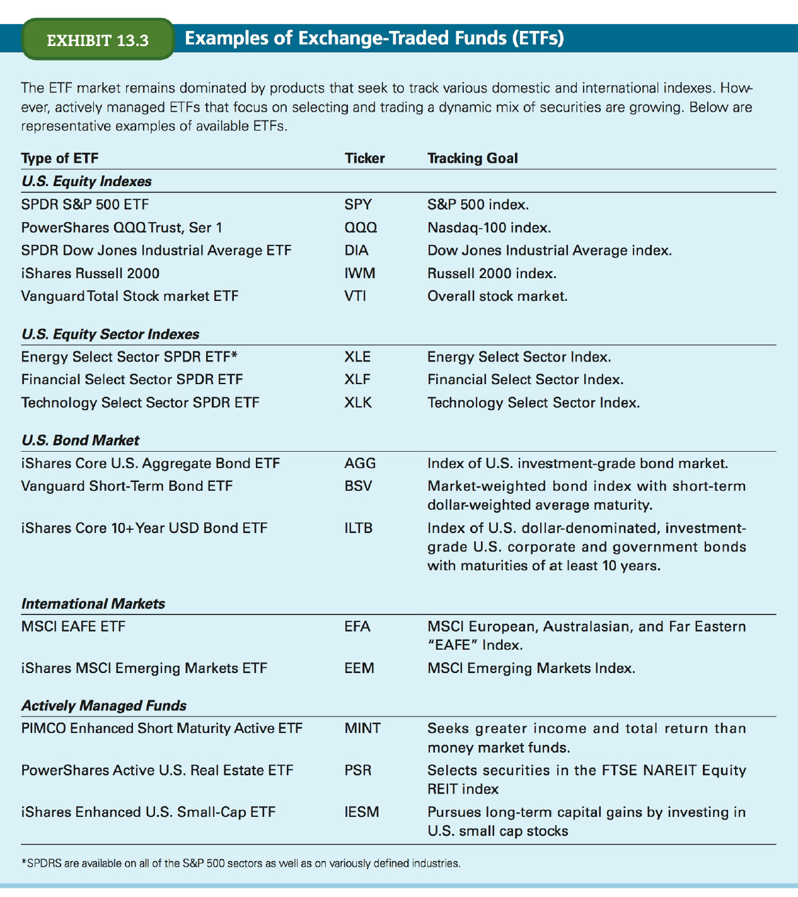

#### ETNs

Exchange-traded notes (ETNs) are more similar to ETFs than to mutual funds. Like ETFs,

# TODO: complete

### Cost considerations

- If it's _closed-end_ or ETF: pay a commission just like any other listed or OTC stock.
- If the fund is _open-end_, depends on the fees and load charges of the fund:

#### Load funds

Most open-end mutual funds are **load funds**: they charge a commission _when the shares are purchased_ (such charges are often referred to as _front-end loads_). Few funds today charge the maximum, most funds charge 2 or 3% commissions &mdash; such funds are known as **low-load funds**. Usually don't charge any commission when you _sell_ your shares.

**Back-end load** funds: funds that charge a commission when you redeem (sell) your stock. These charges usually decline over time and may disappear altogether after 5 or 6 years. The purpose of such charges is to discourage investors from trading in and out of the funds over short periods of time.

According to the latest regulation, mutual funds cannot charge > 8.5% in _total sales charges and fees_ (includes front-, back-end loads as well as 12b-1 fees).


#### No-load funds

- Some charge you nothing to buy their funds.
- Less than half of the funds sold today.

#### 12b-1 fees

> **12b-1 fees**: Also known as _hidden loads_, these fees are annual fees that are allowed by the SEC and were originally designed to help no-load funds cover their distribution and marketing expenses.

- Now used by nearly 70% of all open-end mutual funds.
- Can amount to as much as a 1% of assets under management
- 1% cap set by the SEC.
- Also true no-load funds cannot charge > 0.25% of in annual 12b-1 fees  (otherwise, they must drop the "no-load" label in their sales and promotional material).

A trend in mutual fund fees is the _multiple-class sales charge_. You'll find such arrangements at firms like Dreyfus, Merrill Lynch, MFS, Scudder, Putnam, and others. The way it works is that the mutual fund will issue different classes of shares on the same fund or portfolio of securities. So, rather than having just one class of stock out-standing, there might be three of them: Class A shares might have normal (modest) front-end loads; Class B stock might have no front-end loads but substantial back-end loads along with max annual 12b-1 fees; and Class C shares might carry a small back-end load and modest 12b-1 fees. In other words, you pick your own poison.

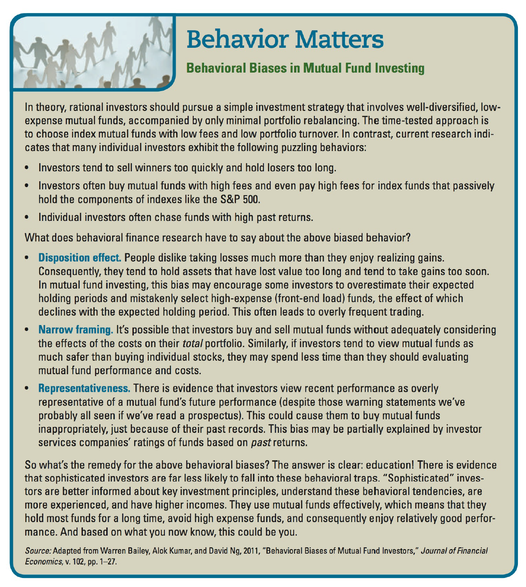


#### Management fees

> Cost you incur to hire professional money managers to run the fund's portfolio of investments.

- Assessed annually
- Range from <0.5% - 4% of assets under management.
- Watch out for these because they have a toll on performance.
- Size of the fee usually unrelated to the fund's performance.


#### Keeping track of fund fees and loads

You can find detailed info on types and amounts of fees and charges on just about any mutual fund:

- Quicken.com
- Kiplinger.com
- Morningstar.com
- [Yahoo!](https://finance.yahoo.com)

or the mutual fund quotes that appear daily in most major newspapers and in the WSJ.

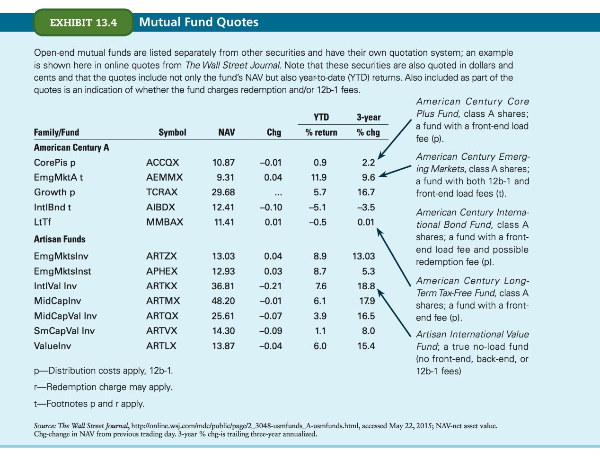

You'll find the letters `r`, `p`, or `t`.

- `r`: means the fund cahrges some type of redemption fee (back-end load) when you sell shares
- `p`: fund levies a 12b-1 fee
- `t`: fund charges redemption fees _and_ 12b-1 fees.


Note that these don't tell you the amount and also _they tell you nothing about front-end loads_.

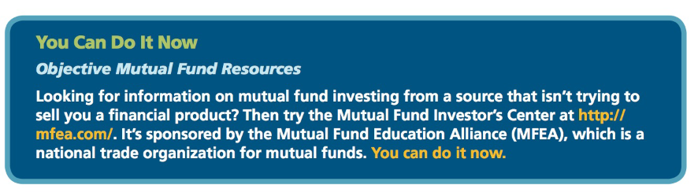

Mutual funds are required by the SEC to fully disclose all their fees and expenses in a standardized, easy-to-understand format. Every fund prospectus must contain a fairly detailed _fee table_, like the one in Exhibit 13.5.

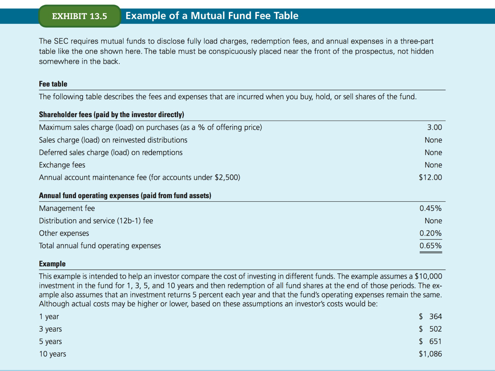

> Notice that this table has 3 parts. (1) Specifies _shareholder transaction costs_. This section tells you what's going to cost to buy and sell shares in the mutual fund. (2) Specifies all _annual operating expenses_ of the fund. Showing these expenses as a percentage of average net assets, the fund must break out management fees, those elusive 12b-1 fees, and any other expenses. (3) Specifies the _total cost over time_ of buying, selling, and owning the fund. This part of the table contains both transaction and operating expenses and shows what the total costs would be over hypothetical 1-, 3-, 5-, and 10-year holding periods.


### Buying and selling funds

Closed-end investment companies or ETFs are no different from buying shares of common stock. Transactions are executed through brokers or dealers.

_Open-end funds_ are much different. Such funds can be bought through a discount or full-service broker or directly from the mutual fund company itself (most have online accounts). Once your account is open and the company has your initial deposit, you are ready to buy shares. Selling shares in a fund is a do-it-yourself affair that simply requires using an online account or an 800 phone number.

When selling, it is wise to see if your company offers the ability to switch funds. A common feature is the ability to go online to move money from one fund to another &mdash; the only constraint is that the funds must managed by the same "family" of funds. Most companies charge little or nothing for these shifts, although funds that offer free exchange privileges often limit the number of times you can switch each year.

Should you want more information than what is provided in either the profile or prospectus, you can always request a copy of the fund's _Statement of Additional Information_, which contains detailed information on the fund's investment objectives, portfolio composition, management, and past performance.

## Types of funds & fund services

### Types of funds

Funds and ETFs are categorised according to their investment policies and objectives because it tends to reflect similarities in their risk-return characteristics. Every fund has a particular stated investment objective, of which the most common are capital appreciation, income, tax-exempt income, preserving investment capital, or some combination thereof. Disclosure is required by the SEC.

- [Growth](#growth-funds)
- [Aggressive growth](#aggressive-growth-funds)
- [Value](#value-funds)
- [Equity-Income](#equity-income-funds)
- [Balanced](#balanced-funds)
- [Growth-and-Income](#growth-and-income-funds)
- [Bond](#bond-funds)
- [Money market mutual funds](#money-market-mutual-funds)
- [Index](#index-funds)
- [Sector](#sector-funds)
- [Socially responsible](#socially-responsible-funds)
- [International](#international-funds)
- [Asset allocation](#asset-allocation-funds)


#### Growth funds

Capital appreciation. Long-term growth and capital gains are the primary goals of growth funds, so they invest principally in **stocks with above-average growth potential**. Because of the uncertainty concerning their future capital gains, growth funds _involve a fair amount of risk_. They're usually viewed as _long-term investment vehicles_ that are most suitable for the aggressive investor who wants to build capital and has little interest in current income. 

#### Aggressive growth funds

- A.k.a "capital appreciation" funds
- Highly speculative investments that seek large profit from capital gains.
- Many are fairly small (< $300M under mgmt)
- Invest in small, unseasoned companies, stocks with relatively high price/earnings multiples, and stocks whose prices are highly volatile
- Perhaps the **most volatile** of funds

#### Value funds

Invest in stocks considered _undervalued_ in the market.

- Invest in sound companies, but yet to be discovered with
- relatively low P/E ratios, high dividend yields, and moderate amounts of debt
- Value investing involves extensive evaluation of corporate financial stmts and documents that will help fund managers _uncover value before the rest of the market does_.
- Less risky and competitive as compared to growth funds.
- Good option for relatively conservative investors who are looking for attractive returns offered by common stocks, yet want to keep share price volatility and investment risk in check.

#### Equity-Income funds

- Emphasize current income & preserving capital
- Invest in high-yielding common stocks, some convertible securities and preferred stocks
- Generally viewed as a fairly low-risk way of investing in stocks.

#### Balanced funds

- Hold a balanced portfolio of stocks and bonds, to generate a well-balanced return of current income and long-term capital gains.
- A lot like equity-income funds, except that they put much more into fixed-income securities.
- Generally keep 30-40% of their portfolios in bonds.
- Bonds are used for current income, and stocks for capital gains.
- Tend to invest mainly in high-grade securities so are considered relatively safe form of investing.

#### Growth-and-Income funds

- Like balanced funds, but more emphasis on capital growth.
- Unlike balanced funds, put most of their money in equities &mdash; not unusual to have 80-90% of capital in stocks.
- Mostly in high-quality issues.
- Fair amount of risk, if for no other reason than their emphasis on stocks and capital gains.
- Most suitable for investors who can tolerate their risk and price volatility.

#### Bond funds

- Income is their primary objective, although they don't ignore capital gains
- 3 advantages to buying shares in bond funds rather than investing directly in bonds:
	- 1. Bond funds are generally more liquid
	- 2. They offer a cost-effective way of achieving a high degree of diversification in an otherwise expensive investment (most bonds carry a min. denomination of $1K to $5K or more)
	- 3. Bond funds automatically reinvest interest and other income, thereby allowing the investor to earn fully compounded rates of return.
- Fairly conservative form of investment, but they're not totally without risk because the prices of the bonds held in the fund's portfolios will fluctuate with changing interest rates.
- Bond mutual funds had $3.46T in under mgmt in 2014, while bond ETFs had about $296.4B

There are bond funds for every type of bond or variation:

- **Government bond funds**: invest in U.S. Treasury and agency securities
- **Mortgage-backed bond funds**: money in various mortgage-backed securities issued by agencies of the U.S. government (e.g. GNMA issues). Provide a more affordable way to get into mortgage-backed securities. They also have a provision that allows investors to reinvest the _principal_ portion of the monthly cash flow thereby enabling them to preserve, rather than consume, their capital.
- **High-grade coporate bond funds**: invest chiefly in investment-grade securities rated BBB or better
- **High-yield corporate bond funds**: risky investments that buy _junk bonds_ for the yields they offer, which can be higher than standard bonds
- **Convertible bond funds**: invest primarily in (domestic & foreign) securities that can be converted or exchanged into common stock. By investing in convertible bonds and preferred stocks, the funds offer investors some of the price stability of bonds, along with the capital appreciation potential of stocks.
- **Municipal bond funds**: invest in tax-exempt securities and are suitable for investors looking for tax-free income. Like corporate counterparts, municipals can also be in either high-grade or high-yield funds. A special type of municipal bond fund is the _single-state fund_, which invests in the municipal issues of only one state and so produces (for residents of that state) interest income that's _fully exempt_ from federal taxes as well as state (and possibly local/city) taxes.
- **Intermediate-term bond funds**: invest in bonds with maturities of 7 to 10 years or less, and offer not only attractive yields but also relatively low price volatility. Shorter (2-5 year) funds are also available and can be used as substitutes for money market investments by investors looking for higher returns on their money, especially when short-term rates are way down.


#### Money market mutual funds

- Invest in a widely diversified portfolio of short-term money market instruments
- Very popular with investors: they give investors with modest amounts of capital access to the higher-yielding end of the money market, where many instruments require minimum investments of $100K or more.
- There are about 530 publicly traded money market funds that hold nearly $2.73T in assets

Several kinds:

- **General-purpose money funds**: invest in any and all types of money market investments from Treasury bills to corporate commercial paper and bank CODs. Wherever they can find attractive short-term returns. Most money funds are of this type.
- **Tax-exempt money fund**: limits investments to tax-exempt municipal securities with very short (30-90 day) maturities
- **Government securities money funds**: eliminate any risk of default by confining their investments to T-bills and other short-term securities of the U.S. government or its agencies (such as the GNMA).


Highly liquid investments with very low risk because they're virtually immune to capital loss. The interest income they produce tends to follow interest rate conditions, so the returns to shareholders are subject to the ups and downs of market interest rates. [See Chapter 4.](../chapter4.md)

#### Index funds

- Buys and holds a portfolio of stocks (or bonds) equivalent to those in a market index such as the S&P 500. 
- Rather than trying to beat the market, _index funds simply try to match the market_.
- In many cases, the whole portfolio is run almost entirely by a computer that matches the fund's holdings with those of the targeted index.
- Other indexes: S&P Midcap 400, Russell 2000, and Wilshire 5000
- Only a part of the overall mutual fund market, but comprise the vast majority of ETFs
- Approach is **strictly buy and hold**.
- Produce little taxable income from year to year, which leas many high-income investors to view them as a type of tax-sheltered investment.
- Produce **highly competitive returns** for investors. Net, index funds tend to produce better returns than do most other types of stock funds. 
- Every now and then the fully managed funds will have a year (or two) when they outperform the index funds, but those are the exception rather than the rule.

#### Sector funds

- Restricts investments to a particular sector of the market
- One or more industries that make up the targeted sector
- E.g. health care sector: drug companies, hospital mgmt firms, medical suppliers & biotech
- Main objective is _capital gains_. 
- Similar in many ways to growth funds and _should be considered speculative_.

#### Socially responsible funds

- Invest in corporations that they view as socially responsible.
- Abstain from investing in companies that derive revenues from tobacco, alcohol or gambling, weapons contractors, or that operate nuclear power plants.
- Favour firms that produce "responsible" products & services, have strong employee relations, have positive environmental records, and are socially responsive to the communities in which they operate.
- SRF funds grew to about $6.6T by early 2014.

#### International funds

- Invest in foreign securities. Often confining their activities to specific geographical regions (Mexico, Australia, Europe or the Pacific Rim).
- In contrast there are _global funds_, which invest in foreign and national companies &mdash; usually multinational firms.
- As a rule, global funds provide more diversity and, with access to both foreign and domestic markets, can go wherever the action is.

#### Asset allocation funds

Because a lot of individual investors have a tough time making asset allocation decisions, the mutual fund industry has created a product to do the job for them. 

**Asset allocation funds** spread investors' money across all different types of markets instead of in a specific type of investment. Many also include foreign securities, and some even inflation-resistant investments such as gold or real estate.

These funds are designed for people who want to hire fund managers not only to select individual securities for them, but also to make the strategic decisions concerning asset allocation over time. 

There's no assurance that the money manager will make the right moves at the right time, but that's the idea behind these funds.


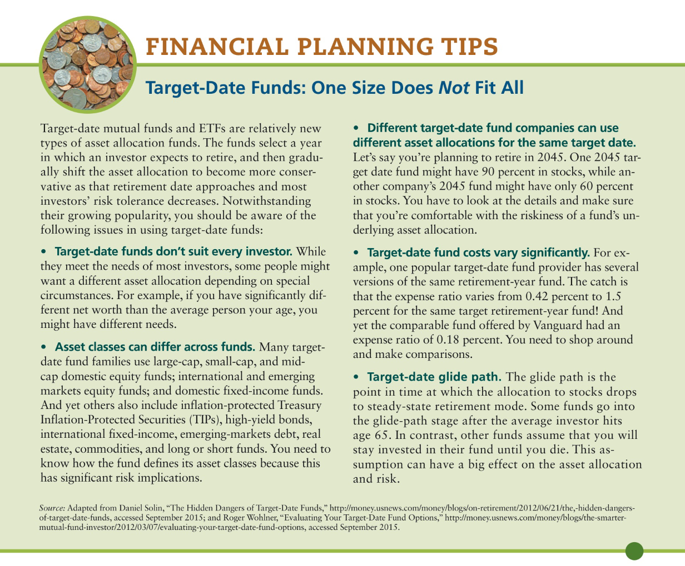

### Fund services

Some of the most sought-after services:

- automatic investment and reinvestment plans
- regular income programs
- conversion privileges
- retirement programs


Many of these are not offered by ETFs.

#### Automatic investment plans

> Allows fund shareholders to funnel fixed amounts of money from their paychecks or their bank accounts automatically into a mutual fund.

To enroll, a shareholder fills out a form authorizing the fund to transfer a set amount (usually $25 to $100 min per period) from your bank account or paycheck at regular intervals, typically monthly or quarterly. 

Convenience may be the chief advantage of these plans but they make solid investment sense as well because one of the best ways of building up a sizable amount of capital is to _add funds to your investment program systematically over time_.

#### Automatic reinvestment plans

> Puts your dividends and other distributions to work by reinvesting them, using them to buy additional shares automatically.

Keep in mind that even though you reinvest your dividends and capital gains, the IRS still treats them as cash receipts and taxes them in the year they're paid.

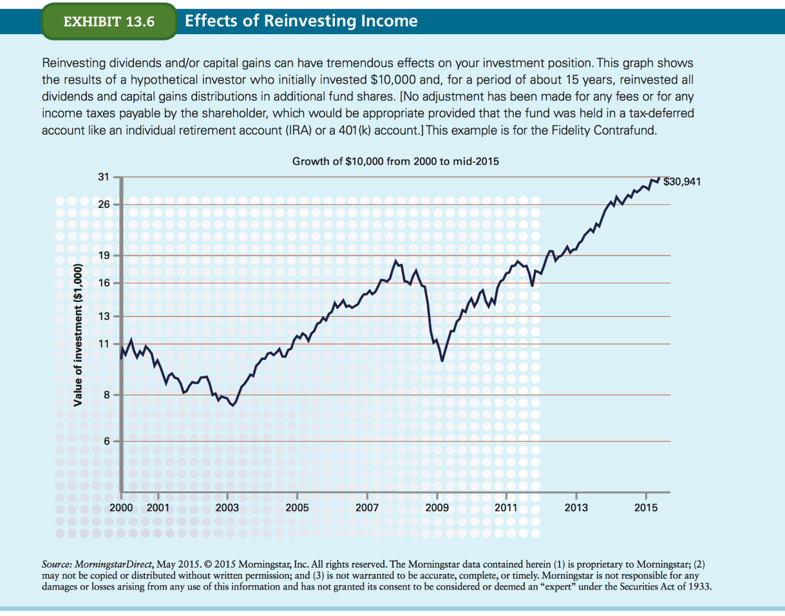

#### Regular income

> **Systematic withdrawal plan**: A plan offered by mutual funds that allows shareholders to be paid specified amounts of money each period.

Some investors invest for steady cash flow. Min investment of $5K to $10K to participate, and withdrawal must be $50 or more per month.

Note that if the fund isn't performing well, the withdrawals could eventually deplete the original investment.

#### Conversion privileges

Sometimes investors will want to move from one fund to another either because their investment objectives have changed or the environment itself has changed. 

Conversion (or exchange) privileges enable shareholders to move easily from one fund to another. The only limitation is that the investor must confine the switches to the same _family_ of funds. 

> For example, an investor can switch from a Fidelity growth fund to a Fidelity money fund, or to its income fund, or to any other fund managed by Fidelity. 

Conversion privileges are attractive because they permit investors to manage their holdings more aggressively by allowing them to move in and out of funds as the investment environment changes. 

One major drawback: although you never see the cash, the exchange of shares from one fund to another is regarded, for tax purposes, as a sale followed by the purchase of a new security. As a result, if any capital gains exist at the time of the exchange, the investor is liable for the taxes on that profit.


#### Retirement programs

All mutual funds provide a special service that allows individuals to set up a tax-deferred retirement account as either IRA or Keogh accounts or through their place of employment, to participate in a qualified retirement plan, such as a 401k. The funds set up the plans and handle all the administrative details so that the stakeholders can take full advantage of available tax savings.


## Making mutual fund and ETF investments

Suppose you have money you want to invest. You want to pick an investment that not only meets your idea of an acceptable risk, but also generates an attractive rate of return. 

It's possible to whittle down the list of alternatives by matching your investment needs with the investment objectives of the funds.

### The selection process

Why invest in a mutual fund or an ETF? Why not go it alone (i.e. buy individual stocks and bonds directly)? 

For beginner investors or investors with little capital, the answer is pretty simple &mdash; mutual funds and ETFs provide far more diversification than such investors could ever get on their own, plus they get the help of professional money managers, and at a reasonable cost to boot.

The competitive returns and services offered by mutual funds will also be a factor. A lot of well-to-do investors have decided that they can get better returns over the long haul by carefully selecting mutual funds than by trying to invest in individual stocks on their own. So they put all, or a big chunk, of their money into funds. Many of these investors will use part of their capital to buy and sell individual securities on their own, and they'll use the rest to _buy mutual funds or ETFs that invest in areas they don't fully understand or aren't well informed about_. For example, they'll use mutual funds or ETFs to get into foreign markets or as a way to buy mortgage-backed securities.

After deciding to use mutual funds or ETFs, the investor must then decide **which funds to buy**. This means putting into action all you know about investing in order to gain as much return as possible at an acceptable level of risk. 

**Given that you have an asset allocation strategy in place** and that you're trying to select funds compatible with your targeted mix, the selection process begins with an assessment of your own investment needs. You'll want to select from those thousands of funds the one or two (or 3 or 4) that best meet your investment needs.

#### Objectives and motives for using funds

**Start with your investment objectives**. 

I.e. why do you want to invest in a mutual fund or an ETF, and what are you looking for in a fund? Again, risk and returns are the two important factors here. When looking at your own risk temperament in relation to the various types of mutual funds and ETFs available, you'll discover that certain types of funds are more appealing to you than others. (E.g. aggressive growth or sector funds will probably _not_ be attractive to individuals wishing to avoid high exposure risk).

Next is the intended use of the mutual fund (i.e. **capital growth vs. current income**).

Finally, there's the services provided by the fund. If you're particularly interested in some services, be sure to look for them in the funds that you select.


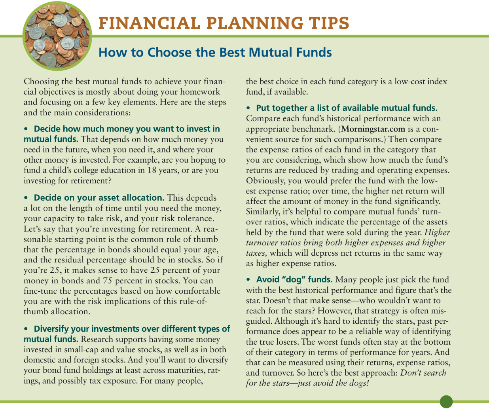

#### What funds have to offer

The ideal mutual fund or ETF will 

- achieve max capital growth when security prices rise,
- provide complete protection against capital loss when prices decline, and
- achieve high levels of current income at all times.

Unfortunately, such funds don't exist. Instead, each fund has its own investment objective, its own manner of operation, and its own range of services. 

**Look at a fund's profile** (or its prospectus) for info on investment objectives, portfolio composition, management, and past performance.

Also the WSJ, Barron's, Money, Fortune, and Forbes provide info and stats on funds. Services are also available that provide background info and assessments on a wide variety of funds. Among the best are Morningstar's, _The Value Line Fund Advisor_, and _The Value Line ETF survey_ (similar to Value Line's stock reports but for mutual funds & ETFs). Also, the Internet has a wealth of info such as finance.yahoo.com where you can obtain historical info on a fund's performance, security holdings, risk profile, load charges, and purchase information.


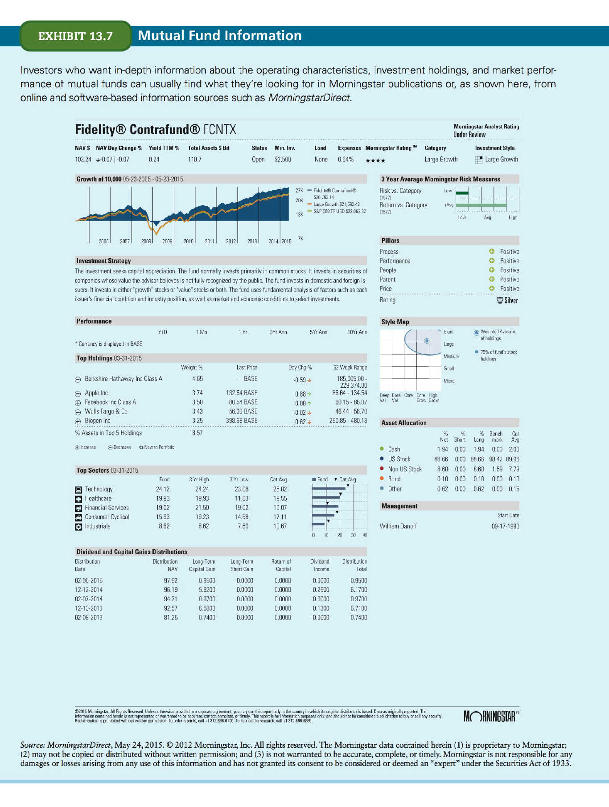

#### Whittling down the alternatives

At this point, fund selection becomes a process of elimination as you weigh your investment needs against the types of funds available. Many funds can be eliminated from consideration simply because they don't meet your needs. Some may be too risky; others may be unsuitable as a storehouse of value.

Rather than trying to evaluate thousands of different funds, you can use a process of elimination to narrow the list down to 2 or 3 _types_ of funds that best match your investment (and asset allocation) needs.

From here, you can whittle the list down a bit more by introducing other constraints. For example, because of cost considerations, you may want to deal only in no-load or low-load funds, or you may be seeking certain services that are important to your investment goals.

Finally, **consider the fund's investment performance**. Useful info includes:

1. how the fund has performed over the past 5-7 years
2. type of return that it has generated in good markets as well as bad
3. level of of dividend and capital gains distributions, which is an important indication not only of how much current income the fund distributes annually but also of the fund's _tax efficiency_ and
4. the level of investment stability the fund has enjoyed over time (i.e. the amount of volatility/risk in the fund's return).

Consider some of the fund facts in Exhibit 13.8.

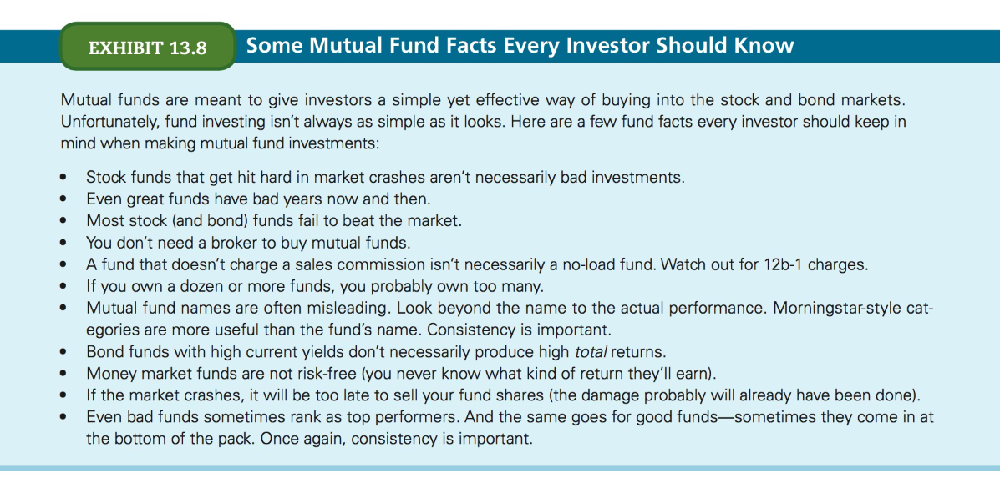


#### Stick with no-loads or low-load mutual funds

The evidence indicates that load fund returns generally aren't, on a risk-adjusted basis, any higher than the returns from no-load funds. In fact, the funds with abnormally high loads and 12b-1 fees often produce returns that are far _less_ than what you can get from no-loads, after taking risk into account. Moreover, because of compounding, the differential returns tend to widen with longer holding periods.

Pay close attention to load charges (and other fees) whenever you're considering an investment in a mutual fund.

#### Choosing between ETFs and Mutual Funds

How to choose between ETFs and mutual funds? Answer depends on what you want to invest in and how sensitive you are to taxes and costs. Morningstar offers the following criteria:

- _Broad or narrow focus?_ ETFs have been developed to accommodate investors pursuing narrow market segments. If you want to focus on a single market sector, industry, or geographic region, there's likely an ETF for you. There are far more ETFs that track single foreign countries than mutual funds that do. So, while there are mutual funds and ETFs for broad index investment, some ETFs offer more narrow, targeted investment.
- _Tax management_. ETFs are set up to protect investors from capital gains taxes better than most mutual funds can. Most ETFs are index funds that trade less than the average actively managed mutual fund, which means that they should generate fewer taxable gains.
- _Costs_.  ETFs have lower overhead expenses than most funds because they don't have to manage customer accounts or staff call centers. This means that ETFs tend to have lower expense ratios than mutual funds. ETFs are often the most cost-effective choice for investors using discount brokers, for those investing a large sum of money, and for those with a long-term horizon.


###  Measuring fund performance

Any fund or ETF has 3 potential sources of return: 

1. dividend income
2. capital gains distributions
3. change in the fund's share price

# TODO: write this section

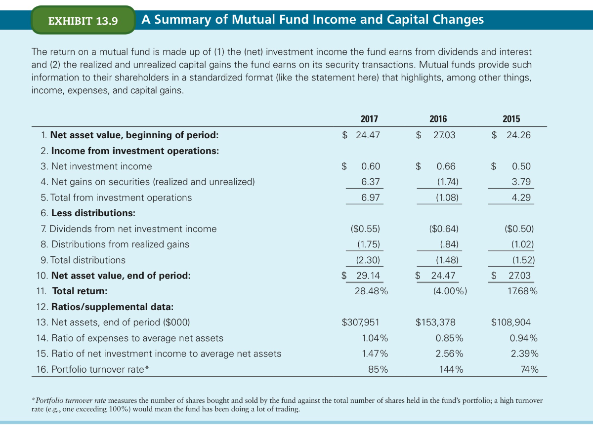

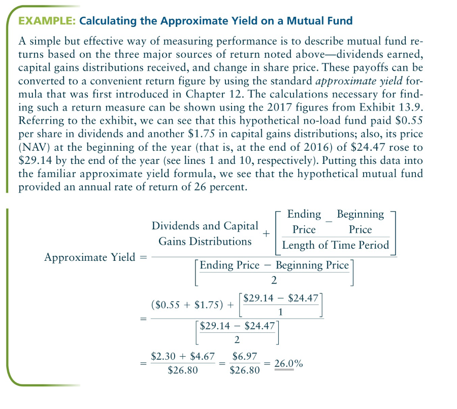

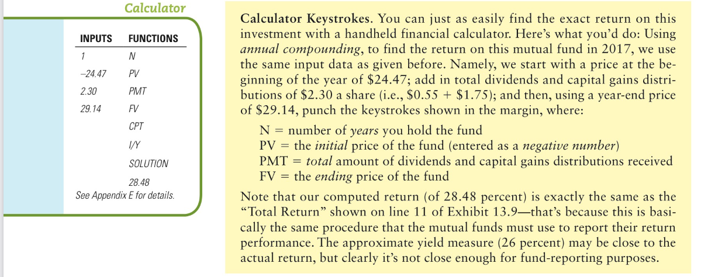

#### Measuring ETF perf

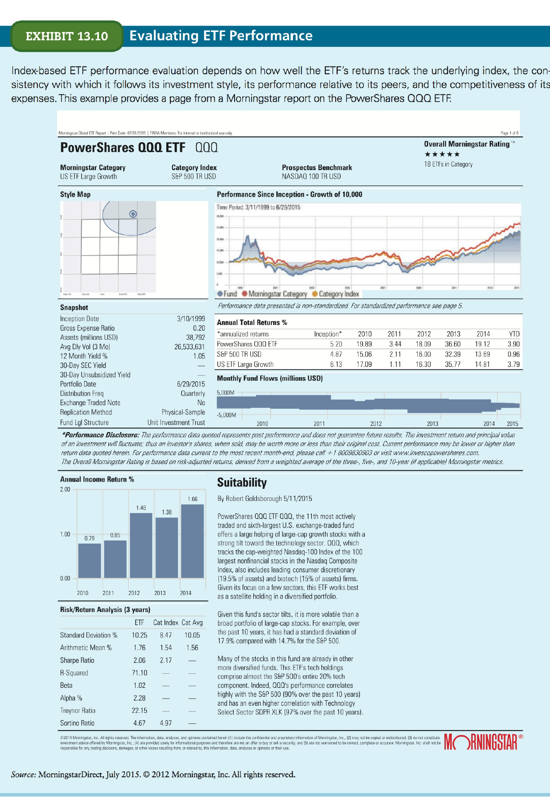

#### Future performance

## Investing in Real estate

Previously thought as an infallible investment, but Great Recession proved otherwise.

Real estate investing includes

- homes
- raw land
- warehouses
- commercial & retail space
- office & apartment buildings
- condos

Several forms:

- buy land or property directly
- various types of real estate securities:
	- real estate mutual funds
	- REITs
	- mortgages
	- stocks of real-estate companies
	- real estate limited partnerships

Adding real estate to your portfolio provides greater diversification than just holding bonds or stocks, because they're less volatile and usually doesn't move in tandem with stocks.

However, it's important you evaluate:

- the outlook for the national economy
- interest rate levels
- supply & demand for space
- regional considerations


### Basic considerations

Attractiveness of real estate lies in **expected cash flows over the planned holding period** and the riskiness of those cash flows.

The expected ongoing cash flows are determined by:

- rent
- depreciation
- taxes
- expected future sales price.

The expected return on a real estate investment is determined by the relationship between the expected future cash flows relative to the initial investment, which is typically reduced by using a significant amount off leverage (borrowing). 

#### Cash flow & taxes

**Make notes on this**

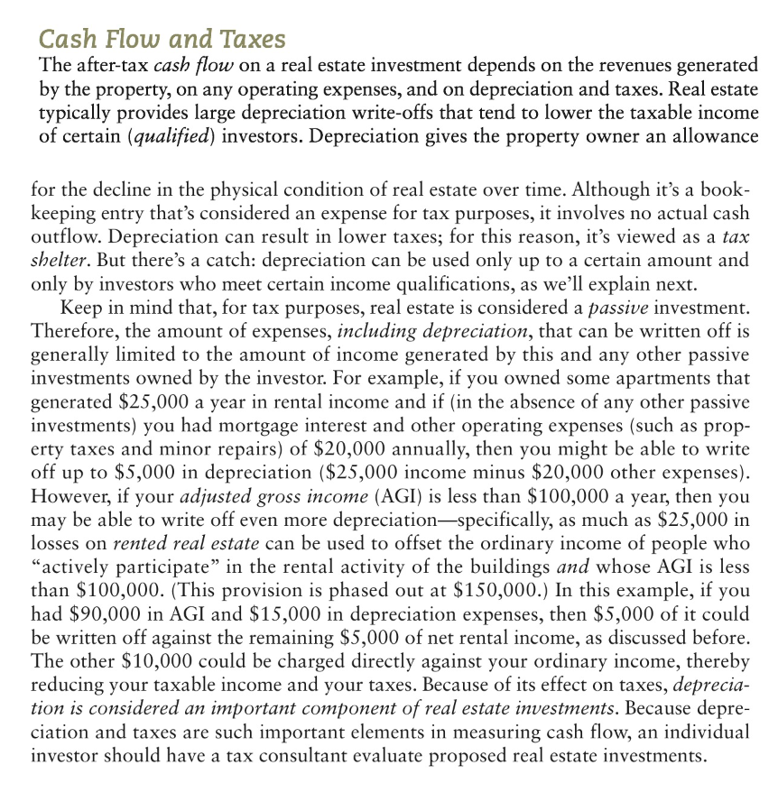

#### Appreciation in value

You should also consider expected changes in property values. In many cases, such appreciation has a much greater impact on the rate of return than the net annual cash flow from the property.

Hence, if the market price of the real estate is expected to increase by $100,000, then that price appreciation should be treated as capital gains and included as part of the return from the investment (minus the capital gains taxes paid).


#### Use of leverage

A big attraction in real estate is the high degree of financial leverage it permits. You can borrow money to magnify returns. Because it is a tangible asset, **investors can borrow as much as 75-90% off its cost.**

As a result, if the profit rate on the investment is grater than the cost of borrowing, then the return on a leveraged investment will be proportionally greater than the return generated from an otherwise comparable unleveraged investment.

Because some of the leveraged investment is made with borrowed money, the return on investment in Exhibit 13.11 reflects _only the amount of money that you put up to buy it_. So, even though the leveraged investment provides _less in earnings after taxes_, it has a lower investment base. The net result is a _higher return on investment_. 

The risks of leverage must be considered along with potential benefits. Indeed, many people have been driven into bankruptcy because they used too much leverage.

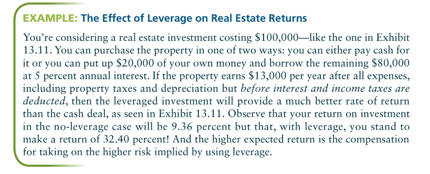

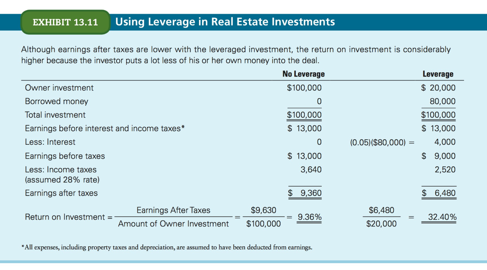


### Speculating in raw land

In this approach, _which is often viewed as highly risky_, investors seek to generate high rates of return by investing in property that they _hope_ will undergo dramatic increases in value. The key to such speculation is to isolate areas of potential population growth and/or real estate demand (ideally, before anyone else does) and purchase property in these areas in anticipation of eventual development.

Undeveloped acreage with no utilities or improvements is often purchased by land speculators either to hold for future development or to sell, as is, at a higher price later.

Given the high degree of uncertainty, raw land speculation should be reserved for real estate investors who understand and can accept the inherent risks.

### Investing in income property

One of the most popular forms of real estate investing is income (or income-producing) property, which includes commercial and residential properties.

> Lease or rent to tenants in order to generate ongoing monthly/annual income in the form of rent receipts.

Before doing this, be sure to know what you're getting into. The owner of income property is responsible for leasing the units and maintaining the property. This means fixing leaky roofs and appliances, painting and other repairs, cleaning after a tenant leaves, and similar responsibilities.

Calculating the value of income-producing property requires estimating the annual net operating income (NOI), which _equals gross rental income (less an allowance for vacancies and bad debts) minus all operating expenses, such as property (but not income) taxes, insurance, maintenance, and so on_. 

Once you have a property's NOI, you can apply a _cap rate_ (the expected annual rate of return on the property) to arrive at an estimated value for the property. A typical cap rate for income property is around 9 to 10%.

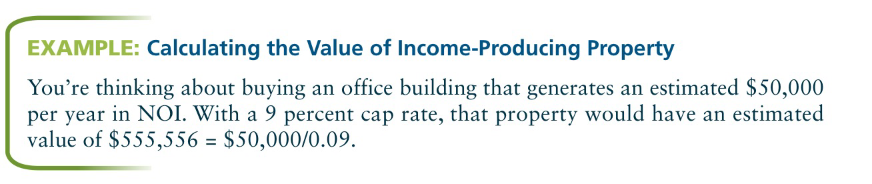

#### Commercial property

Many types: office buildings, industrial space, warehouses, retail space, and hotels. The risks and returns on commercial real estate investments are tied to business conditions and location. The value of commercial property is enhanced by a location in a high-traffic area. Because commercial properties call for professional management and involve significant expenses, investing in this category of income property is generally the domain of more seasoned (often professional) real estate investors.


#### Residential property

First-time investors often choose residential properties such as homes, apartments, and smaller multifamily buildings. Aside from purchase and financing costs, major factors of these investment's profitability are:

- occupancy rates - the % of available space rented over the year
- and maintenance and mgmt costs
- neighborhood
- local regulations regarding tenants
- supply & demand trends for the type of property


### Other ways to invest in real estate

If you don't want to own or don't have the money to buy it, you can purchase specialised securities. 

- real estate mutual fund
- stock in a publicly traded real estate company (residential homebuilders, construction companies, mortgage lenders, home improvement retailers, property managers, real estate brokerage firms and engineering companies). 
- REITs
- Real estate limited partnernships (LPs aka LLCs limited liability companies)


#### Real estate investment trusts (REITs)

Arguably the best way is via a **real estate investment trust (REIT)**, which is a type of closed-end investment company that invests money in various types of real estate and real estate mortgages.

Like a mutual fund in that it sells shares of stock and uses the proceeds to invest in a portfolio of real estate investments.

They are appealing to investors because they offer the benefits of real estate ownership - both capital appreciation and current income - without the headaches of property management.

They have become popular because the trusts generally have relatively low correlations with other market sectors, such as common stocks and bonds, and provide attractive dividend yields &mdash; well above the yields on common stocks (about 65% of the total return from REITs comes from their dividends).

Produce competitive returns: compound annual return (dividends + stock price appreciation on the FTSE REIT U.S. Real Estate Index) from REITs for the last 30 years was 11.36%, compared with 12.51% of the S&P 500. The performance over this period is significantly influenced by the real estate losses resulting from the Great Recession in 2007-2009. However, the return on REITs was 27.15% in 2014 and the three-year return from 2012 to 2014 was 16.83%.

REITs can be particularly attractive investments during periods of high inflation, which is projected by many to eventually result from the large deficit spending induced by the Great Recession.

Like mutual funds, each REIT has stated investment objectives, which should be considered carefully before acquiring shares.

3 basic types:

1. **Equity REITs**: Own and operate income-producing real estate such as apartments, office buildings, shopping centers, and hotels.
2. **Mortgage REITs**: make both construction and mortgage loans to real estate investors.
3. **Hybrid REITs**: invest in both income-producing properties and mortgage loans.

Equity REITs produce both attractive current yields and the potential to earn excellent capital gains as their properties appreciate in value. In contrast, mortgage REITs tend to be more income oriented; they emphasize the high current yields they generate by investing in debt.

Listed REITs hold more than $1T in US real estate assets and constitute about 90% of the $700B listed REIT market. Most of the rest of the market involves mortgage REITs. 

**The income earned by a REIT isn't taxed, but the income distributed to owners is designated and taxed as ordinary income**. Whereas dividends on common stocks normally are taxed at preferential rates (of 15 or 20% or less), this is not the case with REITs, whose cash dividends are treated as ordinary income and taxed accordingly.

#### Real estate limited partnerships (or LLCs)

Special-purpose syndicates organised to invest in real estate. Structured as LPs or LLCs. 

With LPs, the managers assume the role of _general partner_, which means that their liability is unlimited and that the other investors are _limited partners_ who are legally only liable only for the amount of their initial investment.

LLCs are more popular. The LLC has a managing member and other members - none of which have any liability. Investors buy _units_ in an LP or LLC; a unit represents an ownership position, similar to a share of stock. Reeal estate LPs and LLCs are riskier investments than REITs, and they appeal to more affluent investors who can afford the typical unit cost of $100K or more.


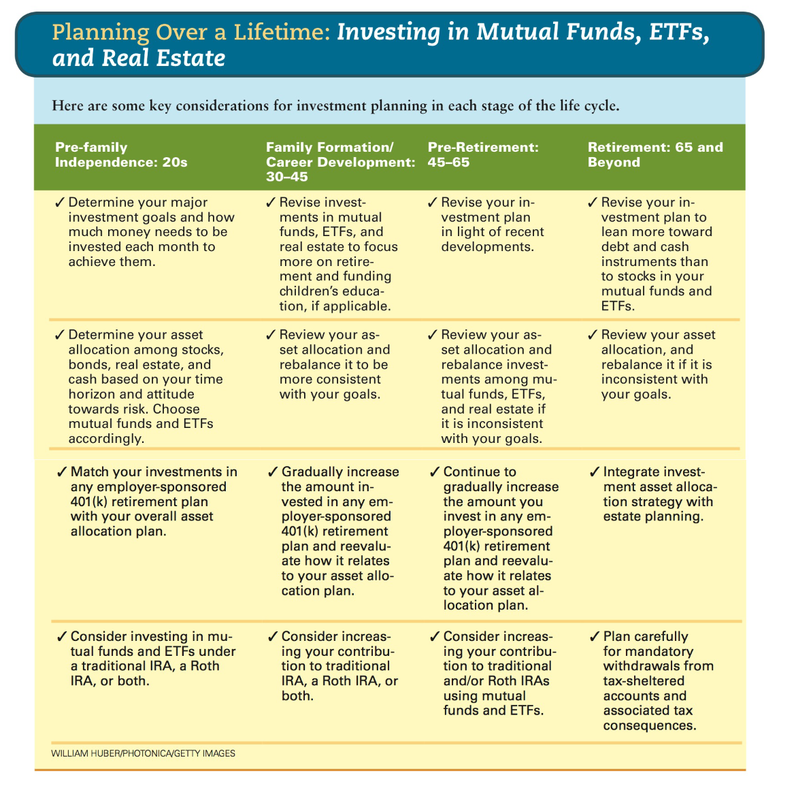


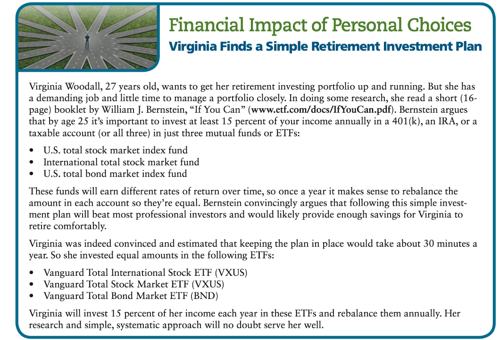

