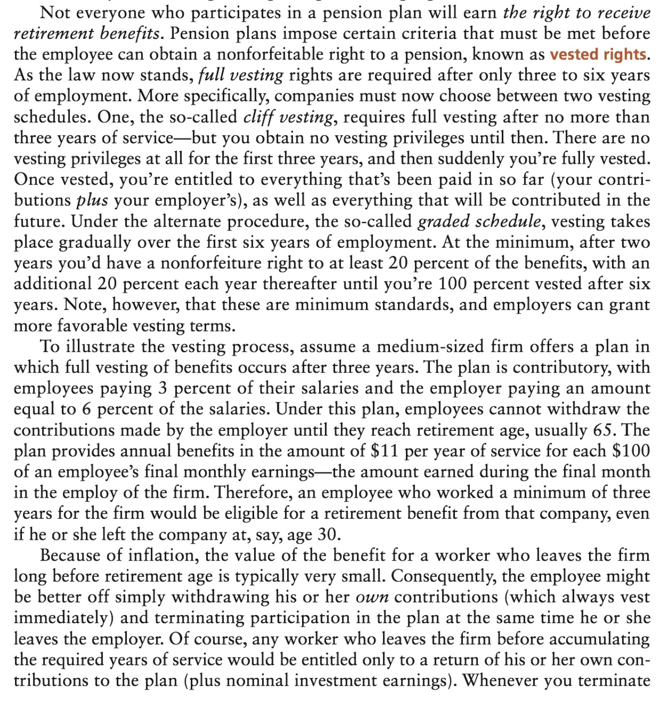

# Chapter 14
## Planning for Retirement


## Overview

- No financial goal is more important than achieving a comfortable standard of living in retirement.

1. The first step is to **set retirement goals for yourself**.
	- Describe what you want to do in retirement, the level of income you'd like to receive, and any special retirement goals you may have (buying a home in Florida or an around-the-world cruise).
1. Establish the size of the _nest egg_ that you're going to need to achieve your retirement goals.
	- Formulate an _investment program_ that enables you to build up your nest egg.
	- This involves (1) creating systematic savings plan and (2) identifying the types of investments that will best meet your retirement needs.
	- Investments and investment planning are the vehicles for building up your retirement funds.
	- Tax planning is also important because a major objective of sound retirement planning is to legitimately shield as much income as possible from taxes, and, in so doing, maximize the accumulation of retirement funds.


### 3 biggest pitfalls of retirement planning

> People often get carried away with the amount of money they want to build up for retirement. Having a nest egg of $4 million or $5 million would be great, but it's really beyond the reach of most people. Besides, you don't need that much to live comfortably in retirement.

3 big mistakes:

1. Starting too late
1. Putting away too little.
1. Investing too conservatively.

- Start with a default amount of 15% of your pre-tax income and go from there.
- Many people tend to be far too conservative in investing retirement money. They place way too much of their retirement money into _low-yielding_, fixed-income securities such as CDs and Treasury notes. Although you should never speculate with your retirement plan, there's no need to avoid risk altogether.
- Note that it is _the combination of these three factors_ that determines the amount you'll have at retirement. 
- This means there are _several ways of getting roughly the same result_. Knowing the size of the nest egg you'd like to end up with, you can pick the combination of variables (period of accumulation, annual contribution, rate of return) that you're most comfortable with.

### Estimating income needs

2 strategies:

1. **Plan for retirmeent over a series of short-run time frames.** A good way to do this is to state your retirement income objectives as a percentage of your present earnings. For example, if you want a retirement income equal to 80% of your final take-home pay, then you can determine the amount necessary to fund this need. Then, every 3 to 5 years, you can revise and update your plan.
1. **Long-term approach**. Estimate the level of income you'd like to receive in retirement; along with the amount of funds you must amass to achieve that desired standard of living. Of course, if conditions or expectations should change dramatically in the future, then it may be necessary to make corresponding alterations to your long-run retirement goals and strategies.


#### 1. Determine future retirement needs

**Determine your expenses when you retire.**

- In your 30s, two children and an annual income of 80K before taxes.
- Likely household expenditures estimated to be 60-70% of your current expenditures (kids don't live with you anymore, you already own your home, etc)

In the example, the Pendletons' current expenditures are 56K (this information is readily obtained from the **Income & Expense Statement**). At 70%, their estimated retirement expenditures are (`56*.7 =`) $39,200 **in today's dollars**.


#### 2. Estimating retirement income

**Where you will get the money to meet your projected expenses.**

E.g.: 

- Social security
- Employer's pension

Make this estimate in **today's dollars**, and then obtain the **future value**.

> The next question is: Where will the Pendletons get the money to meet their projected household expenses of $39,200 a year? They've addressed this problem by estimating what their income will be in retirement—again based on today's dollars. Their two basic sources of retirement income are Social Security and employer-sponsored pension plans. They estimate that they'll receive about $24,000 a year from Social Security (as we'll see later in this chapter, you can obtain an estimate directly from the Social Security Administration of what your future Social Security benefits are likely to be when you retire) and another $9,000 from their employer pension plans, for a total projected annual income of $33,000. When comparing this figure to their projected household expenditures, it's clear the Pendletons will be facing an annual shortfall of $6,200 (see steps E through I in Worksheet 14.1). This is the amount of additional retirement income they must come up with; otherwise, they'll have to reduce their standard of living in retirement. 

> At this point, we need to introduce the inflation factor to our projections in order to put the annual shortfall of $6,200 in terms of retirement dollars. Here, we assume that both income and expenditures will undergo approximately the same average annual rate of inflation, which will cause the shortfall to grow by that rate over time. In essence, 30 years from now, the annual shortfall is going to amount to a lot more than $6,200. How large this number becomes will, of course, depend on what happens to inflation. Assume that the Pendletons expect inflation over the next 30 years to average 5 percent. While that's a bit on the high side by today's standards, the Pendletons are concerned that the ballooning of the federal deficit in response to the financial crisis of 2007-2009 will cause inflation to rise over the long term. Using the compound value table from Appendix A, we find that the inflation factor for 5 percent and 30 years is 4.322. Multiplying this inflation factor by the annual shortfall of $6,200 gives the Pendletons an idea of what that figure will be by the time they retire: $6,200 x 4.322 = $26,796 or nearly $27,000 a year (see steps J to L in Worksheet 14.1). Thus, based on their projections, the shortfall should amount to about $26,796 a year when they retire 30 years from now. _This is the amount they'll have to come up with through their own supplemental retire-ment program_. 


#### 3. Funding a projected shortfall

Determine:

1. **How big your retirement nest egg must be to cover the projected annual income shortfall**
1. **How much to save each year to accumulate the required amount by the time they retire.**


This process assumes that you cover the shortfall by accumulating an amount at retirement age and investing that amount at a projected rate. The earnings on this investment represent the shortfall you're trying to cover.

> Let's assume that this rate of return is estimated at 8 percent, in which case the Pendletons should accumulate $334,950 by retirement to cover the projected shortfall. This figure is found by capitalizing the estimated shortfall of $26,796 at an 8 percent rate of return: $26,796/0.08 = $334,950 (see steps M and N). Given an 8 percent rate of return, such a nest egg will yield $26,796 a year: $334,950 x 0.08 = $26,796. So long as the capital ($334,950) remains untouched, it will generate the same amount of annual income for as long as the Pendletons live and can eventually become a part of their estate. 

Now you calculate how much you need to save _each year_ to get to the amount you're going to invest at retirement.

This is called a "Sinking Fund Payment". The formula in Excel is `=PMT(Rate, NPER, Present Value, Future Value)`.

> For the Monthly Investment (with no up-front lump sum), you would put the monthly investment as the payment, and 0 for the Present Value. The Future Value is still the same. 


(Taken from https://money.stackexchange.com/questions/26368/whats-the-formula-to-calculate-the-monthly-or-lump-sum-investment-amount-for-a)

> To find out how much must be saved each year to achieve a targeted sum in the future, we can use the table of annuity factors in Appendix B. The appropriate interest factor depends on the rate of return one expects to generate and the length of the investment period. In the Pendletons' case, there are 30 years to go until retirement, meaning that the length of their investment period is 30 years. Suppose that they believe they can earn a 6 percent average rate of return on their investments over this 30-year period. From Appendix B, we see that the 6 percent, 30-year interest factor is 79.058. Because the Pendletons must accumulate $334,950 by the time they retire, the amount they'll have to save each year (over the next 30 years) can be found by dividing the amount they need to accumulate by the appropriate interest factor; that is, $334,950 79.058 = $4,237 (see steps 0 to Q in Worksheet 14.1). 


In Excel:

```
=PMT(0.06,30,0, 334950) # -> ($4,236.75)
```

The Pendletons now know what they must do to achieve the kind of retirement they want: _Put away $4,237 a year and invest it at an average annual rate of 6% over the next 30 years_.


**The procedure done here is a bit simplified.** One important simplifying assumption in the procedure is that it ignores the income that can be derived from the _sale of a house_. This offers special tax features and can generate a significant amount of cash flow.

When inflation occurs, it is likely to drive up home prices right along with the cost of everything else. Rather than trying to factor in the cash flow of selling a home into the forecast of retirement income and needs, we suggest that you _recognise_ the existence of this cash-flow source in your retirement planning and consider it as a cushion against all the uncertainty inherent in retirement planning projections.


### Online retirement planning

- Helpful tools at quicken.com and bloomberg.com

You answer a few questions about expected inflation, desired rate of return on investments, and current levels of income and expenditures. Then the online app determines the size of any income shortfall, the amount of retirement funds that must be accumulated over time, and different ways to achieve the desired retirement nest egg. 

**An attractive feature of most of these internet sites is the ability to run through "what-if" excercises easily**. 


## Social Security

Social Security Act of 1935.

### Coverage

Coverage today extends to all gainfully employed workers. Two major classes of employees are now exempt from _mandatory_ participation in the SS system: 

1. federal _civilian_ employees who were hired before 1984 and are covered under the Civil Service Retirement System
2. employees of state and local governments who have chosen not to be covered (although most are covered through the _voluntary participation_)

Certain positions like newspaper carriers under age 18 and full-time college students working for a university are also exempt.

- To qualify for benefits, nearly all workers today must be employed in a job covered by SS for **at least 40 quarters**, or 10 years.
- The quarters _need not be consecutive_.
- Once the 40-quarter retirement is met, the worker becomes fully insured and remains eligible for retirement payments even if he or she never works again in covered employment.
- The surviving spouse and dependent children of a _deceased worker_ are also eligible for monthly benefits if the worker was fully insured at the time of death or, in some special cases, if certain other requirements are met.

### Payroll taxes

Check: https://tax.thomsonreuters.com/news/social-security-wage-base-increases-to-132900-for-2019/

The cash benefits provided by SS are derived from the payroll (FICA) taxes paid by covered employees and their employers. 

- Tax rate in 2015 for employees was 6.2% of SS and 1.45% for Medicare (total **7.65%**) (Figures were the same in 2019)
- Rates are different for self-employed people (twice as much. yikes!)
- Social security tax == Old Age, Survivors, and Disability Insurance (OASDI)
- Hospital Insurance == Medicare tax


These rates are only applicable to the first $132,900 in wages for SS and $200K for Medicare. This is known as a maximum **wage base**, and it increases each year (in 2015 this was $118,500).

### Retirement benefits

Two main categories:

1. old-age benefits
1. survivor's benefits

#### Retirement benefits

Workers who are fully covered may receive retirement benefits for life once they reach full retirement age. 

- For anyone born in **1960 or later**: SS defines retirement age as **age 67**.
- Early retirement: **age 62** receive partial benefits (70 to 80%) of the full amount (depending on when you were born)


If the retiree has a spouse age 67 or older, the spouse is entitled to benefits equal to 1/2 of the amount received by the retired worker and can also file for early receipt of reduced benefits at age 62.

Social Security should be viewed as a **foundation for your retirement income**. By itself, **it's insufficient to enable a worker and spouse to maintain their preretirement standard of living**.

In two-income families, both the husband and wife may be eligible for SS benefits. These can be chosen in one of two ways:

1. take the full benefits to which each is entitle from his or her account
1. take the husband and wife benefits of the higher-paid spouse.

If each receives their full share, no spousal benefits are given. If they take the husand and wife benefits of the higher-paid spouse, they effectively receive 1.5 shares.


#### Survivor's benefits

If the covered worker dies, the spouse can receive survivor's benefits from SS.

Benefits include:

- small lump payment of several hundred dollars
- followed by monthly benefit checks

To be eligible for monthly payments, the surviving spouse must generally be at least 60 years of age or have a dependent and unmarried child of the deceased worker in his or her care.

To qualify for _full_ benefits, the spouse must be >= 67. Reduced benefits are payable between ages 60 and 67.

If the children of a deceased worker reach age 16 before the spouse reaches age 60, the monthly benefits cease and do not resume until the spouse turns 60. This period during which survivor's benefits are not paid is sometimes called the _widow's gap_.


### Monthly SS benefits

The amount of SS benefits to which an eligible person is entitled to is set by law and defined according to a fairly complex formula.

Your **Social Security Statement** (available at ssa.gov) lists the year-by-ear Social Security earnings you've been credited with and shows (in today's dollars) what benefits you can expect under three scenarios:

1. if you retire at age 62 and receive 70-80% of the full benefit
2. the full benefit at age 65 to 67 (depends on your year of birth)
3. the increased benefit (of up to 8% per year) that's available if you delay retirement until age 70.

The statement also estimates what your children and surviving spoues would get if you die and how much you'd receive monthly if you became disabled.


#### Range of benefits

Exhibit 14.3 shows the current average level of benefits (for someone who retired in 2015). Keep in mind that the figures given in the exhibit represent amounts that the beneficiaries will receive in their _first year_ of retirement. Those amounts will be adjusted upward each year with subsequent increases in the cost of living.


Note that the average benefits reflect the fact that they _may be reduced_ if the SS recipient is _under age 67 and still gainfully employed_ — perhaps in a part-time job.

Retirees aged 62 to 66 are subject to an _earnings test_ that effectively limits the amount of income they can earn before they start losing some (or all) of their SS benefits.

In 2015 the limit was $15,720 per year (the limit rises annually with wage inflation). In 2019 this was $17,640. You lose $1 in benefits for every $2 you earn above the limit.

This **only applies to early retirees**. Once you reach full retirement age you can earn as much as you like. This also only applies on earned income through wages/salaries. Does not apply to interest, dividends, rents or profits from securities transactions.


#### Taxes on benefits

Even though SS contributions are made in after-tax dollars, you may actually have to pay taxes (again) on at least some of your SS benefits.

SS retirement benefits are subject to federal income taxes if the beneficiary's annual income exceeds one of the following base amounts: $25K for a single taxpayer, $32K for married taxpayers filing jointly, and 0 for married taxpayers filing separately.

Determine the amount of income that must be counted:

- Start with your adjusted gross income (AGI) as defined by current tax law
- Add all nontaxable interest income (e.g. income from municipal bonds) + a stipulated portion of the SS benefits received. 

## Pension Plans and Retirement Programs

> Qualified pension plans allow firms to deduct their contributions to employee retirement programs. The employees can also deduct these contributions from their taxable income and can thus build up their own retirement funds on a tax-deferred basis.

**Of course, when the funds are eventually paid out as benefits, the employees will have to pay taxes on this income**.

Government red tape has taken a toll on pension plans. The **Employee Retirement Income Security Act (ERISA)** of 1974 which was established to protect the employees participating in private employer retirement plans, has actually led to a reduction in the number of new retirement plans started among firms, especially the smaller ones.

Estimations put the % of full-time workers covered by company-financed plans at 40%. 

In contrast there has been a significant increase in salary-reduction forms of retirement plans. The widespread availability of Keogh plans, Roth, traditional, and SEP IRAs, and other programs have lessened the urgency of small firms to offeir their own company-financed pension plans.

In an attempt to curb serious funding problems in private pension plans, Congress passed under George W Bush the **Pension Protection Act** in 2006.

Forces employers who provide traditional pension plans to shore up these programs by pumping in tens of billions of dollars in _additional_ contributions. At the same time, however, the law encourages employees to make use of various salary reduction (defined contribution) plans, like 401(k)s and IRAs, by setting higher contribution limits and, perhaps what is most important, by making it easier for companies to enroll workers automatically into company-sponsored savings plans (rather than relying on the current system, which leaves the option with the worker).

Employees can opt out if they wish. 

> This latter measure, which many believe could end up being the most significant part of the legislation, is aimed at substantially raising the participation rate among workers in various types of corporate savings plans. There's still another provision of the law that's intended to help employees manage their retirement accounts by encouraging, rather than limiting, the amount and types of investment advice that mutual funds and other providers can give directly to employees.


### Employer-sponsored programs: basic plans

Employers can sponsor two types of retirement programs: 

- _basic plans_: in which employees automatically participate after a certain period of employement
- _supplemental plans_: which are mostly volutnary programs that enable employees to increase the amount of funds being set aside for retirement.

#### Participation requirements

Common requirements: years of service, minimum age, level of earnings, employment classification.

> Minimum age & age of service requirements are often incorporated into retirement plans in the belief that a much higher labor turnover rate applies to both newly hired and younger employees. Therefore, to reduce the administrative costs of the plans, employees in these categories are often excluded from participation. 




#### Your contribution

Two types of plans:

- **noncontributory pension plan**: the employer pays the total cost of the benefits
- **contributory pension plan**: the employee bears part of the cost of the benefits.

In contributory plans, the employee's share of the costs is often between 3-10% of annual wages and is typically paid through a payroll deduction.

The most common arrangement is for the employer to match the employee's contribution — the employee puts up half the annual contribution and the employer puts up the other half. 

When employees who've participated in a contributory retirement plan terminate employment before retirement, they're legally entitled to a benefit that is based on the amount of their individual contributions. Usually this benefit is a cash lump sum, but in some cases, it can be taken as a monthly payment at retirement. Whether departing employees receive any benefit from the _employer's_ contributions depends on the plan's benefit rights.

#### Defined contributions or defined benefits

Methods to compute benefits at retirement:

1. defined contribution
1. defined benefit

> A defined contribution plan specifies the amount of contribution that both the employer and employee must make. At retirement, the worker is awarded whatever level of monthly benefits those contributions will purchase.

Although age, income level, and the amount of contributions made to the plan have a great deal to do with the amount of monthly benefits received at retirement, probably no variable is more important than the level of _investment performance_ generated on the contributed funds.

A defined contribution plan **promises nothing at retirement** except the returns the fund manager have been able to obtain. The only thing that's defined is thea mount of contribution that the employee and/or employer must make (generally stated as a % of the the employee's income). 

Thus, the _employee bears the risk of funding retirement_.

> **defined benefit**: a pension plan in wchih the formula for computing benefits is stipulated in its provision.

These benefits are paid out regardless of how well (or poorly) the retirement funds are invested. If investment performance falls short, the employer must make up the difference in order to fund the benefits agreed to in the plan. Thus, the employer bears the risk of funding the employee's retirement.

This type of plan **allows an employee to calculate, before retirement, how much their monthly retirement income will be.** Often the number of years of service and amount of eranings are prime factors in the formula. 

E.g. workers might be paid 2.5% of their final three-year average annual salary for each year of service. Thus the _annual_ benefit to an employee whose final three-year average annual salary was $85,000 and who was with the company for 20 years would be $42,500.

- About 65% of all private industry employees have some kind of retirement plan.
- Of those, about 60% have a defined contribution and about 20% have a defined benefit plan
- The number of _defined benefit plans in existence_ has steadily declined and will continue to do so.

**Regardless of the method used to calculate benefits, the employee's key concern should be with the % of final take-home pay that the plan is likely to produce**.

**A pension is usually thought to be good if, when combined with SS, it will result in a monthly income equal to about 70-80% of preretirement net earnings.**

To reach this goal, however, today's employees must take some responsibility because there's a growing trend for companies to switch from defined benefit plans to defined contribution programs. 

> Companies don't like the idea of facing uncertain future pension liabilities. So more and more of them are avoiding these problems altogether by changing to defined contribution plans. And in cases where the firms are sticking with their defined benefit plans, the benefits are often so meager that they don't come close to the desired 70-80% of income target. The bottom line is _employees are now being forced to assume more responsibility for ensuring the desired level of retirement income_. 


#### Cash-Balance plans

> **cash-balance plan**: an employer-sponsored retirement program that combines features of defined contribution and defined benefit plans and is well suited for a mobile workforce.

As with traditional plans, the company funds the pension (the employee pays nothing into the plan). It also controls the investments and guarantees a benefit payout at retirement.  And as with a defined contribution plan, the company contributions are based on a percentage (say, 4 or 5%) of the employee's current salary. 

Most important, the company sets up a separate "account" for each employee that shows how much has been accumulated in the account at any given time.

In a cash-balance plan, the account is guaranteed by the company to earn a given minimum rate of return, which might be a fixed percentage rate (of perhaps 2 or 3%) or a variable rate of return that is linked to something like Treasury bills (T-bills). 

Unlike traditional pension plans, your retirement benefits are in now ay linked to the salary you'll be making when you retire. Instead, at retirement, you receive whatever the cash balance of your happens to be, either in the form of a lump-sum payment or as a stream of fixed annuity payments over time.

Given the low guaranteed earnings rate, there's little doubt that the retirement benefits of cash-balance plans will turn out to be less — and perhaps substantially so — than what would have been paid under traditional plans (where the benefits are linked to how the employee was making at the time of his or her retirement). 

**But there's a big upside to these plans, particularly for younger employees:** _the accounts are portable_. This means that, when employees leave a firm, they can roll their accounts into their new employer's cash-balance plans or into an IRA. Indeed, the portability of cash-balance plans makes them better suited than a traditional pension plan to meet the needs of an increasingly mobile work force.

#### Qualified pension plans

> **qualified pension plan**: a pension plan that meets specified criteria established by the Internal Revenue Code.

The IRC permits a coporate employer making contributions to a qualified pension plan to deduct from taxable income its contributions to the plan. As a result, the employees on whose behalf the contributions are made don't have to include these payments as part of their taxable income until the benefits are actually received.

Further, in contributory plans, _employees can also shelter their contributions from taxes_. 

Still another tax advantage of these plans is that any and all investment income is allowed to accumulate tax free. As a result, investment capital can build up more quickly. Yet despite all these tax benefits, many firms still believe that the costs of regulation exceed any benefits that might result and therefore choose to forgo the procedures required for having a plan qualified. 

Probably the biggest disadvantage of nonqualified pension plans from the employee's perspective is that any contributions made to _contributory_ plans are made on an after-tax basis and thus are _not_ sheltered from taxes.


### Employer-sponsored programs: supplemental plans

These plans are often _voluntary_ and enable employees to increase the amount of funds being held for retirement, and enjoy attractive tax benefits.

3 basic types:

1. profit-sharing
1. thrift and savings
1. salary reduction plans


#### Profit-sharing plans

> **profit-sharing plan**: an arrangement in which employees of a firm participate in the company's earnings.

- Many employers establish minimum and maximum amounts to be paid as contributions to profit-sharing plans, regarldess of how low or high corporate earnings are.
- Contributions to profit-sharing plans are invested inc ertain types of fixed-interest products, stocks and bonds, and in many cases securities issued by the emplying firm itself.

> Some major firms offer _voluntary profit-sharing plans_ that invest heavily in their own stock. It's common in many of these cases for long-term career employees to accumulate several hundred thousand dollars' worth of the company's stock. And we're not talking about highly paid corporate executives here; rather, these are just average employees who had the discipline tod ivert a portion of their salary consistently to the company's profit-sharing plan. However, _there is a real and significant downside to this practice_: if the company should hit hard times, then not only could you face salary cuts (or lose your job), but the value of your profit-sharing account will likely tumble as well. Certainly, employees should seriously consider taking steps to diversify their pension portfolios more adequately if more than 30-40% of their portfolios is concentrated in their company's stock.


#### Thrift and Savings plans

> **thrift and savings plans**: A plan to supllement pension and other fringe benefits; the firm contributes an amount equal to a set proportion of the employee's contribution.

E.g.: the employer might match an employee's contributions at the rate of 50 cents on the dollar up to, say, 6% of salary. Thus an employee making $40K a year could pay $2.4K into the plan annually, and the employer would kick in another $1,200.

These contributions are then deposited with a trustee, who invests the money in various types of securities, including stocks and bonds of the employing firm. 

With IRS-qualified thrift and savings plans, the _employer's_ contributions and earnings on the savings aren't included in the _employee's_ taxable income until he or she withdraws these sums. Unfortunately this attractive tax feature does not extend to the employee's contributions, so any money put into one of these savings plans is still considered part of the employee's taxable income and subject to regular income taxes.

- Usually have more liberal vesting and withdrawal privileges than do pension and retirement programs.
- Often the employee's right to the employer's contributions becomes nonforfeitable immediately upon payment, and the total savings in the plan can be withdrawn by giving proper notice.

**An employee who was the option should seriously consider participating in a thrift plan**. The returns are usually pretty favourable, especially when you factor in the _employer's_ contributions.


#### Salary reduction plans or 401(k)

> **salary reduction or 401(k) plan**: An agreement by which part of a covered employee's pay is withheld and invested in some form of investment; taxes on the contributions and the account earnings are deferred until the funds are withdrawn.

403(b) (public schools, colleges, univerisites, nonprofit hospitals etc) or 457 (state or local government workers as well as some tax-exempt organizations) plans are similar, but for non-profit, public organizations. Very similar to 401(k).

**401(k) is a type of defined contribution plan**.

Fidelity Investments: one of the largest 401(k) providers.

A 401(k) gives employees the option to **divert part of their salary** to a company-sponsored, **tax-sheltered account**. 

- Earnings are accumulated **tax free**. (really tax-deferred)
- Taxes are paid **when you retire the funds**, presumably _when you're in a lower tax bracket_.
- Annual limit of how much you can contribute (**$19,000** in 2019, up from $18,000 in 2015).
- "Catch-up" provision for over 50 years old, who can contribute $6K more.


**So long as you can afford to put the money aside, you should seriously consider joining a 401(k)/403(b)/457 plan if your employer offers one**.

This is especially true when one considers the matching features offered by many of these plans. Most comapnies that offer 401(k) plans have some type of matching contributions program, often putting up 50 cents (or more) for every dollar contributed by the employee. This is basically **free money**.


##### Roth IRA

First available in 2006, the **Roth 401(k)** is just like a traditional 401(k) except for one thing: **All contributions to Roth 401(k) plans are made in after-tax dollars**. 

This means:

- there are no tax savings to be derive from the annual employee contributions
- there are no taxes to be paid on plan withdrawals (they're tax free)
- the limit of $19K applies to all 401(k) accounts (Roth or traditional, **combined**).
- employers can also match in Roth 401(k), but those matches will accumulate in a separate account that will be taxed as ordinary income at withdrawal. 
- Because of the tax differences in traditional versus Roth 401(k) plans, all earnings generated in the _employee's account_ accumulate on a **tax-free basis** in Roth Plans; they accumulate on a _tax-deferred_ basis in traditional 401(k) plans.
- Roth 401(k) plans offer an advantage to high-income individuals who aren't able to contribute to a Roth IRA. There are no income restrictions for using Roth 401(k) plans.


Both Roth and traditional 401(k) plans typically offer their participants various investment options, including equity and fixed-income mutual funds, company stock, and other interest-bearing vehicles such as bank CDs or similar insurance company products. 


### Evaluating employer-sponsored pension plans

Be sure to familiarize yourself not only with the basic plans, but also with any (voluntary) supplemental plans you may be eligible to join. 

Questions to ask:

- **Eligibliity requirements**: precisely what are they, and if you're not already in the plan, when will you be able to participate?
- **Defined benefits or contributions**: Which one is defined? If it's the benefits, exactly wat formula is used to define them? Pay particular attention to how Social Security benefits are treated in the formula. If it's a defined contribution program, do you have any control over how the money is invested? If so, what are your options? _What you'd like to have_: lots of attracitve no-load stock/equity mutual funds to choose from. _What you don't need_: a bunch of low-yielding investment options, such as bank CDs, money market mutual funds, or fixed annuities.
- **Vesting procedures**: Does the company use a cliff or graded procedure, and precisely when do you become fully vested?
- **Contributory or noncontributory**: If the plan is contributory, how much comes from you and how much from the company; and what's the total of this contribution as a percentage of yourr salary? If it's noncontributory, what is the company's contribution as a percentage of your salary?
- **Retirement age**: What's the normal retiremetn age, and what provixions are there for _early_ reitrement? What happens if you leave the company before retirement? Are the pension benefits _portable_ — that is, can you take them with you if you change jobs?
- **Voluntary supplemental programs**: How much of your salary can you put into one or more of these plans, and what — if anything — is matched by the company? Remember, these are like defined contribution plans, so nothing is guaranteed as far as benefits are concerned.

As part of this process, try to determine as best you can, _a rough estimate of what your benefits are likely to be at retirement_ (before you start cranking out the numbers, check with the people who handle employee benefits at your workplace; they'll often give you the help you need). 

### Self directed retirement programs

Individuals can set up their own tax-sheltered retirement plans. There are two basic types:

1. **Keogh** and **SEP** plans for self-employed individuals
2. **IRA**s: almost anyone


#### Keogh and SEP plans

> **Keogh plan**: An account to which self employed persons may make specified payments that may be deducted from taxable income; earnings also accrue on a tax-deferred basis.

Keogh plans allow self-employed individuals to set up tax-deferred retirement plans for themselves and their employees.

Max contribution for Keogh plans was $53K per year in 2015, or 25% of earned income, whichever was less.

Any individual who is self-employed, either full- or part-time, is eligible to set up a Keogh account. These accounts can also be sued by individuals who hold full-time jobs and moonlight part-time — for instance, the engineer who has a small consulting business on the side, or the accountant who does tax returns on a freelance basis at night and on weekends.

> If the engineer earns $10K a year from his part-time consulting business, then he can contribute 25% of that ($2.5K) to his Keogh account and thereby reduce both his taxable income and the amount he pays in taxes. 

Keogh accounts can be opened at banks, insurance companies, brokerage houses, mutual funds, and other financial institutions. Although a designated financial institution acts as custodian of all the funds held in a Keogh account, _actual investments held in the account are directed completely by the individual contributor_. 

These are self-directed retirement programs.

Income earned from the investments must be reinvested in the account. This income accrues tax free. All Keogh contributions and investment earnings must remain in the account until the individual turns 59.5 unless he or she becomes seriously ill or disabled. Early withdrawals for any other reason are subject to 10% tax penalties. However, the individual is not _required_ to start withdrawing funds at age 59.5; the funds can stay in the account (and continue earning tax-free income) until the individual is 70.5. The individual must then begin withdrawing funds for the account; unless he or she continues to be gainfully employed past the age of 70.5. 

Once an individual starts withdrawing funds, all such withdrawals are treated as ordinary income and subject to normal income taxes.

A similar program is called a _simplified employee pension plan_ or **SEP-IRA** for short. It's aimed at small business owners, particularly those with _no employees_, who want a plan that's simple to set up and administer. SEP-IRAs can be used in place of Keoghs and, although simpler to administer, have the same annual contribution caps as a Keogh account.


#### Individual Retirement Account (IRAs)

> **individual retirement account (IRA)**: A retirement plan, open to any working American, to which a person may contribute a specified amount each year.

Same as any other investment account, except it's labeled as an IRA. 

3 types to choose from:

1. **Traditional (deductible) IRA**: can be opened by anyone without a retirement plan at his or her place of employment, _regardless of income level_, or by couple filing jointly who &mdash; even when covered by employer retirement plans &mdash; have adjusted gross incomes of less than $98K (or single taxpayers with AGIs of < $61K). Tax-deductible contributions of up to $6K in 2019 per year. All account earnings grow tax-free until withdrawn, when ordinary tax rates apply (though a 10% normally paplies to withdrawals made before 59.5)
1. **Nondeductible (after-tax) IRA**: open to anyone regardless of their income level or whether they're covered by an employer retirement plan. Up to $6K in 2019 can be contributed, but the contributions are in **after-tax** dollars. However, the _earnings do accrue tax free and are not subject to tax until they are withdrawn_. 
1. **Roth IRA**: a lot like _Roth 401(k)_. Roth IRAs can be opened by couples filing jointly with adjusted gross incomes of up to $193K (singles up to $131K), whether or not they have other retirement or pension plans. But the best part of the Roth IRA is its tax features &mash; although the annual contributions of up to $6K in 2019 a person are made with after-tax dollars, all earnings in the account grow tax free. And _all withdrawals from the account are also tax free_, so long as the account has been open for at least five years and the individual is past age 59.5. In other words, so long as these conditions are met, you won't have to pay taxes on any withdrawals you make from your Roth IRA!


Keep in mind penalty-free withdrawals are generally allowed from an IRA so long as the funds are being used for first-time home purchases (up to $10K), qualifying educational costs, certain major medical expenses, or other qualified emergencies. ALso, with both the traditional/deductible and nondeductible IRAs, you must start making withdrawals from your account once you reach age 70.5 &mdash; although _this requirement does not apply to Roth IRAs_.

##### Education IRAs

In addition to these IRAs, _Coverdell Eduaction Savings Accounts_ (or ESAs) can be set up to meet the future education (college) cost of a child or grandchild. These accounts can be opened by couples with AGIs of up to $220K (or singles of up to $110K) for the benefit of a child under the age of 18. _Nondeductible_ annual contributions of up to $2K per child are allowed in 2015. As with Roth IRAs, the eranings grow tax free so long as they remain in the account, and all withdrawals (which must be made by the time the beneficiary reaches age 30) are also made tax free and penalty free, provided the funds are used for qualifying education expenses.

##### 529 plans

Named for Section 529 of the IRC. A 529 is an education savings plan operated by a state or educational institution that is designed to help set aside money to fund future college costs. Every state offers at least one 529 plan and the student's chosen school does not have to be in the state in which the plan is based. It is also possible to prepay tuition in some states using a 529 plan. The savings plan contributions are not deductible at the federal level, but some states allow an up-front deductions.

Although Coverdell ESAs and 529 plans are quite similar, they differ significantly in contribution limits, age limits for student use, and the type and level of schooling covered.


#### Self-directed accounts and their investment vehicles

IRAs are _self-directed accounts_, you are free to make almost any kind of investment decision you want. 

- Conventional wisdom suggest funding your IRA with _income-producing assets_
- If you're looking for capital gains, do so _outside_ your retirement account:
	1. growth-oriented securities are by nature _more risky_
	2. you _cannot write off losses_ from the sale of securities held in an IrA
- Doesn't mean you shouldn't have good-quality growth stock or mutual fund in an IRA

No matter which investment vehicle you choose, keep in mind it's meant to stay there for the long haul. Heavy penalties are paid if you withdraw funds before 59.5.

> Also, when you move your IRA account to a new firm (this is known as a _rollover_), the transfer is subject to a **20% withholding tax** if the proceeds from the transfer are paid to you directly. The rule is very clear on this: if you take possession of the funds (even for just a few days), you'll be hit with the withholding tax.

> So, should you contribute to an IRA or not? Obviously, so long as you qualify for either a traditional/tax-deductible IRA or a Roth IRA, you should seriously consider making the maximum payments allowable. The Ira continues to be an excellent vehicle for sheltering income from taxes. 


## Annuities

**Note**: creo que esto es el equivalente de un seguro de vida dotal en M&eacute;xico.

> An annuity is just the opposite of life insurance

> **annuity**: An investment product created by life insurance companies that provides a series of payments over time.

Life insurance is the systematic accumulation of an estate that is used for protection against financial loss resulting from premature death. In contrast, an **annuity** is the systematic *liquidation* of an estate in such a way that it provides protection against the economic difficulties that could result from outliving personal financial resources.

The period during which premiums are paid toward the purchase of an annuity is called the **accumulation period**; correspondingly, the period during which annuity payments are made is called the **distribution period**.


Under a pure life annuity contract, a life insurance company will **guarantee regular monthly payments to an individual** for as long as he or she lives. 

Benefits composed of:

1. principal: premium amounts paid in by the _annuitant_ (person buying the annuity) during the accumulation period
1. interest: the amount earned on these funds between the time they're paid and distributed. These accrue tax-free, but the payments to an annuity are in _after-tax dollars_ (i.e. no special tax treatment is given to capital contributions)
1. survivorship benefits: the portion of the principal and interest that has not been returned to the annuitant before death


### Classification

Annuities are classified based on key characteristics: payment of premiums, disposition of proceeds, inception date of benefits, and method used in calculating benefits.


#### Single premium or installments

Terms:

- single premium annuity contract
- immediate annuity
- installment premium annuity contract
- deferred annuity

Two ways to pay premiums:

1. one lump-sump payment up front
1. pay the premium in installments

The **single-premium annuity contract** usually requires a minimum investment of anywhere from $2.5K to $10K, with $5K being the most common figure. Popular because of attractive tax features. Usually bought right before retirement, in what's known as an **immediate annuity**, which begins to pay immediately &mdash; the first check arrives a month after purchase.

> Sometimes the cash value of a life insurance policy is used at retirement to acquire a single premium annuity. This is an effective use of a life insurance policy: you get the insurance coverage when you _need_ it the most (while you're raising and educating your family) and then a regular stream of income when you can probably _use_ it the most (after you've retired).

Most _group_ annuity policies are funded with single premiums, many _individuals_ still buy annuities by paying for them in installments.

**Installment premium annuity contracts**: set payments (as low as $100) are made at regular intervals (monthly, quarterly, annually) over an extended period of time. Sometimes these anuities are set up with a fairly large initial payment of perhaps several thousand dollars), followed by a series of much smaller installment payments (of, say, $250 a quarter). This approach would be used to purchase a **deferred annuity**.

> **deferred annuity**: a type of annuity in which benefit payments are deferred over a certain number of years.

Note that single premiums can also be used to purchase deferred annuities.

A big advantage of installment premium deferred annuities is that your savings can build up over time _free of taxes_. You'll pay taxes until you start receiving benefit payments from your annuity.

Installment premium contracts **also carry can important _life insurance provision_**, which stipulates that if an annuitant dies before the distribution period begins, then the annuitant's beneficiaries will receive the market value of the contract or the amount invested, whichever is greater (note that the single-premium annuities contain similiar life insurance provisions so long as the payout of benefits is deferred to some future date).

In addition, an annuitiant can terminate an installment premium contract at any time or simply stop paying the periodc installments and take a paid-up annuity for a reduced amount.

One potential advantage of purchasing an installment-type annuity relatively early in life is that scheduled benefits are based on mortality rates in effect when the contract was purchased. Even if the mortality rate increases, as it normally does with the passage of time, the annuitant won't be required to pay the higher premium stipulated in contracts issued later.


#### Disposition of proceeds

Benefits can be paid in lump-sum or _annuitised_ by parceling out the money into regular payments over a defined or open-ended period. You should annuitize.

Most common annuity disbursement options:

- **life annuity with no refund (pure life)**: The annuitant receives a specified amount of income for life, whether the disbursement period turns out to be 1 year or 50 years. The estate or family receives no refunds when the annuitant dies. This results in the largest monthly payments of any of the distribution methods because the issuer (a life insurance company) doesn't have to distribute the principal, if any, to the annuitant's heirs.
- **guranteed-minimum annuity (life annuity with refund)**: The benefits aren't limited to the annuitant only and may extend to named beneficiaries. Two forms:
	- **life annuity, period certain**: guarantees the annuitant a stated amount of monthly income for life; the insurer agrees to pay for a minimum number of years. If the annuitant dies, the beneficiaries receive the payments for the "period certain"
	- **refund annuity**: if the annuitant dies, the designated beneficiary receives monthly payments (or in some cases, a lump-cash refund) until the total purchase price of the annuity has been refunded.
- **annuity certain**: Pays a set amount of monthly income for a specified number of years, thereby filling a need for monthly income that will expire after a certain length of time. An annuitant selecting a 10-year annuity certain receives payments for 10 years after retirement, regardless of whether he or she lives for 2 or 20 more years.


#### Fixed vs Variable annuity

Your money is invested. How the rate of return is figured on that investment determines whether you own a fixed or variable annuity.

> **Fixed-rate annuity**: an annuity in which the insurance company agrees to pay a guaranteed minimum rate of interest on your money.

Often amounts to little more than prevailing money market rates existing when you bought the contract. Unlike bond mutual funds, fixed annuities don't fluctuate in value when interest rates rise or fall, so your principal is always secure. These _interest-earning annuities_, are ideally suited for the cautious investor who likes the secure feeling of knowing what his or her monthly cash flow will be.

> **variable annuity**: an annuity in which the monthly income provided by the policy varies with the insurer's actual investment experience.

**Nothing is guaranteed, not even the principal**.

- _You_ decide where your money will be invested. 
- You can choose from bonds, stocks, money market securities, real estate, alternative investments, or some combination thereof.

> In most cases you can convert to a fixed annuity at distribution. What you do, in effect, is to use the cash value in your variable annuity to buy a paid-up fixed annuity. In this way, you use a variable annuity during the accumulation period to build up your capital as much as possible and then switch to a fixed annuity for the distribution period to obtain a certain, well-defined stream of future income.


### Sources of annuities

Administered by life insurance companies, stock brokers, mutual funds, banks, and financial planners.

The cost will vary with the annuitant's age at issue, the annuitant's age when payments begin, the method used to distribute benefits, the number of lives covered, and the annuitant's gender (the cost to women is higher because they live longer).

**Shop around**.


There are annual fees: insurance of 1% or more, annual management fees of 1 to 2% on variable annuities, as well as contract charges (maintenance fees) of $30 to $60 per year.

Most annuities charge hefty penalties for early withdrawal.

### Investment and income properties of annuities

Annuities are a form of tax-sheltered investment. The income is tax deferred.

Be aware the IRS treats withdrawals from annuities like IRA withdrawals: 10% tax penalty if done before time.

If you're under age 59.5 and in the 28% tax bracket, you'll end up paying 38% tax rate on any funds withdrawn from an annuity. The IRS views withdrawals as _taxable income_ until the account balance falls to the amount of original paid-in principal, after which any further withdrawals are tax free.


