# Chapter 2
## Using Financial Statements &amp; Budgets

3 instruments:

1. Financial plans: road map to show you the way
1. Financial statements: let you know where you stand
1. Budgets: allow you to monitor and control expenses and purchases in a manner that is consistent with your financial plans

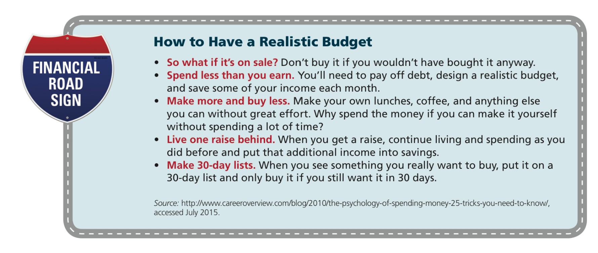

## Terms

- **personal financial statements**: planning tools to for developing and monitoring personal financial plans
	- 1. **Balance sheet**: describes your financial position at a _given point_ in time
	- 2. **Income &amp; Expense statement**: measures financial performance _over_ time
- **budgets**: detailed financial report that looks _forward_, based on expected income and expenses
- **gross income**: before tax (bruto)
- **net income**: after tax (neto)

## Balance sheet

Tracking your progress toward your financial goals.

3 parts:

1. **Assets**: what you own
1. **Liabilities (debts)**: What you owe
1. **Net worth**: Difference between your assets and liabilities

```
Net worth = Total Assets - Total Liabilities
```

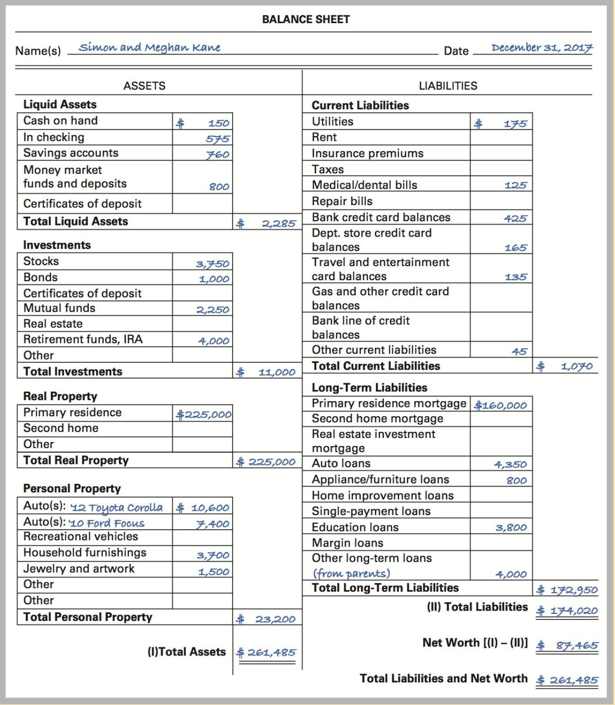

### Assets

- Items **you own**.
- Whether purchased with cash or financed using debt (even if you haven't fully paid for an asset, _you should list it in your balance sheet_).
- Don't add _leased_ items (you don't own them).

Assets can be grouped as follows:

- **Liquid assets**: Low-risk financial assets held in cash or instruments that can be liquified quickly, with little or no loss in value. (e.g. Cash on hand or in a checking or savings account, money market deposit accounts, money market mutual funds, certificates of deposit that mature within 1 year)
- **Investments**: Assets such as stocks, bonds, mutual funds, and real estate that are acquired in order to earn a return rather than provide a service.
	- Business ownership
	- Cash value of life insurance and pensions
	- Retirement funds (IRAs and 401(k) plans)
	- Commodities / financial futures / options
- **Real property**: Tangible assets that are immovable: land and anything fixed to it, such as a house. **Appreciates** (increases in value over time).
- **Personal property**: Tangible assets that are movable and used in every day life (cars, recreational equipment, household furnshing and appliances, clothing, jewelry, home electronics). Typically __depreciate__ (declines in value) shortly after being put into use.


All assets should be recorded at their current **fair market value**, which may differ considerably from their original purchasing price.

- **fair market value**: the actual value of an asset (for money), or the price for which it can reasonably be expected to sell in the open market (e.g. used car or home)

### Liabilities

**Debts.**

- Department-store charges
- Bank credit card charges
- Installment loans
- Mortgages on housing or other real estate

Generally classified according to maturity:

- **Current (short-term) liability**: Currently owed an due within 1 yera of the date of the balance sheet (consumable goods, utility bills, rent, insurance premiums, taxes, medical bills, repair bills and total **open account credit obligations** (outstanding balances against credit lines)
- **Long-term liability**: Debt due >= 1 year from the date of the balance sheet. (Real estate mortgages, most consumer installment loans, education loans, etc)


Regardless of the type **only the latest outstanding balance** should be shown as a liability on the balance sheet (what is still due is what matters at any given point in time, not the initial loan balance).

Only the outstanding principal portion of a loan or mortgage should be listed as a liability on the balance sheet (i.e. _do not include the interest portion of your payments_)

> **principal** is the amount of debt you owe at a given time

### Net worth

The actual amount of wealth or **equity** that an individual or family has in owned assets. Substract total liabilities from total assets.


If nw < 0, family (or individual) is **insolvent**. 


### Steps to making a balance sheet

1. **List your assets at their fair market value as of the date you are preparing the balance sheet.** Estimate the value of homes and cars using published sources of information, such as advertisements from comparable homes and the _Kelley Blue Book_ for used car values. Consider item appreciation and depreciation.
1. **List all current and long-term liabiliites.** 
1. **Calculate net worth.**


## Income &amp; Expense Statement

What you earn and where it goes. Captures the various financial transactions that ocurr over a period of time (usually a **year** or a **month**).

3 components:

1. **Income**: what goes in
2. **Expenses**: what goes out
3. **Cash surplus (or deficit)**: `income-expenses`

> The statement is prepared on a **cash basis**, which means that only transactions involving actual cash inflows or actual cash outlays are recorded.


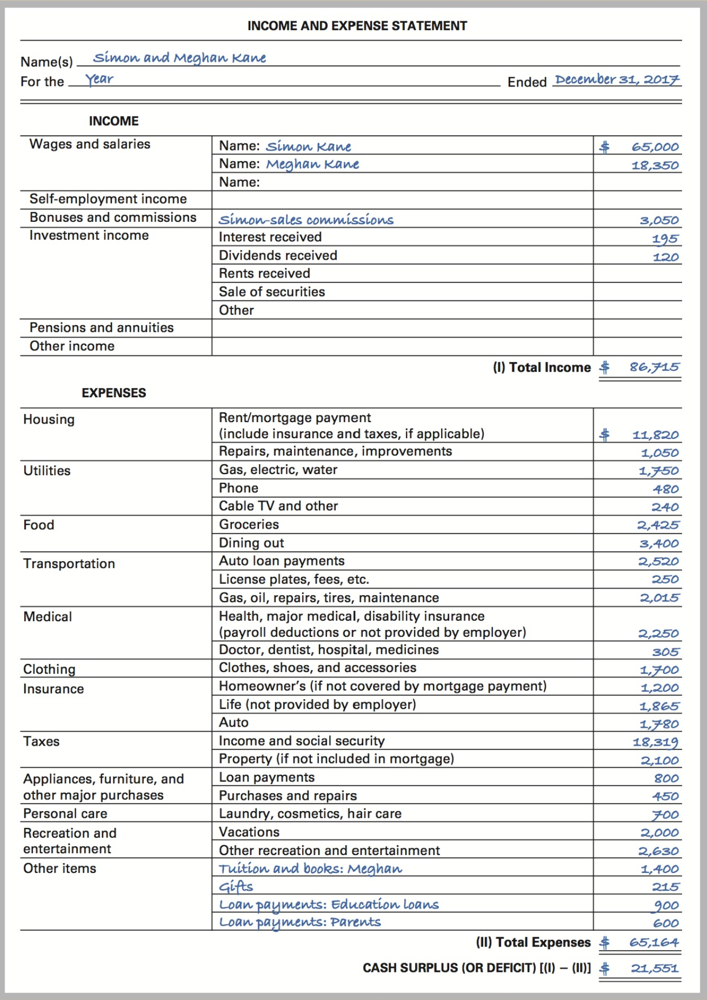


**Income**

- Wages
- Salaries
- Self-employment income
- bonuses
- comissions
- interest &amp; dividends received from savings and investments
- proceeds from sale of assets such as stocks and bonds
- pension
- annuity
- Social security income
- Rent received from assets
- Alimony
- Scholarships / grants
- tax refunds

The proper figure to use is **gross income**: amount received _before_ taxes. This is used because the taxes and payroll deductions will be itemised and deducted as expenses later in the income and expense statement.


**Expenses**

Cash out.

- Living expenses (housing, utilities, food, transportation, medical, clothing, insurance)
- Tax payments
- Asset purchases
- Other payments for personal care, recreation &amp; entertainment

**Fixed** (e.g. utilities, mortgages) vs **variable** expenses (e.g. food, clothing, entertaiment).


Important measure: average annual expenses by major category as a percentage of after-tax income.


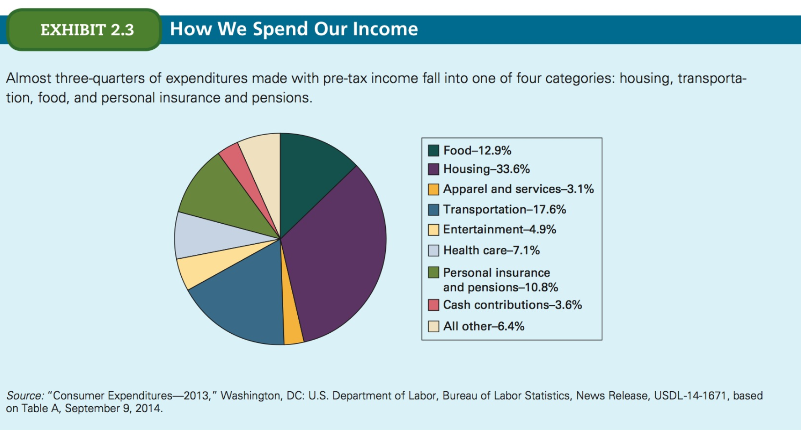


### Steps to preparing the income &amp; expense statement

Date the sheet to define the period covered.

1. **Record your income from all sources for the chosen period.** Use paycheck stubs. Include bonuses, comission checks, overtime pay. Keep a running list of other income sources, such as rents, tax refunds, and asset sales.
1. **Establish meaningful expense categories.**
1. **Subtract total expenses from total income to get cash surplus or deficit.**


- Credit purchases are shown as an asset and corresponding liability on the balance sheet.

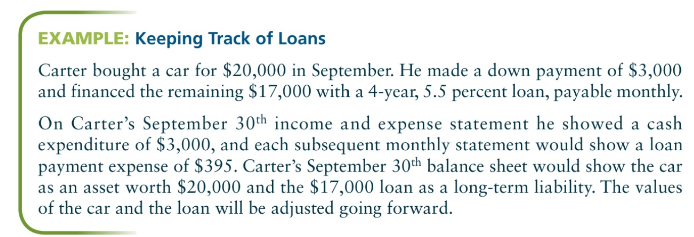


> For example, if you bought headphones for $100 in cash, you'd show the headphones on your balance sheet as an asset (at its fair market value) and as a $100 expenditure on your income &amp; expense statement. If you borrowed to pay for the headphones, the loan amount would be a liability on the balance sheet, and any loan payments made during the period would be shown on the income and expense statement.

## Useful tips for financial statements

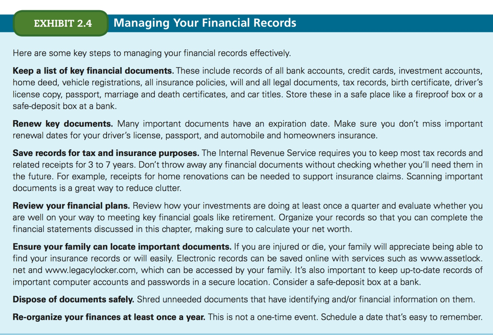

1. Keep good records

- Good records make it easiser for a spouse or relative to manage your financial affairs in an emergency. To that end, you should prepare a comprehensive list of these records, their locations, and your key advisors (financial planner, banker, accountat, attorney, doctors) for family members.

1. Update frequently

Prepare your financial statements at least once each yer, ideally when drawing up your budget. Many people do this every 3 or 6 months.

> You'll want to set up separate files for tax planning records, with one for income (paycheck stubs, interest on savings accounts, etc.) and another for deductions, as well as for individual mutual fund and brokerage account records.

### Ratio Analysis

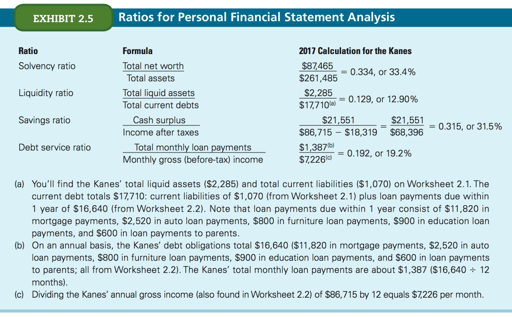

Every time you update your financial statements, you should analyze them to see how well you're doing on your financial goals (e.g. compare income and expense statement actual financial results with budgeted figures).

Calculating certain financial ratios can help you evaluate your financial performance over time.

1. **Solvency ratio**
1. **Liquidity ratio**
1. **Savings ratio**
1. **Debt service ratio**


#### Balance Sheet Ratios

##### Solvency ratio

Measure the degree of exposure to insolvency. The potential to withstand financial problems.

```
Total net worth / Total assets
```


##### Liquidity ratio

Meaures the ability to pay current debts (how long you could continue to pay current debts (bills or charges that must be paid within 1 year) with existing liquid assets).

```
Total liquid assets / Total current debts
```


#### Income &amp; Expense Statement Ratios


##### Savings ratio

Indicates relative amount of cash surplus achieved during a given period. (American families, on average, save about 5 to 8 percent).

```
Cash surplus / Net income (after tax)
```

##### Debt service ratio

Provides a measure of the ability to pay debts promptly.

```
Total monthly loan payments / Monthly gross (before-tax) income
```

This ratio **excludes current liabilities** and considers only mortgage, installment, and personal loan obligations.

(You want this to be low (under 35%)).


## Budgets

A cash budget is a tool that helps you:

- Maintain the necessary information to monitor and control your finances
- Decide how to allocate your income to reach your financial goals
- Implement a system of disiciplined spending
- Reduce needless spending so you can increase the funds allocated to savings &amp; investments
- Acheieve your long-term financial goals
- **Save automatically** (automatic transfers)
- Only works if you (1) use it and (2) keep careful records of actual income &amp; expenses
- Every month calculate the the surplus or deficit.

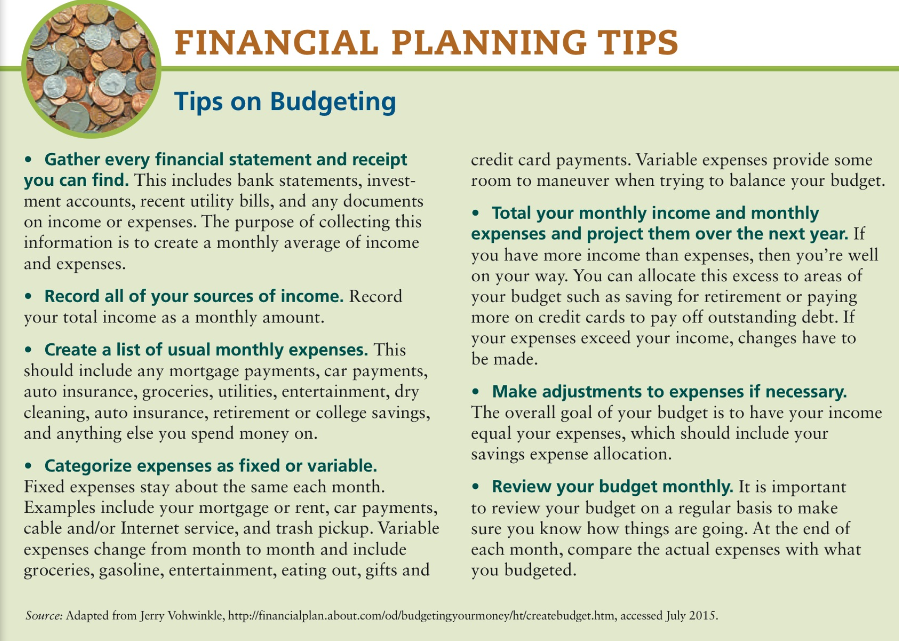


A budget deals with **estimated cash receipts &amp; expenses** that are expected to occur in a given period.

3 stages for preparation:

1. Forecasting income
2. Forecasting expenses
3. Finalizing the cash budget.

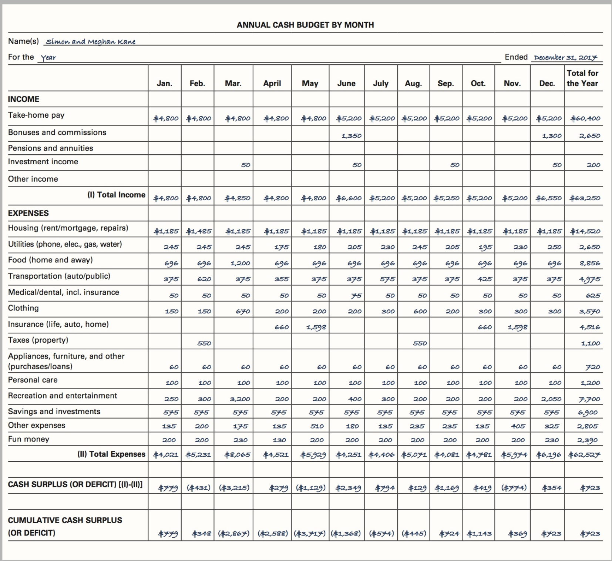

#### 1. Forecasting income

Include all income expected:

- take-home pay (net income **instead** of gross income)
- expected bonuses / comissions
- pension/annuity income
- investment income (interest, dividend, rental and asset sale income)

#### 2. Forecasting expenses

- **Estimated** expenses. You can use past expense data to make these estimates. 
- Study your spending habits to see if you are doing things that should be eliminated.
- Categorise your expenses. Choose categories that reflect your priorities and allow you to monitor areas of concern.
- Include contributions to savings
- **Base estimated expenses on current price levels and then increase them by a percentage that reflects the anticipated rate of inflation**
- Don't forget an allowance for 'fun money'.

#### 3. Finalizing the cash budget

Finalise your budget by comapring projected income to projected expenses. In a balanced, budget, the total income for the year equals or exceeds total expenses. If you find that you have a deficit at year end, you'll have to go back and adjust your expenses. If you have several months of large surpluses, you should be able to cover any shortfall in a later month. 


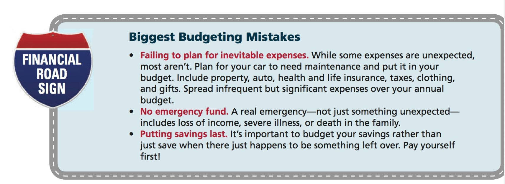

### Deficits

Even if the annual budget balances, in certain months you may have a deficit. You can handle this like so:

- Shift expenses from months with deficits to months with surpluses
- Use savings, investments, or borrowing to cover temporary deficits

These strategies are useful for handling *temporary* deficits.

If you have annual deficits even after adjusting your expenses:

1. **Liquidate enough savings and investments or borrow enough to meet the total budget shortfall for the year.** Not preferred. A budget should help you enjoy a reasonable standard of living _and_ progress toward acheiving your long-term goals. Reducing savings / investments or increasing debt reduces net worth.
1. **Cut low-priority expenses from the budget.**
1. **Increase income.** Difficult option. 

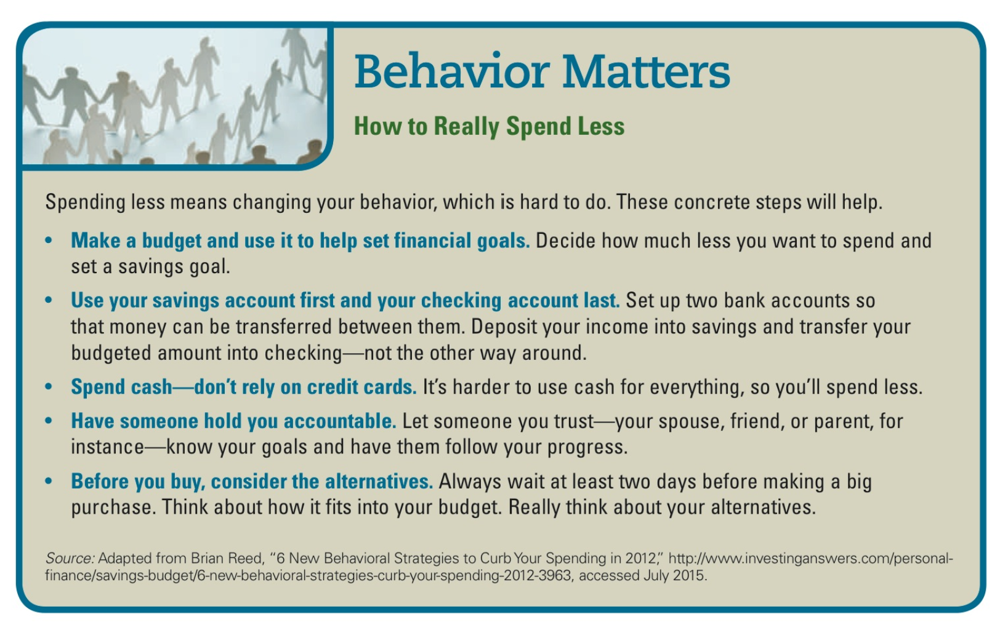

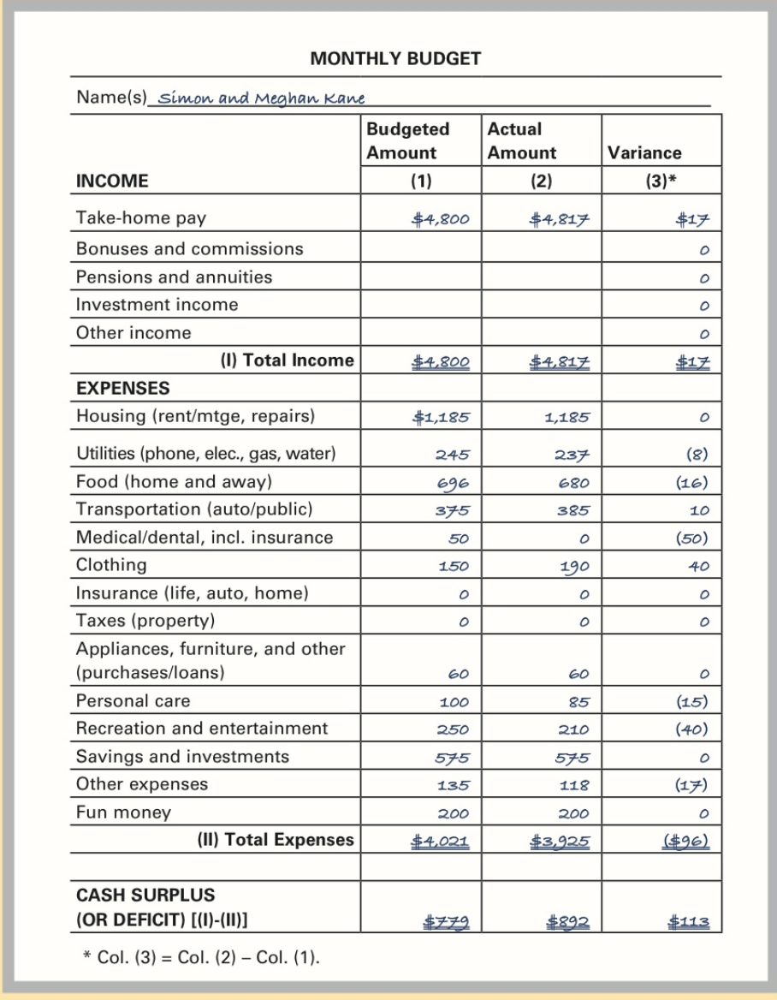


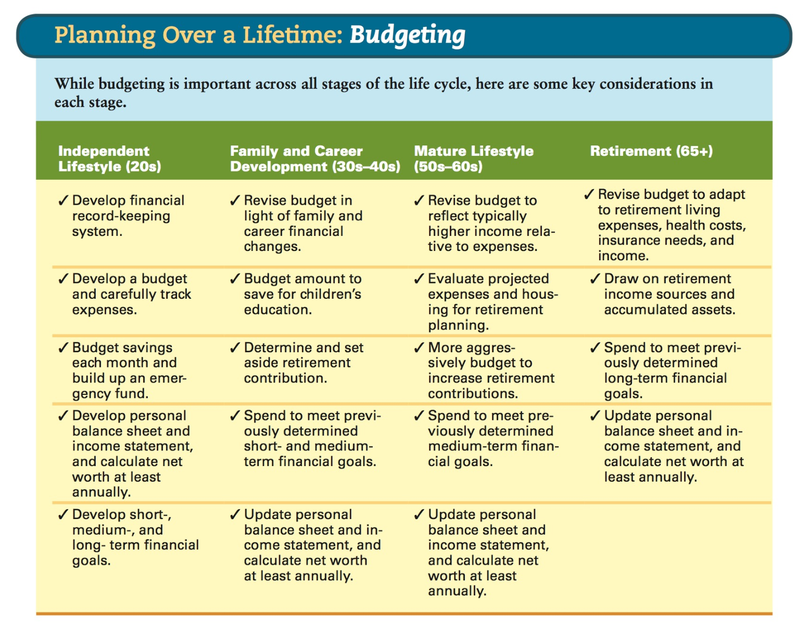


### Prepare your statements

Use the following questions to guide you:

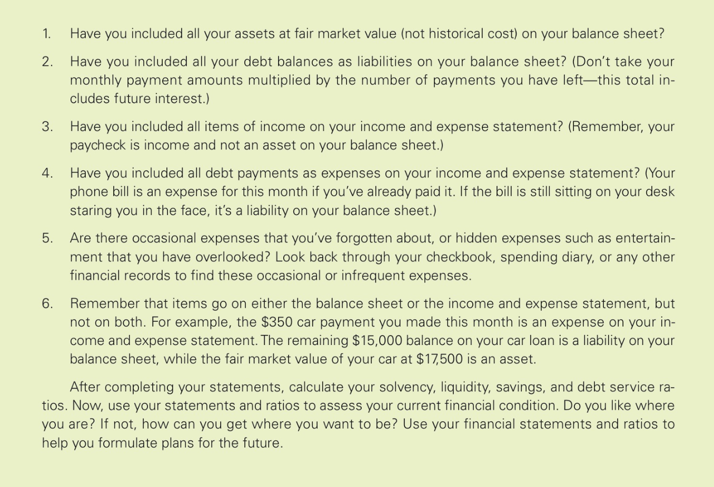


## Time value of money


- **time value of money**: the concept that a dollar today is worth more than a dollar received in the future.

Using this tool, you can correctly compare dollar values occuring at different points in time. 

So long as you can earn a positive rate of return (interest rate) on your investments (ignoring taxes and other behavioural factors) **you should always prefer to receive equal amounts of money sooner rather than later**.

The two most important concepts are:

- **present value**
- **future value**


### Future value

The value to which an amount today will grow if it earns a specific rate of interest over a given period.

Assume you make annual deposits of $2,000 into a savings account that pays 5% interest per year. At the end of 20 years:

- your **deposits** would total **$20,000** (20 x $2,000), but
- your **account balance** should have increased to **$66,132**

This is because of **compounding**: the interest earned each year is left in the account and becomes part of the balanace (principal) on which interest is earned in subsequent years.

#### Future value of a single amount

Assume you want to know how much an investment P will be worth in 5 years time:

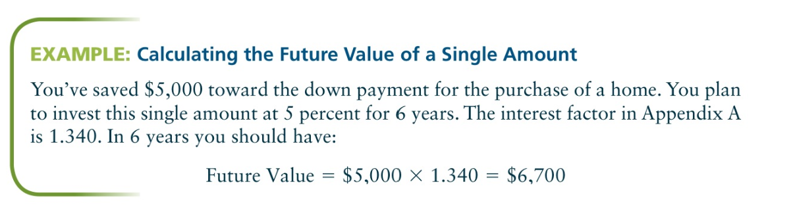

You can calculate this using **future value factors** which come in a table of such factors. However, you can also use the formula:

```
Future value = P*(1 + r)^n

P = initial amount invested today
r = rate of return (interest rate) (in decimal form) e.g. 0.5
n = # of years or months
```

In fact the future value factor is simply the above equation without the `P*` multiplication.

The rationale is:

```
# Suppose you invest $100.00 at 5% interest rate and you want to know how much that will be worth in 3 years:

Year 1: $100*1.05
Year 2: ($100*1.05)*1.05
Year 3: (($100*1.05)*1.05)*1.05 == $100 * (1.05)^3
```

#### Future value of an annuity

- **Annuity**: A fixed sum of money that occurs annually.

You can also use the concept of future value to find out how much you would need to invest **annually** at a given interest rate to accumulate a certain amount in the future.

Let's say you want to have $38,300 in 6 years. How much money would you need to deposit annually?

For this calculation you can also use **future value annuity factors** which also come in tables.

However you can also use this formula:

```
FV of Annuity = P*((1 + r)^n - 1/r)
```

Which is derived from the sum of a geometric series with common ratio `1 + r`.


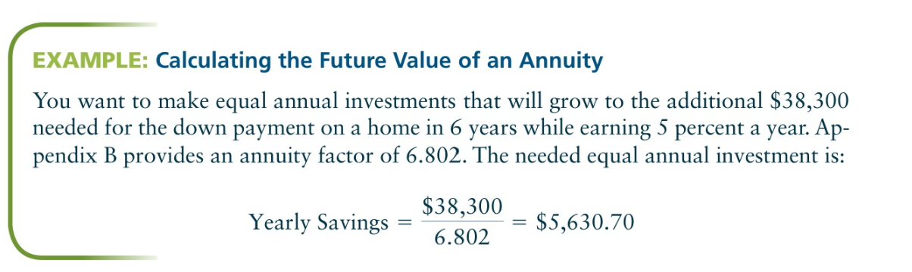

### Present value

Present value is the analogous concept to future value. It is the value today of an amount to be received in the future or the amount that would have to be invested today at a given interest rate over a specified time period to accumulate the future amount.


The process of finding present value is called **discounting**, which is the inverse of _compunding_ to find the future value.

#### Present value of a single amount

Assume you want to create a retirment fund (future value) by making a single lump-sum deposit today, you can use this formula to find the amount you need to deposit:

```
Present Value = Future Value x Present Value Factor
```

You can alternatively calculate it like so:

```
Present value = Future value / (1+r)^n
```


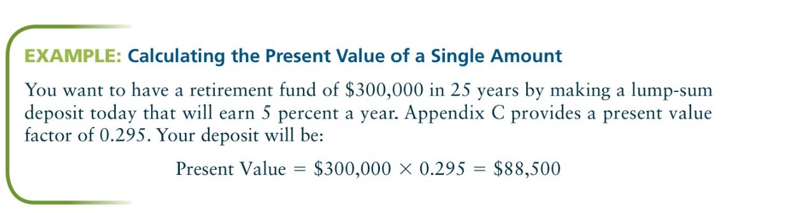

#### Present value of an annuity 

You can also use present value techniques to determine how much you can withdraw from your retirment fund each year over a specified time horizon. 

Assume that at age 55 you wish to begin making equal annual withdrawals over the next 30 years from your $300,000 retirement fund. At first, you might think you could withdraw $10,000 per year ($300,000/30 years). However, **the funds still on deposit would continue to earn 5% annual interest**. To find the amount of the equal annual withdrawal, you can use this formula:


```
Annual Withdrawal = Initial deposit / Present value annuity factor
```

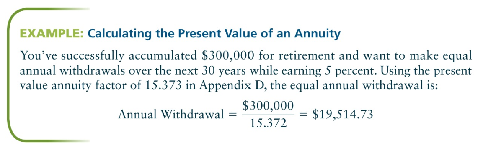

