# Chapter 4
## Managing your cash and savings


**Table of Contents**

-   [Managing your cash and
	savings](#managing-your-cash-and-savings)
-   [Tips](#tips)
-   [Financial marketplace](#financial-marketplace)
	-   [Financial institutions](#financial-institutions)
	-   [Money safety](#money-safety)
-   [Cash management products](#cash-management-products)
	-   [Checking account](#checking-account)
	-   [Savings accounts](#savings-accounts)
	-   [Interest-Paying Checking
		Accounts](#interest-paying-checking-accounts)
	-   [Asset Management Accounts
		(AMA)](#asset-management-accounts-ama)
-   [Choosing a bank](#choosing-a-bank)
-   [Starting savings](#starting-savings)
	-   [Earning interest](#earning-interest)
-   [Other investment vehicles](#other-investment-vehicles)
	-   [Certificates of Deposit
		(CDs)](#certificates-of-deposit-cds)
-   [Government-issued](#government-issued)
	-   [U.S. Treasury Bills
		(T-Bills)](#u.s.-treasury-bills-t-bills)
	-   [Series EE Bonds](#series-ee-bonds)
	-   [I Savings Bonds](#i-savings-bonds)

---

[Cash Is No Longer Trash - John Waggoner - Kipling's Personal Finance Magazine January 2019](pdf/kip201901_56.pdf)


This chapter deals with the administration of **liquid assets**

- Cash
- Checking / savings accounts
- Money market deposit accounts
- Money market mutual funds
- Other short-term investment vehicles

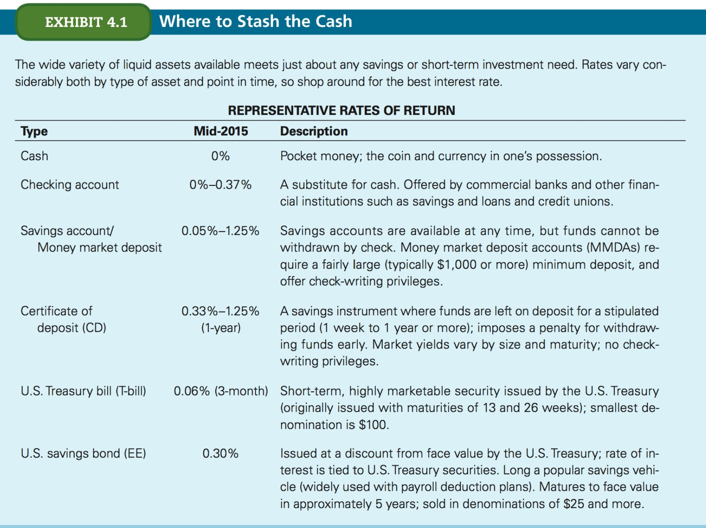

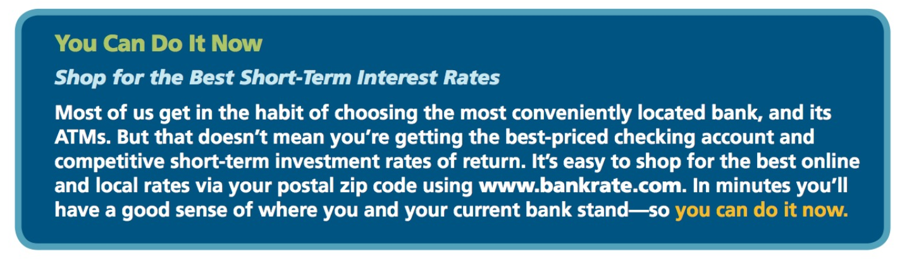

## Tips

- If you're going shopping, set a maximum spending limit beforehand - an amount consistent with your cash budget.

## Financial marketplace


### Financial institutions

Two types:

- **depository** vs **non-depository**: accept deposits (like traditional banks)?

#### Depository financial institutions

The vast majority of financial institutions are depository financial institutions.

- Commercial banks
- Savings &amp; loans associations (S&Ls)
- Savings banks
- Credit unions

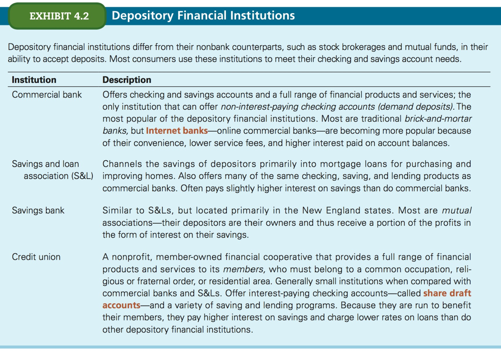


#### Non-depository financial institutions

Offer banking services, but don't accept deposits.

- **stock brockerage firms**: serveral cash management options, money market mutual funds that invest in short-term securities andd earn a higher rate of interest than bank accounts, credit cards, etc.
- **mutual funds**: Chap 13
- life insurance / finance companies

e.g. you can hold credit cards from these institutions.


### Money safety

Most banks are federally insured. If they're not, they're most likely insured by a state-chartered or private insurance agency. Experts believe that the latter have less protection against loss than the former.

**Deposit insurance** means that your deposits in a bank are insured against institutional failure up to a certain amount. This amount is usually $250K (per depositor) for most federally-insured banks.

The checking _and_ savings accounts are insured, _as long as the maximum insurable amount is not exceeded_, the depositor can have any number of accounts and still be fully protected.

**This is an important feature to keep in mind because many people mistakenly believe that the maximum insurance applies to _each_ of their accounts.**

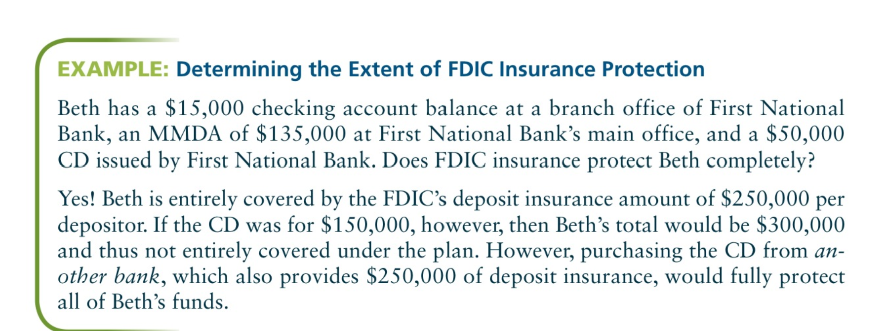

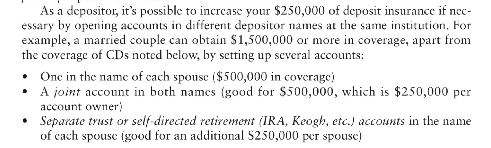

## Cash management products

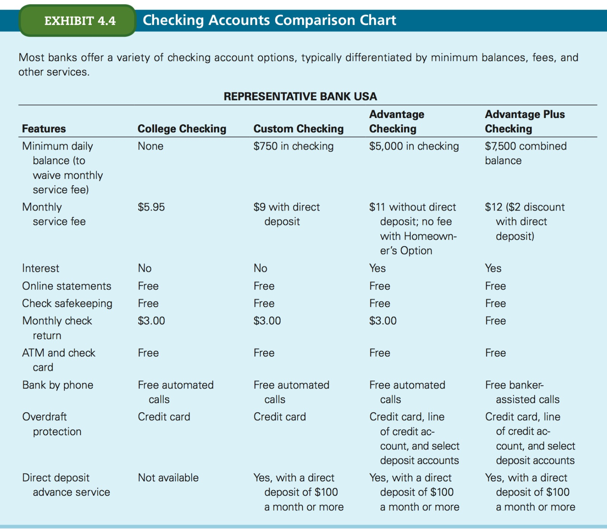


### Checking account

- **Demand deposit**: an account held at a financial institution from which funds can be withdrawn on demand by the account holder

You put money by _depositing_ funds, you withdraw it by:

- writing a check
- using a debit card
- making a cash withdrawal

Traditionally pays no interest and charges a service fee which can be waived by maintaining a minimum balance. 

Traditional banks offer _regular checking_.

Credit unions, savings banks, S&amp;Ls offer checking accounts that _must_ pay interest they're called NOW **negotiable order of withdrawal** accounts, except for credit unions where they're called **share draft accounts**.

### Savings accounts

Savings deposits are **time deposits**, they are expected to remain on deposit for longer period than demand depsoits.

- earn a higher interest rate
- Interest rate depends on account balance


> Although financial institutions generally have the right to require a savings account holder to wait a certain number of days before receiving payment of a whitdrawal, most are willing to pay withdrawals immediately.

Watch out for:

- withradawl policies
- deposit insurance
- stated interest rate
- method of calculating interest paid


### Interest-Paying Checking Accounts

One of 

- NOW accounts
- Money market deposit accounts
- Money market mutual funds

#### NOW accounts

Negotiable order of withdrawal (NOW) accounts are checking accounts on which the financial institution pays interest. 

- No legal minimum balance, but many institutions set their own policies.

#### Money market deposit accounts (MMDAs)

A **federally insured** (main advantage) savings account.

- most banks require a minumum balance of $1K or more
- Accessed via checks or ATMs
- Limited # of free checks &amp; transactions but pays fees for additional ones
- Highest interest rate of any bank account on which checks can be written
- **High monthly bank charges** which can offset the interested earned


#### Money market mutual funds (MMMF)

A mutual fund that pools the funds of many small investors and purchases high-return, short-term marketable securities offered by the U.S. Treasure, major corporations, large commercial banks, and various government organizations.

- Historically pay interest rates of 1 to 3 % above those paid on regular savings accounts
- Instant access to their funds through checks (often have a stipulated minimum amount ($500))


### Asset Management Accounts (AMA)

A.k.a. _central asset account_.

A comprehensive depsit account which combines checking, investing, and borrowing activities and is primarily offered by brokerage houses &amp; mutual funds. Appeal to investors because they can consolidate most of their financial transactions at one institution and on one account statement.

A typical AMA includes:

- an MMDA with unlimited checking
- Visa or MasterCard debit card
- use of ATMs
- Brokerage &amp; loan accounts


Notes:

- Annual feeds and account charges (e.g. ATM withdrawal fees) vary, so it pays to shop around.
- Minimum balance requirements
- Interest rates on checking account deposits
- Automatically "sweep" excess balances (e.g. > $500) to higher-return MMMF daily or weekly


Drawbacks:

- Fewer branch locations
- ATM transactions are more costly
- Checks can take longer to clear
- Some bank services (e.g. traveler's and certified checks) may not be offered
- AMAs are not covered by deposit insuranc (although they are protected by the _Securities Investor Protection Corporation_) and usually the firm's private insurance


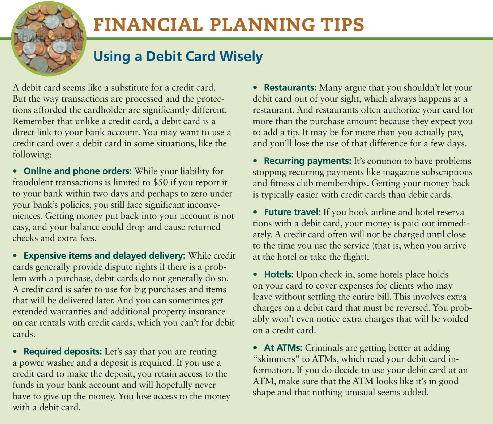

## Choosing a bank

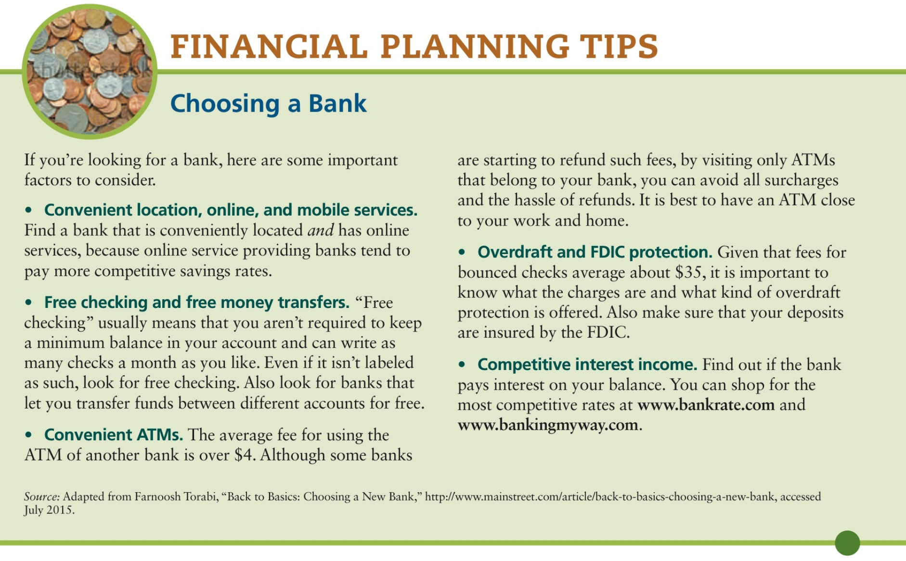


## Starting savings

- You should hold a portion of your assets to meet liquidity needs and accumulate wealth
- About 6 to 9 months of after-tax income (emergency deposit) (build this first, then do everything else).
- **Save automatically** by establishing automatic transfers.
- Choosing investment vehicles will depend on safety, risk, conveniency, liquidity and interest rate payments
- 10 to 25% of investment portfolio in savings-type instruments in addition to the 6 to 9 months of liquid reserves ^

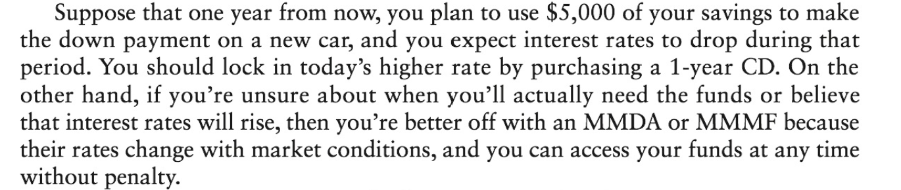


**The whole point of putting your money in a savings account is interest earned**.

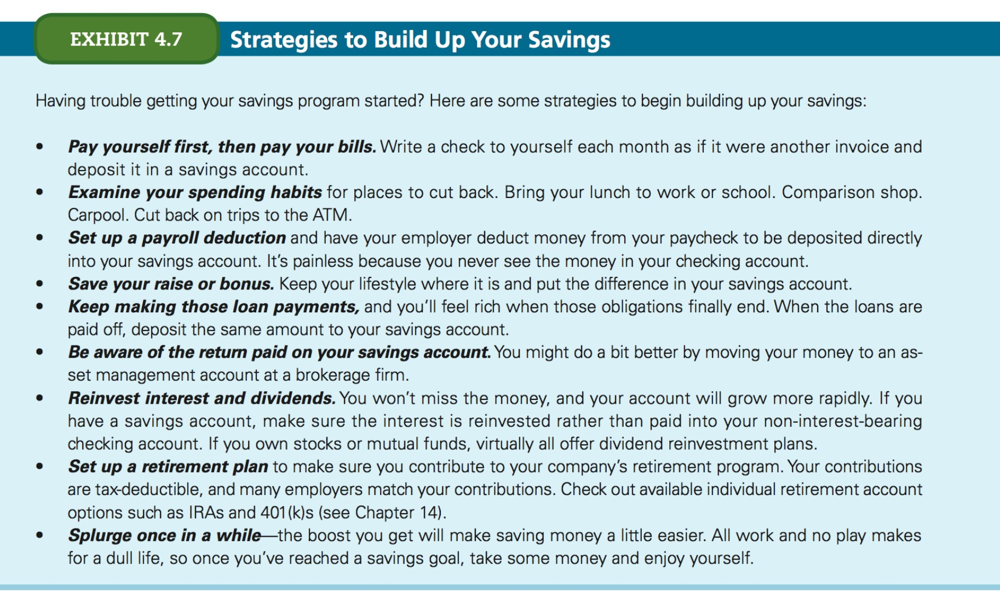


### Earning interest

Interest is usually **compounded**. This is the effect of interest being paid on money that's already been paid as interest.

If you invest an initial amount P and get interest `ir` every 6 months, then by month 12, you will be paid `ir` % on `P*(1 + ir)`, not `P` alone. 

This means that the more often your payment is compounded, the more money you will get.

This is why we say there is a difference between **nominal (stated) interest rate** and **effective interest rate**.

#### Terms

- **simple interest**: interest that is paid only on the initial amount of the deposit
- **nominal (stated) interest rate**: the promised rate of interest paid on a savings deposit or charged on a loan
- **effective rate of interest**: The annual rate of return that is _actually earned_ (or _charged_) during the period the funds are held (or borrowed)


**Effective Rate of Interest**

```
Effective Rate of Interest = Amount of interest Earned / Amount of Money Invested or Deposited
```


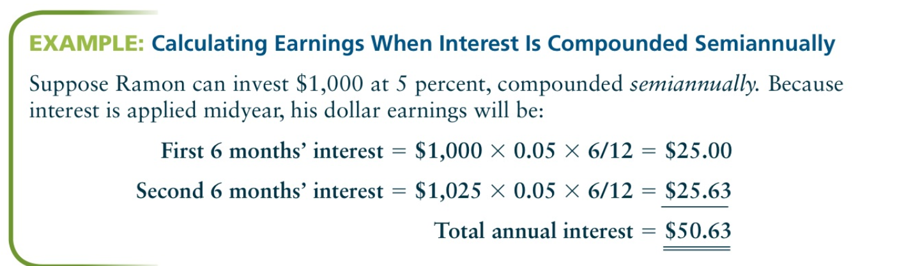


**The more frequently interest is compounded, the greater the effective rate for any given nominal rate**.

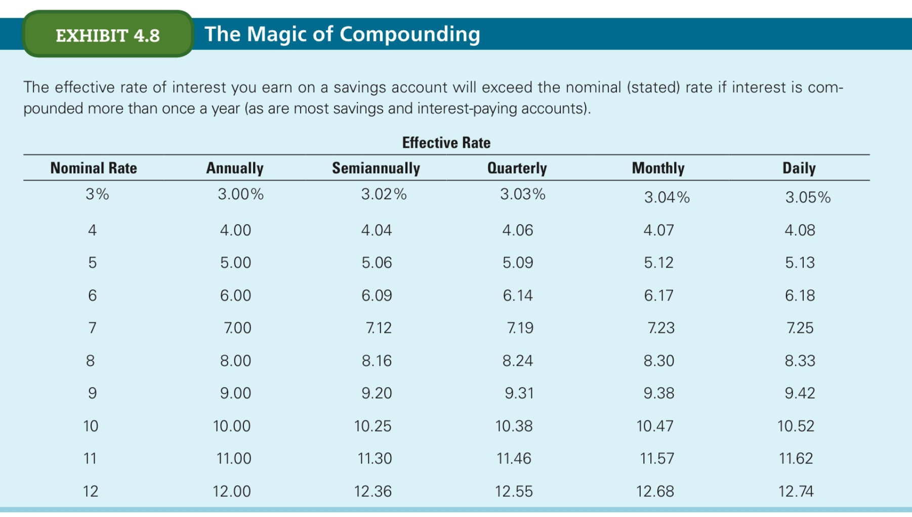


## Other investment vehicles


### Certificates of Deposit (CDs)

CDs are deposits that **must** remain on deposit for a specified time period (ranging from 7 days to as long as 7 or more years).

Although it is possible to withdraw funds prior to maturity, an **interest penalty** is usually charged.

Banks, S&Ls and other depository institutions can offer any rate and maturity CD they wish.

Most pay higher rates for larger deposits and longer periods of time.


## Government-issued 

### U.S. Treasury Bills (T-Bills)

> The T-bill is considered the ultimate safe haven for savings and investments.

They are issued by the U.S. Treasury as part of its ongoing process of funding the national debt. They are sold on a _discount basis_ (meaning they're sold at a lower price than its nominal rate (what the bond was purchased for, or what it will pay when it matures)) in $100 minimum denominations and are issued at 3 and 6-month maturities.

They are auctioned off every Monday. The most important quality and what makes them super attractive is that they are backed by the U.S. Treasury, with all their credibility (it's virtually risk-free) and they are **free of state and local income taxes**.


### Series EE Bonds

- a.k.a. Patriot Bonds
- Issued by the U.S. Treasury on a _discount basis_
- Free of state and local income taxes
- _Accrual-type securities_: interest is paid when they're cashed in or before maturity, rather than periodically during their lives
- Seires HH bonds: 10-year maturity and are available in demnominations of $50 to $10,000.
- Unlike EE bonds, HH bonds are issued at their full face value and pay interest semianually (every 6 months) at the current fixed rate
- Pruchaseable at banks or other depository institutions or through payroll deduction plans
- Issued in denominations from $25 to $10K, their purchase price is a **uniform 50% of the face amount** (this means that a $100 bond will cost $50 and be worth $100 at maturity)
- Series EE bonds earn interest at a fixed rate for 30 years (used for long-term goals like education and retirement)
- Bonds can be redeemed any time after the first 12 months, but redeeming EE bonds in < 5 years results in a penalty of the last 3 months of interest earned
- Fixed interest rate is set every 6 months in May & November
- Increase in value every month and interest is compounded semianually
- **Savers don't need to report interest earned on their federal tax returns until the bonds are redemeed**
- Partial or complete tax avoidance when proceeds are used to pay education expenses (e.g. college tuition) for an IRs-defined dependent (purchaser must be 24 or older and must have income below a given maximum)

### I Savings Bonds

Similar to EE bonds.

- Series I bonds are sold at **face value**. 
- I Savings bonds combines a fixed rate with the annual interest rate that remains the same for the life of the bond which means that
- **The key difference** is that I bonds are adjusted for inflation.
- Cannot be bought or sold in the secondary market, transactions are only with the U.S. Treasurey

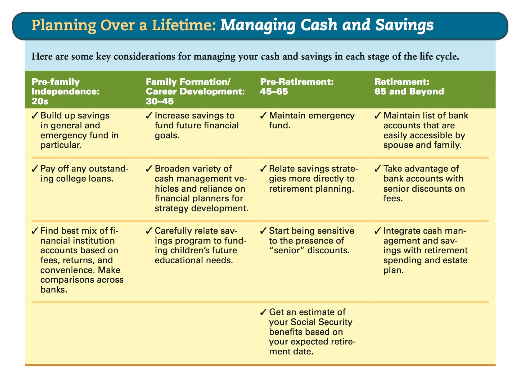


