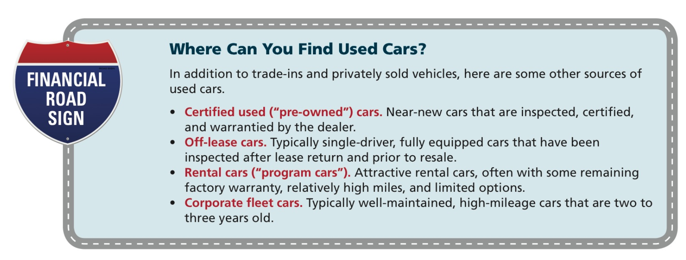
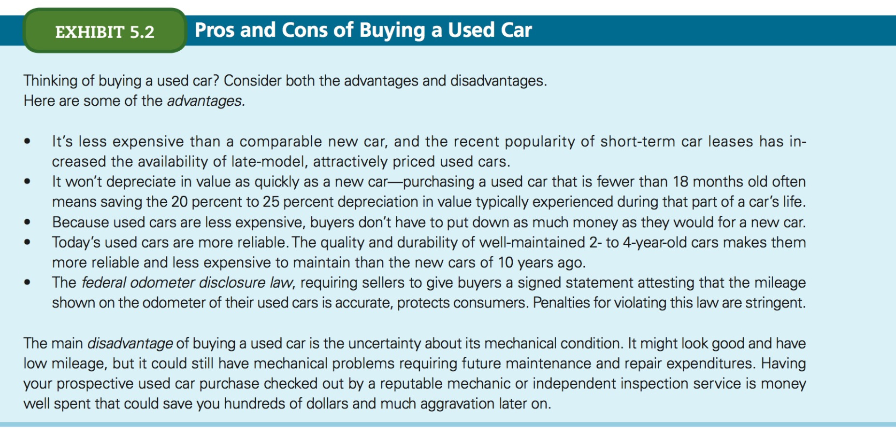

# Chapter 5
## Making automobile and housing decisions

## Resources

Magazines:

- Car and Driver
- Motor Trend
- Road and track
- AutoTrader

Consumer magazines:

- Consumer Reports
- Kiplinger's Personal Finance

These last two provide annual buying guides.

Online:

- Kiplinger's [Find the Right Car Tool](https://www.kiplinger.com/tool/cars/T011-S001-2012-new-car-rankings-compare-costs-performance-da/index.php)
- Consumer Reports New & Used Car Price Service

## Key considerations

- Ask your insurance agent annual premium quotes for insuring various cars; auto insurance is another significant expense of owning a car.
- Check internet sites like Edmunds.com and kbb.com
- Find the car in terms of size, performance, safety and style.
- Choose at least 3 target cars
- Get multiple online quotes from dealers
- Test drive the car and the salesperson
- Negotiate thel owest price by getting bids from at least three dealers. Hold firm on your target price before closing the deal
- Get the salesperson to fax you a worksheet and invoice before you go to the dealership
- Review and sign the paperwork. If you have a worksheet for the deal, the contract should match it. Make sure the numbers match and there are no additional charges or fees
- Inspect the car for scratches and dnets. If anything is missing - like floor mats - ask for a "Due Bill" that states it in writing

## Affordability

- Amount of down payment
- Amount of monthly loan payment: include insurance. Your monthly car payment should be no more than 20 percent of your monthly net income
- License, fuel, oil, tires, 
- Maintenance
- Hybrid or electric vs fuel

### New, Used, or "Nearly New"

This is the first decision you should make based on affordability. Once you know what you wnat shop at these places:

- **Franchise dealerships**: Offer the latest-model used cars, provide financing, and will negotiate on price. Be sure to research values before shopping.
- **Superstores**: AutoNation, CarMax, and similar dealers offer no-haggle pricing and a large selection. They certify cars and may offer a limited short-term warranty. May cost slightly more than a dealer who will negotiate.
- **Independent used car lots**: Usually offer older (4 to 6 year old) cars and have lower overhead than franchise dealers do. There are no unifrom industry standards, so be sure to check with the **Better Business Bureau** before buying.
- **Private individuals**: Generally cost less because there's no dealer overhead; may have maintenance records. Be sure that the seller holds the title of the car.

### Reliability and Warranties

Assess the reliability of a car by 

- talking with friends who own similar cars
- reading objective assessments published by consumer magazines and buying guides such as _Consumer Reports_.

Study the warranty offered by new car manufacturers. Today, most new car warranties cover a minimum of the first three years of ownership or 36K miles, whichever comes first, but some provide coverage for as long as seven years or 70K miles.

Auto manufacturers and private insurers also sell extended warranties and service contracts, somtimes called _buyer protection plans_. Most expers consider these unnecessary and not worth their cost, given the relatively long initial warranty periods now being offered by most manufacturers.

### Other considerations

- Trading in or selling your existing car: although trading in is convenient, it's generally a better deal to sell your old car outright. If you're willing to take the itme, you can usually sell your car for more than the wholesale price typically offered by a dealer on a trade-in.
- **Fuel economy**: The _EPA mileage ratings_ are especially useful on new vehicles, which carry a sticker indicating the number of miles per gallon each model is expected to get for both city and highway driving. You can check out those ratings at http://www.fueleconomy.gov

## Purchasing

Once you know what you can afford to spend and the features that you want, you're ready to begin car shopping.

If you plan to buy a new car, visit all the dealers with cars that meet your requirements.

Look the cars over and ask questions - but don't make any offers until you've found two or three cars with the desired features that are priced within your budget.

Make an appointment to test-drive the cars you're interested in. Drive, *then leave*.

Some manufacturers offer firm selling prices (no haggle), but you should still shop around, because a firm selling price does not guarantee the lowest cost.

# CONTINUE ON PAGE 170 of PDF

# Housing

## Rental Agreements

When you rent an apartment, duplex, house or any other type of residence, you'll be required to sign a **rental contract** or **lease agreement**.

The contract specifies:

- amount of monthly payment
- payment due date
- penalties for late payment
- length of the lease agreement
- security/advance rent (deposit) requirements
- fair wear and tear definitions and provisions
- distribution of expenses
- lease renewal options
- early termination penalties
- restrictions on children, pets, subleasing, or using the facilities

Most leases have a minimum term of 6 to 12 months and require payments at the beginning of each month. 

They may initially require a security deposit and/or payment of the last month's rent in advance as security against damages or violation of the lease agreement. If there's no serious damage, most of the deposit should be refunded to the lessee shortly after the lease expires. A portion of the deposit is sometimes retained by the lessor to cover the cost of cleaning and minor repairs, regardless of how clean and well kept the unit was.

Because the landlord controls the deposit, __a written statement describing any preexisting damage__, _prior_ to occupancy, may help the lessee avoid losing their entire deposit. 

Renters should also clarify who bears expenses such as utilities and trash collection and exactly what, if any, restrictions are placed on the use of the property.

