# Chapter 6
## Using Credit


**Table of Contents**

-   [Using Credit](#using-credit)
	-   [First steps in establishing
		credit](#first-steps-in-establishing-credit)
-   [Credit Cards and open account
	credit](#credit-cards-and-open-account-credit)
	-   [Special types of bank credit
		cards](#special-types-of-bank-credit-cards)
	-   [Retail charge cards](#retail-charge-cards)
	-   [Debit cards](#debit-cards)
	-   [Prepaid cards](#prepaid-cards)
	-   [Revolving credit lines](#revolving-credit-lines)
-   [Application process](#application-process)
	-   [Credit Bureau](#credit-bureau)
	-   [Computing Finance Charges](#computing-finance-charges)
	-   [Things to consider when shopping for a
		card](#things-to-consider-when-shopping-for-a-card)
-   [Safety features](#safety-features)
-   [Bankruptcy](#bankruptcy)
	-   [Wage Earner Plan](#wage-earner-plan)
	-   [Straight Bankruptcy](#straight-bankruptcy)

---

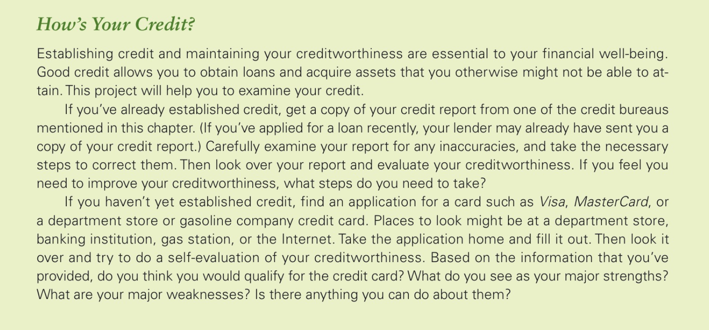

- A good rule to remember is _the product purchased on credit should outlive the amount of time it takes to pay it off_. 
- Be careful not to overspend. You could end up in a really bad place.

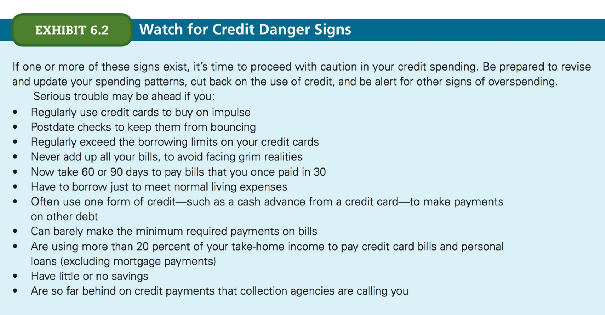


Lenders will look at various factors to establish your creditworthiness (your ability to promptly repay the debt):

- present earnings
- net worth
- current debt position
- credit history


### First steps in establishing credit

1. Open checking and savings accounts
1. Use credit: get a mastercard and use it for small charges periodically, even if you prefer paying cash
1. Obtain a small loan, even if you don't need one. If you don't actually need the money, put it in a liquid investment, such as a money market account or certificate of deposit. The interest you earn should offset some of the interest expense on the loan; you can view the difference as a cost of building good credit. You should repay the loan promptly, perhaps even a little ahead of schedule, to minimize the difference in interest rates. However, don't pay off the loan too quickly because lenders like to see how you perform over an extended period of time. Keep in mind that your ability to obtain a large loan in the future will depend, in part, on how you managed smaller ones in the past.
1. Build a strong credit history. Make all your payments on time. Being late occasionally (two or three times a year) might label you a "late payer".
1. If you foresee difficulty in meeting a monthly payment, let the lender know. Usually arrangements can be made to help you through the situation. This is especially true with installment loans that require fixed monthly payments. If you have one or two of these loans and see a month coming that's going to be really tight, the first thing you should try to do (other than trying to borrow some money from a family member) is to get an extension on your loan. Don't just skip a payment, because that's going to put your account into _late status until you make up the missed payment_. (Just don't do it too often).

#### How much credit can you handle?

Sound financial planning dictates that you need a good idea of how much credit you can comfortably tolerate. The easiest way to avoid repayment problems is to _limit the use of credit to your ability to repay the debt_. 

A useful rule of thumb is to make sure your payment repayment burden doesn't exceed 20% of your monthly take-home pay. Most experts, however, consider the 20% figure as the _maximum_ debt burden and strongly recommmend a **debt safety ratio** closer to **10 or 15%**.

> **debt safety ratio**: the proportion of total monthly consumer credit obligations to monthly take-home pay.


```
debt safety ratio = total monthly consumer credit payments / monthly take-home pay
```


Note that the monthly repayment burden _does include_ payments on your credit cards, but it _excludes_ your monthly mortgage obligation.


## Credit Cards and open account credit

> **line of credit**: maximum amount that the cardholder can owe at any time.

> **Open account credit**: form of credit extended to a consumer in advance of any transaction.

This is your normal credit where a retail outlet or bank agrees to allow the consumer to buy or borrow up to a _specified amount_ on open account. Credit is extended so long as the consumer does not exceed the established **credit limit** and makes payments in accordance with the specified terms.

- **Consumers who use open forms of credit can often avoid paying interest charges _if they promptly pay the full amount of their account balance_**. 
- You receive a monthly **credit statement** from the bank or store that summarises the recent transactions (for that period, typically a month, but not necessarily a calendar month) on your account.

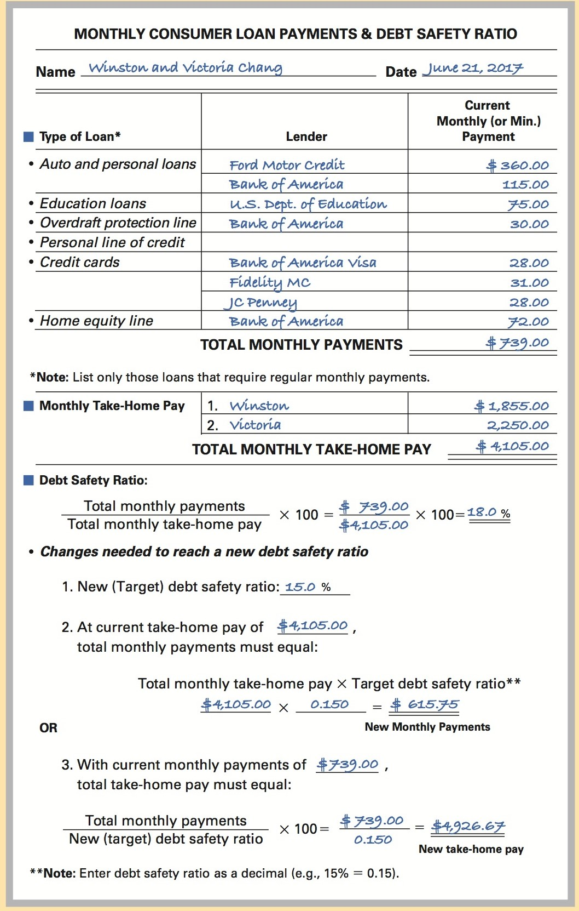

Open account credit generally is available from two broadly defined sources: 

1. financial institutions
1. retail stores/merchants

Financial institutions include commercial banks, S&Ls, credit unions, major stock-brokerage firms, and consumer finance companies. 

The following are features of most credit cards:

#### Line of credit

The **line of credit** is the maximum amount the cardholder can owe. It's set by the card issuer as a result of the client request and the investigation of the applicant's credit and financial status. Most range from 500-2,500 USD.

#### Cash advances

A cash advance is a loan that can be obtained by a bank credit cardholder on which interest begins to accrue immediately. They are transacted at the financial institution. You can draw cash from the ATM to a fixed amount, and up to your remaining credit balance at the teller (physically). 

#### Interest charges

Two types:

- fixed-rate cards (average annual 13.01% interest rate 2015)
- variable-rate cards (average annual 15.76% interest rate 2015)

> You will find that most bank cards have one rate for merchandise purchases and a much higher rate for cash advances.

When you're shopping for a credit card, **watch out** for _special low introductory rates_ that many banks offer. They're usually only good for the first 6 to 12 months.

Most cards have variable interest rates that are tied to an index that moves with market rates.

Generally speaking, _the interest rates on credit cards are higher than any other form of consumer credit_. 

You generally have a **grace period** after you borrow credit (make a purchase with a credit card, for instance) in which you can pay the full balance of your bill and not incur in any interest (typically 20 to 30 days). _Fecha de corte_. 

Interest on cash advances, however, _begins the day the advance is taken out_. 

#### Other fees

- Annual fees: a fee for using the card (around $25 to $40 a year).
- Transaction fees for any (non-ATM) cash advance (usually $5 per cash advance or 3% of amount obtained in the transaction, whichever is more)
- Late-payment fees (additional to the interest)
- Over-the-limit charges
- Foreign transaction fees
- Balance transfer fees

#### Balance transfers

A program that enables cardholders to readily transfer credit balances from one card to another.


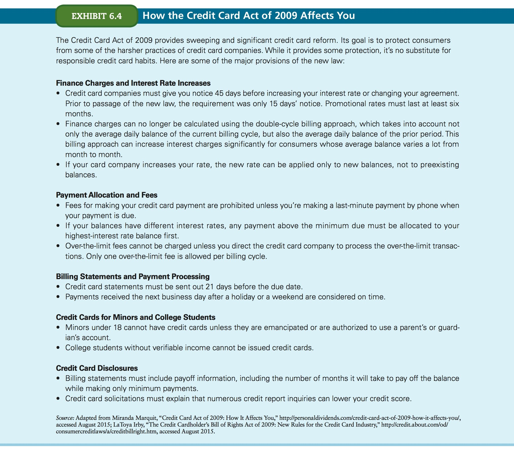


### Special types of bank credit cards

You can also obtain cards that offer rebates, special incentive programs, cards sponsored by nonprofit organizations. 


#### Reward credit cards

https://www.kiplinger.com/slideshow/credit/T016-S003-the-best-rewards-cards-for-you-2019/index.html

> **reward (co-branded) credit cards**: a card which combines features of a traditional bank credit card with an additional incentive, such as rebates and airline mileage.


Some of the many incentive programs:

- **Frequent flyer programs**: cardholder earns free frequent flyer miles for each dollar charged on the credit card. Can be used for free tickets, first-class upgrades, etc. Examples include Delta Sky Miles Card, United Airlines Mileage Plus Visa Card; with the American Express and Chase Travel Plus programs, the miles can be used on any of numerous airlines.
- **Automobile rebate programs**: a number of cards earn annual rebates of up to 5% for new car purchases or leases and gas and auto maintenance purchases up to specified limits. Citibank's ThankYou Preferred Card provides rebates that can be applied to the purchase of any vehicle brand, new or used. Cardholders can earn 1% on most all purchases (notably excluding gas) and 6% during the year. Most of the major car companies offer some kind of rewards-related credit card
- **Other merchandise rebates**: Bank card reward programs, including Norwegian Cruise Line, NASCAR, Starbucks, Marriot Hotels, and Hard Rock Cafe. Major oil companies and regional phone companies offer rebates on phone calls and gas.

If interested check this site out: https://cardtrak.com and https://thepointsguy.com

Keep in mind most incentive cards carry higher interest rates than normal credit cards.


#### Affinity cards

"Credit cards with a cause". Sponsored by some organization or nonprofit like the Special Olympics or the American Wildlife Fund. They obtain a percentage of buys at the expense of higher interest rates for the consumer. Some people view this as "painless philantropy" but some prefer normal cards and then writing a check.

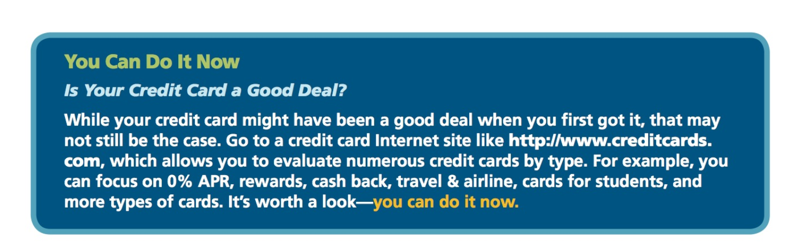


#### Secured Credit Cards

Collateralized credit cards for people with bad credit history. You get a credit line equal to the collateral you deposited in a 12- to 18-month COD. Hopefully will requalify for unsecured conventional credit cards.

#### Student Credit Cards

Special credit cards that target college students that appeal to this segment - free music, movie tickets, etc. Require that you be enrolled in a 2 or 4-year university and have a source of income, whatever that may be. They usually _do not require_ any parental or guardian guarantees, nor do they require that you hold a full-time (or even part-time) job.

Useful to build credit history and to establish loyalty to the bank.

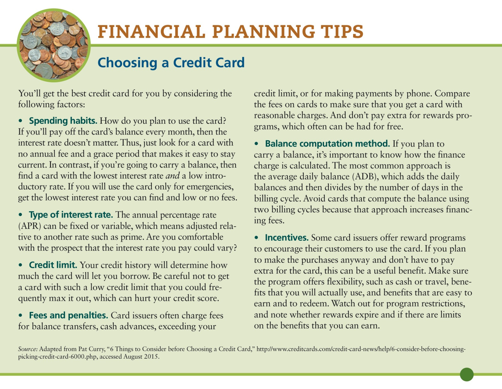


### Retail charge cards

- Issued by department stores, oil companies, car rental agencies etc.
- Build consumer loyalty
- Convenient way to shop
- Generally more expensive than bank credit cards

### Debit cards

- Looks like a credit card, MasterCard & Visa
- Provides direct access to your checking account
- Equivalent to paying in cash
- No finance charges to pay
- Useful to get cash from ATMs
- Some banks may charge a flat annual fee or transaction fee
- Some _merchants_ may charge for using it
- Avoids high cost for credit cards

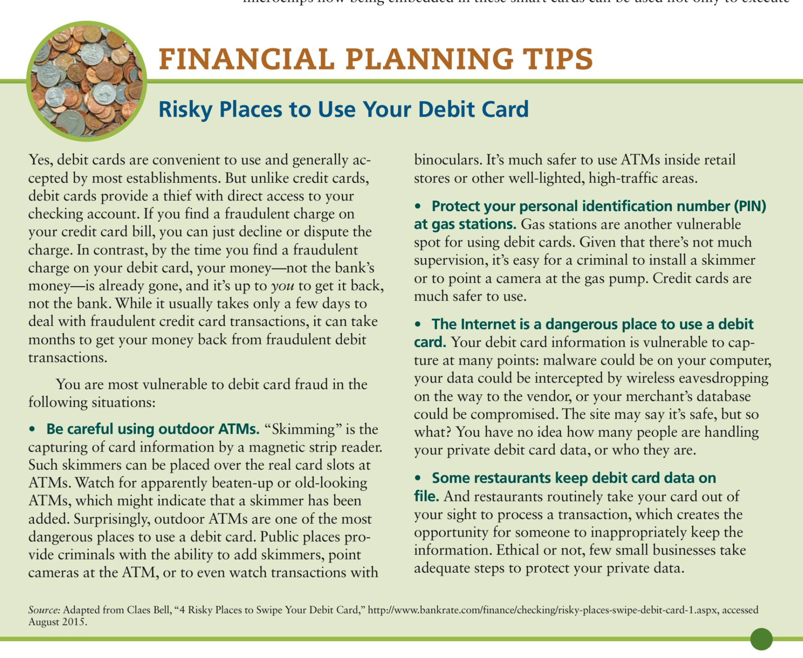

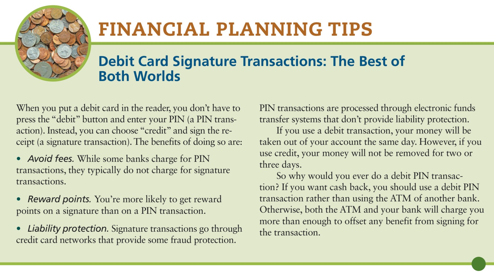

### Prepaid cards

Prepaid physical cards or smartphone apps that effectively provides a way to purchase items.

Pay a fixed amount, and the amount is read from the magnetic strip or chip. 


### Revolving credit lines

> **revolving lines of credit**: a type of open account credit offered by banks and other financial institutions that can be accessed by writing checks against demand deposit or specially designated credit line accounts.

- Normally don't involve the use of credit cards
- Accessed by writing checks on regular checking accounts or specially designated credit line accounts
- Offer more credit, a lot less expensive
- May have tax advantages
- 3 types:
	- Overdraft protection lines
	- Unsecured personal lines of credit
	- Home equity credit lines


#### Overdraft protection

> A line of credit linked to a checking account that allows a depositor to overdraw the account up to a specified amount

- Automatically covers overdrawn checks
- Usually have credit limits of $500 to $1,000
- Taps the line by writing a check
- In some cases the protection is provided by linking the bank's credit card to your checking account
- Best to view it as an _emergency_ source of credit
- Any funds advanced should be repaid as quickly as possible


#### Unsecured personal lines

> A line of credit made available to an individual on an as-needed basis

- Borrow any time you wish without going through the hassle of setting up a new loan
- You apply and are approved for a personal line of credit
- You are issued _checks_ that you can write against
- When you need cash, you write a check and deposit it into your checking account
- You can make checks to a retailer as well
- Range from $2,000 to $25,000+
- Repayment is set up on a monthly installment basis over a period of two to five years
- Prone to overspending (have to manage them well)

#### Home equity credit lines

> A line of credit issued against the existing equity of a home.

- Real estate **appreciates** over time
- Your mortgage balance decreases over time as you pay it
- The difference is the equity you obtain

If you want to tap into this equity without selling your home you can get a **home equity credit line**. They are secured with a **second mortgage on the home**. 

- Allow you to tap into 100% of the equity
- Most lenders set credit lines to 75 or 80% of the market value of the home
- Annual interest rates may be fully deductible for those who itemize up to $100,000 (the amount of the total indebtedness on the house cannot exceed its fair market value)
- One of the _cheapest forms of consumer credit_ (average rate on standard fixed rate credit cards was 13.01%, but home equity credit lines was about 4%)
- Carefully managed because you could lose your home.
- Don't be tempted to use a 15-year home equity credit line to finance, say, a new car that you may be driving for only 5 or 6 years

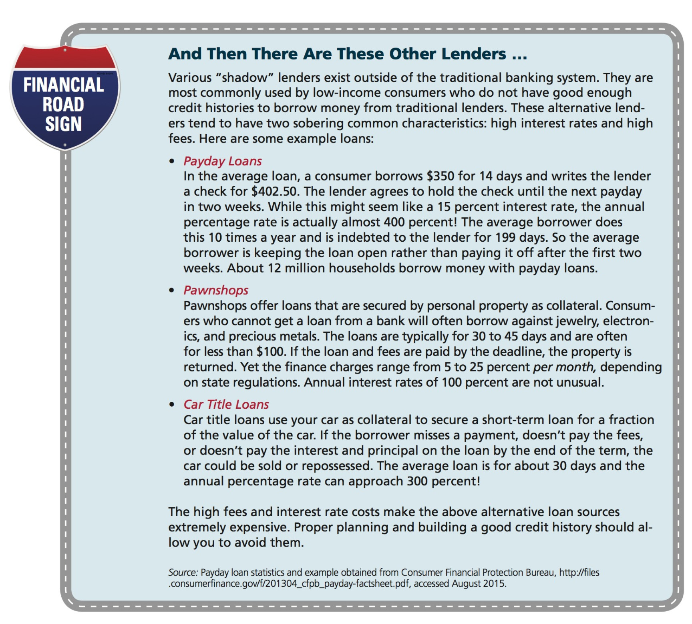


## Application process

```
A whole lot on the process was purposefully left out from this summary.
```

### Credit Bureau

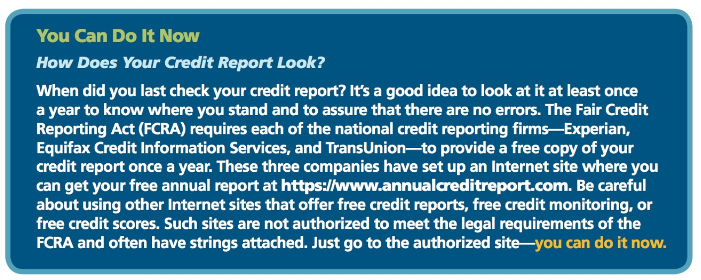


> **credit bureau**: an organization that collects and stores credit information about individual borrowers.


3 major companies:

1. **TransUnion**
1. **Equifax**
1. **Experian**

Things you should know:

- In 2006, they announced that they had developed a new credit-scoring system called *VantageScore*, that would incorporate data from all 3 bureaus.
- There are **several credit scores** that you should know about.
- All Americans are entitled to receive a **free copy** of their credit report once a year
- Credit bureaus do not make decisions on credit extensions / approvals


Information comes from one of three sources:

- creditors who subscribe to the bureau
- other creditors who supply information at your request
- publicly recorded court documents (e.g. tax liens, bankruptcy records)


> Although one late credit card payment probably won't make much of a difference on an otherwise clean credit file a definite pattern of delinquencies (consistently being 30 to 60 days late with your payments) or a personal bankruptcy certainly will.


**Poor credit traits will stick with you for a long time**. Delinquencies remain on your credit file for as long as 7 years and bankruptcies for 10.

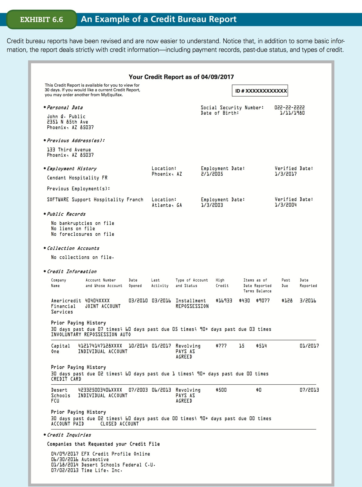


You can check your credit score for free at https://creditkarma.com. They offer a variety of free products that will help you maintain your credit health. The only drawback is that Equifax is not included and that it does not give you a FICO score.


#### FICO scores

Fair Isaac & Co. produces the widely used **FICO scores**. 

- Only uses credit information (no age, marital, salary,etc)
- 5 factors:
	1. payment history (35%)
	1. amount owed (30%)
	1. length of credit history (15%)
	1. new credit (10%)
	1. types of credit used (10%)
- FICO scores are reported by all 3 major credit bureaus
- Range from 300 to 850

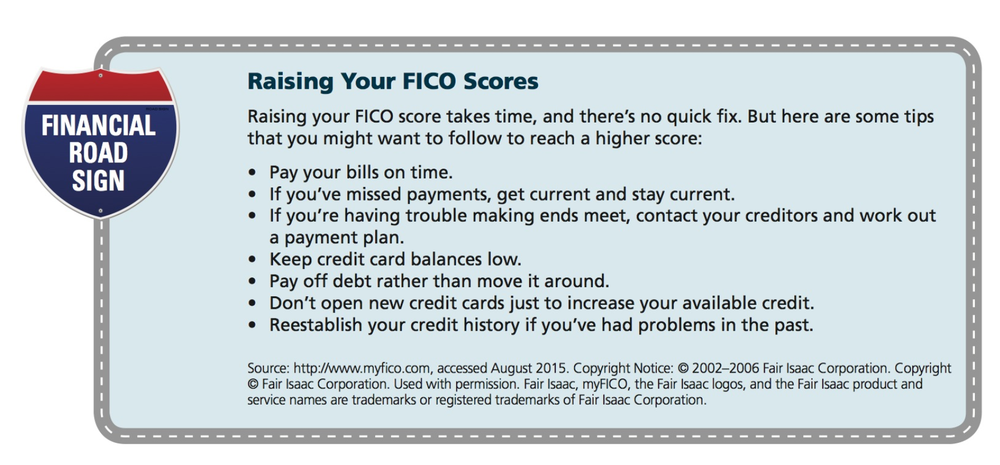

### Computing Finance Charges

> **Annual Percentage Rage (APR)**: the actual or true rate of interest paid over the life of a loan; includes all fees and costs (CAT en Mexico)

Any card issuer is obligated to disclose the APR and the method used to compute finance charges.

The amount of interest you pay for open credit depends partly on the method the lender uses to calculate the balances on which they apply finance charges. Most bank and retail card issuers use one of two varations of the **average daily balance (ADB) method**.

> **Average daily balance (ADB) method**: A method of computing finance charges by applying interest charges to the ADB of the account over the billing period

Two types:

1. **ADB, including new purchases**: For each day in the billing cycle, take the outstanding balance, including new purchases, and subtract payments and credits; then divide by the number of days in the billing cycle
1. **ADB, excluding new purchases**: Same as the first method, but excluding new purchases.


The most common method by far (95%) is the **including new purchases** method.

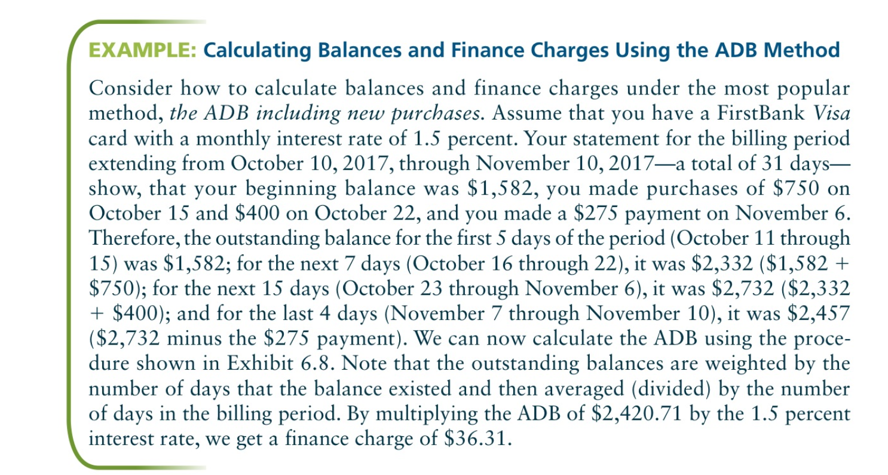


#### Payments

You can and should pay the total balance before the due date. This way you avoid incurring in finance charges.

If you cannot pay for the full balance, you can pay any amount that is >= the **minimum monthly payment** specified on your card statement.

> **minimum monthly payment**: in an open account credit, a minimum specified percentage of the new account balance that must be paid in order to remain current.


Paying the minimum monthly will cause you to incurr in additional finance charges in the following month.

If you do not pay even the minimum monthly balance you are considered to be in default on your account, and the bank issuing the card can take whatever legal action it deems necessary.

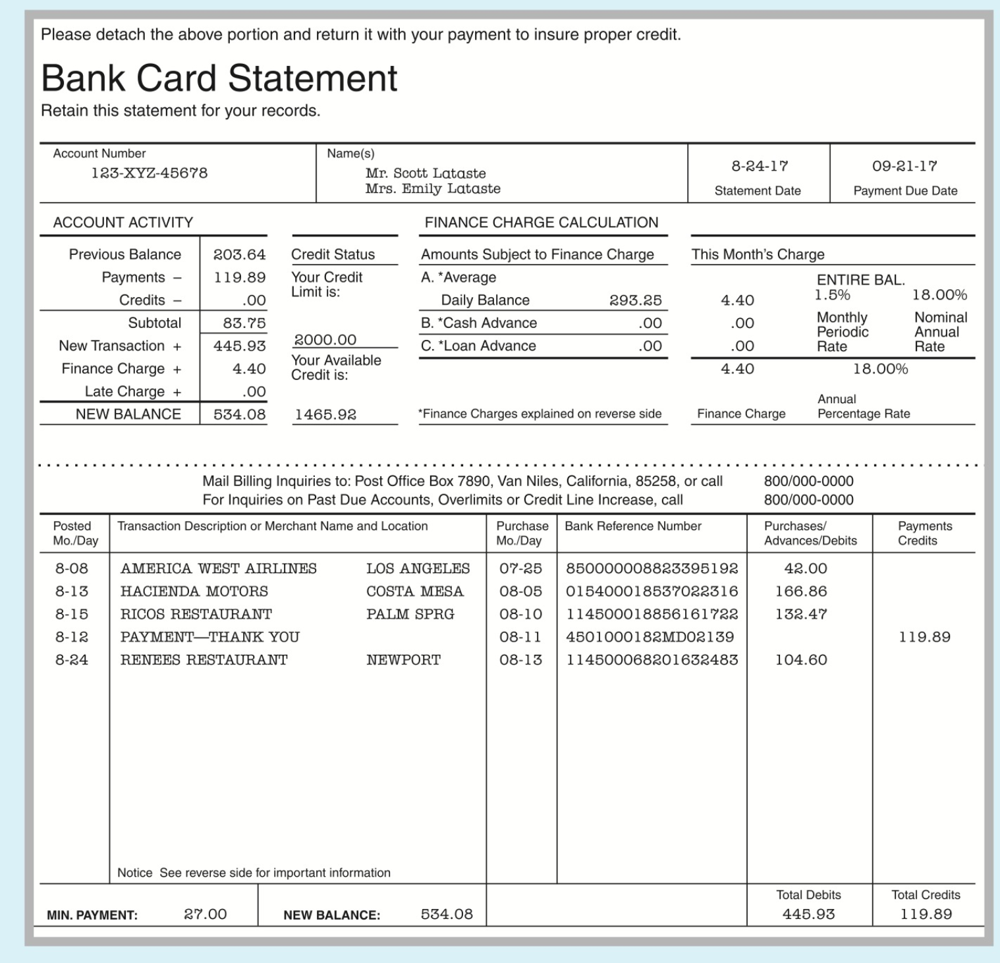


### Things to consider when shopping for a card

- Annual fees
- Rate of interest charged on account balance
- Length of grace period
- Method of calculating balances

- If you normally pay your account balance in full each month, **get a card with no annual fees and a long grace period**. Interest rates are of no consequence since you always pay the full balance
- If you're not a big spender and don't build up big balances on your credit card (below $400/500 USD), then _avoid_ cards with annual fees and get one with as _low_ a rate of interest as possible. (e.g. college students)
- If you _do_ carry big balances (upwards of $1,000), then you'll probably be better off _paying an annual fee_ (even a relatively high one) to keep the rate of interest on the card as low as possible.
- When getting a loan, lenders look at the _total amount_ of credit you have available as well as the outstanding balances on your credit cards. If you have a lot of unused credit capacity, it may be harder to get a loan because lender concerns that you could become overextended.
- **Two cards is the most that financial advisors suggest you carry**

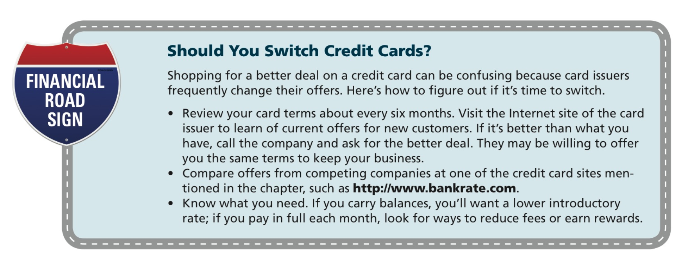


## Safety features

- Never give your account mumber to people or organizations _who call you_. No matter how legitimate it sounds, if you didn't initiate the call then don't give out the information
- If you initiated the call, it's acceptable to give your account number over the phone when ordering or purchasing something
- Don't give your card information over the Internet unless you're dealing with a major retailer
- Don't put your phone number or address (and certainly not your SSN) on credit/charge slips, even if the merchant asks for it - they're _not_ entitled to it
- When using your card to make a purchase, _always keep your card in sight_. If the clerk makes a mistake and wants to make another imprint, ask for the first imprint, and tear it up on the spot.
- Always draw a line on the credit slip through any blank spaces above the total, so the amount can't be altered.
- If you lose a card or it's stolen _report it to the card issuer immediately_. The most you're ever liable for with a lost or stolen card is $50 (per card), but if you report the loss _before_ the card can be used, you won't be liable for any unauthorized carges (the phnoe number to call is listed on the back of your statement)
- Destroy old cards or those that you no longer use.

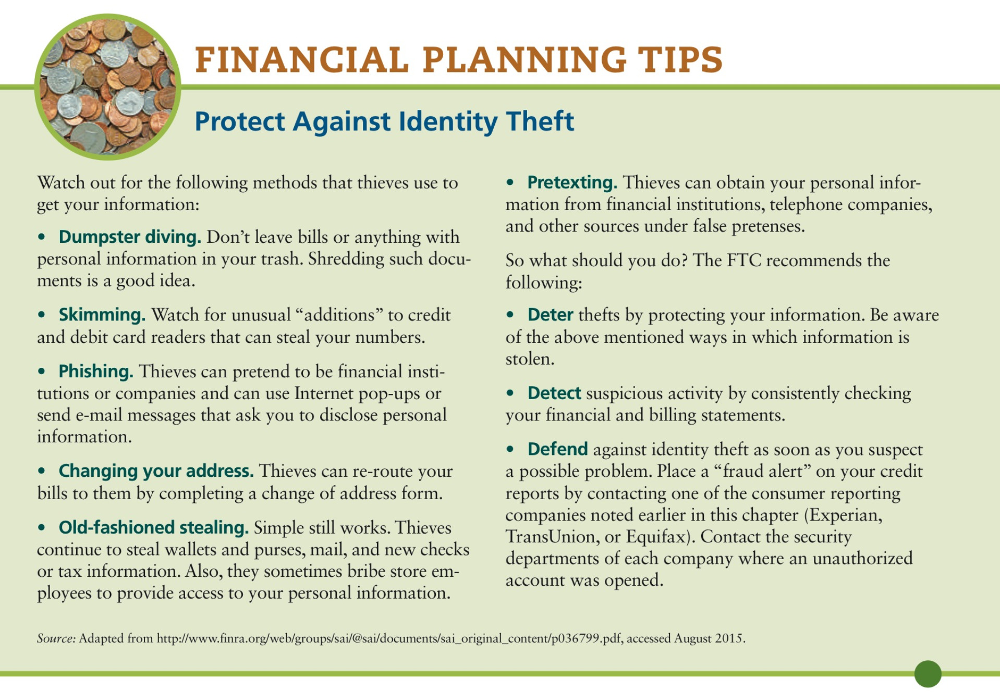


## Bankruptcy

> **personal bankruptcy**: a form of legal recourse open to insolvent debtors, who may petition a court for protection from creditors and arrange for the orderly liquidation and distribution of their assets

> Recession is not the main culprit here; the only way a recession can push you over the edge is if you're already sitting on it! The real culprit is excess debt.

Two of the most widely used legal procedures are

1. Wage Earner Plan
1. Straight bankruptcy

### Wage Earner Plan

- Defined in _Chapter 13_ of the U.S. Bankruptcy Code
- A workout procedure involving some type of debt restructuring by establishing a debt repayment schedule that's more compatible with the person's income.
- Viable alternative for people who have a steady source of income, not more than $1,149,525 in secured debt and $383,175 in unsecured debt and a reasonably good chance of repaying the debt in 3 to 5 years
- A majority of creditors must agree to the plan, and interest charges, along with late-payment penalties are waived for the repayment period
- Most creditors usually go along because they stand to lose more in a straight bankruptcy
- The debtor pays the courts, who pays the creditors in turn
- Throughout the process, the individual retains the use of, and keeps title to, all of his or her assets

### Straight Bankruptcy

- A straight bankruptcy (Chapter 7) "wiping the slate cleanand starting anew"
- 70% of those filing personal bankruptcy choose this route
- Does not eliminate all the debtor's obligations, nor does the debtor necessarily lose all of his or her assets
- Make tax payments and keep up alimony and child-support payments
- Maintains equity in a home, car, and some other personal assets


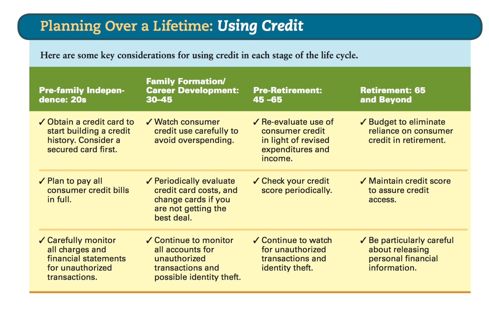


