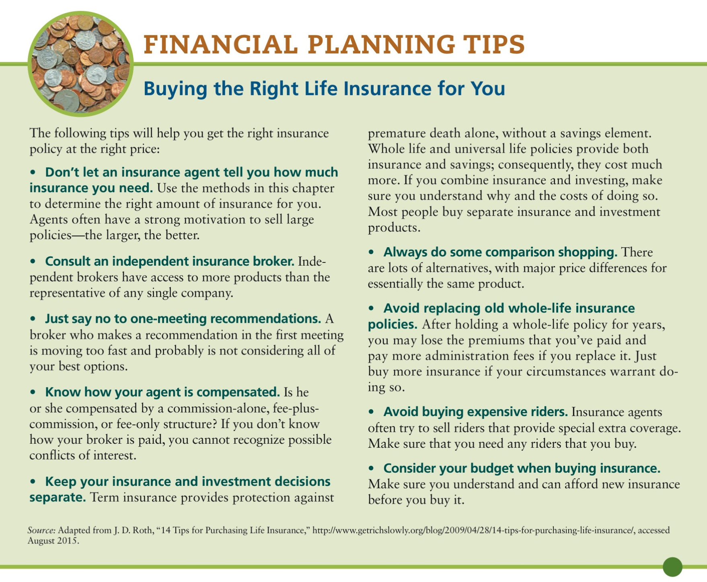

# Chapter 8: Insurance
## Life insurance

<!-- START doctoc generated TOC please keep comment here to allow auto update -->
<!-- DON'T EDIT THIS SECTION, INSTEAD RE-RUN doctoc TO UPDATE -->

- [Insurance](#insurance)
- [Underwriting](#underwriting)
- [Benefits](#benefits)
- [Relevant questions](#relevant-questions)
  - [1. Do you need life insurance?](#1-do-you-need-life-insurance)
  - [2. How much is right for you?](#2-how-much-is-right-for-you)
    - [Multiple-of-earnings](#multiple-of-earnings)
    - [Needs-analysis](#needs-analysis)
      - [Method:](#method)
      - [1. Assessing needs](#1-assessing-needs)
      - [2. Determine what resources will be available](#2-determine-what-resources-will-be-available)
  - [3. What kind of policy is right for you?](#3-what-kind-of-policy-is-right-for-you)
    - [Term life](#term-life)
      - [Straight term](#straight-term)
      - [Decreasing term](#decreasing-term)
    - [Whole Life](#whole-life)
      - [Continuous premium (straight life)](#continuous-premium-straight-life)
      - [Limited payment](#limited-payment)
      - [Single premium (SPLI)](#single-premium-spli)
    - [Universal Life](#universal-life)
        - [Variable Life Insurance](#variable-life-insurance)
        - [Group Life Insurance](#group-life-insurance)
- [Buying life insurance](#buying-life-insurance)
  - [Compare costs and features](#compare-costs-and-features)
  - [Selecting a company](#selecting-a-company)
  - [Choosing an agent](#choosing-an-agent)
- [Medical exam tips](#medical-exam-tips)
- [Key features of life insurance policies](#key-features-of-life-insurance-policies)
  - [Beneficiary clause](#beneficiary-clause)
  - [Settlement options](#settlement-options)
  - [Policy loans](#policy-loans)
  - [Premium payments](#premium-payments)
  - [Grace period](#grace-period)
  - [Nonforfeiture options](#nonforfeiture-options)
  - [Policy reinstatement](#policy-reinstatement)
  - [Change of policy](#change-of-policy)
  - [Other features](#other-features)
    - [Multiple indemnity clause](#multiple-indemnity-clause)
    - [Disability clause](#disability-clause)
    - [Guaranteed purchase option](#guaranteed-purchase-option)
    - [Suicide clause](#suicide-clause)
    - [Exclusions](#exclusions)
    - [Living benefits](#living-benefits)
    - [Viatical settlement](#viatical-settlement)
- [Understanding Life Insurance Policy Illustrations](#understanding-life-insurance-policy-illustrations)
- [Tips](#tips)

<!-- END doctoc generated TOC please keep comment here to allow auto update -->

---

- Its primary purpose is to protect your dependents from financial loss in the event of your untimely death.
- Life insurance protects your family from the potentially catastrophic financial damage caused by the premature death of the major breadwinner

## Insurance

> **insurance policy**: is a contract between you (the insured) and an insurance company (the insurer) under which the insurance company agrees to reimburse you for the losses you suffer according to specified terms

- Effectively transfer your risk of loss to the insurance company
- Pay a relatively small _certain_ amount (the insurance premium) in exchange for the insurance company's promise that they will reimburse you if you suffer an _uncertain_ loss covered by the insurance policy.
- Insurance companies effectively spread out risk among their clients so as to mitigate a single event

## Underwriting

> Underwriting: the process used by insurers to decide who can be insured and to determine applicable rates that will be charged for premiums

Companies want to avoid _adverse selection_ which happens when only high-risk clients apply for and get insurance coverage.

Underwriting tries to determine the risk potential of individuals (the likelihood that the individual will die while the policy is in effect).

Factors include

- longevity for various age groups
- medical history (e.g. heart disease)
- habits and conditions (smoking, obesity, diabetes)
- dangerous jobs or hobbies
- driving under the influence (or driver's license supension)

## Benefits

1. **Financial protection for dependents**
	- e.g. paying off mortgages, setting aside funds for college etc.
2. Protection from creditors
	- Death benefits are paid directly to a named beneficiary instead of being considered as part of your estate. This means that  even if you have outstanding bills and debts at the time of your death, creditors cannot claim the cash benefits from your life insurance policy, which provides further financial protection for your dependents.
3. Tax benefits
	- Proceeds are not generally subject to income tax deductions (state _or_ federal) and some can be configured so as not to be subject to [_estate_ taxes](https://www.investopedia.com/terms/e/estatetax.asp).
	- En México también están exentos sin importar quiénes sean los beneficiarios
4. **Savings vehicle**: Some life insurance can be used as investment instruments

## Relevant questions

1. Do you need life insurance?
2. If so, how much do you need?
3. Which type of life insurance is best, given your financial objectives?
4. What factors should you consider in making the final purchase decision?

### 1. Do you need life insurance?

The main purpose is to **protect your dependents**. Therefore, if you don't have dependents, you probably don't need life insurance (this includes single adults and children, for example).

How much life insurance you need is a function of how many **dependents** you have and how many **assets** you want to protect.

Reevaluate your life insurance needs whenever these factors change (e.g. marriage/divorce, kids, more assets).

### 2. How much is right for you?

There are two methods used to determine this:

1. **Multiple-of-earnings method**
2. **Needs-analysis method**

#### Multiple-of-earnings

Take your gross annual earnings and multiply it by an arbitrary number (usually **5 to 10 times** your current income). You should only use this to _approximate_ life insurance needs.

This method fails to take into account the financial obligations and resources of the individual and his or her family.

#### Needs-analysis

Considers

1. financial obligations
2. financial resources of the insured and his/her dependents.

##### Method:

1. Estimate the total economic resources needed if the individual were to die
2. Determine all financial resources that would be available after death, including existing life insurance and pension plan death benefits
3. Subtract available resources to the amount needed

##### 1. Assessing needs

> What financial resources will my survivors need should I die tomorrow?

When answering this, consider:

1. **Income needed to maintain an adequate lifestyle**:
	- _How much money would your dependents need each month to live comfortably?_
	- Estimate by looking at current monthly budget (expenses for housing, utilities, medical, food, property, taxes, insurance, travel & leisure, savings)
	- Consider these expenses change over time (e.g. when children leave the house)
2. **Extra expenses if the primary producer dies**:
	- Funeral costs
	- Expenses that might be incurred to replace services that you currently provide (cleaning, cooking etc)
3. **Special needs of dependents**:
	- Emergency funds, college education fund, nursing care, etc.
4. **Debit liquidation**:
	- Calculate average amount of outstanding bills (credit cards, department stores, home mortgage)
5. **Liquidity**:
	- Your dependents need liquid assets (i.e. cash) while  your illiquid assets are sold

##### 2. Determine what resources will be available

- Savings
- Investments
- Social security survivor benefits
- Accumulated pension plans
- Profit-sharing programs
- Income that can be earned by surviving spouse or children

Make a reasonable estimate of their value.

Once you have calculated the needs and resources, you can substract these values and **this equals the life insurance needed**.

## 3. What kind of policy is right for you?

3 kinds account for most types of life insurance:

1. **Term life**
1. **Whole life**
1. **Universal life**

### Term life

- A specified amount for a set period. (5 years, 10 years, 30 years).
- Depending on the policy, premiums can be paid semi-anually, anually or quarterly
- Low cost, affordable way to buy large insurance protection over a given, relatively short period (good for young people)
- Offers only temporary coverage. Many term life policies overcome this by offering a **renewability provision**, which gives you the option to renew your policy at the end of the term without having to show evidence of insurability. This allows you to renew the policy even if you have become uninsurable because of accident or illness during the original policy period.
- Another option is a **convertibility provision**. Lets you convert your term insurance policy into a comparable whole life policy at a future time. Useful if you need a large amount of relatively low-cost, short-term protection immediately, but in the future, you expect to have greater income that will allow you to purchase permanent insurance.

Further divided:

1. **Straight term** 
1. **Decreasing term**

#### Straight term

- Written for a set period during which time the insurance coverage remains unchanged.
- **Annual premiums** may increase (annual renewable term policies) or remain level (level premium term policies)
- Level term are more popular

#### Decreasing term

- Maintain a _level premium_ throughout all periods of coverage while the _amount of protection decreases_
- Example: homeowners who want a level of life insurance coverage that will decline at about the same rate as the balances on their home mortgages, policies for young children (as they age the amount of coverage needed decreases until they become of age and the need expires)

| | |
| ----- | ----------- |
| **Advantages** | Cost (cheap). Good for covering needs that will disappear over time |
| **Disadvantages** | Offers only _temporary_ coverage. Once the term expires, you must renew the policy. This can be a problem if you develop underwriting conditions during that period that make it difficult to qualify for insurance |
| **Who should buy it** | Young families on limited budgets should buy guaranteed **renewable** and **convertible** term life policies |

### Whole Life

- Provides permanent insurance.
- Generally has savings features (**cash value**)
	- return rates are normally _fixed_ and _guaranteed_ to be higher than a certain rate (typically 4 to 6%)
- The face value of the policy is paid on death; alternatively the insured can borrow against it or withdraw cash value when the need for insurance protection has expired
- 3 major types exist:
	- **Continuous premium** (straight life)
	- **Limited payment**
	- **Single premium**

> **cash value**: The accumulated refundable value of an insurance policy; results from the investment earnings on paid-in insurance premiums

#### Continuous premium (straight life)

- Level premium each year until they die (or exercise a nonforfeiture right)
- The earlier in life the coverage is purchased, the lower the annual premium
- Insurance sellers will try to convince young people using this argument (but of course, the less you pay anually, you pay it longer, therefore you pay total more)
- Good reasons exist for young people to buy insurance, but paying less annually should not be the only one
- Offers the greatest amount of death protection and the least amount of savings per premium dollar
- Probably the **wisest choice to fill a permanent life insurance need**

#### Limited payment

- Covered for your entire life
- Premium is paid for a **specified period**
- On completion of payment periods, the insurance remains in force, for the rest of the insured's life
- If life insurance is what you want, probably better off buying continuous premium

#### Single premium (SPLI)

- One cash premium payment at the inception of the contract (buying life insurance coverage for the rest of your life)
- Interest/investment earnings on the policy are tax deferred (useful investment vehicle)
- Any widthdrawals or loans taken against the SPLI cash value before age 59 1/2 are not only taxed at capital gains, but are also subject to a 10 percent penalty for early withdrawal

| | |
| ----- | ----------- |
| **Advantages** | Premium payment contribute toward building an estate, regardless of how long the insured lives. Favorable tax treatments are given to accumulated earnings. |
| **Disadvantages** | Cost. Less death protection per premium dollar than term. Investment features provide lower yield than otherwise comparable investment options. |
| **Who should buy it** | Increased risk of health problems (disqualifiers). |

**Buy directly from the insurer (avoid agents).**

### Universal Life

- Combines term insurance (death benefits a.k.a. pure insurance) with cash value (tax-sheltered savings/investment account that pays interest)
- Pure insurance and savings are unbundled (specified separately in the premium)
- Premium payment is used to pay for administrative costs.
	- **The remainder** is put into cash-value portion of the policy, where it generates return
	- Each month the cost of 1 month's term insurance is drawn from the cash value to purchase death protection
	- If cash value grows large, death protection must increase to retain tax benefits (tax laws require that death benefits in universal life policies _always exceed the cash value_ by a stipulated amount)

| | |
| ----- | ----------- |
| **Advantages** | **Flexibility**. Annual premium can be increased or decreased from year to year, because the cost of the death protection may be covered from either the annual premium or the accumulation account (i.e. the cash value). The death benefit can also be increased or decreased.  This flexibility allows you to adapt the death benefit to your life-cycle needs—for example, increasing the death benefit when you have another child and decreasing it when your children are grown. **Savings feature**. |
| **Disadvantages** | **Charges and fees**. Heavy fees. Changing premiums and protection levels |
| **Who should buy it** | Looking for a greater ROI. People anticipating changes in death protection. |

##### Variable Life Insurance

> **variable life insurance**: life insurance in which the benefits are a function of the returns being generated on the investments selected by the policyholder.

The policyholder decides how to invest the money in the savings (cash-value) component. Most firms that offer variable life policies let you choose from a full menu of different funds, ranging from money market accounts and bond funds to international investments or aggresively managed stock funds.

- Unlike whole or universal life, variable life insurance _does not guarantee a minimum return_.
- The amount of insurance coverage provided varies with the profits generated in the investment account.
- More of an investment vehicle than a life insurance policy.

##### Group Life Insurance

- One master policy is issued and each elegible member of the group receives a certificate of insurance
- Nearly always term insurance
- Employers often provide this as a fringe benefit to employees
- Accounts for about 1/3 of US insurance (fastest growing)
- Group life policies also normally include dependents
- Members who leave the group can convert to whole life individually issued policies if leaving within a specified period
- Should be used for low-priority insurance needs (very low payout)

## Buying life insurance

- compare costs and features
- select a financially healthy insurance company
- choose a good agent

### Compare costs and features

- Look at current rates
- Find out how long they will stay locked in
- Find out max you can be charged when you renew
- Establish _how long_ you will need the coverage and then find the best rates **for the total period**
- Get the features you need (e.g. convertibility)
- Be sure that the policies you are comparing have similar provisions and amounts
- **First decide how much and what kind of policy you want, _and then compare_**

Sites to check out:

- efinancial.com
- selectquote.com
- insure.com
- matrixdirect.com

Don't overlook companies that sell directly to the public or offer low-load policies such as Ameritas, Lincoln Benefit.

### Selecting a company

- Besides looking for reasonably priced products, attractive features, and good customer service, it's vital to consider **financial health of any insurance firm**
- Age & size are useful indicators (> 25 years, annual premium > $100M)
- Financial history, reputation, comissions and other fees
- Company's investment performance and dividend history (for cash value)

Private rating agencies can help with this:

- A.M. Best
- Fitch
- Moody's
- Standard & Poor's

These firms evaluate the company's _claims paying ability_ and give them a rating (available at most public libraries and insurance agents).

### Choosing an agent

- Don't assume that because agents are licensed, they are competent and will serve your best interests.
- Consider the agent's formal and professional level of educational attainment. (Does the agent have a college degree with a major in business or insurance?)
- Does the agent have a professional designation such as Chartered Life Underwriter (CLU), Chartered Financial Consultant (ChFC), or Certified Financial Planner (CFP)?
- Does the agent use fancy buzzwords and generic answers, or does she really listen attentively and, after some thought, logically answer your questions?
- Try to obtain recommendations from other professionals (bankers in trust departments, attorneys, accountants who are specialists in estate planning)

## Medical exam tips

- Know what to expect
	- Height, weight, blood pressure, pulse rate, and blood and urine samples
- Drink water before the exam
- Fast before the exam (4 to 8 hours)
- Don't do a rigorous workout for at least 12 hours prior to the exam
- Avoid alcohol for at least 12 hours before the exam
- Avoid caffeine and nicotine for at least a couple of hours prior to the exam
- Bring a list of your medications
- Get to bed early the night before the exam

## Key features of life insurance policies

- Insurance policies are not standardized

Key features include:

- beneficiary clause
- settlement options
- policy loans
- premium payments
- grace period
- nonforfeiture options
- policy reinstatement
- change of policy

### Beneficiary clause

> **beneficiary**: the person who receives the death benefits of a life insurance policy after the insured's death

- All life insurance policies should have one or more beneficiaries.
- The insured is able to name both a primary beneficiary and various _contingent beneficiaries_
- If the primary beneficiary does not survive the insured, the benefit is distributed among the contingent beneficiaries
- If neither the primary beneficiary nor the contingent beneficiaries survive the insured, the benefits pass to the estate of the insured and distributed by the probate court (according to the will or to state law)
- The person you name as a beneficiary can be changed at any time as long as you didn't indicate an **irrevocable beneficiary** when you took out the policy

### Settlement options

Several ways of paying life insurance policy death proceeds. This can be permanently established by the policyholder before death or left up to the beneficiary when the policy proceeds are paid out.

1. **Lump sum**: Most common (95+% of policyholders). The entire death benefit is paid in a single amount.
1. **Interest only**: The insurance company keeps policy proceeds for a specified time; the beneficiary receives interest payments, usually at some guaranteed rate. This option can be useful when there's no current need for the principal. For example, proceeds could be left on deposit until children go to college, with interest supplementing the family income. Typically, however, interest rates paid by insurers are lower than those available with other savings vehicles.
1. **Fixed period**: The face amount of the policy, along with interest earned, is paid to the beneficiary over a fixed time period. For example, a 55-year-old beneficiary may need additional income until Social Security benefits start.
1. **Fixed amount**: The beneficiary receives policy proceeds in regular payments of a fixed amount until the proceeds run out.
1. **Life income**: The insurer guarantees to pay the beneficiary a certain payment for the rest of his or her life, based on the beneficiary's sex, age when benefits start, life expectancy, policy face value, and interest rate assumptions. This option appeals to beneficiaries who don't want to outlive the income from policy proceeds and so become dependent on others for support. An interesting variation of this settlement option is the _life-income-with-period-certain option_, whereby the company guarantees a specified number of payments that would pass to a second beneficiary if the original beneficiary dies before the period ends.

### Policy loans

An advanced made by a life insurance company to a policyholder against a whole life policy.

- The loan is secured by the cash value of the life insurance policy.
- Although the loans do not have to be repaid, any balance plus interest on the loan remaining at the insured death is substracted from the proceeds of the policy
- Fixed rate or market-variable rate
- _Be careful with these loans; unless certain conditions are met, the IRS may treat them as withdrawals, meaning they could be subject to tax penalties_.

### Premium payments

- Must specify when the premiums are due
- Most insurers allow the policyholders to choose whether to pay annually, semiannuallyl, quarterly, or monthly.
- In most cases, insurance companies charge a fee if you decide to pay more often than annually.

### Grace period

The _grace period_ permits the policholder to retain the full death protection for a short period (usually 31 days) after missing a premium payment date.

### Nonforfeiture options

A _nonforfeiture option_ gives a cash value life insurance policyholder some benefits even when a policy is terminated before its maturity.

### Policy reinstatement

_Reinstatement_ revives the original contractual relationship between the company and the policholder. Most often, the policyholder must reinstate the policy within a specified period (3 to 5 years) after the policy has lapsed. 

Before reinstating a policy, a policyholder should determine whether buying a new policy might be less costly.

### Change of policy

Many life insurance contracts contain a provision that permits the insured to switch from one policy form to another.

### Other features

#### Multiple indemnity clause

Multiple indemnity clauses increase the face amount of the policy (double or triple), if the insured dies in an accident. The benefit is often offered to the policyholder at a small additional cost.

Do not contemplate this when determining insurance needs. It offers no protection if the insured's death is due to illness.

#### Disability clause

A disability clause may contain a waiver-of-premium benefit alone or coupled with disability income.

- Waiver-of-premium benefit: excuses the payment of premiums on the life insurance policy if the insured becomes totally and permanently disabled prior to age 60 (sometimes age 65).
- Disability income: the insured receives a monthly income equal to $5 or $10 per $1,000 of the policy face value. Some insurers will continue these payments for the life of the insured; others terminate them at age 65. 
- Fairly inexpensive and can be added to most whole life policies but generally not to term policies

#### Guaranteed purchase option

Can purchase additional coverage at stipulated intervals without providing evidence of insurability. This option is frequently offered to buyers of a whole life policy who are under age 40. 

Increases in coverage can usually be purchased every 3, 4 or 5 years in sums equal to the amount of the original policy or $10,000, whichever is lower.

#### Suicide clause

Nearly all life insurance policies have a _suicide clause_ that voids the contract if an insured commits suicide within a certain period, normally two years after the policy's inception.

In these cases, the company simply returns the premiums that have been paid. If an insured commits suicide after this initial period has elapsed, the policy proceeds are paid regardless.

#### Exclusions

Life policies are very broad. The only common exceptions are aviation, war, and hazardous occupation or hobby. Companies can rarely change coverage offered or premium charged if the insured decides to take up hazardous occupations _after_ a policy is issued.

#### Living benefits

_Accelerated benefits_. Allows the insured to receive a percentage of the death benefit from a whole or universal life policy prior to death. Some insurers offer this option at no charge to established policyholders if the insured suffers a terminal illness that is expected to result in death within a specified period (such as six months to a year) or needs an expensive treatment (such as an organ transplant) to survive.

#### Viatical settlement

This option allows a terminally ill insurance holder to receive a percentage of the insurance policy's death benefit for immediate use. This is usually done through an investor.

Approach viatical settlements carefully, because they mean giving up all future claims on the life insurance policy and can also affect a patient's Medicare eligibility in some cases. Note also that some viatical settlement companies - the firms that arrange the transfer between insured and investors - have been scrutinized by government agencies for unethical practices.

## Understanding Life Insurance Policy Illustrations

> **Life insurance policy illustration**: a hypothetical representation of a policy's performance that reflects the most important assumptions that the company relies on when presenting the policy results to a prospective client

Typically consists of two main parts:

- **Guaranteed illustration**: The insurance company is required by law to disclose the worst-case scenario, which shows the effects of the insurer crediting the minimum interest and charging the maximum amount based on standard mortality tables. It's safe to assume that the benefits, cash surrender value, and accumlated values will never be lower than what this scenario presents
- **Current illustration**: This is the insurance company's representation of policy performance based on the credit rates and mortality charges _currently_ in effect.

Focus first on the basic assumptions that the company used to compute it, including your age, sex, and underwriting health status. The illustration will indicate the premiums, cash surrender value, and death benefits. Double-check all the information. Ask the insurance agent to provide an _inforce reprojection_ that shows any changes in credits or charges that the insurance company has declared for the next policy year. Most agents will not provide this unless you ask them. Watch for any unanticipated premium increases.

Check to make sure that all the following sections are present in the narrative summary of the illustration and that no pages are missing:

- **Policy description, terms, and features**: Overviews the main components of the policy. Double-check that the policy's premiums and benefits projections match your needs.
- **Underwriting discussion**: This provides a detailed description of the policy's benefits, premiums, and tax information.
- **Column definitions and key terms**: This defines the terms used in the illustration. Make sure that you understand all the definitions and terms.
- **Disclaimer**: This section informs the prospective client that the illustration's portrayal of future values could vary from actual results
- **Signature page**: This section provides a numerical summary of the illustration in 5- and 10-year increments. The insurance agent's signature here acknowledges that he or she has explained that the nonguaranteed elements are subject to change, and your signature acknowledges that you understand this.

## Tips

1. Don't let an insurance agent tell you how much insurance you need
1. Consult an independent insurance broker
1. Say no to one-meeting recommendations: <small>A broker who recommends something in the first meeting is probably moving too fast</small>
1. Know how your agent is compensated
	- comission-alone, fee-plus-comission, fee-only structures
1. Keep your insurance and investment decisions separate
1. Always do some comparison shopping
1. Avoid replacing old whole-life insurance policies
1. Consider your budget when buying insurance
1. Revise and update life insurance every 5 years and after important life events

