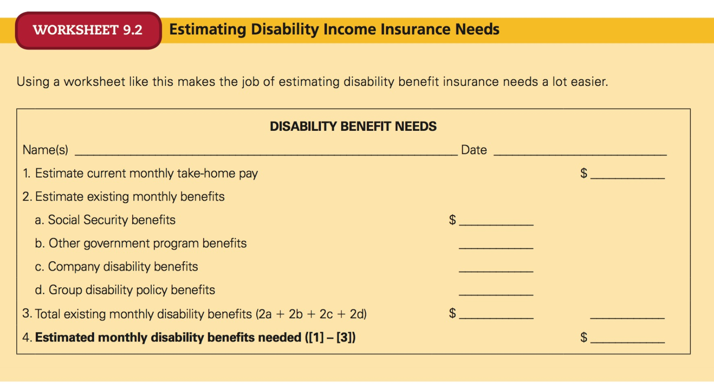

# Chapter 9
## Insuring your Health

<!-- START doctoc generated TOC please keep comment here to allow auto update -->
<!-- DON'T EDIT THIS SECTION, INSTEAD RE-RUN doctoc TO UPDATE -->
**Table of Contents**

- [Private Health Insurance Plans](#private-health-insurance-plans)
	- [Traditional Indemnity (Fee-for-Service) Plans](#traditional-indemnity-fee-for-service-plans)
	- [Managed Care Plans](#managed-care-plans)
		- [Health Maintenance Organizations (HMOs)](#health-maintenance-organizations-hmos)
		- [Preferred Provider Organizations (PPOs)](#preferred-provider-organizations-ppos)
		- [Other managed care plans](#other-managed-care-plans)
	- [Blue Cross/ Blue Shield Plans](#blue-cross-blue-shield-plans)
- [Government Health Insurance Plans](#government-health-insurance-plans)
	- [Medicare](#medicare)
		- [Basic hospital insurance (Part A)](#basic-hospital-insurance-part-a)
		- [Supplementary medical insurance (SMI) (Part B)](#supplementary-medical-insurance-smi-part-b)
		- [Medicare Advantage Plans (Part C)](#medicare-advantage-plans-part-c)
		- [Prescription drug goverage (Part D)](#prescription-drug-goverage-part-d)
	- [Medicaid](#medicaid)
	- [Worker's compensation insurance](#workers-compensation-insurance)
- [Affordable Care Act (ACA) (Obamacare)](#affordable-care-act-aca-obamacare)
	- [Insurance Exchanges](#insurance-exchanges)
- [Health insurance decisions](#health-insurance-decisions)
	- [Health care cost risk](#health-care-cost-risk)
	- [Determine available coverage and resources](#determine-available-coverage-and-resources)
		- [Health reimbursement account (HRA)](#health-reimbursement-account-hra)
		- [Health savings account (HSA)](#health-savings-account-hsa)
		- [COBRA](#cobra)
		- [Retiree coverage](#retiree-coverage)
	- [Choose a health insurance plan](#choose-a-health-insurance-plan)
- [Medical expense coverage and policy provisions](#medical-expense-coverage-and-policy-provisions)
	- [Types of medical expense coverage](#types-of-medical-expense-coverage)
		- [Hospitalization](#hospitalization)
		- [Surgical expenses](#surgical-expenses)
		- [Physician expenses](#physician-expenses)
		- [Major medical insurance](#major-medical-insurance)
		- [Comprehensive major medical insurance](#comprehensive-major-medical-insurance)
		- [Dental services](#dental-services)
		- [Limited protection policies](#limited-protection-policies)
	- [Policy provisions](#policy-provisions)
		- [Terms of payment](#terms-of-payment)
			- [Deductibles](#deductibles)
			- [Participation (co-insurance)](#participation-co-insurance)
			- [Internal limits](#internal-limits)
			- [Coordination of benefits](#coordination-of-benefits)
		- [Terms of coverage](#terms-of-coverage)
			- [Persons and places covered](#persons-and-places-covered)
			- [Cancellation](#cancellation)
			- [Pre-existing conditions](#pre-existing-conditions)
			- [Pregnancy and abortion](#pregnancy-and-abortion)
			- [Mental illness](#mental-illness)
			- [Rehabilitation coverage](#rehabilitation-coverage)
	- [Cost containment provisions for medical expense plans](#cost-containment-provisions-for-medical-expense-plans)
- [Long-term-care insurance](#long-term-care-insurance)
- [Disability income insurance](#disability-income-insurance)
	- [Estimating disability insurance needs](#estimating-disability-insurance-needs)
	- [Disability income insurance provisions and costs](#disability-income-insurance-provisions-and-costs)
		- [Definition of disability](#definition-of-disability)
		- [Benefit amount and duration](#benefit-amount-and-duration)
		- [Probationary period](#probationary-period)
		- [Waiting period](#waiting-period)
		- [Renewability](#renewability)
		- [Other provisions](#other-provisions)

<!-- END doctoc generated TOC please keep comment here to allow auto update -->

---

> **insurance premium:** amount of money an individual or business pays for an insurance policy (costo anual)

Health insurance:

1. Private
	- 1.1 Traditional indemnity (fee-for-service)
	- 1.2 Managed care plans
		- HMOs
		- PPOs
		- EPOs
		- POS plans
2. Public

## Private Health Insurance Plans

> **Group health insurance**: health insurance consisting of contracts written between a group (employer, union, etc) and the health care provider.

> Employers are also shifting a larger percentage of the cost to employees. As a result, you may want to compare group and individual policies before deciding which coverage to buy.

Most private health insurance plans fall into one of two categories:

- **traditional indemnity (fee-for-service) plans**
- **managed care plans**

### Traditional Indemnity (Fee-for-Service) Plans

> indemnity (fee-for-service) plan: the health care provider is separate from the insurer, who pays the provider or reimburses you for a specified percentage of expenses after a deductible amount has been met.

- Insurer **pays the health care provider** or **reimburses** you
- Typicially pays 80% (you cover the rest)
- You have to pay a deductible ($100 - $2,000)
- The lower the deductible, the higher the premium
- Have to submit a claim for reimbursements

The amount the insurance company pays is commonly based on the usual, customary, and reasonalbe (UCR) charges - what the insurer considers to be the prevailing fees within your area, not what your doctor or hospital actually charges.

If your doctor charges more than the UCR charges, you may be responsible for the excess. UCR charges vary significantly among insurers, so you should compare your doctor's fees with what a plan pays. Many carriers offer indemnity plans wherein physicians who accept the insurance agree to accept the UCR payments set by the insurer. **There are few indemnity plans left in the US**.

### Managed Care Plans

> **managed care plans**: subscribers/users contract with the provider organization which uses a designated group of providers meeting specific selection standards to furnish health care services for a monthly fee.

- Managed care plans **don't pay deductibles**, but pay a small **copayment** fee for office visits and medications.
- Most medical services - including preventive and routine care that indemnity plans may not cover - are fully covered when obtained from plan providers.

Several types:

1. **Health Maintenance Organizations (HMOs)**
2. **Preferred Provider Organizations (PPOs)**
3. **Exclusive Provider Organizations (EPOS)**
4. **Point-of-Service Plans (POS)**

#### Health Maintenance Organizations (HMOs)

> **health maintenance organizations**: an organization of hospitals, physicians, and other health care providers that have joined to provide comprehensive health care services to its members, who pay a monthly fee.

- Pay a monthly fee
- Co-payment typically $5 to $50 USD each time that you use services or fill a prescription
- Services include:
	- doctor's visits
	- imaging and laboratory services
	- preventive care
	- health screenings
	- hospital inpatient care and surgery
	- maternity care
	- mental health care
	- drug prescriptions
- Advantages:
	- no deductibles
	- few or no exclusions
	- not having to file insurance claims
- Used to be assigned a **primary care physician (PCP)** but less common now, you can choose your own
- Some services require a referral from your PCP (specialists)

Two main types:

- **Group HMO**: employs a group of doctors to provide health care services _from a central facility_. Members obtain health care services from the doctors and other personnel who practice there. Most prevalent in larger cities
- **Individual practice association (IPA)**: Most popular type. IPA members receive medical care from indiviual physicians practicing _from their own offices and from community hospitals_ that are affilitated with the IPA. You get some choice.

#### Preferred Provider Organizations (PPOs)

> **preferred provider organization**: a health provider that combines the characteristics of the IPA form of HMO with an indemnity plan to provide comprehensive health care services to its subscribers within a network of physicians and hospitals

- An insurance company or provider contracts with a network of physicians and hospitals that agree to accept the negotiated fee for medical services
- Unlike HMO, a PPO also provides insurance coverage **outside the PPO network**
- You pay a higher price for medical services provided by out-of-network doctors and hospitals

#### Other managed care plans

- **Exclusive provider organization (EPOs)**: contracts with medical providres to offer services to member at reduced costs, bu tit reimburses members only when affiliated providers are used
- **Point-of-service (POS) plan**: hybrid form of HMO that allows members to go outside of the HMO network for care. 

### Blue Cross/ Blue Shield Plans

> **Blue Cross/Blue Shield**: prepaid hospital and medical expense plans under which health care services are provided to plan participants by member hospitals and physicians

A prepaid hospital and medical expense plans. 

## Government Health Insurance Plans

### Medicare

> **Medicare**: a health insurance plan administered by the federal government to help persons age 65 and over, and others receiving monthly Social Security disability benefits, to meet their helath care costs.

- Designed to help persons 65 and over
- Also covers many people udner 65 who receive monthly Social Security disability benefits
- Funds are paid by taxes
- Traditionally provides two primary components:
	- Basic hospital insurance
	- Supplementary medical insurance as well as prescription drug coverage

#### Basic hospital insurance (Part A)

- Provides inpatient hospital services (room, board, etc) for the first 90 days of illness.
- A deductible is applied during the first 60 days of illness.
- Co-insurance provisions, applicable to days 61-90 of the hospital stay, can further reduce benefits.
- Up to 100 days of post-hospital extended-care faciliites (e.g. nursing homes)

#### Supplementary medical insurance (SMI) (Part B)

- Covers physicians and surgeons in addition to the costs of medical and health services such as imaging, laboratory tests, prosthetic devices, rental of medical equipment, and ambulance transportation.
- Also covers some home health services and limited psychiatric care

SMI is a **voluntary program** for which participants pay premiums, which are then matched with government funds.

Anyone 65 and over can enroll in SMI.

#### Medicare Advantage Plans (Part C)

- Provide Medicare benefits to eligible people, but they differ in that they are administered by private providers rather than by the government
- Supplementary benefits include: vision, hearing, dental, general checkups, and health and wellness programs
- Members may pay an additional monthly premium, but many of the private providers don't charge this
- Usually pay a fixed co-payment for each doctor visit, rather than pay a deductible

#### Prescription drug goverage (Part D)

- Insurance covering both brand-name and generic prescription drugs at participating pharmacies.
- **Voluntary program** pay a monthly fee and a yearly deductible, which vary by provider.
- Also pay part of the cost of drugs, including a co-payment or co-insurance

Many Medicare enrolees buy private insurance policies to fill the gaps that Medicare does not provide.

### Medicaid

State-run public assitance program that provides health insurance to those who are unable to pay. Each state has its own regulations about who is eligible for coverage and the types of medical services that are covered. 

### Worker's compensation insurance

Designed to compensate workers who are injured on the job or become ill through work-related causes.

- Managed by each state
- Employers bear nearly the entire cost of worker's compensation insurance in most states
- Premiums are based on historical use
- Self-employed people are required to contribute to worker's compensation for themselves and for their employees

## Affordable Care Act (ACA) (Obamacare)

Two goals:

- Reduce the number of uninsured citizens in the country
- Reduce the increases in health care costs by providing a "state-based" health insurance exchange in each state

Provisions:

- Employers with > 50 full time employees are required to provide insurance or face a penalty equal to $2,000 times the number of employees less 30.
- All individuals not covered by Medicare or Medicaid are required to purchase health insurance or pay a penalty that will amount to the greater of $695 per adult ($347.50 per child) or 2.5% of the family income in 2016.

Essential health benefits required by the ACA:

- Ambulatory patient services
- Emergency services
- Hospitalizations
- Maternity and newborn care
- Mental health and substance use disorder services, including behavioral health treatment
- Prescription drugs
- Rehabilitative and habilitative services and devices
- Laboratory services
- Preventive and wellness services and chronic disease management
- Pediatric services, including oral and vision care

Additional features:

- Cover pre-existing conditions
- Parents mus thave the option to carry their children on their plan until age 26
- Life time dollar limits on total insurance coverage are prohibited
- Plans must cover preventive care and medical screenings
- Insurers must spend at least 80$ of premiums on claims

### Insurance Exchanges

- TBD. TODO.

Page 350.

## Health insurance decisions

Evaluate:

- potential areas of loss
- types of coverage
- otherr resources available to you and your family
- any gaps in protection

### Health care cost risk

Most people need protection against two types of losses that can result from illness or accidents:

1. Expenses for medical care and rehabilitation
2. Loss of income or household services caused by an inability to work.

Long-term costs for medical care can range from $300,000 to $1 million. This cost is difficult to estimate.

Loss of income is easy to calculate: a % of your (or your spouse's) current monthly earnings. MOst experts believe that **60 to 75%** is sufficient.

Consider strategies in minimizing risk:

- **Risk avoidance**: look for ways to avoid exposure to health care loss. E.g.: don't take illegal drugs, refuse rides on motorcycles, don't smoke (in bed and start a fire).
- **Loss prevention and control**: Smoking, alcohol, and drug dependency, impromper diet, inadequate sleep, and lack of regular excercise contribute to more than 60% of all diagnosed illnesses. Eliminating some or all of these factors from your lifestylue can reduce your chances of becoming ill. Also don't drive while intoxicated, and wear a seatbelt.
- **Risk assumption**: Consider the risks that you're willing to retains as you deal with health insurance decisions. Some risks pose relatively small loss potential; you can budget for them rather than insure against them.

### Determine available coverage and resources

- Some employers offer employees a _flexibile-benefit ('cafeteria') plan_ offering a choice of benefits.
- Typically, the menu of benefits includes more than one health insurance option, as well as life insurance, disability income insurance, and other benefits.
- The employer sets a dollar amount that it will provide, and employees choose a combination from these benefits, depending on their preferences and circumstances.
- If, after choosing your benefits from the menu offered, you decide you want or need additional insurance benefits, most employers will set up a salary reduction agreement with the employee.

#### Health reimbursement account (HRA)

Some employeres offer consumer-directed health plans that go one step beyond a flexible-benefit cafeteria plan. Typicially, these plans combine a high-deductible health insurance policy with a tax-free **health reimbursement account (HRA)**.

> **health reimbursement account (HRA)**: An account into which employers place contributions that employees can use to pay for medical expenses.

When the account is used up, you must pay the remaining deductible of the health insurance policy before insurance begins to pay. If you don't use the money by the end of the year, you can "roll over" the amount; after several years of rolling it over, you could accumulate quite a bit of cash to pay for medical expenses.

**If you change jobs, the money stays with the employer.**

The IRS considers employer contributions to medical reimbursement accounts to be tax-free income.

#### Health savings account (HSA)

> **health savings account (HSA)**: a tax-free savings account - funded by employees, employer, or both - to spend on routine medical costs. Usually combined with a high deductible policy to pay for catastrophic care.

- The HSA is also a tax-free account, but **the money is funded by employees, employeres, or both** to spend on routine medical costs
- Combined with high-deductible insurance policy to pay for catastrophic care in case of major accident o illness and **can be rolled over each year**.
- If you change your jobs, **the HSA money belongs only to you and is yours to keep**.

In addition to the HSA and HRA, there are many other consumer-directed health plans. There are also **flexibile spending accounts (FSAs)** that allow employees to contribute pre-tax dollars to an account that must be spent on qualified medical (or dependent care) expenses.

**If the account balance is not spent during the year, it is not carried over to the next year.**

#### COBRA

> **Consolidated Omnibus Budget Reconociliation Act (COBRA)**: A federal law that allows an employee who leaves the insured group to continue coverage for up to 18 months by paying premiums to his or her former employer on time; the employee retains all benefits previously available, except for disability income coverage.

If you're laid off or leave a job where you've had health benefits, then you are legally eligible to continue your coverage for a period of 18 months under federal COBRA regulations.

You'll be responsible for paying the full cost of the insurance if you decide to continue during this time, but you'll still pay group insurance rates that are often less expensive than buying individual insurance.

Similar continuation coverage is avilable for retirees and their families for up to 18 months or until they become eligibile for Medicare, whichever occurs first.

However, **you must arrange to continue your coverage** before leaving your former employer. 

There are **critical enrollment windows** and policy coverage details to compare.

After COBRA coverage expires, most states provide for conversion of the group coverage to an individual policy regardless of the insured's current health and without evidence of insurability.

#### Retiree coverage

> Another important area of group coverage to consider is retiree benefits. The number of companies providing health insurance to retirees has decreased sharply, so you may not be able to count on receiving employer-paid benefits once you retire. Medicare will cover basic medical expenses, but you'll probably want to supplement this coverage with one of the 12 standard Medigap plans, which are termed plans "A" through "L".

Look for a carrier that is highly rated by at least two of the major rating agencies and has a reputation for settling claims fairly and promptly. 

The National Committee for Quality Assurance (NCQA) is a good source of information. This non-profit, unbiased organization issues annual "report cards" that rate the service quality of various health plans.

### Choose a health insurance plan

- If you're employed, check the health insurance plans your company offers
- If you can't get coverage from an employer, get plan descriptions and costs from several providers, including a group plan from a professional or trade organization if available
- Also check the state or federal insurance exchange available to you
- Carfeully read the plans to understand what is covered and what cost
- Add up what you've spent on medical costs over the past few years and what you might expect to spend in the future, so you can see what your costs would be under various plans.

Before choosing a particular plan, you should ask yourself some important questions to decide whether you want an indemnity plan or a managed care plan:

1. **How important is cost compared with having freedom of choice?**. You may have to pay more to stay with your current doctor if he or she is not part of a manged care plan that you're considering. 

> Some states have experimented with the **comunity rating approach to health insurance premium pricing**, which prohibits insurance companies from varying rates based on health status or claim history. The "community" is defined as the area in which the insurance is offered.

2. **Will you be reimbursed if you choose a managed care plan and want to see an out-of-network provider?** For most people, the managed care route is cheaper, even if you visit a ddoctor only once a year, because of indemnity plans "reasonable charge" provisions.
3. **What types of coverage do you need?** You may want a plan with good maternity and pediatric care, whereas another may want outpatient mental health benefits. Make sure the plans you're considering offer what you want.
4. **How good is the managed care network?** Look at the participating doctors and hospitals to see how many of your providers are part of the plan. Check out the credentials of participating providers; a good sign is accreditation from the NCQA. Are the provider's locations convenient for you? What preventive medical programs does it provide? Has membership grown? Talk to friends and associates to see what their experiences have been with the plan.
5. **How old are you, and how's your health?** Many financial adviors recommend buying the lowest-cost plan &mdash; which may be an indemnity plan with a high deductible &mdash; if you're young and healthy.

After considering all of the coverage and resources available to you, consider where gaps in your health insurance coverage may lie and how best to fill them. 

## Medical expense coverage and policy provisions

### Types of medical expense coverage

#### Hospitalization

Hospitalization policies usually pay for a portion of:

- hospital's daily semiprivate room rate (includes meals, nursing care, and other routine services)
- cost of ancilliary services, such as laboratory tests, imaging, and medications

Many plans also cover some outpatient and out-of-hospital services once you're discharged, such as in-home rehabilitation, diagnostic treatment, and preadmission testing.

Some hospitalization plans simply pay a **flat rate amount** for each day the insured is in the hospital, regardless of actual charges.

**Most policies set a limit on the number of days of hospitalization and a maximum dollar amount on ancilliary services that they will pay for.**

#### Surgical expenses

Covers the cost of surgery in or out of the hospital. Usually part of a hospitalization insurance or as a rider to such a policy. Most plans reimburse you for _reasonable and customary_ surgical expenses based on a survey of surgical costs during the previous year. 

- **They may also cover anesthesia, nonemergency treatment using imaging, and a limited allowance for diagnostic tests**
- Scheduled benefits are often inadequate when compared with typical surgical costs.
- Most elective cosmetic surgery is typically excluded unless deemed medically necessary.

#### Physician expenses

_Physicians expense insurance_, also called _regular medical expense_, covers the cost of **visits to a doctor's office** or for a doctor's hospital visits, including consultation with a specialist.

Also covered are **imaging and laboratory tests preformed outside of a hospital**.

Often these plans specify a **maximum payment per visit** as well as a maximum number of visits per injury or illness.

#### Major medical insurance

> **Major medical plans**: An insurance plan designed to supplement the basic coverage of hospitalization, surgical, and physician expenses; used to finance more catastrophic medical costs.

- In the past it was common to have lifetime limits of $500K or $1M, but the ACA eliminates lifetime limits

#### Comprehensive major medical insurance

> **comprehensive major medical insurance**: a health insurance plan that combines into a single policy the coverage for basic hospitalization, surgical, and physician expenses along with major medical protection.

- Usually with a low deductible
- Often written uder a group contract

#### Dental services

Dental insurance covers necessary dental care and some dental injuries sustained through accidents.

#### Limited protection policies

Insurance companies offer other options that provide limited protection against certain types of perils:

- **Accident policies**: certain types of accidents
- **Sickness policies**: a.k.a _dread disease policies_, pay a specified sum for a named disease, such as cancer
- **Hospital income policies**: promise to guarantee a specific daily, weekly, or monthly amount as long as the insured is hospitalized

Sound insurance planning seldom dictates the purchase of such policies. Be aware that the extra cost of purchasing these insurance options typically otweighs the limited coverage they provide.

### Policy provisions

Policy provisions can be divided into 2 groups:

1. terms of payment
2. terms of coverage

#### Terms of payment

Four provisions govern how much your health insurance plan will pay:

1. deductibles
2. the participation (co-insurance) clause
3. the policy's internal limits
4. coordination of benefits clause, if any

##### Deductibles

> **deductible**: the initial amount _not_ covered by an insurance policy and thus the insured's responsibility; it's usually determined on a calendar-year basis or on a per-illness or per-accident basis.

Major medical insurance plans offered under an indemnity (fee-for-service) plan often have a relatively large _deductible_, typically $500 or $1,000.

- Comprehensible major medical plans tend to offer lower deductibles, sometimes $100 or less. 
- Most plans offer a calendar-year, all-inclusive deductible. This allows the person to accumulate the deductible from more than one incident of use.
- _Carryover provision_: any part of the deductible that occurs during the final three months of the year can be applied to the current year's deductible and can _also_ be applied to the following calendar year's deductible.

##### Participation (co-insurance)

> **participation** or **co-insurance clause**: A provision in many health insurance policies stipulating that the insurer will pay some portion &mdash; say, 80 or 90% &mdash; of the amount of the covered loss in excess of the deductible rather than the entire amount.

- Helps reduce the incentive for policyholder to fake an illness and discourages them from incurring unnecessary medical expenses.
- _Stop loss provision_: places a cap on the amount of participation required.

> Without a stop-loss provision, a $1 million medical bill would leave the insured with $200,000 of costs under an 80% plan. Often such provisions limit the insured's participation to less than $10,000 and sometimes to as little as $2,000.

##### Internal limits

> **internal limits**: A feature commonly found in health insurance policies that limits the amount that will be paid for certain specified expenses, even if the claim does _not_ exceed overall policy limits.

Common charges subject to internal limits include:

- hospital room & board
- surgical fees
- mental and nervous conditions
- nursing services

##### Coordination of benefits

> **coordination of benefits provision**: A provision often included in health insurance policies to prevent the insured from collecting more than 100% of covered charges; it requires that benefit payments be coordinated if the insured is eligible for benefits under more than one policy.

- Many private health insurance policies coordinate benefit provisions with medical benefits paid under workers' compensation.
- In contrast, some companies widely advertise that their policies will pay claims regardless of other coverage the policyholder has.
- Using policies with coordination of benefits clauses can help you prevent coverage overlaps and, ideally, reduce your premiums.

#### Terms of coverage

The terms can affect the value of the policy. Some important provisions:

1. persons and places covered
1. cancellation policies
1. preexisting conditions
1. pregnancy and abortion
1. mental illness
1. rehabilitation coverage
1. continuation of group coverage

##### Persons and places covered

Under the ACA, family health care insurers must allow parents to retain their children on their helath insurance policies up to the age of 26.

Some policies protect you only while you're in the US or Canada; otehrs offer worlwide coverage but exclude named countries.

##### Cancellation

Many policies are written to permit _cancellation_ at the insurer's option at any time. Some policies exxplicitly state this; others don't. To protect against premature cancellation, **buy policies that specifically state that the insurer won't cancel your coverage so long as premiums are paid**.

##### Pre-existing conditions

The ACA no longer permits denial of coverage for pre-existing conditions.

Employees who have recently left a job or retired are covered by the _Health Insurance Portability and Accountability Act_ or **HIPAA**. 

Under HIPAAA, if you've already been covered by a health plan without a break in coverage of more than 63 days and you apply for new insurnace, insurers cannot turn you down, charge you higher premiums, or enforce an exclusionary period because of your health status.

HIPAA doesn't guarantee you group coverage, but it does protect your ability to buy individual health insurance even if you have a preexisting health condition.

HIPAA now only applies to "grandfathered" plans that existed when the ACA went into effect in March 2010 and have not been changed significantly since then. 

##### Pregnancy and abortion

Manny individual and group health insurance plans include special clauses for medical expenses incurred through pregnancy or abortion. Coverage varies wildly.

##### Mental illness

Many plans omit or only offer reduced benefits for treatment of mental disorders. Not much progress has been done on this issue.

##### Rehabilitation coverage

Previously, if an illness or accident left an insured partially or totally disabled, then normally no funds would be available to help the person retrain for employment and a more productive life. 

Now, many policies include _rehabilitation coverage_ for counseling, occupational therapy, and even some educational or job training programs. 

### Cost containment provisions for medical expense plans

Provisions that limit the coverage:

- **Preadmission certification**: Requires you to receive approval from your insurer before entering the hospital for a scheduled stay. Not required for emergency stays.
- **Continued stay review**: To receive normal reimbursement, the insured must secure approval from the insurer for any stay that exceeds the originally approved limits.
- **Second surgical opinions**: Many plans require second opinions on specific non-emergency procedures and, in their absence, may reduce the surgical benefits paid. Most surgical expense plans now fully reimburse the cost of second opinions
- **Waiver of co-insurance**: Many insurers now agree to waive the co-insurance clause and pay 100% of surgical costs for outpatient procedures (cheaper than hospital room & board). A similar waiver is sometimes applied to generic pharmaceuticals. 
- **Limitation of insurer's responsibility**: Mnay policies also have provisions limiting the insurer's financial responsibility to reimbursing only for costs that are considered "reasonable and customary".

## Long-term-care insurance

> **long-term care**: the delivery of medical and personal care, other than hospital care, to persons with chronic medical conditions resulting from either illnes or fraility

- Long-term care is very expensive
- There is a thing such as **long-term care insurance**
- Special insurance policies that pay a fixed dollar amount for each day that you receive care in a nursing home or at home.
- Usually privately purchased policies but many employers offer long-term insurance (covered by the insured, but probably cheaper than buying it outside)

**Do you need long-term care insurance?**

1. **Do you have many assets to preserve for your dependents?** You must deplete most of your assets before Medicaid will pay for nursing home care. Some financial advisors recommend that people over 65 whose net worth is > $100K and income exceeds $50K annually consider long-term insurance _if_ they can afford the premiums. If you're very wealthy should probably self-insure.
1. **Can you afford the premiums?** Premiums on good-quality policies can be 5 to 7 % of annual income or more. You may be better off investing the amount you'd spend on premiums.
1. **Is there a family history of disabling disease?** If there's a history of Alzheimer's, neurological disorders, or other potentially debilitating diseases, the need for long-term care insurance may increase.
1. **Are you male or female?** Women tend to live longer than men and are more likely to require long-term care.
1. **Do you have family who can care for you?** The availability of relatives or home health services to provide care can reduce the cost of long-term care.

**A SIGNIFICANT PORTION ON LONG-TERM INSURANCE WAS LEFT OUT OF THIS SUMMARY ON PURPOSE**. Consult page 367.

## Disability income insurance

> **disability income insurance**: Insurance that provides families with weekly or monthly payments to replace income when the insured is unable to work because of a covered illness, injury or disease.

- During the working years, becoming disabled is more likely than death.
- Almost all employers offer disability income insurance at advantageous rates.
- **Coverage is often voluntary**, and you may have to pay the entire premium yourself.
- Group coverage is usually a good buy, and premiums for employer-sponsored group coverage average $300 to $500 a year depending on age and income.
- A disadvantage is that if you change jobs, you may lose the coverage.
- The benefits under a group plan in which you pay the premiums are tax free (unless paid through a flexible spending account).
- Social security offers disability income benefits, but you must be unable to do _any_ job whatsoever to receive benefits. benefits are payable onlyif your disability is expected to last at least one year and they don't begin until you've been disabled for at least five months. The actual amount paid is a percentage of your previous monthly earnings, with some adjustments, and there is a maximum monthly payment.

### Estimating disability insurance needs

1. **Calculate take-home pay**. Disability benefits are generally, but not always, tax free, so you typically need to replace only your take-home (after-tax) pay. Benefits from employer-paid policies are fully or partially taxable. 
2. **Estimate the monthly amounts of disability benefits from government or employer programs**.
	- _Social security benefits_. Obtain an estimate of your benefits by using online calculators provided by the Social Security Administration on their internet site. The average Social Security benefit is about $1,200 per month.
	- _Other government program benefits_ with disability benefits for which you qualify (armed services, Veterans Administratio, civil service)
	- _Company disability benefits_. Ask your company benefits supervisor to help you calculate company-provided benefits, including sick pay or wage continuation plans (these are essentially short-term disability income insurance) and plans formally designated as disability insurance. For each of these, check on its tax treatment.
	- _Group disability policy benefits_. A private insurer provides the coverage, and you pay for it, often through payroll deduction.
3. **Add up your existing monthly disability benefits**.
4. **Subtract your existing monthly disability benefits from your current monthly take-home pay**. The result shows the estimated monthly disability benefits you'll need in order to maintain your present after-tax income. Note that the investment income and spousal income are ignored because it's assumed this income will continue and is necessary to maintain your current standard of living.

### Disability income insurance provisions and costs

Important features:

1. definition of disability
1. benefit amount and duration
1. probationary period
1. waiting period
1. renewability
1. other provisions

#### Definition of disability

- Some pay benefits if you're unable to perform the duties of your customary occupation - the own occupation "Own Occ" definition whereas others pay only if you can engage in no gainful employment at all - the _any occupation_ "Any Occ" definition.
- Any occ is considerably less expensive

#### Benefit amount and duration

Most individual disability income policies pay a flat monthly benefit, which is stated in the policy, whereas group plans pay a fixed percentage of gross income. In either case, insurers normally won't agree to amounts of more than 60% to 70% of the insured's gross income.

If you're assured a substantial defined benefit pension, Social Security, or other benefits at retirement, a policy that pays benefits until age 65 is adequate. Most people, however, will need to continue their occupations for many more years and should consider a policy offering lifetime benefits.

#### Probationary period

Both group and individual disability income policies are likely to include a probationary period, usually 7 to 30 days, which is a time delay from the date the policy is issued until the benefit privileges are available. Any disability stemming from an illness, injury or disease that occurs during the probationary period is _not_ covered.

#### Waiting period

Similar to long-care insurance, a period between the onset of disability and when benefits start paying. If you have an adequate emergency fund to provide family income during the early months of disability, you can choose a longer waiting period and substantially reduce your premiums.

With most insurers, you can trade off an increase in the waiting period &mdash; say, from 60 to 90 days &mdash; for an increase in the duration of benefits from five years to age 65. 

Accepting this type of trade-off usually makes sense becuase the primary purpose of insurance is to protect the insured against a catstrophic loss, not from smaller losses that are better handled through proper budgeting and saving.

#### Renewability

Most individual disability income insurnace is either _guaranteed renewable_ or _non-cancelable_. 

- _Guaranteed renewability_: ensures that you can renew the policy until you reach the age stated in the clause, usually age 65.
- _Non-cancelable_: Also guarantee renewability, but they also guarantee that future premiums will remain the same as those stated in the policy at issuance.

#### Other provisions

Benefits are not inflation adjusted. To counteract this, many insurers offer a cost-of-living-adjustment (COLA) provision, where the monthly benefit is adjusted upward each year, often in line with the CPI, although these annual adjustments are often capped at a given rate (say, 8 percent).

Although some financial advisors suggest buying COLA riders, others feel the 10 to 25% additional premium is too much to pay for it.

